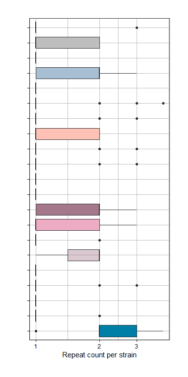

1.2\_CRISPRscope\_genomic\_analysis
================
Thibault Schowing
28 février, 2022

-   [Import libraries](#import-libraries)
-   [Folders](#folders)
-   [Divers functions](#divers-functions)
-   [Metaphlan: Prevalence filtering](#metaphlan-prevalence-filtering)
    -   [Final 26 species list -
        Vincent](#final-26-species-list---vincent)
    -   [Species list colors and names](#species-list-colors-and-names)
    -   [Final 185 species](#final-185-species)
-   [Import data](#import-data)
    -   [CRISPRscope tibble SEL185](#crisprscope-tibble-sel185)
    -   [CRISPRscope tibble SELDIALACT](#crisprscope-tibble-seldialact)
        -   [Clustering 80%](#clustering-80)
        -   [Clustering - 100% - meta +
            genomic](#clustering---100---meta--genomic)
    -   [Host genome GC content](#host-genome-gc-content)
-   [Phylogenetic order](#phylogenetic-order)
    -   [CRISPR arrays](#crispr-arrays)
-   [EXPORT subsets and fastas](#export-subsets-and-fastas)
    -   [Export spacers](#export-spacers)
    -   [Export spacers for BLAST](#export-spacers-for-blast)
    -   [Export repeats](#export-repeats)
    -   [Export fasta for overall
        clustering](#export-fasta-for-overall-clustering)
    -   [Export Cas type for defense mechanisms
        ploting](#export-cas-type-for-defense-mechanisms-ploting)
    -   [<stat> Assembly ratio](#-assembly-ratio)
    -   [distances and clusters](#distances-and-clusters)
    -   [Species per cas subtypes](#species-per-cas-subtypes)
    -   [185 species cas subtypes](#185-species-cas-subtypes)
    -   [Total number of spacers](#total-number-of-spacers)
    -   [Spacers GC content](#spacers-gc-content)
    -   [Repeats GC content](#repeats-gc-content)
    -   [Spacer length](#spacer-length)
    -   [Spacer length density](#spacer-length-density)
    -   [Spacers count](#spacers-count)
    -   [Host GC content](#host-gc-content)
    -   [Merge plots](#merge-plots)
    -   [<ANI numbers>](#section)
-   [ANI custom turnover / array](#ani-custom-turnover--array)
    -   [Results](#results)
-   [Repeat and spacers cluster species
    comparison](#repeat-and-spacers-cluster-species-comparison)
-   [Repeat clusters](#repeat-clusters)
    -   [Tileplot clusterx 100](#tileplot-clusterx-100)
    -   [Tileplot clusterx 80](#tileplot-clusterx-80)
    -   [cluster80 percentage identity.](#cluster80-percentage-identity)
-   [<stat> spacers numbers](#-spacers-numbers)
    -   [Contamination -&gt; Helveticus and Delbrueckii shared
        spacers](#contamination---helveticus-and-delbrueckii-shared-spacers)
    -   [Spacers heatmaps (80-100%)](#spacers-heatmaps-80-100)
    -   [Shared spacers colored by
        repeat.](#shared-spacers-colored-by-repeat)
-   [——————————](#section-1)
-   [Pairwise spacer comparison](#pairwise-spacer-comparison)
    -   [Identical spacers](#identical-spacers)
    -   [Results](#results-1)
        -   [All merged data](#all-merged-data)
        -   [bigger than 35](#bigger-than-35)
        -   [30 or not](#30-or-not)
    -   [Edit distance final plot](#edit-distance-final-plot)
-   [————————-](#-)
-   [SEED: Where are the mutations?](#seed-where-are-the-mutations)
    -   [All pairs &lt; edit6](#all-pairs--edit6)
    -   [By cas-types](#by-cas-types)
    -   [Plots](#plots)
-   [————————-](#--1)
-   [Genome and CRISPR nucleotide
    diversity](#genome-and-crispr-nucleotide-diversity)
    -   [Comparison with core genome diversity
        (?)](#comparison-with-core-genome-diversity-)
-   [————————-](#--2)
-   [Edit distance Randomness
    Verification](#edit-distance-randomness-verification)
    -   [Plot](#plot)
    -   [Compare overall with random](#compare-overall-with-random)
-   [-](#--3)
-   [-](#--4)
-   [-](#--5)

Second phase. The metagenomes were analysed with Metaphlan3 and 242
species were found. The available assemblies of these 242 species on
NCBI were downloaded and CRISPRCasFinder (CRISPRscope) was executed on
these assemblies.

# Import libraries

    ## -- Attaching packages --------------------------------------- tidyverse 1.3.1 --

    ## v ggplot2 3.3.5     v purrr   0.3.4
    ## v tibble  3.1.2     v dplyr   1.0.7
    ## v tidyr   1.1.3     v stringr 1.4.0
    ## v readr   2.0.0     v forcats 0.5.1

    ## -- Conflicts ------------------------------------------ tidyverse_conflicts() --
    ## x dplyr::filter() masks stats::filter()
    ## x dplyr::lag()    masks stats::lag()

    ## 
    ## Attachement du package : 'plotly'

    ## L'objet suivant est masqué depuis 'package:ggplot2':
    ## 
    ##     last_plot

    ## L'objet suivant est masqué depuis 'package:stats':
    ## 
    ##     filter

    ## L'objet suivant est masqué depuis 'package:graphics':
    ## 
    ##     layout

    ## 
    ## Attachement du package : 'reshape'

    ## L'objet suivant est masqué depuis 'package:plotly':
    ## 
    ##     rename

    ## L'objet suivant est masqué depuis 'package:dplyr':
    ## 
    ##     rename

    ## Les objets suivants sont masqués depuis 'package:tidyr':
    ## 
    ##     expand, smiths

    ## Le chargement a nécessité le package : BiocGenerics

    ## Le chargement a nécessité le package : parallel

    ## 
    ## Attachement du package : 'BiocGenerics'

    ## Les objets suivants sont masqués depuis 'package:parallel':
    ## 
    ##     clusterApply, clusterApplyLB, clusterCall, clusterEvalQ,
    ##     clusterExport, clusterMap, parApply, parCapply, parLapply,
    ##     parLapplyLB, parRapply, parSapply, parSapplyLB

    ## Les objets suivants sont masqués depuis 'package:dplyr':
    ## 
    ##     combine, intersect, setdiff, union

    ## Les objets suivants sont masqués depuis 'package:stats':
    ## 
    ##     IQR, mad, sd, var, xtabs

    ## Les objets suivants sont masqués depuis 'package:base':
    ## 
    ##     anyDuplicated, append, as.data.frame, basename, cbind, colnames,
    ##     dirname, do.call, duplicated, eval, evalq, Filter, Find, get, grep,
    ##     grepl, intersect, is.unsorted, lapply, Map, mapply, match, mget,
    ##     order, paste, pmax, pmax.int, pmin, pmin.int, Position, rank,
    ##     rbind, Reduce, rownames, sapply, setdiff, sort, table, tapply,
    ##     union, unique, unsplit, which.max, which.min

    ## Le chargement a nécessité le package : S4Vectors

    ## Le chargement a nécessité le package : stats4

    ## 
    ## Attachement du package : 'S4Vectors'

    ## Les objets suivants sont masqués depuis 'package:reshape':
    ## 
    ##     expand, rename

    ## L'objet suivant est masqué depuis 'package:plotly':
    ## 
    ##     rename

    ## Les objets suivants sont masqués depuis 'package:dplyr':
    ## 
    ##     first, rename

    ## L'objet suivant est masqué depuis 'package:tidyr':
    ## 
    ##     expand

    ## Les objets suivants sont masqués depuis 'package:base':
    ## 
    ##     expand.grid, I, unname

    ## Le chargement a nécessité le package : IRanges

    ## 
    ## Attachement du package : 'IRanges'

    ## L'objet suivant est masqué depuis 'package:plotly':
    ## 
    ##     slice

    ## Les objets suivants sont masqués depuis 'package:dplyr':
    ## 
    ##     collapse, desc, slice

    ## L'objet suivant est masqué depuis 'package:purrr':
    ## 
    ##     reduce

    ## L'objet suivant est masqué depuis 'package:grDevices':
    ## 
    ##     windows

    ## Le chargement a nécessité le package : XVector

    ## 
    ## Attachement du package : 'XVector'

    ## L'objet suivant est masqué depuis 'package:purrr':
    ## 
    ##     compact

    ## Le chargement a nécessité le package : GenomeInfoDb

    ## 
    ## Attachement du package : 'Biostrings'

    ## L'objet suivant est masqué depuis 'package:base':
    ## 
    ##     strsplit

    ## 
    ## Attachement du package : 'scales'

    ## L'objet suivant est masqué depuis 'package:purrr':
    ## 
    ##     discard

    ## L'objet suivant est masqué depuis 'package:readr':
    ## 
    ##     col_factor

    ## 
    ## Attachement du package : 'gridExtra'

    ## L'objet suivant est masqué depuis 'package:BiocGenerics':
    ## 
    ##     combine

    ## L'objet suivant est masqué depuis 'package:dplyr':
    ## 
    ##     combine

    ## 
    ## Attachement du package : 'cowplot'

    ## L'objet suivant est masqué depuis 'package:reshape':
    ## 
    ##     stamp

    ## Le chargement a nécessité le package : RSQLite

    ## Le chargement a nécessité le package : future

    ## 
    ## Attachement du package : 'future'

    ## L'objet suivant est masqué depuis 'package:IRanges':
    ## 
    ##     values

    ## L'objet suivant est masqué depuis 'package:S4Vectors':
    ## 
    ##     values

# Folders

``` r
repository <- "C:/Users/thsch/Desktop/CRISPRscope" # Main git repository. 
google_drive_folder <- "G:/Mon Drive/0_Documents/1_Emploi/E_StageAgroscope/CRISPRscope_writing/IMG"
#"C:/Users/thsch/Google Drive/0_Documents/1_Emploi/E_StageAgroscope/CRISPRscope_writing/IMG"

# repository/0_data/IMPORT has to stay this way, like many other folders. 

data_folder <- "C:/Users/thsch/Desktop/0_data"

results_folder <- "C:/Users/thsch/Desktop/0_data/CRISPRscope_results"      # Not gitted. Contains .rds results from the pipeline and diverse small intermediary results.
```

# Divers functions

``` r
#
# Converts dna string set to dataframe
#
dss2df <- function(dss) data.frame(length=width(dss), seq=as.character(dss), names=names(dss))
```

\#———————————————-

# Metaphlan: Prevalence filtering

Using Metaphlan output, select only the species with a high enough
abudance.

ATTENTION: Only the document sent by Vincent is correct, as 16S samples
were also taken in account.

``` bash
#!/bin/bash

#SBATCH -o slurm_output/metaphlan-%j-output.txt
#SBATCH -e slurm_output/metaphlan-%j-error.txt

#SBATCH --job-name="mtphlan"
#SBATCH --time=96:00:00
#SBATCH --mem=150G
#SBATCH --partition=pall
#SBATCH --cpus-per-task=5
#SBATCH --nodes=1
#SBATCH --export=NONE


module add vital-it/7


# singularity run-help /software/singularity/containers/MetaPhlAn2-2.7.8-1.biocontainers.simg;


# singularity exec --bind /data/projects/p539_crisprscope/ /software/singularity/containers/MetaPhlAn2-2.7.8-1.biocontainers.simg metaphlan2.py <options>


BaseLocation_output=/data/projects/p539_crisprscope/9_metaphlan/OUTPUT

#CONTAINER=/software/singularity/containers/MetaPhlAn2-2.7.8-1.biocontainers.simg
#CONTAINER=/data/projects/p539_crisprscope/MetaPhlAn2-2.7.8-1.biocontainers.simg

CONTAINER=/software/singularity/containers/MetaPhlAn-3.0.7-1.ubuntu20.sif
DATE=20210510
rm ${BaseLocation_output}/metaphlan/allStrains_metaphlan.txt

for bioprojectsss in $(ls /data/projects/p539_crisprscope/0_data/metagenomes) #loop through the different bioprojects
do
        echo "======================================="
        echo -e "Bioproject: "${bioprojectsss}
        for biosamplesss in $(ls /data/projects/p539_crisprscope/0_data/metagenomes/${bioprojectsss}) #loop through the different biosamples
        do
                echo "======================================="
                echo -e "Biosample: "${biosamplesss}

                rm -r ${BaseLocation_output}/metaphlan/${bioprojectsss}_${biosamplesss}
                mkdir -p ${BaseLocation_output}/metaphlan/${bioprojectsss}_${biosamplesss}/{bowtie2ouput,metaphlan_profile}

                #check number of read files
                numReadss=$(ls /data/projects/p539_crisprscope/0_data/metagenomes/${bioprojectsss}/${biosamplesss} |wc -l)

                SAMPLE_FOLDER=/data/projects/p539_crisprscope/0_data/metagenomes/${bioprojectsss}/${biosamplesss}/

                if [ "$numReadss" = "2"  ]
                then
                        echo -e "there are two read files in the directory, therefore we run a PE metaphlan"
                        VAR1="/data/projects/p539_crisprscope/0_data/metagenomes/${bioprojectsss}/${biosamplesss}/*_1.fastq.gz"
                        VAR2="/data/projects/p539_crisprscope/0_data/metagenomes/${bioprojectsss}/${biosamplesss}/*_2.fastq.gz"
                        echo ${VAR1}
                        echo ${VAR2}

                        zcat ${VAR1} ${VAR2} > ${SAMPLE_FOLDER}_input.fastq
                        INPUT=${SAMPLE_FOLDER}_input.fastq

                        singularity exec --bind /data/projects/p539_crisprscope/ --bind /db/SOFTWARE/MetaPhlAn/ ${CONTAINER} metaphlan --input_type fastq $INPUT --nproc 5 --bowtie2out  ${BaseLocation_output}/metaphlan/${bioprojectsss}_${biosamplesss}///bowtie2ouput/metagenome_${biosamplesss}_trimmed.bowtie2.bz2 > ${BaseLocation_output}/metaphlan/${bioprojectsss}_${biosamplesss}/metaphlan_profile/profiled_metagenome_${names}_trimmed.txt

                        rm ${SAMPLE_FOLDER}_input.fastq

                        grep "s__"  ${BaseLocation_output}/metaphlan/${bioprojectsss}_${biosamplesss}/metaphlan_profile/profiled_metagenome_${names}_trimmed.txt |grep "t__" -v|awk -F "[\t|]" -v culturess="$bioprojectsss" -v strainzzzss="$biosamplesss" '{OFS="\t"}{print culturess,strainzzzss,$7,$15}' >>  ${BaseLocation_output}/metaphlan/${DATE}_allStrains_metaphlan.txt

                else
                        echo -e "there are only one read file in the directory, therefore we run a single end bwa alignement"

                        VAR1="/data/projects/p539_crisprscope/0_data/metagenomes/${bioprojectsss}/${biosamplesss}/*.fastq.gz"
                        echo ${VAR1}

                        zcat ${VAR1} > ${SAMPLE_FOLDER}_input.fastq

                        INPUT=${SAMPLE_FOLDER}_input.fastq

                        singularity exec --bind /data/projects/p539_crisprscope/ --bind /db/SOFTWARE/MetaPhlAn/ ${CONTAINER} metaphlan --input_type fastq $INPUT --nproc 5 --bowtie2out  ${BaseLocation_output}/metaphlan/${bioprojectsss}_${biosamplesss}///bowtie2ouput/metagenome_${biosamplesss}_trimmed.bowtie2.bz2 > ${BaseLocation_output}/metaphlan/${bioprojectsss}_${biosamplesss}/metaphlan_profile/profiled_metagenome_${names}_trimmed.txt

                        rm ${SAMPLE_FOLDER}_input.fastq

                        grep "s__"  ${BaseLocation_output}/metaphlan/${bioprojectsss}_${biosamplesss}/metaphlan_profile/profiled_metagenome_${names}_trimmed.txt |grep "t__" -v|awk -F "[\t|]" -v culturess="$bioprojectsss" -v strainzzzss="$biosamplesss" '{OFS="\t"}{print culturess,strainzzzss,$7,$15}' >>  ${BaseLocation_output}/metaphlan/${DATE}_allStrains_metaphlan.txt

                fi

        done #biosamplessss
done #bioprojectsss
```

Read Metaphlan OUTPUT

``` r
allStrains_metaphlan <- read_delim(paste(data_folder, "/Metaphlan_results/allStrains_metaphlan.txt", sep=""), 
                                   "\t", 
                                   escape_double = FALSE, 
                                   col_names = FALSE, 
                                   trim_ws = TRUE) %>% 
  mutate(ProjectID = X1, Sample = X2, Species = X3, RelAbundance = X4) %>% 
  select(ProjectID, Sample, Species, RelAbundance) %>% 
  mutate(ProjectID = replace(ProjectID, ProjectID == "20201217_metagenomes", "Agroscope")) %>% 
  mutate(Species = gsub("s__", "", Species)) 

allStrains_metaphlan

allStrains_metaphlan %>% summarise(nb_species = n_distinct(Species))

unique_species <- unique(allStrains_metaphlan$Species)
write.table(unique_species, file = paste(data_folder, "/Metaphlan_results/metaphlan_unique_species.csv", sep=""), row.names = F, col.names = F, quote = F, eol = "\n")


# ATTENTION: Might need to mannually replace CRLF to LF with Np++

# Projects
unique(allStrains_metaphlan$ProjectID)


# We have only 196 
length(unique_species)
```

## Final 26 species list - Vincent

Generated by Vincent Somerville -&gt; final species selection from
Metaphlan output and 16S samples from Foodbionet

Note: For Taxon ID we use our metaphlan output but also 16S analysis of
other cheese from Foodbionet. The FINAL\_LIST from Vincent contains the
most prevalent species from Metaphlan AND Foodbionet.

The goal is now to download the genomes of the high-prevalence
foodbionet species, currently missing in our assemblies collection.

## Species list colors and names

Give to each species a specifically defined color.

``` r
# Contains the associated color set for the species
species_colors <- read_delim(paste(data_folder, "/IMPORT/species_colors.txt", sep = ""),
                             "\t", escape_double = FALSE, trim_ws = TRUE) %>% 
  mutate(Species = species) %>% 
  select(-species) %>% 
  mutate(Species = gsub(" ", "_", Species)) %>% 
  mutate(color = toupper(color))
```

    ## Rows: 28 Columns: 2

    ## -- Column specification --------------------------------------------------------
    ## Delimiter: "\t"
    ## chr (2): species, color

    ## 
    ## i Use `spec()` to retrieve the full column specification for this data.
    ## i Specify the column types or set `show_col_types = FALSE` to quiet this message.

``` r
X20210428_metaphlan_Foodbionet_final_species <- 
  read_csv(
    paste(
      data_folder, "/IMPORT/20210428_metaphlan_final_species.txt", sep = "")) %>% 
  mutate(species_new = gsub(" ", "_", species_new)) %>% arrange(species_new)
```

    ## New names:
    ## * `` -> ...1

    ## Rows: 26 Columns: 5

    ## -- Column specification --------------------------------------------------------
    ## Delimiter: ","
    ## chr (1): species_new
    ## dbl (4): ...1, counts, prevelance, median

    ## 
    ## i Use `spec()` to retrieve the full column specification for this data.
    ## i Specify the column types or set `show_col_types = FALSE` to quiet this message.

``` r
# Update the Species names. 
update_names <- function(tbl){
  return(
    tbl %>% 
      mutate(Species = replace(Species, Species == "Streptococcus_luteciae", "Streptococcus_lutetiensis")) %>% 
      mutate(Species = replace(Species, Species == "Propionibacterium_acnes", "Cutibacterium_acnes")) %>% 
      mutate(Species = replace(Species, Species == "Lactobacillus_zeae", "Lactobacillus_casei")) %>% 
      mutate(Species = replace(Species, Species == "Lactobacillus_casei", "Lacticaseibacillus_casei")) %>% 
      mutate(Species = replace(Species, Species == "Staphylococcus_sciuri", "Mammaliicoccus_sciuri")) %>% 
      mutate(Species = replace(Species, Species == "Lactobacillus_fermentum", "Limosilactobacillus_fermentum")) %>% 
      mutate(Species = replace(Species, Species == "Lactobacillus_versmoldensis", "Companilactobacillus_versmoldensis")) %>% 
      mutate(Species = replace(Species, Species == "Lactobacillus_rhamnosus", "Lacticaseibacillus_rhamnosus")) %>% 
      mutate(Species = replace(Species, Species == "Lactobacillus_coryniformis", "Loigolactobacillus_coryniformis")) %>% 
      mutate(Species = replace(Species, Species == "Lactobacillus_curvatus", "Latilactobacillus_curvatus")) %>% 
      mutate(Species = replace(Species, Species == "Lactobacillus_plantarum", "Lactiplantibacillus_plantarum")) %>% 
      arrange(Species) 
    )
}


# Update the column name to fit with the update_name function

final_species_list_26 <- X20210428_metaphlan_Foodbionet_final_species %>% 
   mutate(Species = species_new) %>% arrange(Species) %>% select(-species_new) 

 
# Update names
final_species_list_26 <- update_names(final_species_list_26)
species_colors <- update_names(species_colors)
 
  
# Result
species_colors
```

    ## # A tibble: 28 x 2
    ##    color     Species                           
    ##    <chr>     <chr>                             
    ##  1 #17C3B2FF Bifidobacterium_animalis          
    ##  2 #16C3B396 Brevibacterium_aurantiacum        
    ##  3 #14C2B14B Brevibacterium_linens             
    ##  4 #A7C5DA4B Companilactobacillus_versmoldensis
    ##  5 GREY      Corynebacterium_casei             
    ##  6 GREY      Cutibacterium_acnes               
    ##  7 #A7BED3FF Lacticaseibacillus_casei          
    ##  8 #A7C5DA96 Lacticaseibacillus_rhamnosus      
    ##  9 #A3758A32 Lactiplantibacillus_plantarum     
    ## 10 #FDC2B496 Lactobacillus_acidophilus         
    ## # ... with 18 more rows

``` r
final_species_list_26$Species
```

    ##  [1] "Bifidobacterium_animalis"           "Brevibacterium_aurantiacum"        
    ##  [3] "Brevibacterium_linens"              "Companilactobacillus_versmoldensis"
    ##  [5] "Corynebacterium_casei"              "Cutibacterium_acnes"               
    ##  [7] "Lacticaseibacillus_casei"           "Lacticaseibacillus_rhamnosus"      
    ##  [9] "Lactiplantibacillus_plantarum"      "Lactobacillus_acidophilus"         
    ## [11] "Lactobacillus_delbrueckii"          "Lactobacillus_helveticus"          
    ## [13] "Lactococcus_lactis"                 "Latilactobacillus_curvatus"        
    ## [15] "Leuconostoc_lactis"                 "Leuconostoc_mesenteroides"         
    ## [17] "Leuconostoc_pseudomesenteroides"    "Limosilactobacillus_fermentum"     
    ## [19] "Loigolactobacillus_coryniformis"    "Mammaliicoccus_sciuri"             
    ## [21] "Pediococcus_parvulus"               "Pediococcus_pentosaceus"           
    ## [23] "Propionibacterium_freudenreichii"   "Staphylococcus_equorum"            
    ## [25] "Streptococcus_lutetiensis"          "Streptococcus_thermophilus"

242 species were analysed with CRISPRCasFinder when only 196 are
outputed by Metaphlan (unidentified process error).

-   modify the needed species names
-   Confirm that the 196 species have been processed and remove the
    useless ones
-   Check the output of the Foodbionet thingy and verify which species
    need to be added

## Final 185 species

Create a precise list of the 196 Metaphlan species and add the 16S
prevalent ones with renaming of the particular ones as bellow. There are
185 species with available genomes at the end.

``` r
# final_species_list_199 <- allStrains_metaphlan %>% select(Species) %>% distinct() %>% 
#   mutate(Species = replace(Species, Species == "Streptococcus_luteciae", "Streptococcus_lutetiensis")) %>% 
#   mutate(Species = replace(Species, Species == "Propionibacterium_acnes", "Cutibacterium_acnes")) %>% 
#   mutate(Species = replace(Species, Species == "Lactobacillus_zeae", "Lactobacillus_casei")) %>% 
#   mutate(Species = replace(Species, Species == "Lactobacillus_casei", "Lacticaseibacillus_casei")) %>% 
#   mutate(Species = replace(Species, Species == "Staphylococcus_sciuri", "Mammaliicoccus_sciuri")) %>% 
#   mutate(Species = replace(Species, Species == "Lactobacillus_fermentum", "Limosilactobacillus_fermentum")) %>% 
#   mutate(Species = replace(Species, Species == "Lactobacillus_versmoldensis", "Companilactobacillus_versmoldensis")) %>% 
#   mutate(Species = replace(Species, Species == "Lactobacillus_rhamnosus", "Lacticaseibacillus_rhamnosus")) %>% 
#   mutate(Species = replace(Species, Species == "Lactobacillus_coryniformis", "Loigolactobacillus_coryniformis")) %>% 
#   mutate(Species = replace(Species, Species == "Lactobacillus_curvatus", "Latilactobacillus_curvatus")) %>% 
#   mutate(Species = replace(Species, Species == "Lactobacillus_plantarum", "Lactiplantibacillus_plantarum"))


# EMPTY - No genomes available
# Staphylococcus_vitulinus
# Staphylococcus_fleurettii

# # Generate copy script
# script <- final_species_list_199 %>% mutate(cp = paste("cp -r ./20210406/", Species, " ./SEL199/", sep = "")) %>% select(cp)
# write_delim(script, file = "./OUTPUT/copy_genome_199.sh", delim = "\n", col_names = FALSE)
# 
# # Generate CCF script
# ccfscript <- final_species_list_199 %>% mutate(cp = paste("sbatch 0_CRISPRScope_master.sh ", Species, sep = "")) %>% select(cp)
# write_delim(ccfscript, file = "./OUTPUT/SEL199_launchall.sh", delim = "\n", col_names = FALSE)
# 
# 
# # Generate download Script
# download_NCBI_list <- final_species_list_199 %>% mutate(cp = Species) %>% select(cp)
# write_delim(download_NCBI_list, file = "./OUTPUT/download_genome_199.sh", delim = "\n", col_names = FALSE)


# Old names -> copy strains from here into new matching directory (NCBI is late on naming)

# Streptococcus_luteciae
# Propionibacterium_acnes
# Lactobacillus_zeae
# Lactobacillus_casei
# Staphylococcus_sciuri
# Lactobacillus_fermentum
# Lactobacillus_versmoldensis
# Lactobacillus_rhamnosus
# Lactobacillus_coryniformis
# Lactobacillus_curvatus
# Lactobacillus_plantarum


#
# Species with no assembly available -> delete
#
# 
# 
# rm -r Actinomycetaceae_bacterium_sk1b4
# rm -r Actinomycetales_bacterium_JB111
# rm -r Aerococcaceae_bacterium
# rm -r Staphylococcus_vitulinus
# rm -r Staphylococcus_fleurettii
# rm -r Saccharomyces_cerevisiae 
# rm -r Oenococcus_alcoholitolerans
# rm -r Lactobacilus_nuruki
# rm -r Lactobacillus_wasatchensis
# rm -r Lactobacillus_pentosus
# rm -r Lactobacillus_parakefiri
# rm -r Kocuria_kristinae

# 
# 
# Verify new-name directory exists. Do manually one by one

# 
# 
# cp -v ./20210514/Streptococcus_luteciae/* ./20210514/Streptococcus_lutetiensis
# cp -v ./20210514/Propionibacterium_acnes/* ./20210514/Cutibacterium_acnes
# cp -v ./20210514/Lactobacillus_zeae/* ./20210514/Lactobacillus_casei
# cp -v ./20210514/Lactobacillus_casei/* ./20210514/Lacticaseibacillus_casei
# cp -v ./20210514/Staphylococcus_sciuri/* ./20210514/Mammaliicoccus_sciuri
# cp -v ./20210514/Lactobacillus_fermentum/* ./20210514/Limosilactobacillus_fermentum
# cp -v ./20210514/Lactobacillus_versmoldensis/* ./20210514/Companilactobacillus_versmoldensis
# cp -v ./20210514/Lactobacillus_rhamnosus/* ./20210514/Lacticaseibacillus_rhamnosus
# cp -v ./20210514/Lactobacillus_coryniformis/* ./20210514/Loigolactobacillus_coryniformis
# cp -v ./20210514/Lactobacillus_curvatus/* ./20210514/Latilactobacillus_curvatus
# cp -v ./20210514/Lactobacillus_plantarum/* ./20210514/Lactiplantibacillus_plantarum

# Once all genomes from the right merged species are ready, copy the 26 selected into the right directory
# 
```

# Import data

## CRISPRscope tibble SEL185

Import the main dataset(s). Directly created after executing
CRISPRCasFinder and associated parsers on the IBU cluster. (p539)
Computed with the selection of the available assemblies of 199 species
(minus two empty Streptococci)

``` r
# Main set: contains 242 species 
CRISPRscope_tbl_185 <- readRDS(file = paste(results_folder, "/SEL185/SEL185_NCBI_CRISPRscope_tibble.rds", sep=""))
CRISPRscope_tbl_185 <- CRISPRscope_tbl_185 %>% mutate(source = "NCBI")
```

## CRISPRscope tibble SELDIALACT

Import of the data from in-house Dialact database (among the 26 most
prevalent species.)

``` r
CRISPRscope_tbl_Dialact <- readRDS(file = paste(results_folder, "/SELDIALACT/SELDIALACT_DIALACT_CRISPRscope_tibble.rds", sep=""))
CRISPRscope_tbl_Dialact <- CRISPRscope_tbl_Dialact %>% mutate(source = "DIALACT")

CRISPRscope_tbl_185 <- CRISPRscope_tbl_185 %>% bind_rows(CRISPRscope_tbl_Dialact)
```

\#============================================== \# Additional quality
filtering

Remove spurious NNNN sequences in the spacer set and repeat set

``` r
CRISPRscope_tbl_185_raw <- CRISPRscope_tbl_185

CRISPRscope_tbl_185 <- CRISPRscope_tbl_185 %>% 
  filter(SpacerSeq %>% str_detect("^[ACTGactg]+$")) %>% 
  filter(DR_seq %>% str_detect("^[ACTGactg]+$"))


# contaminted Strain: FAM2888-i1-1

contaminated_strains <- c(
"FAM2888-i1-1",
"FAM23942i1-1",
"FAM20323i1-1",
"FAM23926i1-1",
"FAM23927i1-1",
"FAM21955i1-1",
"FAM18355i1-1",
"FAM21998i1-1",
"FAM17724i1-1",
"FAM6009i1-1",
"FAM2888i1-1",
"FAM21780i1-1")

CRISPRscope_tbl_185 <- CRISPRscope_tbl_185 %>%
  filter(! Strain %in% contaminated_strains)


#Remove spacers by size (bigger than 50bp)

CRISPRscope_tbl_185 <- CRISPRscope_tbl_185 %>% filter(nchar(SpacerSeq) < 50)
```

\#============================================== \# Clustering \#\#
Clustering - 80% - genomic

As data have been computed separately between NCBI and Dialact
databases, the clustering has to be done for all spacers / repeats at
the same time. These are the clusters at 80% identity only for the
genomic part

Import processed clustering and merge to main tibble.

### Clustering 80%

``` r
Clusters_CRISPRscope_spacers80 <- read_csv(paste(
      data_folder, "/IMPORT/clustering/Clusters0.8_CRISPRscope_genomic_185_spacers.csv", sep = "")) %>% 
  distinct(seq, cluster, identity)
```

    ## Rows: 69467 Columns: 4

    ## -- Column specification --------------------------------------------------------
    ## Delimiter: ","
    ## chr (2): seq, seqid
    ## dbl (2): cluster, identity

    ## 
    ## i Use `spec()` to retrieve the full column specification for this data.
    ## i Specify the column types or set `show_col_types = FALSE` to quiet this message.

``` r
Clusters_CRISPRscope_repeats80 <- read_csv(paste(
      data_folder, "/IMPORT/clustering/Clusters0.8_CRISPRscope_genomic_185_repeats.csv", sep = "")) %>% 
  distinct(seq, cluster, identity)
```

    ## Rows: 892 Columns: 4

    ## -- Column specification --------------------------------------------------------
    ## Delimiter: ","
    ## chr (2): seq, seqid
    ## dbl (2): cluster, identity

    ## 
    ## i Use `spec()` to retrieve the full column specification for this data.
    ## i Specify the column types or set `show_col_types = FALSE` to quiet this message.

``` r
CRISPRscope_tbl_185 <- CRISPRscope_tbl_185 %>% select(-cluster_spacer, -identity_spacer_cluster, -cluster_repeat, -identity_repeat_cluster)

CRISPRscope_tbl_185 <- CRISPRscope_tbl_185 %>% 
  left_join(Clusters_CRISPRscope_spacers80, by = c("SpacerSeq" = "seq")) %>% 
  mutate(cluster_spacer = cluster) %>% 
  mutate(identity_spacer_cluster80 = identity) %>% 
  select(-cluster, -identity) %>% 
  relocate(cluster_spacer, .after = "SpacerSeq") %>% 
  relocate(identity_spacer_cluster80, .after = "cluster_spacer")


CRISPRscope_tbl_185 <- CRISPRscope_tbl_185 %>% 
  left_join(Clusters_CRISPRscope_repeats80, by = c("DR_seq" = "seq")) %>% 
  mutate(cluster_repeat = cluster) %>% 
  mutate(identity_repeat_cluster80 = identity) %>% 
  select(-cluster, -identity) %>% 
  relocate(cluster_repeat, .after = "DR_seq") %>% 
  relocate(identity_repeat_cluster80, .after = "cluster_repeat")
```

### Clustering - 100% - meta + genomic

The fasta files are exported within 3.2\_CRISPRscope\_comparison.
Clustering is done with 100% identity to have identical but reverse
complement clusters. Here we only take the cluster number, not the
identity %

``` r
Clusters_CRISPRscope_spacers_identity <- read_csv(paste(
      data_folder, "/IMPORT/clustering/Clusters1_CRISPRscope_ALL_SPACERS.csv", sep = "")) %>% 
  distinct(seq, cluster, identity) %>% select(-identity)
```

    ## Rows: 79007 Columns: 4

    ## -- Column specification --------------------------------------------------------
    ## Delimiter: ","
    ## chr (2): seq, seqid
    ## dbl (2): cluster, identity

    ## 
    ## i Use `spec()` to retrieve the full column specification for this data.
    ## i Specify the column types or set `show_col_types = FALSE` to quiet this message.

``` r
Clusters_CRISPRscope_repeats_identity <- read_csv(paste(
      data_folder, "/IMPORT/clustering/Clusters1_CRISPRscope_ALL_REPEATS.csv", sep = "")) %>% 
  distinct(seq, cluster, identity) %>% select(-identity)
```

    ## Rows: 1362 Columns: 4

    ## -- Column specification --------------------------------------------------------
    ## Delimiter: ","
    ## chr (2): seq, seqid
    ## dbl (2): cluster, identity

    ## 
    ## i Use `spec()` to retrieve the full column specification for this data.
    ## i Specify the column types or set `show_col_types = FALSE` to quiet this message.

``` r
CRISPRscope_tbl_185 <- CRISPRscope_tbl_185 %>% 
  left_join(Clusters_CRISPRscope_spacers_identity, by = c("SpacerSeq" = "seq")) %>% 
  mutate(cluster_spacer_identity = cluster) %>% 
  select(-cluster) %>% 
  relocate(cluster_spacer_identity, .after = "cluster_spacer")


CRISPRscope_tbl_185 <- CRISPRscope_tbl_185 %>% 
  left_join(Clusters_CRISPRscope_repeats_identity, by = c("DR_seq" = "seq")) %>% 
  mutate(cluster_repeat_identity = cluster) %>% 
  select(-cluster) %>% 
  relocate(cluster_repeat, .after = "DR_seq") %>% 
  relocate(cluster_repeat_identity, .after = "cluster_repeat")
```

\#============================================== \# Subtype to class

``` r
# Species + strain
CRISPRscope_tbl_185 <- CRISPRscope_tbl_185 %>% separate(Cas_subtype, c("Type", "Subtype"), remove = FALSE) %>% 
  mutate(Cas_class = if_else(Type %in% c("I","III","IV"), "Class 1", "Class 2", "NA")) %>% 
  relocate(Cas_class, .before = Cas_subtype) %>% 
  select(-Type, -Subtype)
```

    ## Warning: Expected 2 pieces. Additional pieces discarded in 42 rows [51496,
    ## 51497, 51498, 51499, 51500, 51501, 51502, 53340, 53341, 53342, 53343, 53344,
    ## 53345, 53346, 53407, 53408, 53409, 53410, 53411, 53412, ...].

\#============================================== \# Genome count merge
Integrate here the orginal numger of genomes, the database of origin,
etc.

``` r
# Species count. Result of the original metaphlan. (?)

  #allStrains_metaphlan %>% summarise(nb_species = n_distinct(Species)) # 196
  # Add the number of species from 16S samples.


# Genome count. Original number of genomes from NCBI / Dialact

  genome_count_SELDIALACT <- read_delim(paste(data_folder, "/CRISPRscope_results/genome_count_SELDIALACT.txt", sep=""), 
    ";", escape_double = FALSE, trim_ws = TRUE) %>% mutate(count = `12`, Species = ...2) %>% select(-`12`, -...2)
```

    ## New names:
    ## * `` -> ...2

    ## Rows: 12 Columns: 2

    ## -- Column specification --------------------------------------------------------
    ## Delimiter: ";"
    ## chr (1): ...2
    ## dbl (1): 12

    ## 
    ## i Use `spec()` to retrieve the full column specification for this data.
    ## i Specify the column types or set `show_col_types = FALSE` to quiet this message.

``` r
  genome_count_SELDIALACT %>% write.csv(paste(data_folder, "/CRISPRscope_results/export_genome_count_SELDIALACT.csv", sep=""))

  genome_count_SEL185 <- read_delim(paste(data_folder, "/CRISPRscope_results/genome_count_SEL185.txt", sep=""), 
    ";", escape_double = FALSE, trim_ws = TRUE) %>% mutate(count = `185`, Species = ...2) %>% select(-`185`, -...2)
```

    ## New names:
    ## * `` -> ...2

    ## Rows: 185 Columns: 2

    ## -- Column specification --------------------------------------------------------
    ## Delimiter: ";"
    ## chr (1): ...2
    ## dbl (1): 185

    ## 
    ## i Use `spec()` to retrieve the full column specification for this data.
    ## i Specify the column types or set `show_col_types = FALSE` to quiet this message.

``` r
  genome_count_SEL185 %>% write.csv(paste(data_folder, "/CRISPRscope_results/export_genome_count_SEL185.csv", sep=""))

  genome_count_TOTAL <- bind_rows(genome_count_SEL185, genome_count_SELDIALACT)
  genome_count_TOTAL %>% write.csv(paste(data_folder, "/CRISPRscope_results/export_genome_count_total.csv", sep=""))

  # Sum the genome count for species with data from NCBI and Dialact
  genome_count_TOTAL <- tibble(aggregate(genome_count_TOTAL$count, by=list(genome_count_TOTAL$Species), sum)) %>% 
    mutate(Species = Group.1, count = x) %>% select(-Group.1, -x)
  genome_count_TOTAL %>% summarise(total = sum(count))
```

    ## # A tibble: 1 x 1
    ##   total
    ##   <dbl>
    ## 1 14869

``` r
  # Final genome count for the 26 most prevalent species
  genome_count_26 <- genome_count_TOTAL %>% filter(Species %in% final_species_list_26$Species) %>% summarise(total = sum(count)) # 2778
  

  
  dialact <- genome_count_SELDIALACT %>% mutate(DB = "Dialact")
  ncbi <- genome_count_SEL185 %>% mutate(DB = "NCBI refseq")
  
  genome_count_databases <- bind_rows(dialact, ncbi)
  
  
  genome_count_SELDIALACT
```

    ## # A tibble: 12 x 2
    ##    count Species                         
    ##    <dbl> <chr>                           
    ##  1    83 Streptococcus_thermophilus      
    ##  2    69 Lactobacillus_helveticus        
    ##  3    84 Lactococcus_lactis              
    ##  4     2 Brevibacterium_aurantiacum      
    ##  5     1 Latilactobacillus_curvatus      
    ##  6   168 Lactobacillus_delbrueckii       
    ##  7    20 Leuconostoc_mesenteroides       
    ##  8    70 Propionibacterium_freudenreichii
    ##  9    15 Pediococcus_pentosaceus         
    ## 10     2 Staphylococcus_equorum          
    ## 11     2 Corynebacterium_casei           
    ## 12    20 Lacticaseibacillus_rhamnosus

``` r
  genome_count_SEL185
```

    ## # A tibble: 185 x 2
    ##    count Species                      
    ##    <dbl> <chr>                        
    ##  1   500 Streptococcus_agalactiae     
    ##  2     3 Kurthia_sp_11kri321          
    ##  3     2 Brachybacterium_saurashtrense
    ##  4    34 Carnobacterium_maltaromaticum
    ##  5     7 Lactobacillus_brevis         
    ##  6    37 Pseudomonas_lundensis        
    ##  7    22 Kocuria_rhizophila           
    ##  8    17 Leuconostoc_lactis           
    ##  9   122 Streptococcus_thermophilus   
    ## 10   104 Halomonas_sp_JB37            
    ## # ... with 175 more rows

``` r
  genome_count_TOTAL
```

    ## # A tibble: 185 x 2
    ##    Species                                count
    ##    <chr>                                  <dbl>
    ##  1 Acidipropionibacterium_acidipropionici     8
    ##  2 Acinetobacter_baumannii                  500
    ##  3 Acinetobacter_johnsonii                   38
    ##  4 Acinetobacter_nosocomialis               152
    ##  5 Aerococcus_urinaeequi                      8
    ##  6 Aerococcus_viridans                        7
    ##  7 Agrococcus_casei                           1
    ##  8 Alkalibacterium_gilvum                     1
    ##  9 Bacillus_aerius                            2
    ## 10 Bacillus_coagulans                        11
    ## # ... with 175 more rows

``` r
#TODO include genome count (total original genomes)
```

Genome count merge

``` r
tmpjoin <- genome_count_TOTAL %>% mutate(original_assembly_count = count) %>% select(-count)

CRISPRscope_tbl_185 <- CRISPRscope_tbl_185  %>% 
  left_join(tmpjoin, by = c("Organism" = "Species"))
```

\#============================================== \# Spacers GC content

``` r
seq_to_gc_content <- function(sequence){
  num_g <- str_count(sequence, "G") + str_count(sequence, "g")
  num_c <- str_count(sequence, "C") + str_count(sequence, "c")
  gc_content <- ((num_g + num_c) / str_length(sequence)) * 100
  return(gc_content)
}

CRISPRscope_tbl_185 <- CRISPRscope_tbl_185  %>% 
  mutate(spacer_gc_content = map_dbl(SpacerSeq, seq_to_gc_content))

CRISPRscope_tbl_185 <- CRISPRscope_tbl_185  %>% 
  mutate(repeat_gc_content = map_dbl(DR_seq, seq_to_gc_content))
```

\#——————————- \# CRISPRscope tibble SEL26

Here we create a second dataset with only the 26 most prevalent species.
In the end there are only 21 species because 5 do not contain CRISPR

``` r
#final_species_list_26$Species

CRISPRscope_tbl_26 <- CRISPRscope_tbl_185%>% filter(Organism %in% final_species_list_26$Species)
```

## Host genome GC content

\#———————————————- \# Meso/thermophilic or general (26 only)

``` r
CRISPRscope_tbl_26 <- CRISPRscope_tbl_26 %>% 
  mutate(species_type = 
           ifelse(Organism %in% c("Lacticaseibacillus_casei","Lactobacillus_delbrueckii","Streptococcus_thermophilus",
                                  "Lactobacillus_helveticus"),
                  "thermophilic",
                  ifelse(Organism %in% c("Companilactobacillus_versmoldensis","Lactococcus_lactis",
                                         "Streptococcus_thermophilus","Propionibacterium_freudenreichii"),
                         "mesophilic",
                         "generalist"))) 
```

\#———————————————- \# EXPORT CRISPRscope\_tbl - RDS

``` r
# Export the complete dataset for comparison with metagenomes.

saveRDS(CRISPRscope_tbl_185, file = paste(data_folder, "/CRISPRscope_results/export_complete_SEL26.rds", sep=""))
saveRDS(CRISPRscope_tbl_26, file = paste(data_folder, "/CRISPRscope_results/export_complete_SEL26.rds", sep=""))
```

\#———————————————- \#- \#- \#-

# Phylogenetic order

For the 26 most prevalent species, and so the 21 crispr containing ones,
we set the phylogenetic order like bellow.

``` r
species_levels_26 <- c("Lactobacillus_helveticus","Lactobacillus_acidophilus","Lactobacillus_delbrueckii",
                   "Companilactobacillus_versmoldensis","Lacticaseibacillus_rhamnosus","Lacticaseibacillus_casei",
                   "Latilactobacillus_curvatus","Loigolactobacillus_coryniformis","Leuconostoc_pseudomesenteroides",
                   "Leuconostoc_mesenteroides","Leuconostoc_lactis","Limosilactobacillus_fermentum","Pediococcus_pentosaceus",
                   "Pediococcus_parvulus","Lactiplantibacillus_plantarum","Streptococcus_lutetiensis","Streptococcus_thermophilus",
                   "Lactococcus_lactis","Mammaliicoccus_sciuri","Staphylococcus_equorum","Brevibacterium_linens",
                   "Brevibacterium_aurantiacum","Bifidobacterium_animalis","Cutibacterium_acnes","Propionibacterium_freudenreichii",
                   "Corynebacterium_casei")

# when calling ggplot: 
#Organism <- factor(Organism, levels = species_level_26)

# Verify typo by comparing known list
#s <- tibble(species_levels_26) %>% filter(species_levels %in% final_species_list_26$Species)

# List of actually present species (with order)
crisprscope_species_list <- CRISPRscope_tbl_26 %>% select(Organism) %>% distinct(Organism) %>% unlist(use.names=F)

species_levels_21 <- tibble(species_levels_26) %>% filter(species_levels_26 %in% crisprscope_species_list)
species_levels_21 <- species_levels_21$species_levels_26
```

\#———————————————- \# Numbers Descriptive numbers of the data -&gt;
check final version in 3.2 for a denser version \#\# CRISPR content

``` r
# Genomes with CRISPR / Species without CRISPR 
  
  library(dplyr)
  
  list_185_species <- genome_count_TOTAL %>% distinct(Species)   # 185 distinct species (found genomes)
  list_CCF_species <- CRISPRscope_tbl_185 %>% distinct(Organism) # 126 distinct species  (contain crispr)
  species_without_crispr <- list_185_species %>% filter(! Species %in% list_CCF_species$Organism) # 59 Species withtout CRISPR
  
  
  # Count genomes with and without crispr to have the average number of strains with crispr here ( Approximately 40% of sequenced bacterial genomes, and ~90% of those from archaea, contain at least one CRISPR locus (Grissa et al. 2007). )
  
  crispr_genomes <- CRISPRscope_tbl_26 %>% select(Organism, Strain) %>% distinct(Organism,Strain) %>% 
    dplyr::count(Organism) %>% 
    dplyr::rename(ncrispr = n)
  
  all_genomes <- genome_count_TOTAL %>% filter(Species %in% final_species_list_26$Species) %>% 
    dplyr::rename(Organism = Species) %>% 
    dplyr::rename(nall = count)
  
  genomes_ratio <- left_join(all_genomes, crispr_genomes, by = c("Organism")) %>% 
    mutate(ncrispr = replace_na(ncrispr, 0)) %>% 
    mutate(ratio = ncrispr/nall)
  
  
  
  
  # REPORT VALUES
  #=========================
  sum(all_genomes$nall) # 2778 genomes in total (w/wo crispr)
  mean(genomes_ratio$ratio) # 0.4924017
  sd(genomes_ratio$ratio)   # 0.4018492
  #=========================
  
  
  
  
  
  species_without_crispr %>% write.csv(file = paste(data_folder, "/CRISPRscope_results/species_without_crispr.csv", sep=""))


  # Attention, check numbers in the 3.2_CRISPRscope_comparison.rmd file. Numbers have been updated
# Number of distinct spacers
  CRISPRscope_tbl_185 %>% distinct(SpacerSeq)               # 69'307 unique spacers sequences
  CRISPRscope_tbl_185 %>% distinct(cluster_spacer_identity) # 56'796 cluster representative (100 %)
  CRISPRscope_tbl_185 %>% distinct(cluster_spacer)          # 52'593 cluster representative (80 %)


  CRISPRscope_tbl_26 %>% distinct(SpacerSeq)                # 21'028 unique spacers sequences
  CRISPRscope_tbl_26 %>% distinct(cluster_spacer_identity)  # 16'506 cluster representative (100 %)
  CRISPRscope_tbl_26 %>% distinct(cluster_spacer)           # 14'953 cluster representative (80 %)


# Number of distinct repeats
  CRISPRscope_tbl_185 %>% distinct(DR_seq)                  # 885 unique repeat sequences
  CRISPRscope_tbl_185 %>% distinct(cluster_repeat_identity) # 535 cluster representative (100 %)
  CRISPRscope_tbl_185 %>% distinct(cluster_repeat)          # 139 cluster representative (80 %)

  CRISPRscope_tbl_26 %>% distinct(DR_seq)                   # 196 unique repeat sequences
  CRISPRscope_tbl_26 %>% distinct(cluster_repeat_identity)  # 112 cluster representative (100 %)
  CRISPRscope_tbl_26 %>% distinct(cluster_repeat)           # 40 cluster representative (80 %)


# How many repeats do subtypes have
  tmp <- CRISPRscope_tbl_26 %>% 
    select(Cas_subtype, cluster_repeat) %>% distinct() %>% 
    count(Cas_subtype) %>% select(n) %>% unlist() 
  tmp %>% mean()
  tmp %>% sd()


# From the 26 species, how many do not contain crispr
  
  #CRISPRscope_tbl_26 %>% distinct(Organism) # 21 Organisms 
  list_CCF_26 <- CRISPRscope_tbl_26 %>% distinct(Organism) 
  non_crispr_species <- final_species_list_26 %>% filter(! Species %in% list_CCF_26$Organism) # List 
  non_crispr_species$Species
```

## CRISPR arrays

``` r
# Number of CRISPR arrays in the 26 species. 
  CRISPRscope_tbl_26 %>% dplyr::count(ArrayID)
  
  
  
# Number of array per genome - histogram
  strain_array_count <- CRISPRscope_tbl_26 %>% select(Strain, ArrayID) %>% 
    arrange(ArrayID) %>% distinct() %>% 
    group_by(Strain) %>% summarise(nb_array = n())
  
  mean(strain_array_count$nb_array) # 1.651338
  sd(strain_array_count$nb_array) # 0.9007704
  
  strain_array_count_plot <- strain_array_count %>% 
    ggplot(aes(nb_array)) +
    geom_histogram()
  
# Number of cas subtypes
  CRISPRscope_tbl_26 %>% select(Cas_subtype) %>% distinct()
```

# EXPORT subsets and fastas

Export various files form the CRISPRscope\_tbl\_185. Used later in
e.g. clustering, blast, etc.

## Export spacers

For clustering, export all distinct spacers and repeats (only filtered,
meaning unique sequence / textbased) TODO: base this on the 100 cluster
and not only on the seq.

``` r
#
# Export spacers
#

spacers_unique_filtered <- CRISPRscope_tbl_185 %>% select(SpacerSeq) %>% distinct(SpacerSeq) %>%
  rowid_to_column("header") %>% add_column(sufx = "genomic") %>%
  unite(header, c(header, sufx))

dfs <- data.frame(spacers_unique_filtered$header, spacers_unique_filtered$SpacerSeq)
dfs.fasta = dataframe2fas(dfs, file= paste(data_folder, "/EXPORT/fasta/CRISPRscope_185_spacers.fasta", sep=""))
```

## Export spacers for BLAST

Unlike clustering where we just need the sequence and the cluster
number, here we need all the sequences with their provenance (ID)

``` r
out2 <- CRISPRscope_tbl_185 %>%
  group_by(Organism, Strain, Scaffold, Array, Spacer) %>%
  mutate(header = paste(Organism, Strain, Scaffold, Array, Spacer, sep = "_") ,
         seq = SpacerSeq) %>%
  ungroup %>%
  select(header, seq)

dfs <- data.frame(out2$header, out2$seq)
dfs.fasta = dataframe2fas(dfs, file= paste(data_folder, "/EXPORT/fasta/CRISPRscope_185_spacers_BLAST.fasta", sep=""))
```

## Export repeats

This fasta file contains only the genomic spacers. This is mainly to
compare how many spacers will hit between genomic and metagenomic sets.

``` r
repeats_unique <- CRISPRscope_tbl_185 %>% select(DR_seq) %>% distinct(DR_seq)

repeats_unique <- repeats_unique %>% rowid_to_column("header") %>% add_column(sufx = "genomic") %>%
  unite(header, c(header, sufx))

dfs <- data.frame(repeats_unique$header, repeats_unique$DR_seq)
dfs.fasta = dataframe2fas(dfs, file=paste(data_folder, "/EXPORT/fasta/CRISPRscope_185_repeats.fasta", sep=""))
```

## Export fasta for overall clustering

Here we add the “genomic” prefix to all sequences in order to recognise
the cluster’s provenance.

``` r
# Export Fasta

## Spacers

spacers_unique <- CRISPRscope_tbl_185 %>% select(SpacerSeq) %>% distinct(SpacerSeq) %>%  
  rowid_to_column("header") %>% add_column(sufx = "genomic") %>% 
  unite(header, c(header, sufx))

dfs <- data.frame(spacers_unique$header, spacers_unique$SpacerSeq)
dfs.fasta = dataframe2fas(dfs, file=paste(data_folder, "/EXPORT/fasta/CRISPRscope_genomic_185_spacers.fasta", sep=""))

## Repeats

repeats_unique <- CRISPRscope_tbl_185 %>% select(DR_seq) %>% distinct(DR_seq) %>%  
  rowid_to_column("header") %>% add_column(sufx = "genomic") %>% 
  unite(header, c(header, sufx))

dfsr <- data.frame(repeats_unique$header, repeats_unique$DR_seq)
dfsr.fasta = dataframe2fas(dfsr, file=paste(data_folder, "/EXPORT/fasta/CRISPRscope_genomic_185_repeats.fasta", sep=""))
```

## Export Cas type for defense mechanisms ploting

Here we extract the cas type(s) per species and per strain to plot the
available defense mechanisms of each, alongside with the ones determined
by the HMMs.

``` r
# Cas types (and not subtypes) per species 
CRISPRscope_tbl_26 %>% 
  group_by(Organism) %>% 
  select(Cas_subtype) %>% 
  distinct() %>% 
  separate(Cas_subtype, c("Type", "Subtype")) %>% 
  select(-Subtype) %>% 
  distinct() %>% 
  write.csv(file = paste(data_folder, "/EXPORT/SpeciesCasType.csv", sep=""), quote = T, row.names = F, col.names = T)

# Species + strain
CRISPRscope_tbl_26 %>% 
  group_by(Organism,Strain) %>% 
  select(Cas_subtype) %>% 
  distinct() %>% 
  separate(Cas_subtype, c("Type", "Subtype")) %>% 
  select(Type, Subtype) %>% 
  distinct() %>% 
  mutate(Class = if_else(Type %in% c("I","III","IV"), "Class 1", "Class 2", "NA")) %>% 
  write.csv(file = paste(data_folder, "/EXPORT/StrainCasType.csv", sep=""), quote = T, row.names = F, col.names = T)
```

\#============================================== \#———————————————- \#
Diverse stats and plots

\#\#
<p>

Arrays per genomes

Arrays per genomes

``` r
CRISPRscope_tbl_26 %>% select(Organism, Strain, ArrayID) %>%  distinct() %>% 
  group_by(Strain) %>% mutate(nb_array_strain = n()) %>% select(Organism, Strain, nb_array_strain) %>% distinct() %>% 
  ungroup() %>% group_by(Organism) %>% summarise(avg_nb_array_strain = mean(nb_array_strain)) %>% distinct() %>% 
  ungroup() %>% dplyr::rename(Species = Organism) %>% 
  write.csv(file = paste(data_folder, "/EXPORT/MeanArrayPerStrain.csv", sep=""))
```

Spacers per array

``` r
CRISPRscope_tbl_26 %>% select(Organism, Strain, ArrayID) %>%  distinct() %>% 
  group_by(Strain) %>% mutate(nb_array_strain = n()) %>% select(Organism, Strain, nb_array_strain) %>% distinct() %>% 
  write.csv(file = paste(data_folder, "/EXPORT/NbArrayPerStrain.csv", sep=""))
```

Arrays per strains.

``` r
CRISPRscope_tbl_26 %>% group_by(Strain) %>% summarise(nbArray = n_distinct(ArrayID)) %>% select(nbArray) %>% dplyr::count(nbArray) %>% 
  ggplot(aes(x = nbArray, y = n)) + 
  scale_x_discrete("Number of arrays per strain", c(1,2,3,4,5,6,7,8,9), c("1","2","3","4","5","6","7","8","9")) +
  geom_bar(stat="identity")
```

<!-- -->

Here we count the number of assemblies available, and the ones left with
high quality CRISPR in the end.

\#\#
<p>

Databases of origin

Plot of assemblies count from NCBI and Dialact

``` r
# databases origin in section "Raw data" or something like that, in the beginning
db_plot <- bind_rows(dialact, ncbi) %>% filter(Species %in% final_species_list_26$Species) %>%  
  mutate(Species = gsub("_", " ", Species)) %>%
  mutate(Species = fct_reorder(Species, -count, .fun='sum')) %>%
  ggplot(aes(x=Species, y=count, fill=DB)) +
  geom_bar(aes(fill=DB), position = "stack", stat = "identity")+
  ylab("Number of genome assemblies") +
  xlab("") +
  theme_bw() +
  coord_flip() +
  theme(
    axis.text.x = element_text(
      angle = 65,
      hjust = 1,
      color = "black",
      size = 12,
      face = "italic"
    ),
    axis.text.y = element_text(color = "black"),
    axis.title.x = element_text(color = "black"),
    axis.title.y = element_text(color = "black"),
    axis.line.y.left = element_line(color = "black"),
    axis.line.y.right = element_line(color = "black"),
    axis.line.x = element_line(color = "black"),
    axis.ticks = element_line(color = "black"),
    plot.title = element_text(color = "black"),
    panel.background = element_rect(fill = "white", colour = NA),
    plot.background = element_rect(fill = "white", colour = NA),
    legend.position = "top",
    legend.background = element_rect(fill = "white", colour = NA),
    legend.box.background = element_rect(fill = "white", colour = NA),
    legend.text = element_text(color = "black"),
    legend.title = element_text(color = "black"),
    plot.margin = unit(c(1, 1, 1, 1), "cm"),
    panel.grid.major = element_line(color = "black", size = 0.1),
    panel.grid.minor = element_line(color = "black", size = 0.1),
    strip.background = element_rect(
      color = "black",
      fill = "white",
      size = 0.5,
      linetype = "solid"
    ),
    strip.text = element_text(color = "grey")
  )

ggsave(
  plot = db_plot,
  file = paste(google_drive_folder, "/db_plot.jpg", sep=""),
  bg = "white",
  width = 25,
  height = 25,
  units = "cm",
  dpi = 800
)

db_plot
```

<!-- -->

Data for the “number of assemblies per crispr containing species” plot.

``` r
# All genomes
genome_count_total_ordered <- genome_count_TOTAL %>% arrange(desc(count)) %>% select(Species, count)

# Total number of genomes
genome_count_total_ordered %>% summarise(sum = sum(count))
```

    ## # A tibble: 1 x 1
    ##     sum
    ##   <dbl>
    ## 1 14869

``` r
# Genomes with CRISPR
genome_count_CCF26 <- CRISPRscope_tbl_26 %>%
  group_by(Organism) %>%
  summarize(Organism = Organism, yes_crispr = n_distinct(Strain)) %>%
  distinct(Organism, yes_crispr) %>%
  arrange(desc(yes_crispr))
```

    ## `summarise()` has grouped output by 'Organism'. You can override using the `.groups` argument.

``` r
# Join both
joined_assemblies_count <- genome_count_CCF26 %>%
  left_join(genome_count_total_ordered, by = c("Organism" = "Species")) %>%
  mutate(CRISPR_assembly_ratio = round((yes_crispr/count), 3)) %>%
  arrange(desc(CRISPR_assembly_ratio))

# Genomes count for the 26 species
joined_assemblies_count %>% ungroup() %>%  summarise(sum_genomes = sum(count))
```

    ## # A tibble: 1 x 1
    ##   sum_genomes
    ##         <dbl>
    ## 1        2360

``` r
# Transform for stacked and filter
joined_assemblies_count_flat <- joined_assemblies_count %>%
  filter(Organism %in%  final_species_list_26$Species) %>%
  select(-count, -CRISPR_assembly_ratio) %>%
  gather(CRISPR, count, -Organism) %>%
  mutate(Organism = gsub("_", " ", Organism))

lvls <- unique(joined_assemblies_count_flat$Organism)

joined_assemblies_count_flat$Organism <- factor(joined_assemblies_count_flat$Organism, levels = lvls)
```

\#\#
<p>

CRISPR containing assemblies - color

``` r
# Plot 

colors_tmp <- species_colors %>% mutate(Organism = gsub("_", " ", Species)) %>% select(-Species) %>% gather(Organism, color) %>% unique()
joined_assemblies_count_flat_color <- joined_assemblies_count_flat %>% 
  left_join(colors_tmp, by = "Organism") %>% arrange(desc(count))

plt <- joined_assemblies_count_flat_color %>% arrange(desc(count)) %>%  
  ggplot(aes(x = reorder(Organism, -count), y = count, fill = color))+
  geom_bar(stat = "identity") +
  scale_fill_manual(values = c(joined_assemblies_count_flat_color$color), labels = c(joined_assemblies_count_flat_color$Organism), name = "Species") +
  xlab("") +
  ylab("Assembly count")+
  ggtitle("Number of assemblies for the 21 CRISPR containing species") +
  #scale_fill_manual(values=colors_tmp$color) +
  #geom_text(aes(label=nb_strain), position=position_dodge(width=0.9), color = "lightblue", vjust=-1) +
  #geom_text(aes(label=CRISPR_assembly_ratio), position=position_dodge(width=0.9), color = "lightblue", vjust=-1) +
  theme_bw() +
  theme(
    axis.text.x = element_text(
      angle = 47,
      hjust = 1,
      color = "black",
      size = 12,
      face = "italic"
    ),
    axis.text.y = element_text(color = "black"),
    axis.title.x = element_text(color = "black"),
    axis.title.y = element_text(color = "black"),
    axis.line.y.left = element_line(color = "black"),
    axis.line.y.right = element_line(color = "black"),
    axis.line.x = element_line(color = "black"),
    axis.ticks = element_line(color = "black"),
    plot.title = element_text(color = "black"),
    panel.background = element_rect(fill = "white", colour = NA),
    plot.background = element_rect(fill = "white", colour = NA),
    legend.position = "top",
    legend.background = element_rect(fill = "white", colour = NA),
    legend.box.background = element_rect(fill = "white", colour = NA),
    legend.text = element_text(color = "black"),
    legend.title = element_text(color = "black"),
    plot.margin = unit(c(1, 1, 1, 1), "cm"),
    panel.grid.major = element_line(color = "black", size = 0.1),
    panel.grid.minor = element_line(color = "black", size = 0.1),
    strip.background = element_rect(
      color = "black",
      fill = "white",
      size = 0.5,
      linetype = "solid"
    ),
    strip.text = element_text(color = "grey")
  ) #+ coord_flip()

ggsave(
  plot = plt,
  #file = "./IMG/report/Genome_crispr_content_CRISPRstrain.pdf",
  file = paste(google_drive_folder, "/Nb_species_21_CRISPR.jpg", sep=""),
  bg = "white",
  width = 25,
  height = 15,
  units = "cm",
  dpi = 800
)

plt
```

<!-- -->

## <stat> Assembly ratio

``` r
mean(joined_assemblies_count$CRISPR_assembly_ratio)
```

    ## [1] 0.6095238

``` r
sd(joined_assemblies_count$CRISPR_assembly_ratio)
```

    ## [1] 0.355997

\#\#
<p>

Assembly ratio

``` r
joined_assemblies_count_plot2 <- joined_assemblies_count %>% 
  filter(Organism %in%  final_species_list_26$Species) %>% 
  arrange(desc(CRISPR_assembly_ratio)) %>% 
  mutate(Organism_txt = paste(gsub("_", " ", Organism), "(",  count, ")"))

joined_assemblies_count_plot2$Organism_txt = factor(joined_assemblies_count_plot2$Organism_txt, 
                                                    levels = joined_assemblies_count_plot2$Organism_txt)

mean(joined_assemblies_count_plot2$CRISPR_assembly_ratio)
```

    ## [1] 0.6095238

``` r
sd(joined_assemblies_count_plot2$CRISPR_assembly_ratio)
```

    ## [1] 0.355997

``` r
plt_crispr_assembly_ratio <- joined_assemblies_count_plot2 %>% 
  ggplot(aes(x = Organism_txt, y = CRISPR_assembly_ratio))+
  geom_col(fill = "lightblue3")+
  xlab("") +
  ylab("CRISPR ratio")+
  theme_bw() +
  theme(
    axis.text = element_text(size = 14),
    axis.title = element_text(size = 14),
    axis.text.x = element_text(
      angle = 55,
      hjust = 1,
      color = "black",
      face = "italic"
    ),
    axis.text.y = element_text(color = "black"),
    axis.title.x = element_text(color = "black"),
    axis.title.y = element_text(color = "black"),
    axis.line.y.left = element_line(color = "black"),
    axis.line.y.right = element_line(color = "black"),
    axis.line.x = element_line(color = "black"),
    axis.ticks = element_line(color = "black"),
    plot.title = element_text(color = "black"),
    panel.background = element_rect(fill = "white", colour = NA),
    plot.background = element_rect(fill = "white", colour = NA),
    legend.position = "top",
    legend.background = element_rect(fill = "white", colour = NA),
    legend.box.background = element_rect(fill = "white", colour = NA),
    legend.text = element_text(color = "black"),
    legend.title = element_text(color = "black"),
    plot.margin = unit(c(1, 1, 1, 1), "cm"),
    panel.grid.major = element_line(color = "black", size = 0.1),
    panel.grid.minor = element_line(color = "black", size = 0.1),
    strip.background = element_rect(
      color = "black",
      fill = "white",
      size = 0.5,
      linetype = "solid"
    ),
    strip.text = element_text(color = "grey")
  )


ggsave(
  plot = plt_crispr_assembly_ratio,
  file = paste(google_drive_folder, "/2_Genome_crispr_ratio_CRISPRstrain.pdf", sep=""),
  bg = "white",
  width = 38,
  height = 15,
  units = "cm",
  dpi = 800
)

plt_crispr_assembly_ratio
```

<!-- -->

## distances and clusters

``` r
CRISPRscope_tbl_26 %>% group_by(cluster_spacer_identity) %>% summarise(n_diff_seq_per_cluster = n_distinct(SpacerSeq))
```

    ## # A tibble: 16,506 x 2
    ##    cluster_spacer_identity n_diff_seq_per_cluster
    ##                      <dbl>                  <int>
    ##  1                      19                      2
    ##  2                      20                      1
    ##  3                      21                      1
    ##  4                      22                      1
    ##  5                      23                      1
    ##  6                      24                      1
    ##  7                      25                      1
    ##  8                      27                      2
    ##  9                      28                      1
    ## 10                      29                      1
    ## # ... with 16,496 more rows

``` r
CRISPRscope_tbl_26 %>% filter(cluster_spacer_identity == 23) %>% distinct(SpacerSeq) %>% unlist()
```

    ##                                           SpacerSeq 
    ## "AAGGCGCCTATTTATCTTGTTTAGGCAGTCTTGATAAATACGAAGCGTC"

``` r
CRISPRscope_tbl_26 %>% group_by(cluster_spacer_identity) %>% summarise(mean_rel_dist = mean(rel_dist_leader), sd_rel_dist = sd(rel_dist_leader)) %>% drop_na() %>% 
  select(sd_rel_dist, mean_rel_dist) %>% 
  ggplot(aes(x=sd_rel_dist, y=mean_rel_dist)) +
  geom_point()
```

<!-- -->

``` r
# with 80% clusters
CRISPRscope_tbl_26 %>% group_by(cluster_spacer) %>% summarise(mean_rel_dist = mean(rel_dist_leader), sd_rel_dist = sd(rel_dist_leader), idclst = identity_spacer_cluster80) %>% drop_na() %>% 
  mutate(idclst = abs(idclst)) %>% 
  mutate(idclst = ifelse(idclst == 1, 100, idclst)) %>% 
  select(sd_rel_dist, mean_rel_dist, idclst) %>% 
  ggplot(aes(x=sd_rel_dist, y=mean_rel_dist, colour=idclst)) +
  geom_point(alpha=0.2, size=1) +
  theme_classic() +
  xlab("SD of the relative distance within 80% id clusters") +
  ylab("Mean  of the relative distance within 80% id clusters")
```

    ## `summarise()` has grouped output by 'cluster_spacer'. You can override using the `.groups` argument.

    ## Adding missing grouping variables: `cluster_spacer`

<!-- -->

``` r
CRISPRscope_tbl_26 %>% group_by(cluster_spacer_identity) %>% summarise(mean_rel_dist = mean(rel_dist_leader), sd_rel_dist = sd(rel_dist_leader)) %>% drop_na() %>% 
  select(sd_rel_dist, mean_rel_dist) %>% 
  ggplot(aes(x=mean_rel_dist)) +
  geom_histogram()
```

    ## `stat_bin()` using `bins = 30`. Pick better value with `binwidth`.

<!-- -->

``` r
CRISPRscope_tbl_26 %>% group_by(cluster_spacer_identity) %>% dplyr::count()
```

    ## # A tibble: 16,506 x 2
    ## # Groups:   cluster_spacer_identity [16,506]
    ##    cluster_spacer_identity     n
    ##                      <dbl> <int>
    ##  1                      19     2
    ##  2                      20     1
    ##  3                      21     1
    ##  4                      22     1
    ##  5                      23     1
    ##  6                      24     1
    ##  7                      25     1
    ##  8                      27     2
    ##  9                      28     1
    ## 10                      29     1
    ## # ... with 16,496 more rows

``` r
CRISPRscope_tbl_26 %>% group_by(cluster_spacer_identity) %>% dplyr::count() %>% filter(n==2)
```

    ## # A tibble: 2,894 x 2
    ## # Groups:   cluster_spacer_identity [2,894]
    ##    cluster_spacer_identity     n
    ##                      <dbl> <int>
    ##  1                      19     2
    ##  2                      27     2
    ##  3                      58     2
    ##  4                     125     2
    ##  5                     134     2
    ##  6                     202     2
    ##  7                     244     2
    ##  8                     336     2
    ##  9                     365     2
    ## 10                     439     2
    ## # ... with 2,884 more rows

## Species per cas subtypes

``` r
a <- CRISPRscope_tbl_185 %>% 
  select(Cas_subtype, Organism) %>%  
  group_by(Cas_subtype) %>% 
  summarise(Cas_subtype = Cas_subtype, nb_species = n_distinct(Organism)) %>% 
  distinct() %>% mutate(Dataset = "G185")
```

    ## `summarise()` has grouped output by 'Cas_subtype'. You can override using the `.groups` argument.

``` r
b <- CRISPRscope_tbl_26 %>% 
  select(Cas_subtype, Organism) %>%  
  group_by(Cas_subtype) %>% 
  summarise(Cas_subtype = Cas_subtype, nb_species = n_distinct(Organism)) %>% 
  distinct() %>% mutate(Dataset = "G26")
```

    ## `summarise()` has grouped output by 'Cas_subtype'. You can override using the `.groups` argument.

``` r
bind_rows(a,b) %>% write.csv(file = paste(data_folder, "/EXPORT/nb_species_per_subtype_26_185.csv", sep = ""), row.names = F)
```

## 185 species cas subtypes

``` r
CRISPRscope_tbl_185 %>% 
  select(Cas_subtype, Organism) %>% distinct() %>%  group_by(Organism) %>% mutate(count = n()) %>% 
  select(Organism, Cas_subtype, count) %>% 
  write.csv(file = paste(data_folder, "/EXPORT/Cas_subtypes_per_species_185.csv", sep=""), row.names = F)
```

\#\#
<p>

Spacer sizes Check ridgeline plots -&gt; cleaner version Here we can
nicely see the two peaks, at 30 and 33

``` r
# All spacers

CRISPRscope_tbl_26 %>% select(SpacerSeq) %>% 
  mutate(l = str_length(SpacerSeq)) %>% dplyr::count(l) %>% 
  ggplot(aes(x=l, y=n)) +
  geom_col()
```

<!-- -->

``` r
# One per 100% identity cluster

CRISPRscope_tbl_26 %>% select(SpacerSeq, cluster_spacer_identity) %>% 
  group_by(cluster_spacer_identity) %>% 
  filter(row_number()==1) %>% 
  mutate(l = str_length(SpacerSeq)) %>% dplyr::count(l) %>% 
  ggplot(aes(x=l, y=n)) +
  geom_col()
```

<!-- --> \#\#
<p>

spacer count per array

``` r
tmp_arrcount <- CRISPRscope_tbl_26 %>% 
  select(Organism, ArrayID, SpacerSeq, Cas_class, Cas_subtype) 

#tmp_arrcount %>% write.csv(file = paste(data_folder, "/EXPORT/raw_org_arr_sp_class_type.csv", sep=""))


tmp_arrcount %>% dplyr::count(ArrayID, Cas_subtype) %>% ggplot(aes(x=n)) +
  geom_bar() +
  facet_wrap(~Cas_subtype)
```

<!-- -->

## Total number of spacers

``` r
CRISPRscope_tbl_26 %>% summarise(nb_spacers = n())  # 51019
```

    ## # A tibble: 1 x 1
    ##   nb_spacers
    ##        <int>
    ## 1      50955

\#———————————————- \# Ridgeline plot

Ridgeline plot of spacer size and gc content

## Spacers GC content

``` r
ridge_plt <- CRISPRscope_tbl_26 %>%
  inner_join(species_colors, by = c("Organism" = "Species"))

ridge_plt$Organism = factor(ridge_plt$Organism, levels = species_levels_21)

cols <- as.character(ridge_plt$color)
names(cols) <- as.character(ridge_plt$Organism)


plt1 <- ridge_plt %>% 
  ggplot() +
  #geom_density_ridges(aes(x = repeat_gc_content,y = Organism), scale = 1, fill="gray92") +
  geom_density_ridges(aes(x = spacer_gc_content, y = Organism, fill = Organism), scale = 1) +
  scale_fill_manual(values = cols) +
  
  scale_y_discrete(labels = function(x) str_replace(x, "_", " "), limits=rev) +
  #theme_ridges() + 
  theme_bw() +
  theme(
    axis.text.y = element_text(
      hjust = 1,
      color = "black",
      size = 12,
      face = "italic"
    ),
    axis.text.x = element_text(color = "black"),
    # axis.text.y = element_blank(), # comment / uncomment for y axis text
    axis.title.x = element_text(color = "black"),
    axis.title.y = element_text(color = "black"),
    axis.line.y.left = element_line(color = "black"),
    axis.line.y.right = element_line(color = "black"),
    axis.line.x = element_line(color = "black"),
    axis.ticks = element_line(color = "black"),
    plot.title = element_text(color = "black"),
    panel.background = element_rect(fill = "white", colour = NA),
    plot.background = element_rect(fill = "white", colour = NA),
    legend.position = "none",
    legend.background = element_rect(fill = "white", colour = NA),
    legend.box.background = element_rect(fill = "white", colour = NA),
    legend.text = element_text(color = "black", face = "italic"),
    legend.title = element_text(color = "black"),
    plot.margin = unit(c(1, 1, 1, 1), "cm"),
    panel.grid.major = element_line(color = "grey", size = 0.1),
    panel.grid.minor = element_line(color = "grey", size = 0.1),
    strip.background = element_rect(
      color = "black",
      fill = "white",
      size = 0.5,
      linetype = "solid"
    ),
    strip.text = element_text(color = "grey")
  ) +
  ylab("") +
  xlab("Spacers GC content")+
  xlim(0,85)
```

Repeat GC content density

``` r
library(ggpubr)
```

    ## 
    ## Attachement du package : 'ggpubr'

    ## L'objet suivant est masqué depuis 'package:egg':
    ## 
    ##     ggarrange

    ## L'objet suivant est masqué depuis 'package:cowplot':
    ## 
    ##     get_legend

``` r
data <- CRISPRscope_tbl_26 %>% 
  select(spacer_gc_content) 

plt_dsty_spacer_gc <- ggdensity(data, x = "spacer_gc_content", add = "mean") + 
  xlab("")+
  ylab("Density")+
  ylim(0,0.05)+
  xlim(0,85)
```

    ## Warning: geom_vline(): Ignoring `mapping` because `xintercept` was provided.

    ## Warning: geom_vline(): Ignoring `data` because `xintercept` was provided.

``` r
g_sp_gc <- egg::ggarrange(
  plt_dsty_spacer_gc, plt1,
  nrow = 2, ncol = 1, heights = c(1, 6), widths = c(1)
)
```

    ## Warning: Removed 8 rows containing non-finite values (stat_density).

    ## Picking joint bandwidth of 2.17

    ## Warning: Removed 8 rows containing non-finite values (stat_density_ridges).

<!-- -->

## Repeats GC content

``` r
ridge_plt11 <- CRISPRscope_tbl_26 %>%
  inner_join(species_colors, by = c("Organism" = "Species"))

ridge_plt11$Organism = factor(ridge_plt11$Organism, levels = species_levels_21)

cols <- as.character(ridge_plt11$color)
names(cols) <- as.character(ridge_plt11$Organism)


plt11 <- ridge_plt11 %>% 
  ggplot() +
  #geom_density_ridges(aes(x = repeat_gc_content,y = Organism), scale = 1, fill="gray92") +
  geom_density_ridges(aes(x = repeat_gc_content, y = Organism, fill = Organism), scale = 1) +
  scale_fill_manual(values = cols) +
  
  scale_y_discrete(labels = function(x) str_replace(x, "_", " "), limits=rev) +
  #theme_ridges() + 
  theme_bw() +
  theme(
    # axis.text.y = element_text(
    #   hjust = 1,
    #   color = "black",
    #   size = 12,
    #   face = "italic"
    # ),
    axis.text.x = element_text(color = "black"),
    axis.text.y = element_blank(), # comment / uncomment for y axis text
    axis.title.x = element_text(color = "black"),
    axis.title.y = element_text(color = "black"),
    axis.line.y.left = element_line(color = "black"),
    axis.line.y.right = element_line(color = "black"),
    axis.line.x = element_line(color = "black"),
    axis.ticks = element_line(color = "black"),
    plot.title = element_text(color = "black"),
    panel.background = element_rect(fill = "white", colour = NA),
    plot.background = element_rect(fill = "white", colour = NA),
    legend.position = "none",
    legend.background = element_rect(fill = "white", colour = NA),
    legend.box.background = element_rect(fill = "white", colour = NA),
    legend.text = element_text(color = "black", face = "italic"),
    legend.title = element_text(color = "black"),
    plot.margin = unit(c(1, 1, 1, 1), "cm"),
    panel.grid.major = element_line(color = "grey", size = 0.1),
    panel.grid.minor = element_line(color = "grey", size = 0.1),
    strip.background = element_rect(
      color = "black",
      fill = "white",
      size = 0.5,
      linetype = "solid"
    ),
    strip.text = element_text(color = "grey")
  ) +
  ylab("") +
  xlab("Repeats GC content") +
  xlim(0,85)
```

Repeat GC content density

``` r
library(ggpubr)


data <- CRISPRscope_tbl_26 %>% 
  select(repeat_gc_content) 

plt_dsty_repeat_gc <- ggdensity(data, x = "repeat_gc_content", add = "mean") + 
  xlab("")+
  xlim(0,85)+
  ylim(0,0.05)+
  ylab("")
```

    ## Warning: geom_vline(): Ignoring `mapping` because `xintercept` was provided.

    ## Warning: geom_vline(): Ignoring `data` because `xintercept` was provided.

``` r
g_dr_gc <- egg::ggarrange(
  plt_dsty_repeat_gc, plt11,
  nrow = 2, ncol = 1, heights = c(1, 6), widths = c(1)
)
```

    ## Picking joint bandwidth of 3.4

<!-- -->

## Spacer length

Spacer length

``` r
ridge_plt2 <- CRISPRscope_tbl_26 %>%
  mutate(spacer_length = nchar(SpacerSeq)) %>% 
  inner_join(species_colors, by = c("Organism" = "Species"))

ridge_plt2$Organism = factor(ridge_plt2$Organism, levels = species_levels_21)

cols <- as.character(ridge_plt2$color)
names(cols) <- as.character(ridge_plt2$Organism)


plt2 <- ridge_plt2 %>% 
  ggplot() +
  geom_density_ridges(aes(x = spacer_length, y = Organism, fill = Organism), scale = 1) +
  #geom_boxplot(aes(x = spacer_length, y = Organism, fill = Organism)) +
  scale_fill_manual(values = cols) +
  scale_y_discrete(labels = function(x) str_replace(x, "_", " "), limits=rev) +
  #theme_ridges() + 
  theme_bw() +
  theme(
    # axis.text.y = element_text(
    #   hjust = 1,
    #   color = "black",
    #   size = 12,
    #   face = "italic"
    # ),
    axis.text.x = element_text(color = "black"),
    axis.text.y = element_blank(), # comment / uncomment for y axis text
    axis.title.x = element_text(color = "black"),
    axis.title.y = element_text(color = "black"),
    axis.line.y.left = element_line(color = "black"),
    axis.line.y.right = element_line(color = "black"),
    axis.line.x = element_line(color = "black"),
    axis.ticks = element_line(color = "black"),
    plot.title = element_text(color = "black"),
    panel.background = element_rect(fill = "white", colour = NA),
    plot.background = element_rect(fill = "white", colour = NA),
    legend.position = "none",
    legend.background = element_rect(fill = "white", colour = NA),
    legend.box.background = element_rect(fill = "white", colour = NA),
    legend.text = element_text(color = "black", face = "italic"),
    legend.title = element_text(color = "black"),
    plot.margin = unit(c(1, 1, 1, 1), "cm"),
    panel.grid.major = element_line(color = "grey", size = 0.1),
    panel.grid.minor = element_line(color = "grey", size = 0.1),
    strip.background = element_rect(
      color = "black",
      fill = "white",
      size = 0.5,
      linetype = "solid"
    ),
    strip.text = element_text(color = "grey")
  ) +
  ylab("") +
  xlab("Spacers length")
```

## Spacer length density

``` r
library(ggpubr)


data <- CRISPRscope_tbl_26 %>% 
  select(SpacerSeq) %>% 
  mutate(spacer_length = nchar(SpacerSeq)) 

plt_dsty <- ggdensity(data, x = "spacer_length", add = "mean") + 
  xlab("")+
  ylab("")
```

    ## Warning: geom_vline(): Ignoring `mapping` because `xintercept` was provided.

    ## Warning: geom_vline(): Ignoring `data` because `xintercept` was provided.

``` r
g_spsize <- egg::ggarrange(
  plt_dsty, plt2,
  nrow = 2, ncol = 1, heights = c(1, 6), widths = c(1)
)
```

    ## Picking joint bandwidth of 0.291

<!-- -->

## Spacers count

``` r
# ridge_plt2 <- CRISPRscope_tbl_26 %>%
#   mutate(spacer_length = nchar(SpacerSeq)) %>% 
#   inner_join(species_colors, by = c("Organism" = "Species"))

ridge_plt3 <- CRISPRscope_tbl_26 %>% 
  group_by(Strain) %>% 
  summarise(Organism = Organism, Strain = Strain, nb_spacers = n()) %>% 
  distinct() %>% 
  inner_join(species_colors, by = c("Organism" = "Species"))
```

    ## `summarise()` has grouped output by 'Strain'. You can override using the `.groups` argument.

``` r
ridge_plt3$Organism = factor(ridge_plt3$Organism, levels = species_levels_21)

cols <- as.character(ridge_plt2$color)
names(cols) <- as.character(ridge_plt2$Organism)


plt3 <- ridge_plt3 %>% 
  ggplot() +
  geom_density_ridges(aes(x = nb_spacers, y = Organism, fill = Organism), scale = 1) +
  #geom_boxplot(aes(x = nb_spacers, y = Organism, fill = Organism)) +
  scale_fill_manual(values = cols) +
  scale_y_discrete(labels = function(x) str_replace(x, "_", " "), limits=rev) +
  #theme_ridges() + 
  theme_bw() +
  theme(
    # axis.text.y = element_text(
    #   hjust = 1,
    #   color = "black",
    #   size = 12,
    #   face = "italic"
    # ),
    axis.text.x = element_text(color = "black"),
    axis.text.y = element_blank(), # comment / uncomment for y axis text
    axis.title.x = element_text(color = "black"),
    axis.title.y = element_text(color = "black"),
    axis.line.y.left = element_line(color = "black"),
    axis.line.y.right = element_line(color = "black"),
    axis.line.x = element_line(color = "black"),
    axis.ticks = element_line(color = "black"),
    plot.title = element_text(color = "black"),
    panel.background = element_rect(fill = "white", colour = NA),
    plot.background = element_rect(fill = "white", colour = NA),
    legend.position = "none",
    legend.background = element_rect(fill = "white", colour = NA),
    legend.box.background = element_rect(fill = "white", colour = NA),
    legend.text = element_text(color = "black", face = "italic"),
    legend.title = element_text(color = "black"),
    plot.margin = unit(c(1, 1, 1, 1), "cm"),
    panel.grid.major = element_line(color = "grey", size = 0.1),
    panel.grid.minor = element_line(color = "grey", size = 0.1),
    strip.background = element_rect(
      color = "black",
      fill = "white",
      size = 0.5,
      linetype = "solid"
    ),
    strip.text = element_text(color = "grey")
  ) +
  ylab("") +
  xlab("Spacers count per strain")


library(ggpubr)


data <- CRISPRscope_tbl_26 %>% 
  group_by(Strain) %>% 
  summarise(spacer_count = n())

plt_sp_count_dsty <- ggdensity(data, x = "spacer_count", add = "mean") + 
  xlab("")+
  ylab("")
```

    ## Warning: geom_vline(): Ignoring `mapping` because `xintercept` was provided.

    ## Warning: geom_vline(): Ignoring `data` because `xintercept` was provided.

``` r
g_spcount <- egg::ggarrange(
  plt_sp_count_dsty, plt3,
  nrow = 2, ncol = 1, heights = c(1, 6), widths = c(1)
)
```

    ## Picking joint bandwidth of 10.9

<!-- -->

## Host GC content

``` r
ridge_plt4 <- CRISPRscope_tbl_26 %>% 
  group_by(Organism) %>% 
  summarise(Organism = Organism, Strain = Strain, gc_host = host_gc_content) %>% 
  distinct() %>% 
  inner_join(species_colors, by = c("Organism" = "Species"))
```

    ## `summarise()` has grouped output by 'Organism'. You can override using the `.groups` argument.

``` r
ridge_plt4$Organism = factor(ridge_plt4$Organism, levels = species_levels_21)

cols <- as.character(ridge_plt4$color)
names(cols) <- as.character(ridge_plt4$Organism)
```

``` r
plt4 <- ridge_plt4 %>% 
  ggplot() +
  geom_density_ridges(aes(x = gc_host, y = Organism, fill = Organism), scale = 1) +
  #geom_boxplot(aes(x = nb_spacers, y = Organism, fill = Organism)) +
  scale_fill_manual(values = cols) +
  #expand_limits(x = 0) +
  scale_y_discrete(labels = function(x) str_replace(x, "_", " "), limits=rev) +
  #theme_ridges() + 
  theme_bw() +
  theme(
    # axis.text.y = element_text(
    #   hjust = 1,
    #   color = "black",
    #   size = 12,
    #   face = "italic"
    # ),
    axis.text.x = element_text(color = "black"),
    axis.text.y = element_blank(), # comment / uncomment for y axis text
    axis.title.x = element_text(color = "black"),
    axis.title.y = element_text(color = "black"),
    axis.line.y.left = element_line(color = "black"),
    axis.line.y.right = element_line(color = "black"),
    axis.line.x = element_line(color = "black"),
    axis.ticks = element_line(color = "black"),
    plot.title = element_text(color = "black"),
    panel.background = element_rect(fill = "white", colour = NA),
    plot.background = element_rect(fill = "white", colour = NA),
    legend.position = "none",
    legend.background = element_rect(fill = "white", colour = NA),
    legend.box.background = element_rect(fill = "white", colour = NA),
    legend.text = element_text(color = "black", face = "italic"),
    legend.title = element_text(color = "black"),
    plot.margin = unit(c(1, 1, 1, 1), "cm"),
    panel.grid.major = element_line(color = "grey", size = 0.1),
    panel.grid.minor = element_line(color = "grey", size = 0.1),
    strip.background = element_rect(
      color = "black",
      fill = "white",
      size = 0.5,
      linetype = "solid"
    ),
    strip.text = element_text(color = "grey")
  ) +
  xlim(0,80) +
  ylab("") +
  xlab("Host GC content")

plt4
```

    ## Picking joint bandwidth of 0.454

<!-- -->

``` r
library(ggpubr)


data <- CRISPRscope_tbl_26 %>% 
  group_by(Organism) %>% 
  summarise(gc_content = host_gc_content)
```

    ## `summarise()` has grouped output by 'Organism'. You can override using the `.groups` argument.

``` r
plt_gc_content_dsty <- ggdensity(data, x = "gc_content", add = "mean") + 
  xlab("")+
  ylab("")+
  xlim(c(0,80))
```

    ## Warning: geom_vline(): Ignoring `mapping` because `xintercept` was provided.

    ## Warning: geom_vline(): Ignoring `data` because `xintercept` was provided.

``` r
g_gccont <- egg::ggarrange(
  plt_gc_content_dsty, plt4,
  nrow = 2, ncol = 1, heights = c(1, 6), widths = c(1)
)
```

    ## Picking joint bandwidth of 0.454

<!-- -->

## Merge plots

``` r
require(gridExtra)
G26_overview_plt <- grid.arrange(g_sp_gc,g_dr_gc,g_gccont,g_spsize,g_spcount,
             ncol=5, 
             widths=c(80,40,40,40,40)
             )
```

<!-- -->

``` r
ggsave(
  plot = G26_overview_plt,
  file = paste(google_drive_folder,"/G26_overview_plot.pdf", sep = ""),
  bg = "white",
  width = 40,
  height = 20,
  units = "cm",
  dpi = 800
)

ggsave(
  plot = G26_overview_plt,
  file = paste(google_drive_folder,"/G26_overview_plot.png", sep = ""),
  bg = "white",
  width = 40,
  height = 20,
  units = "cm",
  dpi = 800
)
```

\#———————————————- \# Host GC content boxplot

``` r
GC_contents_plots <- CRISPRscope_tbl_26 %>% select(Organism, Strain, host_gc_content, spacer_gc_content, repeat_gc_content) %>% 
  gather(host_gc_content, spacer_gc_content, repeat_gc_content, key="group", value="value") %>% distinct() %>% 
  mutate(Organism = gsub("_", " ", Organism)) %>% 
  ggplot(aes(x=group, y=value, fill=group)) +
  ylim(0,110)+
  geom_signif(comparisons = list(c("host_gc_content", "spacer_gc_content"), c("host_gc_content","repeat_gc_content"), c("spacer_gc_content","repeat_gc_content")), map_signif_level = TRUE, 
              tip_length = 0,
              y_position = c(76,88, 95),
              test = "wilcox.test") +
  geom_boxplot()+
  theme_classic()+
  theme(
        axis.text.x = element_blank(), #element_text(angle = 45, vjust = 1, hjust=1, color = "black", size = 11),
        axis.text.y = element_text(hjust = 0, color = "black"),
        axis.title.x = element_text(color = "black", vjust = -4),
        axis.title.y = element_text(color = "black"),
        plot.title = element_text(color = "black"),
        axis.line.y.left = element_line(color = "black"),
        axis.line.y.right = element_line(color = "black"),
        axis.line.x.top = element_line(color = "black"),
        axis.line.x.bottom = element_line(color = "black"),
        axis.ticks = element_line(color = "black"),
        panel.background = element_rect(fill = "white",colour = NA),
        panel.grid.major = element_line(size = 0, linetype = 'solid',colour = "white"),
        panel.grid.minor = element_line(size = 0, linetype = 'solid',colour = "white"),
        plot.background = element_rect(fill = "white",colour = NA),
        plot.margin = unit(c(1,1,1,1), "cm"),
        legend.position = c(0.5, 0.1),
        legend.direction = "horizontal",
        legend.background = element_rect(fill = "white", colour = NA),
        legend.box.background = element_rect(fill = "white", colour = NA),
        legend.text = element_text(color = "black"),
        legend.title = element_text(color = "black", face = "italic"),
        strip.text = element_text(face = "italic")
    
  ) +
  ylab("GC content (%)") +
  xlab("") +
  scale_fill_discrete(name = "", labels = c("Host", "Repeats", "Spacers")) +
  facet_wrap(~Organism)


ggsave(
  plot = GC_contents_plots,
  file = paste(google_drive_folder,"/GC_contents_plots.pdf", sep = ""),
  bg = "white",
  width = 40,
  height = 40,
  units = "cm",
  dpi = 800
)
```

    ## Warning in wilcox.test.default(c(54.5912632075472, 53.7266666666667,
    ## 55.8436666666667, : cannot compute exact p-value with ties

    ## Warning in wilcox.test.default(c(58.815725, 59.628925, 58.9490111111111, :
    ## cannot compute exact p-value with ties

    ## Warning in wilcox.test.default(c(58.815725, 59.628925, 58.9490111111111, :
    ## cannot compute exact p-value with ties

    ## Warning in wilcox.test.default(c(62.5, 50, 56.25, 65.625, 59.375, 71.875, :
    ## cannot compute exact p-value with ties

    ## Warning in wilcox.test.default(c(46.8592909090909, 45.3155959183674,
    ## 45.532734375, : cannot compute exact p-value with ties

    ## Warning in wilcox.test.default(c(40.9033903846154, 42.620281097561,
    ## 41.5321164179104, : cannot compute exact p-value with ties

    ## Warning in wilcox.test.default(c(42.3849542857143, 42.5181033333333,
    ## 40.2551333333333, : cannot compute exact p-value with ties

    ## Warning in wilcox.test.default(c(38.6756037453184, 37.608261,
    ## 38.3690619565217, : cannot compute exact p-value with ties

    ## Warning in wilcox.test.default(c(42.2284436090226, 40.71668, 42.1672743842364, :
    ## cannot compute exact p-value with ties

    ## Warning in wilcox.test.default(c(30.2903, 34.0425860824742, 35.1903720930233, :
    ## cannot compute exact p-value with ties

    ## Warning in wilcox.test.default(c(39.6113142857143, 39.0110738738739,
    ## 39.049367826087: cannot compute exact p-value with ties

    ## Warning in wilcox.test.default(c(38.954014, 36.2960333333333,
    ## 36.7945333333333, : cannot compute exact p-value with ties

    ## Warning in wilcox.test.default(c(33.0736, 31.9873494845361),
    ## c(17.6470588235294, : cannot compute exact p-value with ties

    ## Warning in wilcox.test.default(c(33.0736, 31.9873494845361),
    ## c(52.7777777777778, : cannot compute exact p-value with ties

    ## Warning in wilcox.test.default(c(17.6470588235294, 43.2432432432432,
    ## 29.7297297297297, : cannot compute exact p-value with ties

    ## Warning in wilcox.test.default(c(37.801258974359, 47.5694611111111, 38.682536, :
    ## cannot compute exact p-value with ties

``` r
GC_contents_plots
```

    ## Warning in wilcox.test.default(c(54.5912632075472, 53.7266666666667,
    ## 55.8436666666667, : cannot compute exact p-value with ties

    ## Warning in wilcox.test.default(c(58.815725, 59.628925, 58.9490111111111, :
    ## cannot compute exact p-value with ties

    ## Warning in wilcox.test.default(c(58.815725, 59.628925, 58.9490111111111, :
    ## cannot compute exact p-value with ties

    ## Warning in wilcox.test.default(c(62.5, 50, 56.25, 65.625, 59.375, 71.875, :
    ## cannot compute exact p-value with ties

    ## Warning in wilcox.test.default(c(46.8592909090909, 45.3155959183674,
    ## 45.532734375, : cannot compute exact p-value with ties

    ## Warning in wilcox.test.default(c(40.9033903846154, 42.620281097561,
    ## 41.5321164179104, : cannot compute exact p-value with ties

    ## Warning in wilcox.test.default(c(42.3849542857143, 42.5181033333333,
    ## 40.2551333333333, : cannot compute exact p-value with ties

    ## Warning in wilcox.test.default(c(38.6756037453184, 37.608261,
    ## 38.3690619565217, : cannot compute exact p-value with ties

    ## Warning in wilcox.test.default(c(42.2284436090226, 40.71668, 42.1672743842364, :
    ## cannot compute exact p-value with ties

    ## Warning in wilcox.test.default(c(30.2903, 34.0425860824742, 35.1903720930233, :
    ## cannot compute exact p-value with ties

    ## Warning in wilcox.test.default(c(39.6113142857143, 39.0110738738739,
    ## 39.049367826087: cannot compute exact p-value with ties

    ## Warning in wilcox.test.default(c(38.954014, 36.2960333333333,
    ## 36.7945333333333, : cannot compute exact p-value with ties

    ## Warning in wilcox.test.default(c(33.0736, 31.9873494845361),
    ## c(17.6470588235294, : cannot compute exact p-value with ties

    ## Warning in wilcox.test.default(c(33.0736, 31.9873494845361),
    ## c(52.7777777777778, : cannot compute exact p-value with ties

    ## Warning in wilcox.test.default(c(17.6470588235294, 43.2432432432432,
    ## 29.7297297297297, : cannot compute exact p-value with ties

    ## Warning in wilcox.test.default(c(37.801258974359, 47.5694611111111, 38.682536, :
    ## cannot compute exact p-value with ties

<!-- -->

\#———————————————- \# ANI

``` bash
#!/bin/bash

#SBATCH -o slurm_output/fastani-output.txt
#SBATCH -e slurm_output/fastani-error.txt

#SBATCH --job-name="fastANI"
#SBATCH --time=7-00:00:00
#SBATCH --mem=25G
#SBATCH --partition=pall
#SBATCH --export=NONE
#SBATCH --ntasks=1


# Load modules


module add UHTS/Analysis/fastANI/1.1;

mkdir -p slurm_output
##fastaANI


###---------------------------
##make a list of locations of all Sterm and ldel genomes to comapre
###---------------------------

##-------------------------------all


rm -r /data/projects/p539_crisprscope/8_fastani/{20210511_run,log}

mkdir -p /data/projects/p539_crisprscope/8_fastani/{20210511_run,log}
for DBss in $(ls /data/projects/p539_crisprscope/0_data/SELECTED/)
do
  
  for datesss in $(ls /data/projects/p539_crisprscope/0_data/SELECTED/${DBss}/)
  do
  
  #rm  /data/projects/p539_crisprscope/8_fastani/log/filenames_all_fastani.txt
  for speciesss in $(ls /data/projects/p539_crisprscope/0_data/SELECTED/${DBss}/${datesss})
  do
    echo "===================================="
    echo ${speciesss}
    ls /data/projects/p539_crisprscope/0_data/SELECTED/${DBss}/${datesss}/${speciesss} |wc -l
    ls /data/projects/p539_crisprscope/0_data/SELECTED/${DBss}/${datesss}/${speciesss} |grep -c ".fna"
    for genomessss in $(ls /data/projects/p539_crisprscope/0_data/SELECTED/${DBss}/${datesss}/${speciesss})
    do
      
      genome_short=$(echo ${genomessss}|sed 's/.fna//g')
      echo -e "/data/projects/p539_crisprscope/0_data/SELECTED/"${DBss}"/"${datesss}"/"${speciesss}"/"${genome_short}".fna \n"  >> /data/projects/p539_crisprscope/8_fastani/log/filenames_all_fastani.txt
      echo -e ${speciesss}"\t"${genome_short}  >> /data/projects/p539_crisprscope/8_fastani/log/filenames_all_description_genomes.txt
      
      done
    done
  done
done

wc -l /data/projects/p539_crisprscope/8_fastani/log/filenames_all_description_genomes.txt
wc -l /data/projects/p539_crisprscope/8_fastani/log/filenames_all_fastani.txt


###---------------------------
##fastaANI
###---------------------------
fastANI --fragLen 1000 -t 37 --ql /data/projects/p539_crisprscope/8_fastani/log/filenames_all_fastani.txt \
  --rl /data/projects/p539_crisprscope/8_fastani/log/filenames_all_fastani.txt \
  -o /data/projects/p539_crisprscope/8_fastani/20210511_run/20210511_ANI_output_all.txt
```

ANI Import the Average Nucleotide Identity (ANI) computed for each pair
of strains

ANI will be calculated only for species whos been retained (high
prevalence in samples)

Heavy load - compute proportion of shared spacers First, we remove from
the ANI file the strains that have no crispr detected. This reduces the
computation.

``` r
ani_merged <- read_csv(file = paste(data_folder, "/IMPORT_EXPORT/MERGED_ANI_output_clean.csv", sep=""))


# Not all the strains from the ANI are present in CRISPRscope_tbl_26
# We take only strains with CRISPR and ignore the others. 
all_ani_strains <- distinct(ani_merged %>% select(strain_query)) # all strains for which we have ANI 

wanted_list <- distinct(CRISPRscope_tbl_26 %>% select(Strain)) # -> 1196 rows

# Note that staphylococcus equorum, only has 2 strains with CRISPR and they don't share any. So they will be abscent of the plot.
CRISPRscope_tbl_26 %>% group_by(Organism) %>% summarise(nstrain = n_distinct(Strain))

# Verification: 
# all strains are present (1196) -> good
length(intersect(all_ani_strains$strain_query, wanted_list$Strain))

# Get Strain-ANI only if they are also in the main DF, remove the row otherwise
# Comparing without spacers, will cause NAN due to divison by 0
ANI_merged_filtered <- ani_merged %>% 
  filter(strain_query %in% wanted_list$Strain) %>% 
  filter(strain_ref %in% wanted_list$Strain) 

# Verif

distinct(ANI_merged_filtered %>% select(strain_query)) # -> 1196 rows

ANI_merged_filtered %>% write.csv(file = paste(data_folder, "/IMPORT_EXPORT/ANI_merged_filtered.csv", sep=""), row.names=FALSE)
```

Heavier load - for each pair compute the percentage of shared spacers.
Takes around an hour or two depending on the hardware. (locally)

``` r
ANI_merged_filtered <- read_csv(file = paste(data_folder, "/IMPORT_EXPORT/ANI_merged_filtered.csv", sep=""))

# Function to get 
get_pair_shared_seq <- function(strain1str, strain2str, spacer=TRUE){

  if(spacer){
    strain1_seq <- CRISPRscope_tbl_185 %>% filter(Strain == strain1str) %>% select(cluster_spacer_identity)
    strain1_seq <- strain1_seq$cluster_spacer_identity

    strain2_seq <- CRISPRscope_tbl_185 %>% filter(Strain == strain2str) %>% select(cluster_spacer_identity)
    strain2_seq <- strain2_seq$cluster_spacer_identity

  }else{# NOT USED
    strain1_seq <- CRISPRscope_tbl_185 %>% filter(Strain == strain1str) %>% select(cluster_repeat)
    strain1_seq <- strain1_seq$cluster_repeat

    strain2_seq <- CRISPRscope_tbl_185 %>% filter(Strain == strain2str) %>% select(cluster_repeat)
    strain2_seq <- strain2_seq$cluster_repeat
  }

  # Percentage of common sequences between the two strains
  score <- ((2 * length(intersect(strain1_seq , strain2_seq)))/(length(strain1_seq) + length(strain2_seq)))

  return(score)
}

# Compute all shared spacer percent

#ANI_merged_filtered_test <- ANI_merged_filtered %>% top_n(200)
# 
# test_spacer_pair <- subset_test %>% 
#   mutate(shared_spacers = map2(strain_query, strain_ref, spacer=TRUE, get_pair_shared_seq))
library(furrr)
ANI_Shared_spacers_strain_pair_raw <- ANI_merged_filtered %>% 
  mutate(shared_spacers = future_map2(strain_query, strain_ref, spacer=TRUE, get_pair_shared_seq))
  #mutate(shared_spacers = purrr::pmap(list(strain1, strain2, spacer=TRUE), get_pair_shared_seq)) 


# map functions returns listed data, we need to unlist and convert to double.
# Adjust the scale
# For plotting, remove the pairwise comparison of same strain. 
ANI_Shared_spacers_strain_pair <- ANI_Shared_spacers_strain_pair_raw %>% 
  mutate(shared_spacer_numeric = as.numeric(unlist(ANI_Shared_spacers_strain_pair_raw$shared_spacers))) %>% 
  mutate(shared_spacer_numeric = shared_spacer_numeric * 100) %>% 
  filter(strain_query != strain_ref) %>% 
  select(-shared_spacers)

ANI_Shared_spacers_strain_pair %>% 
  write.csv(file = paste(data_folder, "/IMPORT_EXPORT/ANI_Shared_spacers_strain_pair2.csv", sep=""))
```

\#\# TBR
<p>

colors test

ANI vs Proportion of shared spacers. We can observe a surprising group
with Lacticaseibacillus\_rhamnosus that seem to have a high proportion
of shared spacers even with a lower ANI than the other strains seem to
share.

Zero Shared Spacers REMOVED !!!

Validate coloring

``` r
# colors_tmp <- species_colors %>% mutate(Organism = gsub("_", " ", Species)) %>% select(-Species) %>% gather(Organism, color) %>% unique()
# joined_assemblies_count_flat_color <- joined_assemblies_count_flat %>% 
#   inner_join(colors_tmp, by = "Organism") %>% arrange(desc(count))
# 
# plt <- joined_assemblies_count_flat_color %>% arrange(desc(count)) %>%  
#   ggplot(aes(x = reorder(Organism, -count), y = count, fill = color))+
#   geom_bar(stat = "identity") +
#   scale_fill_manual(values = c(joined_assemblies_count_flat_color$color), labels = c(joined_assemblies_count_flat_color$Organism)) 
# plt
```

\#\#
<p>

ANI MAIN PLOT

Filter the data by removing all strain pairs that do not share spacers
at all and by taking only ANI over 95%, the species limit.

``` r
ANI_Shared_spacers_strain_pair <- read_csv(file = paste(data_folder, "/IMPORT_EXPORT/ANI_Shared_spacers_strain_pair2.csv", sep=""), lazy = FALSE) # 21 species
```

    ## New names:
    ## * `` -> ...1

    ## Rows: 160236 Columns: 9

    ## -- Column specification --------------------------------------------------------
    ## Delimiter: ","
    ## chr (4): species_query, strain_query, species_ref, strain_ref
    ## dbl (5): ...1, ANI, bidirectional_fragment_mapping, total_query_fragment, sh...

    ## 
    ## i Use `spec()` to retrieve the full column specification for this data.
    ## i Specify the column types or set `show_col_types = FALSE` to quiet this message.

``` r
# Join colors and filter small ANI and zero shared spacers
ANI_Shared_spacers_strain_pair_filtered <- ANI_Shared_spacers_strain_pair %>% select(species_query, ANI, shared_spacer_numeric) %>% 
  left_join(species_colors, by=c("species_query" = "Species")) %>% 
  filter(ANI > 95 ) %>% 
  filter(shared_spacer_numeric > 0) %>% 
  mutate(col = color) %>% select(-color)

# Staphylococcus_equorum is lost because rarely pocess CRISPR and do not share spacers

ANI_Shared_spacers_strain_pair_filtered %>% 
  write_csv(paste(data_folder, "/IMPORT_EXPORT/ANI_data_plot3.csv", sep="")) 
```

``` r
library(stats)
ANI_Shared_spacers_strain_pair_filtered <- read_csv(file = paste(data_folder, "/IMPORT_EXPORT/ANI_data_plot3.csv", sep=""), lazy = FALSE) %>% 
  #filter(species_query == "Lacticaseibacillus_rhamnosus") %>% 
  mutate(species_query = gsub("_", " ", species_query))
```

    ## Rows: 53094 Columns: 4

    ## -- Column specification --------------------------------------------------------
    ## Delimiter: ","
    ## chr (2): species_query, col
    ## dbl (2): ANI, shared_spacer_numeric

    ## 
    ## i Use `spec()` to retrieve the full column specification for this data.
    ## i Specify the column types or set `show_col_types = FALSE` to quiet this message.

``` r
cols <- as.character(ANI_Shared_spacers_strain_pair_filtered$col)
names(cols) <- as.character(ANI_Shared_spacers_strain_pair_filtered$species_query)


plot_per_species <- ANI_Shared_spacers_strain_pair_filtered  %>% 
  ggplot(aes(x=ANI, y=shared_spacer_numeric, label = rev(species_query))) + 
  geom_point(aes(colour = species_query), size = 0.3, alpha=0.2, show.legend=T) + 
  #geom_smooth(method='lm', formula = y~x, method.args = list(family = gaussian(link = 'log'))) +
  #stat_smooth(method = "lm") +
  stat_cor(p.accuracy = 0.001, r.accuracy = 0.01) +
  scale_color_manual(values=cols) +                                         # Set the color manually to the column values
  scale_y_continuous(trans = "log10") +                          # Y axis on log scale
  ylab("Proportion of shared spacers [%]") +
  xlab("ANI - Average Nucleotide Identity [%]") +
  annotation_logticks(sides = "l") +
  theme_bw() +
  theme(
    axis.text.x = element_text(
      angle = 45,
      hjust = 1,
      color = "black"
    ),
    axis.text.y = element_text(color = "black"),
    axis.title.x = element_text(color = "black"),
    axis.title.y = element_text(color = "black"),
    axis.line.y.left = element_line(color = "black"),
    axis.line.y.right = element_line(color = "black"),
    axis.line.x = element_line(color = "black"),
    axis.ticks = element_line(color = "black"),
    plot.title = element_text(color = "black"),
    panel.background = element_rect(fill = "white", colour = NA),
    plot.background = element_rect(fill = "white", colour = NA),
    legend.position = "left",
    legend.background = element_rect(fill = "white", colour = NA),
    legend.box.background = element_rect(fill = "white", colour = NA),
    legend.text = element_text(color = "black", face = "italic"),
    legend.title = element_text(color = "black"),
    plot.margin = unit(c(1, 1, 1, 1), "cm"),
    panel.grid.major = element_blank(), #element_line(color = "black", size = 0.1),
    panel.grid.minor = element_blank(), #element_line(color = "black", size = 0.1),
    strip.background = element_rect(
      color = "black",
      fill = "White",
      size = 0.5,
      linetype = "solid"
    ),
    strip.text = element_text(color = "black")
  ) + 
  guides(color = guide_legend(override.aes = list(alpha = 1, size = 2))) + # HERE PROBLEM
  labs(colour='Species') 


plot_per_species <-
  ggMarginal(plot_per_species, xparams = list(size=.2, outlier.size=.1), yparams = list(size=.2, outlier.size=.1))
```

    ## Warning: Ignoring unknown parameters: outlier.size

    ## Warning: Ignoring unknown parameters: outlier.size

    ## Warning: Ignoring unknown parameters: outlier.size

    ## Warning: Ignoring unknown parameters: outlier.size

``` r
#, labels = function(x) str_replace(x, "_", " ")
#scale_color_discrete(labels = function(x) str_replace(x, "_", " ")) +    # HERE PROBLEM   # Remove the '_' of the species names in plot, not in data

# 
# ggsave(
#   plot = plot_per_species,
#   #file = "./IMG/report2/ANISpacerShared.pdf",
#   file = paste(google_drive_folder, "/ANI_sharedSpacers_plot.jpg", sep=""),
#   bg = "white",
#   width = 25,
#   height = 15,
#   units = "cm",
#   dpi = 800
# )

plot_per_species
```

<!-- -->

\#TODO slope glm

redo the plot without logscale but with geom-smooth

``` r
library(stats)
ANI_Shared_spacers_strain_pair_filtered <- read_csv(file = paste(data_folder, "/IMPORT_EXPORT/ANI_data_plot3.csv", sep="")) %>% 
  #filter(species_query == "Lacticaseibacillus_rhamnosus") %>% 
  mutate(species_query = gsub("_", " ", species_query))
```

    ## Rows: 53094 Columns: 4

    ## -- Column specification --------------------------------------------------------
    ## Delimiter: ","
    ## chr (2): species_query, col
    ## dbl (2): ANI, shared_spacer_numeric

    ## 
    ## i Use `spec()` to retrieve the full column specification for this data.
    ## i Specify the column types or set `show_col_types = FALSE` to quiet this message.

``` r
cols <- as.character(ANI_Shared_spacers_strain_pair_filtered$col)
names(cols) <- as.character(ANI_Shared_spacers_strain_pair_filtered$species_query)


plot_per_species <- ANI_Shared_spacers_strain_pair_filtered  %>% 
  ggplot(aes(x=ANI, y=shared_spacer_numeric, label = rev(species_query))) + 
  geom_point(aes(colour = species_query), size = 0.3, alpha=0.2, show.legend=T) + 
  #geom_smooth(method='lm', formula = y~x, method.args = list(family = gaussian(link = 'log'))) +
  stat_smooth(method = "glm") +
  #stat_cor(p.accuracy = 0.001, r.accuracy = 0.01) +
  scale_color_manual(values=cols) +                                         # Set the color manually to the column values
  scale_y_continuous(trans = "log10") +                          # Y axis on log scale
  ylab("Proportion of shared spacers [%]") +
  xlab("ANI - Average Nucleotide Identity [%]") +
  annotation_logticks(sides = "l") +
  theme_bw() +
  theme(
    axis.text.x = element_text(
      angle = 45,
      hjust = 1,
      color = "black"
    ),
    axis.text.y = element_text(color = "black"),
    axis.title.x = element_text(color = "black"),
    axis.title.y = element_text(color = "black"),
    axis.line.y.left = element_line(color = "black"),
    axis.line.y.right = element_line(color = "black"),
    axis.line.x = element_line(color = "black"),
    axis.ticks = element_line(color = "black"),
    plot.title = element_text(color = "black"),
    panel.background = element_rect(fill = "white", colour = NA),
    plot.background = element_rect(fill = "white", colour = NA),
    legend.position = "left",
    legend.background = element_rect(fill = "white", colour = NA),
    legend.box.background = element_rect(fill = "white", colour = NA),
    legend.text = element_text(color = "black", face = "italic"),
    legend.title = element_text(color = "black"),
    plot.margin = unit(c(1, 1, 1, 1), "cm"),
    panel.grid.major = element_blank(), #element_line(color = "black", size = 0.1),
    panel.grid.minor = element_blank(), #element_line(color = "black", size = 0.1),
    strip.background = element_rect(
      color = "black",
      fill = "White",
      size = 0.5,
      linetype = "solid"
    ),
    strip.text = element_text(color = "black")
  ) + 
  guides(color = guide_legend(override.aes = list(alpha = 1, size = 2))) + # HERE PROBLEM
  labs(colour='Species') +
  ylim(c(0,100))
```

    ## Scale for 'y' is already present. Adding another scale for 'y', which will
    ## replace the existing scale.

``` r
plot_per_species <-
  ggMarginal(plot_per_species, xparams = list(size=.2, outlier.size=.1), yparams = list(size=.2, outlier.size=.1))
```

    ## `geom_smooth()` using formula 'y ~ x'

    ## Warning: Ignoring unknown parameters: outlier.size

    ## Warning: Ignoring unknown parameters: outlier.size

    ## Warning: Ignoring unknown parameters: outlier.size

    ## Warning: Ignoring unknown parameters: outlier.size

    ## `geom_smooth()` using formula 'y ~ x'

    ## Warning: Removed 52 rows containing missing values (geom_smooth).

``` r
#, labels = function(x) str_replace(x, "_", " ")
#scale_color_discrete(labels = function(x) str_replace(x, "_", " ")) +    # HERE PROBLEM   # Remove the '_' of the species names in plot, not in data

# 
ggsave(
  plot = plot_per_species,
  #file = "./IMG/report2/ANISpacerShared.pdf",
  file = paste(google_drive_folder, "/ANI_sharedSpacers_plot_LM.jpg", sep=""),
  bg = "white",
  width = 25,
  height = 15,
  units = "cm",
  dpi = 800
)

plot_per_species
```

<!-- -->

``` r
lm(ANI_Shared_spacers_strain_pair_filtered$shared_spacer_numeric ~ ANI_Shared_spacers_strain_pair_filtered$ANI)
```

    ## 
    ## Call:
    ## lm(formula = ANI_Shared_spacers_strain_pair_filtered$shared_spacer_numeric ~ 
    ##     ANI_Shared_spacers_strain_pair_filtered$ANI)
    ## 
    ## Coefficients:
    ##                                 (Intercept)  
    ##                                    -4074.22  
    ## ANI_Shared_spacers_strain_pair_filtered$ANI  
    ##                                       41.34

``` r
summary(lm(ANI_Shared_spacers_strain_pair_filtered$shared_spacer_numeric ~ ANI_Shared_spacers_strain_pair_filtered$ANI))$r.squared
```

    ## [1] 0.4835217

\#\#
<p>

Main plot 2 - 50-100 y axis

``` r
plot_per_species2 <- ANI_Shared_spacers_strain_pair_filtered  %>% 
  filter(shared_spacer_numeric >= 50) %>% 
  ggplot(aes(x=ANI, y=shared_spacer_numeric, label = rev(species_query))) + 
  geom_point(aes(colour = species_query), size = 0.3, alpha=0.2, show.legend=T) + 
  scale_color_manual(values=cols) +                                         # Set the color manually to the column values
  scale_y_continuous(trans = "log10") +                          # Y axis on log scale
  ylab("Proportion of shared spacers [%]") +
  xlab("ANI - Average Nucleotide Identity [%]") +
  annotation_logticks(sides = "l") +
  theme_bw() +
  theme(
    axis.text.x = element_text(
      angle = 45,
      hjust = 1,
      color = "black"
    ),
    axis.text.y = element_text(color = "black"),
    axis.title.x = element_text(color = "black"),
    axis.title.y = element_text(color = "black"),
    axis.line.y.left = element_line(color = "black"),
    axis.line.y.right = element_line(color = "black"),
    axis.line.x = element_line(color = "black"),
    axis.ticks = element_line(color = "black"),
    plot.title = element_text(color = "black"),
    panel.background = element_rect(fill = "white", colour = NA),
    plot.background = element_rect(fill = "white", colour = NA),
    legend.position = "left",
    legend.background = element_rect(fill = "white", colour = NA),
    legend.box.background = element_rect(fill = "white", colour = NA),
    legend.text = element_text(color = "black", face = "italic"),
    legend.title = element_text(color = "black"),
    plot.margin = unit(c(1, 1, 1, 1), "cm"),
    panel.grid.major = element_blank(), #element_line(color = "black", size = 0.1),
    panel.grid.minor = element_blank(), #element_line(color = "black", size = 0.1),
    strip.background = element_rect(
      color = "black",
      fill = "White",
      size = 0.5,
      linetype = "solid"
    ),
    strip.text = element_text(color = "black")
  ) + 
  guides(color = guide_legend(override.aes = list(alpha = 1, size = 2))) + # HERE PROBLEM
  labs(colour='Species') 


plot_per_species2 <-
  ggMarginal(plot_per_species2, xparams = list(size=.2, outlier.size=.1), yparams = list(size=.2, outlier.size=.1))
```

    ## Warning: Ignoring unknown parameters: outlier.size

    ## Warning: Ignoring unknown parameters: outlier.size

    ## Warning: Ignoring unknown parameters: outlier.size

    ## Warning: Ignoring unknown parameters: outlier.size

``` r
ggsave(
  plot = plot_per_species2,
  #file = "./IMG/report2/ANISpacerShared.pdf",
  file = paste(google_drive_folder, "/ANI_sharedSpacers_plot_zoom50.pdf", sep=""),
  bg = "white",
  width = 25,
  height = 15,
  units = "cm",
  dpi = 800
)

plot_per_species2
```

<!-- -->

## <ANI numbers>

``` r
# 
# ANI_Shared_spacers_strain_pair %>% filter(ANI < 95 & shared_spacer_numeric == 0) %>% select(species_query) %>% distinct() #454 
# ANI_Shared_spacers_strain_pair %>% filter(ANI < 95 & shared_spacer_numeric > 0) # 0
# 
# 
# ANI_Shared_spacers_strain_pair %>% filter(shared_spacer_numeric >= 90) # 6152
# ANI_Shared_spacers_strain_pair %>% filter(shared_spacer_numeric < 90 & shared_spacer_numeric > 0) # 57,060 rows
# ANI_Shared_spacers_strain_pair %>% filter(shared_spacer_numeric > 90) %>% select(species_query) %>% distinct() # 18 Species
# #ANI_Shared_spacers_strain_pair %>% filter(shared_spacer_numeric >= 90) %>% ggplot(aes(x = ANI, y=shared_spacer_numeric)) +
```

\#\#
<p>

Histogram proportion with 0 shared spacers

``` r
df_seg2 <- ANI_Shared_spacers_strain_pair %>% 
  summarise(zero_shared = shared_spacer_numeric == 0) %>% 
  dplyr::count(zero_shared) %>% 
  ggplot(aes(x = zero_shared, y = n)) +
  geom_segment( aes(x=zero_shared, xend=zero_shared, y=0, yend=n), size=1, color="cornflowerblue") +
  geom_point( size=2, color="cornflowerblue", alpha=0.7, shape=18, stroke=2) +
  geom_text(aes(label=n),hjust=1.5, vjust=3) +
  xlab("Spacers are unique") +
  ylab("") +
  theme_bw() +
  theme(
    axis.text = element_text(size = 14),
    axis.title = element_text(size = 14),
    axis.text.x = element_text(
      angle = 49,
      hjust = 1,
      color = "black"
    ),
    axis.text.y = element_text(color = "black"),
    axis.title.x = element_text(color = "black"),
    axis.title.y = element_text(color = "black"),
    axis.line.y.left = element_line(color = "black"),
    axis.line.y.right = element_line(color = "black"),
    axis.line.x = element_line(color = "black"),
    axis.ticks = element_line(color = "black"),
    plot.title = element_text(color = "black"),
    panel.background = element_rect(fill = "white", colour = NA),
    plot.background = element_rect(fill = "white", colour = NA),
    legend.position = "top",
    legend.background = element_rect(fill = "white", colour = NA),
    legend.box.background = element_rect(fill = "white", colour = NA),
    legend.text = element_text(color = "black"),
    legend.title = element_text(color = "black"),
    plot.margin = unit(c(1, 1, 1, 1), "cm"),
    panel.grid.major = element_line(color = "black", size = 0.1),
    panel.grid.minor = element_line(color = "black", size = 0.1),
    strip.background = element_rect(
      color = "black",
      fill = "white",
      size = 0.5,
      linetype = "solid"
    ),
    strip.text = element_text(color = "black")
  )

# ggsave(
#   plot = df_seg2,
#   file = "./IMG/report2/7_ANI_zero_SpacerShared.pdf",
#   bg = "white",
#   width = 10,
#   height = 15,
#   units = "cm",
#   dpi = 800
# )
# 


df_seg2
```

<!-- -->

\#\#
<p>

Density ANI for &gt;90% shared spacers

``` r
df3 <- ANI_Shared_spacers_strain_pair  %>% filter(shared_spacer_numeric >= 90)


# Only closely related strains....
mean(df3$ANI)
```

    ## [1] 99.96415

``` r
#... share more than 90% of their spacers.


plot_ANI45 <- df3 %>% ggplot(aes(x=ANI)) +
  geom_density(color = "cornflowerblue", size = 1) +
  ylab("Density") +
  xlab("ANI of strains that share 90% and more of their spacers [%]") +
  theme_bw() +
  theme(
    axis.text = element_text(size = 14),
    axis.title = element_text(size = 14),
    axis.text.x = element_text(
      angle = 45,
      hjust = 1,
      color = "black"
    ),
    axis.text.y = element_text(color = "black"),
    axis.title.x = element_text(color = "black"),
    axis.title.y = element_text(color = "black"),
    axis.line.y.left = element_line(color = "black"),
    axis.line.y.right = element_line(color = "black"),
    axis.line.x = element_line(color = "black"),
    axis.ticks = element_line(color = "black"),
    plot.title = element_text(color = "black"),
    panel.background = element_rect(fill = "white", colour = NA),
    plot.background = element_rect(fill = "white", colour = NA),
    legend.position = "left",
    legend.background = element_rect(fill = "white", colour = NA),
    legend.box.background = element_rect(fill = "white", colour = NA),
    legend.text = element_text(color = "black", size = 14),
    legend.title = element_text(color = "black", size = 14),
    plot.margin = unit(c(1, 1, 1, 1), "cm"),
    panel.grid.major = element_line(color = "black", size = 0.1),
    panel.grid.minor = element_line(color = "black", size = 0.1),
    strip.background = element_rect(
      color = "black",
      fill = "White",
      size = 0.5,
      linetype = "solid"
    ),
    strip.text = element_text(color = "black")
  )

ggsave(
  plot = plot_ANI45,
  #file = "./IMG/report/9_ANI_2_90_spacers_density.pdf",
  file = paste(google_drive_folder, "/ANI_sharedSpacers_90_density.jpg", sep=""),
  bg = "white",
  width = 15,
  height = 15,
  units = "cm",
  dpi = 800
)

plot_ANI45
```

<!-- -->

\#\#
<p>

Density Shared sp. for &gt;99% similar strain.

``` r
df3 <- ANI_Shared_spacers_strain_pair  %>% filter(ANI > 99)
#df3$shared_spacer_numeric = df3$shared_spacer_numeric + 0.1

plot_ANI3 <- df3 %>% ggplot(aes(x=shared_spacer_numeric)) +
  geom_density() +
  ylab("Density") +
  xlab("Shared spacers for highly smilar strains (>= 99% ANI) [%]") +
  theme_bw() +
  theme(
    axis.text.x = element_text(
      angle = 45,
      hjust = 1,
      color = "black"
    ),
    axis.text.y = element_text(color = "black"),
    axis.title.x = element_text(color = "black"),
    axis.title.y = element_text(color = "black"),
    axis.line.y.left = element_line(color = "black"),
    axis.line.y.right = element_line(color = "black"),
    axis.line.x = element_line(color = "black"),
    axis.ticks = element_line(color = "black"),
    plot.title = element_text(color = "black"),
    panel.background = element_rect(fill = "white", colour = NA),
    plot.background = element_rect(fill = "white", colour = NA),
    legend.position = "left",
    legend.background = element_rect(fill = "white", colour = NA),
    legend.box.background = element_rect(fill = "white", colour = NA),
    legend.text = element_text(color = "black"),
    legend.title = element_text(color = "black"),
    plot.margin = unit(c(1, 1, 1, 1), "cm"),
    panel.grid.major = element_line(color = "black", size = 0.1),
    panel.grid.minor = element_line(color = "black", size = 0.1),
    strip.background = element_rect(
      color = "black",
      fill = "White",
      size = 0.5,
      linetype = "solid"
    ),
    strip.text = element_text(color = "black")
  )

# ggsave(
#   plot = plot_ANI3,
#   file = "./IMG/report/ANI_2_99ANI_density.pdf",
#   bg = "white",
#   width = 25,
#   height = 15,
#   units = "cm",
#   dpi = 800
# )

plot_ANI3
```

<!-- -->

\#———————————————- \# Per-array ANI / shared spacers

To avoid the averaging of Array content/stability, do a pairwise
comparison of all crispr arrays (how many shared spacers). Then, take
arrays within species and join the pairwise strain ANI. Same strain
-&gt; 100% ANI Different strain/same species -&gt; get from ANI df
Different species -&gt; ignore

``` r
# library(furrr)

# DATA
ANI_merged_filtered <- read_csv(file = paste(data_folder, "/IMPORT_EXPORT/ANI_merged_filtered.csv", sep=""))

#
# Get the percentage of common spacers between two arrays
#
get_array_spacer_shared <- function(array1, array2){
  # Get Spacer lists 
  arr1_seq <- CRISPRscope_tbl_26 %>% filter(ArrayID == array1) %>% select(cluster_spacer_identity) %>% unlist()
  arr2_seq <- CRISPRscope_tbl_26 %>% filter(ArrayID == array2) %>% select(cluster_spacer_identity) %>% unlist()
  
  
  # common spacers
  common <- intersect(arr1_seq , arr2_seq)
  # Scores list to be returned
  scores <- list("mean_notshared" = mean(length(arr1_seq)-length(common), length(arr2_seq)-length(common)),
                "unique_sp" = (length(arr1_seq) + length(arr2_seq) - (2*length(common))),
                "shared_perc" = ((2 * length(intersect(arr1_seq , arr2_seq)))/(length(arr1_seq) + length(arr2_seq))),
                "shared_nb" = length(common))
  
  # Moved in scores[]
  # Percentage of common sequences between the two arrays
  # s_shared <- ((2 * length(intersect(arr1_seq , arr2_seq)))/(length(arr1_seq) + length(arr2_seq)))
  
  return(scores)
}


# List of all arrays
arrays_list <- CRISPRscope_tbl_26 %>% select(ArrayID) %>% distinct() %>% unlist() # 1972 arrays

# List of all possible pairs of arrays (for pairwise comparison)
arrays_pairs <- combn(arrays_list, 2)

# Create a dataframe with all necessary info for array1 and 2: Organism, Strain
# Filter to keep only intra species pairs
arrays_pairs_tbl <- tibble(Array1 = arrays_pairs[1,], Array2 = arrays_pairs[2,]) %>% 
  # Join Species / Strain / Subtype info from main dataset for each array / pairs  
  left_join(CRISPRscope_tbl_26 %>% select(Organism, Strain, Cas_subtype, ArrayID) %>% distinct(), by=c("Array1" = "ArrayID")) %>% 
  dplyr::rename(Organism1 = Organism, Strain1 = Strain, Cas_subtype1 = Cas_subtype) %>% 
  left_join(CRISPRscope_tbl_26 %>% select(Organism, Strain, Cas_subtype, ArrayID) %>% distinct(), by=c("Array2" = "ArrayID")) %>% 
  dplyr::rename(Organism2 = Organism, Strain2 = Strain, Cas_subtype2 = Cas_subtype) %>% 
  relocate(Array1, .after = Strain1) %>% relocate(Array2, .after = Strain2) %>% 
  # FILTERING - INTRA SPECIES ONLY
  filter(Organism1 == Organism2) %>% 
  # Add ANI
  left_join(ANI_merged_filtered %>% select(-species_query, -species_ref), by = c("Strain1" = "strain_query", "Strain2" = "strain_ref")) %>% 
  # Compute shared spacers between arrays
  mutate(scores = future_map2(Array1, Array2, get_array_spacer_shared)) %>% 
  #== Scores ==
  unnest(scores) %>% mutate(scores = unlist(scores)) %>%
  group_by(Organism1, Strain1, Array1, Organism2, 
           Strain2, Array2, ANI, bidirectional_fragment_mapping,
           total_query_fragment) %>% 
  summarise(Organism1, Strain1, Array1, Organism2, 
           Strain2, Array2, ANI, bidirectional_fragment_mapping,
           total_query_fragment,scores, cat = c("mean_notshared", "unique_sp", "perc_shared","numb_shared")) %>% 
  spread(cat, scores) %>% 
  ungroup() %>% 
  filter(Strain1 != Strain2) %>% 
  #mutate(perc_shared = perc_shared * 100) %>% 
  mutate(nucleotide_diversity = (bidirectional_fragment_mapping * 1000)*(1/ANI)) %>% 
  mutate(turnover_rate = nucleotide_diversity/unique_sp)


# Forgot this... add in summarise for next run
arrays_pairs_tbl <- arrays_pairs_tbl %>% 
  left_join(CRISPRscope_tbl_26 %>% select(ArrayID, Cas_subtype) %>% distinct(), by = c("Array1" = "ArrayID")) %>% 
  dplyr::rename(Cas_subtype1 = Cas_subtype) %>% 
  relocate(Cas_subtype1, .after = Array1) %>% 
  left_join(CRISPRscope_tbl_26 %>% select(ArrayID, Cas_subtype) %>% distinct(), by = c("Array2" = "ArrayID")) %>% 
  dplyr::rename(Cas_subtype2 = Cas_subtype) %>% 
  relocate(Cas_subtype2, .after = Array2)

arrays_pairs_tbl %>% write_csv(file = paste(data_folder, "/IMPORT_EXPORT/ANI_perArray_sharedSpacers.csv", sep=""))
colnames(arrays_pairs_tbl)
```

Recreate figure 2A (ANI vs Shared spacers)

``` r
arrays_pairs_tbl <- read_csv(file = paste(data_folder, "/IMPORT_EXPORT/ANI_perArray_sharedSpacers.csv", sep=""))
```

    ## Rows: 262422 Columns: 17

    ## -- Column specification --------------------------------------------------------
    ## Delimiter: ","
    ## chr (9): Organism1, Strain1, Array1, Cas_subtype1, Organism2, Strain2, Array...
    ## dbl (8): ANI, bidirectional_fragment_mapping, total_query_fragment, mean_not...

    ## 
    ## i Use `spec()` to retrieve the full column specification for this data.
    ## i Specify the column types or set `show_col_types = FALSE` to quiet this message.

``` r
data_plot <- arrays_pairs_tbl %>% select(Organism1, ANI, perc_shared) %>% 
  left_join(species_colors, by=c("Organism1" = "Species")) %>% 
  filter(ANI > 95 ) %>% 
  filter(perc_shared > 0) %>% 
  mutate(col = color) %>% select(-color)%>% 
  mutate(Organism1 = gsub("_", " ", Organism1))


cols <- as.character(data_plot$col)
names(cols) <- as.character(data_plot$Organism1)


plot_per_species <- data_plot  %>% 
  ggplot(aes(x=ANI, y=perc_shared, label = rev(Organism1))) + 
  geom_point(aes(colour = Organism1), size = 0.9, alpha=0.7, show.legend=T) + 
  #geom_smooth(method='lm', formula = y~x, method.args = list(family = gaussian(link = 'log'))) +
  #stat_smooth(method = "lm") +
  stat_cor(p.accuracy = 0.001, r.accuracy = 0.01) +
  scale_color_manual(values=cols) +                                         # Set the color manually to the column values
  scale_y_continuous(trans = "log10") +                          # Y axis on log scale
  # xlim(c(97,100))+
  ylab("Proportion of shared spacers [%]") +
  xlab("ANI - Average Nucleotide Identity [%]") +
  annotation_logticks(sides = "l") +
  theme_bw() +
  theme(
    axis.text.x = element_text(
      angle = 45,
      hjust = 1,
      color = "black"
    ),
    axis.text.y = element_text(color = "black"),
    axis.title.x = element_text(color = "black"),
    axis.title.y = element_text(color = "black"),
    axis.line.y.left = element_line(color = "black"),
    axis.line.y.right = element_line(color = "black"),
    axis.line.x = element_line(color = "black"),
    axis.ticks = element_line(color = "black"),
    plot.title = element_text(color = "black"),
    panel.background = element_rect(fill = "white", colour = NA),
    plot.background = element_rect(fill = "white", colour = NA),
    legend.position = "left",
    legend.background = element_rect(fill = "white", colour = NA),
    legend.box.background = element_rect(fill = "white", colour = NA),
    legend.text = element_text(color = "black", face = "italic"),
    legend.title = element_text(color = "black"),
    plot.margin = unit(c(1, 1, 1, 1), "cm"),
    panel.grid.major = element_blank(), #element_line(color = "black", size = 0.1),
    panel.grid.minor = element_blank(), #element_line(color = "black", size = 0.1),
    strip.background = element_rect(
      color = "black",
      fill = "White",
      size = 0.5,
      linetype = "solid"
    ),
    strip.text = element_text(color = "black")
  ) + 
  guides(color = guide_legend(override.aes = list(alpha = 1, size = 2))) + # HERE PROBLEM
  labs(colour='Species') 


plot_per_species <-
  ggMarginal(plot_per_species, xparams = list(size=.2, outlier.size=.1), yparams = list(size=.2, outlier.size=.1))
```

    ## Warning: Ignoring unknown parameters: outlier.size

    ## Warning: Ignoring unknown parameters: outlier.size

    ## Warning: Ignoring unknown parameters: outlier.size

    ## Warning: Ignoring unknown parameters: outlier.size

``` r
#, labels = function(x) str_replace(x, "_", " ")
#scale_color_discrete(labels = function(x) str_replace(x, "_", " ")) +    # HERE PROBLEM   # Remove the '_' of the species names in plot, not in data


ggsave(
  plot = plot_per_species,
  #file = "./IMG/report2/ANISpacerShared.pdf",
  file = paste(google_drive_folder, "/ANI_perArray_sharedSpacers_plot.png", sep=""),
  bg = "white",
  width = 25,
  height = 15,
  units = "cm",
  dpi = 800
)

ggsave(
  plot = plot_per_species,
  #file = "./IMG/report2/ANISpacerShared.pdf",
  file = paste(google_drive_folder, "/ANI_perArray_sharedSpacers_plot.pdf", sep=""),
  bg = "white",
  width = 25,
  height = 15,
  units = "cm",
  dpi = 800
)

plot_per_species
```

<!-- -->

\#———————————————- \# ANI and Turnover Rate / strain

can we calculate a CRISPR turnover rate? this would be like \#SNPs/per
CRISPR spacer or every xx number of SNPs 1 new CRISPR spacer.

what you would need is: 1. translate ANI to SNV distance between two
genomes (do this from the fastANI output: column 4 in output is the
number of 1000bp windows that were compared. –&gt; multiple this bp
length with the invert of the ANI to get the basepair difference between
the two genomes). 2. translate the % of shared spacers into a number of
shared spacers

``` r
ANI_merged_filtered <- read_csv(file = paste(data_folder, "/IMPORT_EXPORT/ANI_merged_filtered.csv", sep=""))
```

    ## Rows: 160236 Columns: 7

    ## -- Column specification --------------------------------------------------------
    ## Delimiter: ","
    ## chr (4): species_query, strain_query, species_ref, strain_ref
    ## dbl (3): ANI, bidirectional_fragment_mapping, total_query_fragment

    ## 
    ## i Use `spec()` to retrieve the full column specification for this data.
    ## i Specify the column types or set `show_col_types = FALSE` to quiet this message.

``` r
# # Function to get 
# get_pair_nbof_shared_seq <- function(strain1str, strain2str){
# 
#     strain1_seq <- CRISPRscope_tbl_185 %>% filter(Strain == strain1str) %>% select(cluster_spacer_identity)
#     strain1_seq <- strain1_seq$cluster_spacer_identity
# 
#     strain2_seq <- CRISPRscope_tbl_185 %>% filter(Strain == strain2str) %>% select(cluster_spacer_identity)
#     strain2_seq <- strain2_seq$cluster_spacer_identity
# 
#   
# 
#   # Percentage of common sequences between the two strains
#   #score <- ((2 * length(intersect(strain1_seq , strain2_seq)))/(length(strain1_seq) + length(strain2_seq)))
#   score <- length(intersect(strain1_seq , strain2_seq))
# 
#   return(score)
# }
# 
# get_mean_nb_spacers <- function(strain1str, strain2str){
# 
#     strain1_seq <- CRISPRscope_tbl_185 %>% filter(Strain == strain1str) %>% select(cluster_spacer_identity)
#     strain1_seq <- strain1_seq$cluster_spacer_identity
# 
#     strain2_seq <- CRISPRscope_tbl_185 %>% filter(Strain == strain2str) %>% select(cluster_spacer_identity)
#     strain2_seq <- strain2_seq$cluster_spacer_identity
# 
# 
# 
#   # Percentage of common sequences between the two strains
#   #score <- ((2 * length(intersect(strain1_seq , strain2_seq)))/(length(strain1_seq) + length(strain2_seq)))
#   #score <- length(intersect(strain1_seq , strain2_seq))
#   score <- mean(length(strain1_seq), length(strain2_seq))
# 
#   return(score)
# }
# 
# # Compute all shared spacer percent
# 
# #ANI_merged_filtered_test <- ANI_merged_filtered %>% top_n(200)
# # 
# # test_spacer_pair <- subset_test %>% 
# #   mutate(shared_spacers = map2(strain_query, strain_ref, spacer=TRUE, get_pair_shared_seq))
# library(furrr)
# ANI_Shared_numberof_spacers_strain_pair_raw <- ANI_merged_filtered %>% 
#   mutate(nb_shared_spacers = future_map2(strain_query, strain_ref, get_mean_nb_spacers))
#   #mutate(shared_spacers = purrr::pmap(list(strain1, strain2, spacer=TRUE), get_pair_shared_seq)) 
# 
# 
# # map functions returns listed data, we need to unlist and convert to double.
# # Adjust the scale
# # For plotting, remove the pairwise comparison of same strain. 
# ANI_Shared_numberof_spacers_strain_pair <- ANI_Shared_numberof_spacers_strain_pair_raw %>% 
#   filter(strain_query != strain_ref) %>% 
#   mutate(mean_nb_spacer_numeric = as.numeric(unlist(ANI_Shared_numberof_spacers_strain_pair_raw$nb_shared_spacers))) %>% 
#   #mutate(shared_spacer_numeric = shared_spacer_numeric * 100) %>% 
#   select(-nb_shared_spacers) %>% 
#   mutate(nucleotide_diversity = (bidirectional_fragment_mapping * 1000)*(1/ANI)) %>% 
#   mutate(turnover_rate = nucleotide_diversity/mean_nb_spacer_numeric)
# 
# ANI_Shared_numberof_spacers_strain_pair %>% 
#   write.csv(file = paste(data_folder, "/IMPORT_EXPORT/ANI_Shared_numberof_spacers_strain_pair.csv", sep=""), row.names=FALSE)
# 
# ANI_Shared_numberof_spacers_strain_pair %>% summarise(mean_nt_diversity = mean(nucleotide_diversity), 
#                                                       max_nt_diversity = max(nucleotide_diversity),
#                                                       min_nt_diversity = min(nucleotide_diversity),
#                                                       mean_turnover_rate = mean(turnover_rate), 
#                                                       max_turnover_rate = max(turnover_rate),
#                                                       min_turnover_rate = min(turnover_rate))


#===================================
# REDO WITH CORRECT METRICS


tmp_compute_1 <- CRISPRscope_tbl_26 %>% select(Organism, Strain, cluster_spacer_identity)

score_fct <- function(str_1, str_2){
  
  print(paste("seq1: ", str_1, " /  seq2: ", str_2, sep=""))
  
  strain1_seq <- tmp_compute_1 %>% filter(Strain == str_1) %>% select(cluster_spacer_identity)
  strain1_seq <- strain1_seq$cluster_spacer_identity
  
  strain2_seq <- tmp_compute_1 %>% filter(Strain == str_2) %>% select(cluster_spacer_identity)
  strain2_seq <- strain2_seq$cluster_spacer_identity
  
  # common spacers
  common <- intersect(strain1_seq , strain2_seq)

  score <- list("mean_notshared" = mean(length(strain1_seq)-length(common), length(strain2_seq)-length(common)),
                "unique_sp" = (length(strain1_seq) + length(strain2_seq) - (2*length(common))),
                "shared_perc" = ((2 * length(common))/(length(strain1_seq) + length(strain2_seq))),
                "shared_nb" = length(common))
  
  return(score)
}

#- High Load
ANI_Shared_custom_strain_raw <- ANI_merged_filtered %>% 
  mutate(scores = future_map2(strain_query, strain_ref, score_fct))


# Extract scores and compute turnover and diversity
ANI_Shared_custom_strain <- ANI_Shared_custom_strain_raw %>% unnest(scores) %>% mutate(scores = unlist(scores)) %>%
  group_by(species_query, strain_query, species_ref, 
           strain_ref, ANI, bidirectional_fragment_mapping,
           total_query_fragment) %>% 
  summarise(species_query, strain_query, species_ref, 
           strain_ref, ANI, bidirectional_fragment_mapping,
           total_query_fragment,scores, cat = c("mean_notshared", "unique_sp", "perc_shared","numb_shared")) %>% 
  spread(cat, scores) %>% 
  ungroup() %>% 
  filter(strain_query != strain_ref) %>% 
  #mutate(perc_shared = perc_shared * 100) %>% 
  mutate(nucleotide_diversity = (bidirectional_fragment_mapping * 1000)*(1/ANI)) %>% 
  mutate(turnover_rate = nucleotide_diversity/unique_sp)

ANI_Shared_custom_strain %>% write_csv(file = paste(data_folder, "/IMPORT_EXPORT/ANI_Shared_custom_strain.csv", sep=""))
```

# ANI custom turnover / array

``` r
#install.packages("seqRFLP",  lib="/data/projects/p539_crisprscope/RPACKAGES", repos='http://cran.us.r-project.org')
#install.packages("dplyr",  lib="/data/projects/p539_crisprscope/RPACKAGES", repos='http://cran.us.r-project.org')

# install.packages("furrr",  lib="/data/projects/p539_crisprscope/RPACKAGES", repos='http://cran.us.r-project.org')
# 
# library(cli, lib.loc='/data/projects/p539_crisprscope/RPACKAGES')
# library("seqRFLP", lib.loc='/data/projects/p539_crisprscope/RPACKAGES')
# library(tidyverse , lib.loc='/data/projects/p539_crisprscope/RPACKAGES')
# library(dplyr, lib.loc='/data/projects/p539_crisprscope/RPACKAGES')
# 
# # News
# library(furrr, lib.loc='/data/projects/p539_crisprscope/RPACKAGES')
# 
# 
# install.packages("furrr")


# ANI_merged_filtered <- read_csv(file = paste(data_folder, "/IMPORT_EXPORT/ANI_merged_filtered.csv", sep=""))
#ANI_merged_filtered <- read_csv(file = "./ANI_merged_filtered.csv")

# tmp_compute <- CRISPRscope_tbl_26 %>% 
#   mutate(str_typ = paste(Strain, Array, Cas_subtype, sep="_")) %>% 
#   select(Organism, Strain, str_typ, cluster_spacer_identity) %>% 
#   write_csv(file = paste(data_folder, "/EXPORT/tmp_compute.csv", sep=""))
```

``` r
tmp_compute <- read_csv(file = paste(data_folder, "/EXPORT/tmp_compute.csv", sep=""))
```

    ## Rows: 50955 Columns: 4

    ## -- Column specification --------------------------------------------------------
    ## Delimiter: ","
    ## chr (3): Organism, Strain, str_typ
    ## dbl (1): cluster_spacer_identity

    ## 
    ## i Use `spec()` to retrieve the full column specification for this data.
    ## i Specify the column types or set `show_col_types = FALSE` to quiet this message.

``` r
score_fct <- function(str_typ1str, str_typ2str){
  
  print(paste("seq1: ", str_typ1str, " /  seq2: ", str_typ2str, sep=""))
  
  strain1_seq <- tmp_compute %>% filter(str_typ == str_typ1str) %>% select(cluster_spacer_identity)
  strain1_seq <- strain1_seq$cluster_spacer_identity
  
  strain2_seq <- tmp_compute %>% filter(str_typ == str_typ2str) %>% select(cluster_spacer_identity)
  strain2_seq <- strain2_seq$cluster_spacer_identity
  
  
  # common spacers
  common <- intersect(strain1_seq , strain2_seq)
  
  # print(paste("len1: ", length(strain1_seq), " /  len2: ", length(strain2_seq), "  /  common: ", length(common),sep=""))
  # print(paste("2xlengthcommon: ", 2*length(common), " /  sum length: ", (length(strain1_seq) + length(strain2_seq)), sep=""))
  # print(paste("Perc: ", ((2 * length(common))/(length(strain1_seq) + length(strain2_seq))), sep=""))
  # nshared1 <- (length(strain1_seq)-length(common))
  # nshared2 <- (length(strain2_seq)-length(common))
  # meanns <- mean(c(nshared1, nshared2))
  # print(paste("notshared: ", nshared1, " - ", nshared2, sep=""))
  # print(paste("Mean notshared: ", meanns, sep=""))
  
  
  score <- list("mean_notshared" = mean(length(strain1_seq)-length(common), length(strain2_seq)-length(common)),
                "unique_sp" = (length(strain1_seq) + length(strain2_seq) - (2*length(common))),
                "shared_perc" = ((2 * length(common))/(length(strain1_seq) + length(strain2_seq))),
                "shared_nb" = length(common))
  
  return(score)
}


# Create all possible pairs with Strain and Array this time, in order to compare by subtype
str_typ <- CRISPRscope_tbl_26 %>% mutate(str_typ = paste(Strain, Array, Cas_subtype, sep="_")) %>% select(Strain, str_typ) %>%  distinct()
# Export for cluster
str_typ %>% 
  write_csv(file = paste(data_folder, "/EXPORT/tmp_str_typ.csv", sep=""))

str_typ <- read_csv(file = paste(data_folder, "/EXPORT/tmp_str_typ.csv", sep=""))
```

    ## Rows: 1781 Columns: 2

    ## -- Column specification --------------------------------------------------------
    ## Delimiter: ","
    ## chr (2): Strain, str_typ

    ## 
    ## i Use `spec()` to retrieve the full column specification for this data.
    ## i Specify the column types or set `show_col_types = FALSE` to quiet this message.

``` r
ANI_merged_filtered_custom_type <- ANI_merged_filtered %>% 
  left_join(str_typ, by = c("strain_query"="Strain")) %>% 
  dplyr::rename(str_typ_1 = str_typ) %>% 
  left_join(str_typ, by = c("strain_ref"="Strain")) %>% 
  dplyr::rename(str_typ_2 = str_typ)


#-------
#TBR
    ANI_merged_filtered_custom_type <- ANI_merged_filtered_custom_type %>% slice_head(n=50)
#-------

#- High Load
ANI_Shared_custom_raw1 <- ANI_merged_filtered_custom_type %>% 
  mutate(scores = future_map2(str_typ_1, str_typ_2, score_fct))
```

    ## [1] "seq1: GCF.000021425.1_3_I-G /  seq2: GCF.000172535.1_1_I-G"
    ## [1] "seq1: GCF.000021425.1_3_I-G /  seq2: GCF.003428375.1_5_I-G"
    ## [1] "seq1: GCF.000021425.1_3_I-G /  seq2: GCF.000092765.1_3_I-G"
    ## [1] "seq1: GCF.000021425.1_3_I-G /  seq2: GCF.000695895.1_3_I-G"
    ## [1] "seq1: GCF.000021425.1_3_I-G /  seq2: GCF.000817045.1_3_I-G"
    ## [1] "seq1: GCF.000021425.1_3_I-G /  seq2: GCF.000277345.1_3_I-G"
    ## [1] "seq1: GCF.000021425.1_3_I-G /  seq2: GCF.902387355.1_3_I-G"
    ## [1] "seq1: GCF.000021425.1_3_I-G /  seq2: GCF.000277325.1_3_I-G"
    ## [1] "seq1: GCF.000021425.1_3_I-G /  seq2: GCF.000220885.1_3_I-G"
    ## [1] "seq1: GCF.000021425.1_3_I-G /  seq2: GCF.000240765.1_4_I-G"
    ## [1] "seq1: GCF.000021425.1_3_I-G /  seq2: GCF.000025245.2_3_I-G"
    ## [1] "seq1: GCF.000021425.1_3_I-G /  seq2: GCF.016835115.1_3_I-G"
    ## [1] "seq1: GCF.000021425.1_3_I-G /  seq2: GCF.016835135.1_3_I-G"
    ## [1] "seq1: GCF.000021425.1_3_I-G /  seq2: GCF.000022705.1_3_I-G"
    ## [1] "seq1: GCF.000021425.1_3_I-G /  seq2: GCF.003390755.1_1_I-G"
    ## [1] "seq1: GCF.000021425.1_3_I-G /  seq2: GCF.003438565.1_1_I-G"
    ## [1] "seq1: GCF.000021425.1_3_I-G /  seq2: GCF.009834975.1_1_I-G"
    ## [1] "seq1: GCF.000021425.1_3_I-G /  seq2: GCF.000818055.1_3_I-G"
    ## [1] "seq1: GCF.000021425.1_3_I-G /  seq2: GCF.008041995.1_3_I-G"
    ## [1] "seq1: GCF.000021425.1_3_I-G /  seq2: GCF.003095015.1_1_I-G"
    ## [1] "seq1: GCF.000021425.1_3_I-G /  seq2: GCF.000224965.2_3_I-G"
    ## [1] "seq1: GCF.000021425.1_3_I-G /  seq2: GCF.015377505.1_3_I-G"
    ## [1] "seq1: GCF.000021425.1_3_I-G /  seq2: GCF.008868455.1_1_I-G"
    ## [1] "seq1: GCF.000021425.1_3_I-G /  seq2: GCF.003094895.1_1_I-G"
    ## [1] "seq1: GCF.000021425.1_3_I-G /  seq2: GCF.003438945.1_1_I-G"
    ## [1] "seq1: GCF.000021425.1_3_I-G /  seq2: GCF.006538245.1_1_I-G"
    ## [1] "seq1: GCF.000021425.1_3_I-G /  seq2: GCF.003095115.1_1_I-G"
    ## [1] "seq1: GCF.000021425.1_3_I-G /  seq2: GCF.002914895.1_1_I-G"
    ## [1] "seq1: GCF.000021425.1_3_I-G /  seq2: GCF.004154525.1_1_I-G"
    ## [1] "seq1: GCF.000021425.1_3_I-G /  seq2: GCF.900157045.1_1_I-G"
    ## [1] "seq1: GCF.000021425.1_3_I-G /  seq2: GCF.000414215.1_3_I-G"
    ## [1] "seq1: GCF.000021425.1_3_I-G /  seq2: GCF.006538265.1_1_I-G"
    ## [1] "seq1: GCF.000021425.1_3_I-G /  seq2: GCF.009077835.1_1_I-G"
    ## [1] "seq1: GCF.000021425.1_3_I-G /  seq2: GCF.003094875.1_1_I-G"
    ## [1] "seq1: GCF.000021425.1_3_I-G /  seq2: GCF.009075825.1_1_I-G"
    ## [1] "seq1: GCF.000021425.1_3_I-G /  seq2: GCF.009075805.1_1_I-G"
    ## [1] "seq1: GCF.000021425.1_3_I-G /  seq2: GCF.900157135.1_1_I-G"
    ## [1] "seq1: GCF.000021425.1_3_I-G /  seq2: GCF.002914815.1_1_I-G"
    ## [1] "seq1: GCF.000021425.1_3_I-G /  seq2: GCF.004154435.1_1_I-G"
    ## [1] "seq1: GCF.000021425.1_3_I-G /  seq2: GCF.003095055.1_1_I-G"
    ## [1] "seq1: GCF.000021425.1_3_I-G /  seq2: GCF.004154545.1_1_I-G"
    ## [1] "seq1: GCF.000021425.1_3_I-G /  seq2: GCF.004154445.1_1_I-G"
    ## [1] "seq1: GCF.000021425.1_3_I-G /  seq2: GCF.004167905.1_1_I-G"
    ## [1] "seq1: GCF.000021425.1_3_I-G /  seq2: GCF.003095075.1_1_I-G"
    ## [1] "seq1: GCF.000021425.1_3_I-G /  seq2: GCF.004154695.1_1_I-G"
    ## [1] "seq1: GCF.000021425.1_3_I-G /  seq2: GCF.011770105.1_3_I-G"
    ## [1] "seq1: GCF.000021425.1_3_I-G /  seq2: GCF.004154565.1_1_I-G"
    ## [1] "seq1: GCF.000021425.1_3_I-G /  seq2: GCF.004154655.1_1_I-G"
    ## [1] "seq1: GCF.000021425.1_3_I-G /  seq2: GCF.004154535.1_1_I-G"
    ## [1] "seq1: GCF.000021425.1_3_I-G /  seq2: GCF.006538285.1_1_I-G"

``` r
# Extract scores and compute turnover and diversity
ANI_Shared_custom_raw2 <- ANI_Shared_custom_raw1 %>% unnest(scores) %>% mutate(scores = unlist(scores)) %>%
  group_by(species_query, strain_query, species_ref, 
           strain_ref, ANI, bidirectional_fragment_mapping,
           total_query_fragment, str_typ_1, str_typ_2) %>% 
  summarise(species_query, strain_query, species_ref, 
           strain_ref, ANI, bidirectional_fragment_mapping,
           total_query_fragment, str_typ_1, str_typ_2,scores, cat = c("mean_notshared", "unique_sp", "perc_shared","numb_shared")) %>% 
  spread(cat, scores) %>% 
  ungroup() %>% 
  filter(strain_query != strain_ref) %>% 
  mutate(perc_shared = perc_shared * 100) %>% 
  mutate(nucleotide_diversity = (bidirectional_fragment_mapping * 1000)*(1/ANI)) %>% 
  mutate(turnover_rate = nucleotide_diversity/unique_sp)
```

    ## `summarise()` has grouped output by 'species_query', 'strain_query', 'species_ref', 'strain_ref', 'ANI', 'bidirectional_fragment_mapping', 'total_query_fragment', 'str_typ_1', 'str_typ_2'. You can override using the `.groups` argument.

``` r
  ANI_Shared_custom_raw2 %>% write_csv(file = "./ANI_CUSTOM_OUTPUT_21072021.csv")
```

TBR

``` r
CRISPRscope_tbl_26 %>% filter(Strain == "GCF.004154455.1") %>% select(Organism, Strain, Array, DR_seq, cluster_spacer_identity) %>% group_by(Array) %>% 
  summarise(Organism, Strain, Array, DR_seq, n_distinct(cluster_spacer_identity)) %>% distinct()
```

    ## `summarise()` has grouped output by 'Array'. You can override using the `.groups` argument.

    ## # A tibble: 3 x 5
    ## # Groups:   Array [3]
    ##   Array Organism         Strain     DR_seq            `n_distinct(cluster_space~
    ##   <chr> <chr>            <chr>      <chr>                                  <int>
    ## 1 1     Bifidobacterium~ GCF.00415~ GGGATCATCCCCGCGC~                         28
    ## 2 2     Bifidobacterium~ GCF.00415~ GGGATCATCCCCGCGC~                         31
    ## 3 3     Bifidobacterium~ GCF.00415~ GGGATCATCCCCGCGC~                         47

## Results

For each strain AND ARRAY, we have the ANI, the percentage of shared
spacers but also: - The number of shared spacers between the two arrays,
the number of unique spacers (in total, not shared) - The Nucleotide
diversity calculated as (bidirectional\_fragment\_mapping \*
1000)\*(1/ANI)) - The turnover rate calculated as
nucleotide\_diversity/unique\_sp

``` r
ANI_CUSTOM_OUTPUT_21072021 <- read_csv("C:/Users/thsch/Desktop/0_data/IMPORT/ANI_CUSTOM_OUTPUT_21072021.csv") %>% 
  mutate(turnover_rate = as.double(turnover_rate))
```

    ## Rows: 436790 Columns: 15

    ## -- Column specification --------------------------------------------------------
    ## Delimiter: ","
    ## chr (7): species_query, strain_query, species_ref, strain_ref, str_typ_1, st...
    ## dbl (8): ANI, bidirectional_fragment_mapping, total_query_fragment, mean_not...

    ## 
    ## i Use `spec()` to retrieve the full column specification for this data.
    ## i Specify the column types or set `show_col_types = FALSE` to quiet this message.

``` r
ANI_CUSTOM_PLOT_DATA <- ANI_CUSTOM_OUTPUT_21072021 %>% 
  select(species_query, ANI, perc_shared, unique_sp, nucleotide_diversity, turnover_rate)  %>% 
  left_join(species_colors, by=c("species_query" = "Species")) %>% 
  filter(ANI > 95 ) %>% 
  filter(perc_shared > 0) %>% 
  mutate(col = color) %>% select(-color) %>% 
  mutate(species_query = gsub("_", " ", species_query))

ANI_CUSTOM_PLOT_DATA_2 <- ANI_CUSTOM_OUTPUT_21072021 %>% 
  select(species_query, str_typ_1, str_typ_2, ANI, perc_shared, unique_sp, nucleotide_diversity, turnover_rate) %>% 
  separate(str_typ_1, into = c("Strain1", "Array1", "typ_1"),sep = "_", remove = T) %>% 
  separate(str_typ_2, into = c("Strain2", "Array2", "typ_2"),sep = "_", remove = T) 
```

Within species / per array comparison: percentage of shared spacers vs
ANI

``` r
cols <- as.character(ANI_CUSTOM_PLOT_DATA$col)
names(cols) <- as.character(ANI_CUSTOM_PLOT_DATA$species_query)


ANI_CUSTOM_PLOT_1 <- ANI_CUSTOM_PLOT_DATA  %>% 
  ggplot(aes(x=ANI, y=perc_shared, label = rev(species_query))) + 
  geom_point(aes(colour = species_query), size = 0.3, alpha=0.2, show.legend=T) + 
  scale_color_manual(values=cols) +                                         # Set the color manually to the column values
  scale_y_continuous(trans = "log10") +                          # Y axis on log scale
  ylab("Proportion of shared spacers [%]") +
  xlab("ANI - Average Nucleotide Identity [%]") +
  annotation_logticks(sides = "l") +
  theme_bw() +
  theme(
    axis.text.x = element_text(
      angle = 45,
      hjust = 1,
      color = "black"
    ),
    axis.text.y = element_text(color = "black"),
    axis.title.x = element_text(color = "black"),
    axis.title.y = element_text(color = "black"),
    axis.line.y.left = element_line(color = "black"),
    axis.line.y.right = element_line(color = "black"),
    axis.line.x = element_line(color = "black"),
    axis.ticks = element_line(color = "black"),
    plot.title = element_text(color = "black"),
    panel.background = element_rect(fill = "white", colour = NA),
    plot.background = element_rect(fill = "white", colour = NA),
    legend.position = "left",
    legend.background = element_rect(fill = "white", colour = NA),
    legend.box.background = element_rect(fill = "white", colour = NA),
    legend.text = element_text(color = "black", face = "italic"),
    legend.title = element_text(color = "black"),
    plot.margin = unit(c(1, 1, 1, 1), "cm"),
    panel.grid.major = element_blank(), #element_line(color = "black", size = 0.1),
    panel.grid.minor = element_blank(), #element_line(color = "black", size = 0.1),
    strip.background = element_rect(
      color = "black",
      fill = "White",
      size = 0.5,
      linetype = "solid"
    ),
    strip.text = element_text(color = "black")
  ) + 
  guides(color = guide_legend(override.aes = list(alpha = 1, size = 2))) + 
  labs(colour='Species') 


ANI_CUSTOM_PLOT_1 <-
  ggMarginal(ANI_CUSTOM_PLOT_1, xparams = list(size=.2, outlier.size=.1), yparams = list(size=.2, outlier.size=.1))
```

    ## Warning: Ignoring unknown parameters: outlier.size

    ## Warning: Ignoring unknown parameters: outlier.size

    ## Warning: Ignoring unknown parameters: outlier.size

    ## Warning: Ignoring unknown parameters: outlier.size

``` r
ANI_CUSTOM_PLOT_1
```

<!-- -->

Within species / per array comparison: nucleotide diversity vs
turnover\_rate

``` r
cols <- as.character(ANI_CUSTOM_PLOT_DATA$col)
names(cols) <- as.character(ANI_CUSTOM_PLOT_DATA$species_query)


ANI_CUSTOM_PLOT_2 <- ANI_CUSTOM_PLOT_DATA  %>% 
  ggplot(aes(x=turnover_rate, y=nucleotide_diversity, label = rev(species_query))) + 
  geom_point(aes(colour = species_query), size = 0.3, alpha=0.2, show.legend=T) + 
  scale_color_manual(values=cols) +                                         # Set the color manually to the column values
  scale_y_continuous(trans = "log10") +                          # Y axis on log scale
  # ylab("Proportion of shared spacers [%]") +
  # xlab("ANI - Average Nucleotide Identity [%]") +
  annotation_logticks(sides = "l") +
  theme_bw() +
  theme(
    axis.text.x = element_text(
      angle = 45,
      hjust = 1,
      color = "black"
    ),
    axis.text.y = element_text(color = "black"),
    axis.title.x = element_text(color = "black"),
    axis.title.y = element_text(color = "black"),
    axis.line.y.left = element_line(color = "black"),
    axis.line.y.right = element_line(color = "black"),
    axis.line.x = element_line(color = "black"),
    axis.ticks = element_line(color = "black"),
    plot.title = element_text(color = "black"),
    panel.background = element_rect(fill = "white", colour = NA),
    plot.background = element_rect(fill = "white", colour = NA),
    legend.position = "left",
    legend.background = element_rect(fill = "white", colour = NA),
    legend.box.background = element_rect(fill = "white", colour = NA),
    legend.text = element_text(color = "black", face = "italic"),
    legend.title = element_text(color = "black"),
    plot.margin = unit(c(1, 1, 1, 1), "cm"),
    panel.grid.major = element_blank(), #element_line(color = "black", size = 0.1),
    panel.grid.minor = element_blank(), #element_line(color = "black", size = 0.1),
    strip.background = element_rect(
      color = "black",
      fill = "White",
      size = 0.5,
      linetype = "solid"
    ),
    strip.text = element_text(color = "black")
  ) + 
  guides(color = guide_legend(override.aes = list(alpha = 1, size = 2))) + 
  labs(colour='Species') 


ANI_CUSTOM_PLOT_2 <-
  ggMarginal(ANI_CUSTOM_PLOT_2, xparams = list(size=.2, outlier.size=.1), yparams = list(size=.2, outlier.size=.1))
```

    ## Warning: Ignoring unknown parameters: outlier.size

    ## Warning: Ignoring unknown parameters: outlier.size

    ## Warning: Ignoring unknown parameters: outlier.size

    ## Warning: Ignoring unknown parameters: outlier.size

    ## Warning: Removed 3308 rows containing non-finite values (stat_density).

    ## Warning: Removed 3308 rows containing non-finite values (stat_density).

``` r
ANI_CUSTOM_PLOT_2
```

<!-- -->

``` r
cols <- as.character(ANI_CUSTOM_PLOT_DATA$col)
names(cols) <- as.character(ANI_CUSTOM_PLOT_DATA$species_query)


ANI_CUSTOM_PLOT_3 <- ANI_CUSTOM_PLOT_DATA  %>% 
  ggplot(aes(x=turnover_rate, y=nucleotide_diversity, label = rev(species_query))) + 
  geom_point(aes(colour = species_query), size = 0.3, alpha=0.2, show.legend=T) + 
  scale_color_manual(values=cols) +                                         # Set the color manually to the column values
  scale_y_continuous(trans = "log10") +                          # Y axis on log scale
  # ylab("Proportion of shared spacers [%]") +
  # xlab("ANI - Average Nucleotide Identity [%]") +
  annotation_logticks(sides = "l") +
  theme_bw() +
  theme(
    axis.text.x = element_text(
      angle = 45,
      hjust = 1,
      color = "black"
    ),
    axis.text.y = element_text(color = "black"),
    axis.title.x = element_text(color = "black"),
    axis.title.y = element_text(color = "black"),
    axis.line.y.left = element_line(color = "black"),
    axis.line.y.right = element_line(color = "black"),
    axis.line.x = element_line(color = "black"),
    axis.ticks = element_line(color = "black"),
    plot.title = element_text(color = "black"),
    panel.background = element_rect(fill = "white", colour = NA),
    plot.background = element_rect(fill = "white", colour = NA),
    legend.position = "left",
    legend.background = element_rect(fill = "white", colour = NA),
    legend.box.background = element_rect(fill = "white", colour = NA),
    legend.text = element_text(color = "black", face = "italic"),
    legend.title = element_text(color = "black"),
    plot.margin = unit(c(1, 1, 1, 1), "cm"),
    panel.grid.major = element_blank(), #element_line(color = "black", size = 0.1),
    panel.grid.minor = element_blank(), #element_line(color = "black", size = 0.1),
    strip.background = element_rect(
      color = "black",
      fill = "White",
      size = 0.5,
      linetype = "solid"
    ),
    strip.text = element_text(color = "black")
  ) + 
  guides(color = guide_legend(override.aes = list(alpha = 1, size = 2))) + 
  labs(colour='Species') 


ANI_CUSTOM_PLOT_3 <-
  ggMarginal(ANI_CUSTOM_PLOT_3, xparams = list(size=.2, outlier.size=.1), yparams = list(size=.2, outlier.size=.1))
```

    ## Warning: Ignoring unknown parameters: outlier.size

    ## Warning: Ignoring unknown parameters: outlier.size

    ## Warning: Ignoring unknown parameters: outlier.size

    ## Warning: Ignoring unknown parameters: outlier.size

    ## Warning: Removed 3308 rows containing non-finite values (stat_density).

    ## Warning: Removed 3308 rows containing non-finite values (stat_density).

``` r
ANI_CUSTOM_PLOT_3
```

<!-- -->

\#———————————————-

# Repeat and spacers cluster species comparison

\#\#
<p>

nb repeats

``` r
# colors
colors_tmp <- species_colors %>% mutate(Organism = Species) %>% select(-Species) %>% gather(Organism, color) %>% unique()


plt_nb_repeat <- CRISPRscope_tbl_26 %>% select(Organism, Strain, DR_seq, cluster_repeat_identity) %>% 
  group_by(Strain) %>% 
  summarise(Organism = Organism, Strain = Strain, Count = n_distinct(cluster_repeat_identity)) %>% distinct() %>% 
  left_join(colors_tmp, by = "Organism")
```

    ## `summarise()` has grouped output by 'Strain'. You can override using the `.groups` argument.

``` r
cols <- as.character(plt_nb_repeat$color)
names(cols) <- as.character(plt_nb_repeat$Organism)

plt_nb_repeat$Organism = factor(plt_nb_repeat$Organism, levels = species_levels_21)


plt_nb_repeat %>% write.csv(file = paste(data_folder, "/IMPORT_EXPORT/plt_nb_repeat.csv", sep=""), row.names=FALSE)

plt_nb_repeat = read_csv(file  = paste(data_folder, "/IMPORT_EXPORT/plt_nb_repeat.csv", sep=""))
```

    ## Rows: 1195 Columns: 4

    ## -- Column specification --------------------------------------------------------
    ## Delimiter: ","
    ## chr (3): Strain, Organism, color
    ## dbl (1): Count

    ## 
    ## i Use `spec()` to retrieve the full column specification for this data.
    ## i Specify the column types or set `show_col_types = FALSE` to quiet this message.

``` r
plt_nb_repeat %>% 
  ggplot(aes(x=Count, y=Organism, label = Organism)) +
  geom_boxplot(aes(fill = Organism)) + 
  scale_fill_manual(values = cols) +
  #geom_jitter(width=0.1, size = 0.1) +                                        # Set the color manually to the column values
  scale_x_continuous(trans = "log10") +  
  scale_y_discrete(labels = function(x) str_replace(x, "_", " "), limits=rev) +
  theme_bw() +
  theme(
    # axis.text.y = element_text(
    #   hjust = 1,
    #   color = "black",
    #   size = 12,
    #   face = "italic"
    # ),
    axis.text.y = element_blank(),
    axis.text.x = element_text(color = "black"),
    axis.title.x = element_text(color = "black"),
    axis.title.y = element_text(color = "black"),
    axis.line.y.left = element_line(color = "black"),
    axis.line.y.right = element_line(color = "black"),
    axis.line.x = element_line(color = "black"),
    axis.ticks = element_line(color = "black"),
    plot.title = element_text(color = "black"),
    panel.background = element_rect(fill = "white", colour = NA),
    plot.background = element_rect(fill = "white", colour = NA),
    legend.position = "none",
    legend.background = element_rect(fill = "white", colour = NA),
    legend.box.background = element_rect(fill = "white", colour = NA),
    legend.text = element_text(color = "black"),
    legend.title = element_text(color = "black"),
    plot.margin = unit(c(1, 1, 1, 1), "cm"),
    panel.grid.major = element_line(color = "grey", size = 0.1),
    panel.grid.minor = element_line(color = "grey", size = 0.1),
    strip.background = element_rect(
      color = "black",
      fill = "white",
      size = 0.5,
      linetype = "solid"
    ),
    strip.text = element_text(color = "grey")
  ) +
  ylab("") +
  xlab("Repeat count per strain")
```

<!-- -->

\#\#
<p>

nb ARRAYS per species-strain

``` r
# colors
colors_tmp <- species_colors %>% mutate(Organism = Species) %>% select(-Species) %>% gather(Organism, color) %>% unique()


plt_nb_array <- CRISPRscope_tbl_26 %>% select(Organism, Strain, ArrayID) %>% 
  distinct() %>% 
  group_by(Strain) %>% 
  summarise(Organism = Organism, Strain = Strain, Count = n()) %>% distinct() %>% 
  left_join(colors_tmp, by = "Organism")
```

    ## `summarise()` has grouped output by 'Strain'. You can override using the `.groups` argument.

``` r
cols <- as.character(plt_nb_array$color)
names(cols) <- as.character(plt_nb_array$Organism)

plt_nb_array$Organism = factor(plt_nb_array$Organism, levels = species_levels_21)


plt_nb_array %>% write.csv(file = paste(data_folder, "/IMPORT_EXPORT/plt_nb_array.csv", sep=""), row.names=FALSE)

plt_nb_array = read_csv(file = paste(data_folder, "/IMPORT_EXPORT/plt_nb_array.csv", sep=""))
```

    ## Rows: 1195 Columns: 4

    ## -- Column specification --------------------------------------------------------
    ## Delimiter: ","
    ## chr (3): Strain, Organism, color
    ## dbl (1): Count

    ## 
    ## i Use `spec()` to retrieve the full column specification for this data.
    ## i Specify the column types or set `show_col_types = FALSE` to quiet this message.

``` r
plt_nb_array %>% 
  ggplot(aes(x=Count, y=Organism, label = Organism)) +
  geom_boxplot(aes(fill = Organism)) + 
  scale_fill_manual(values = cols) +
  geom_jitter(width=0.1, size = 0.1) +                                        # Set the color manually to the column values
  #scale_x_continuous(trans = "log10") +  
  #scale_y_discrete(labels = function(x) str_replace(x, "_", " "), limits=rev) +
  theme_bw() +
  theme(
  #   axis.text.y = element_text(
  #     hjust = 1,
  #     color = "black",
  #     size = 12,
  #     face = "italic"
  #   ),
    axis.text.x = element_text(color = "black"),
    axis.text.y = element_blank(),
    axis.title.x = element_text(color = "black"),
    axis.title.y = element_text(color = "black"),
    axis.line.y.left = element_line(color = "black"),
    axis.line.y.right = element_line(color = "black"),
    axis.line.x = element_line(color = "black"),
    axis.ticks = element_line(color = "black"),
    plot.title = element_text(color = "black"),
    panel.background = element_rect(fill = "white", colour = NA),
    plot.background = element_rect(fill = "white", colour = NA),
    legend.position = "none",
    legend.background = element_rect(fill = "white", colour = NA),
    legend.box.background = element_rect(fill = "white", colour = NA),
    legend.text = element_text(color = "black"),
    legend.title = element_text(color = "black"),
    plot.margin = unit(c(1, 1, 1, 1), "cm"),
    panel.grid.major = element_line(color = "grey", size = 0.1),
    panel.grid.minor = element_line(color = "grey", size = 0.1),
    strip.background = element_rect(
      color = "black",
      fill = "white",
      size = 0.5,
      linetype = "solid"
    ),
    strip.text = element_text(color = "grey")
  ) +
  ylab("") +
  xlab("Array count per strain")
```

<!-- -->

\#———————————————-

# Repeat clusters

Show that repeats are strain specific with the clustering

\#<stat> Repeats cluster 100%

``` r
# Stats about how clusters are shared. 
DR_clst_stats <- CRISPRscope_tbl_26 %>% select(Organism, Strain, cluster_repeat_identity) %>% 
  distinct() %>% 
  group_by(Organism) %>% 
  summarise(Organism, cluster_repeat_identity) %>% 
  arrange(cluster_repeat_identity) %>% 
  distinct() %>% 
  ungroup() %>% 
  select(-Organism) %>% 
  dplyr::count(cluster_repeat_identity) 
```

    ## `summarise()` has grouped output by 'Organism'. You can override using the `.groups` argument.

``` r
#-----100%id
# Number of repeats shared: 3
DR_clst_stats %>% filter(n>1)
```

    ## # A tibble: 3 x 2
    ##   cluster_repeat_identity     n
    ##                     <dbl> <int>
    ## 1                     108     2
    ## 2                     173     3
    ## 3                     207     2

``` r
# Number of repeats: 112
DR_clst_stats %>% summarise(ndist = n_distinct(cluster_repeat_identity))
```

    ## # A tibble: 1 x 1
    ##   ndist
    ##   <int>
    ## 1   112

``` r
3/112
```

    ## [1] 0.02678571

``` r
#----- 80% id
DR_clst_stats80 <- CRISPRscope_tbl_26 %>% select(Organism, Strain, cluster_repeat) %>% 
  distinct() %>% 
  group_by(Organism) %>% 
  summarise(Organism, cluster_repeat) %>% 
  arrange(cluster_repeat) %>% 
  distinct() %>% 
  ungroup() %>% 
  select(-Organism) %>% 
  dplyr::count(cluster_repeat) 
```

    ## `summarise()` has grouped output by 'Organism'. You can override using the `.groups` argument.

``` r
# Number of repeats shared: 14
DR_clst_stats80 %>% filter(n>1)
```

    ## # A tibble: 14 x 2
    ##    cluster_repeat     n
    ##             <dbl> <int>
    ##  1             14     2
    ##  2             15     2
    ##  3             22     2
    ##  4             25     5
    ##  5             28     2
    ##  6             55     4
    ##  7             63     2
    ##  8             73     3
    ##  9             83     2
    ## 10             96     2
    ## 11            100     3
    ## 12            103     2
    ## 13            108     4
    ## 14            124     2

``` r
# Number of repeats: 40
DR_clst_stats80 %>% summarise(ndist = n_distinct(cluster_repeat))
```

    ## # A tibble: 1 x 1
    ##   ndist
    ##   <int>
    ## 1    40

``` r
14/40
```

    ## [1] 0.35

``` r
mean(DR_clst_stats$n)
```

    ## [1] 1.035714

``` r
sd(DR_clst_stats$n)
```

    ## [1] 0.2297108

``` r
# Repeat clusters are present in average in 1.52 Organisms with a SD of 0.94


# Percentage of repeats not shared

total_cluster <- length(unique(CRISPRscope_tbl_26$cluster_repeat_identity))


# Try to show for each cluster if there is only one cas-type

cls_tmp <- CRISPRscope_tbl_26 %>% select(Cas_subtype, cluster_repeat_identity) %>% unique()

# There is only one subtype per cluster -> we can put the cas-subtype for the x axis
cls_tmp %>% dplyr::count(cluster_repeat_identity)
```

    ## # A tibble: 112 x 2
    ##    cluster_repeat_identity     n
    ##                      <dbl> <int>
    ##  1                      81     1
    ##  2                      97     1
    ##  3                     102     1
    ##  4                     106     1
    ##  5                     108     1
    ##  6                     112     1
    ##  7                     115     1
    ##  8                     119     1
    ##  9                     135     1
    ## 10                     138     2
    ## # ... with 102 more rows

``` r
# Goal1 : x axis with II-A - repeat 1 , II-A repeat 2
# Goal2: add  abundance. So (number of repeats in that species) / (number of genomes in that species species

# Abundance
abdc <- CRISPRscope_tbl_26 %>% select(Organism, Strain, cluster_repeat_identity, Cas_subtype) %>% 
  group_by(Organism) %>% # add nb genomes
  mutate(total_genomes = n_distinct(Strain)) %>% 
  ungroup() %>% select(Organism, total_genomes) %>%  distinct()
```

## Tileplot clusterx 100

``` r
cluster_id <- CRISPRscope_tbl_26 %>% select(Organism, cluster_repeat_identity, Cas_subtype) %>% 
  distinct() %>% 
  arrange(Organism) %>% 
  group_by(Cas_subtype) %>%
  distinct(cluster_repeat_identity) %>% 
  mutate(id = row_number()) %>% 
  ungroup() %>% 
  unite(cls_type, c("Cas_subtype", "id"), sep = " - repeat ")


preplot_dr_cluster <- CRISPRscope_tbl_26 %>% select(Organism, Strain, cluster_repeat_identity, Cas_subtype, species_type) %>%
  distinct() %>%  # One repeat per array
  left_join(cluster_id, by = c("cluster_repeat_identity")) %>% 
  group_by(Organism, cls_type) %>% 
  mutate(n_tile = n()) %>% 
  ungroup() %>% 
  group_by(Organism) %>% 
  mutate(n_repeat = n()) %>% 
  ungroup() %>% 
  mutate(ratio = n_tile/n_repeat)

preplot_dr_cluster_noorder <- preplot_dr_cluster

preplot_dr_cluster$Organism = factor(preplot_dr_cluster$Organism, levels = species_levels_21)


preplot_dr_cluster <- preplot_dr_cluster %>% arrange(desc(Organism)) %>% mutate(Organism_formated = gsub("_", " ", Organism))

preplot_dr_cluster
```

    ## # A tibble: 1,885 x 10
    ##    Organism    Strain  cluster_repeat_~ Cas_subtype species_type cls_type n_tile
    ##    <fct>       <chr>              <dbl> <chr>       <chr>        <chr>     <int>
    ##  1 Corynebact~ GCF.00~              574 I-E         generalist   I-E - r~      2
    ##  2 Corynebact~ GCF.00~              462 I-E         generalist   I-E - r~      3
    ##  3 Corynebact~ GCF.01~              462 I-E         generalist   I-E - r~      3
    ##  4 Corynebact~ GCF.00~              574 I-E         generalist   I-E - r~      2
    ##  5 Corynebact~ GCF.00~              498 I-E         generalist   I-E - r~      2
    ##  6 Corynebact~ FAM245~              498 I-E         generalist   I-E - r~      2
    ##  7 Corynebact~ FAM245~              462 I-E         generalist   I-E - r~      3
    ##  8 Propioniba~ GCF.90~              274 I-G         mesophilic   I-G - r~     71
    ##  9 Propioniba~ GCF.90~              804 I-G         mesophilic   I-G - r~      1
    ## 10 Propioniba~ GCF.00~              274 I-G         mesophilic   I-G - r~     71
    ## # ... with 1,875 more rows, and 3 more variables: n_repeat <int>, ratio <dbl>,
    ## #   Organism_formated <chr>

``` r
#main <- preplot_dr_cluster %>% arrange(Organism) %>% select(cls_type) %>% distinct()

clst_lst_order = c()

for(i in 1:(length(species_levels_21))){
  s <- species_levels_21[[i]]
  # print(s)
  
  clsts <- preplot_dr_cluster %>% arrange(Organism) %>% select(Organism, cls_type) %>% filter(Organism == s) %>% select(cls_type) %>% distinct() %>%  unlist()
  #print(clsts)
  
  for (j in 1:(length(clsts))){
    # print(length(clsts))
    # print(j)
    # print(paste("[DEBUG]: ", clsts[[j]], sep=""))
    
    if(!clsts[[j]] %in% clst_lst_order){
    #   print(paste("Adding ", clsts[[j]], sep=""))
      clst_lst_order <- append(clst_lst_order, clsts[[j]])
    }
  }
}

print(clst_lst_order)
```

    ##   [1] "I-C - repeat 6"    "I-E - repeat 22"   "I-B - repeat 1"   
    ##   [4] "I-E - repeat 23"   "I-E - repeat 24"   "I-C - repeat 7"   
    ##   [7] "I-E - repeat 25"   "I-E - repeat 26"   "II-A - repeat 14" 
    ##  [10] "I-B - repeat 2"    "I-B - repeat 3"    "I-E - repeat 27"  
    ##  [13] "I-E - repeat 18"   "I-E - repeat 19"   "I-E - repeat 20"  
    ##  [16] "II-A - repeat 12"  "I-C - repeat 5"    "I-E - repeat 21"  
    ##  [19] "III-A - repeat 1"  "III-A - repeat 2"  "II-A - repeat 13" 
    ##  [22] "II-A - repeat 6"   "II-A - repeat 7"   "II-A - repeat 3"  
    ##  [25] "I-C - repeat 2"    "I-C - repeat 3"    "II-A - repeat 1"  
    ##  [28] "II-A - repeat 2"   "II-A - repeat 4"   "I-C - repeat 4"   
    ##  [31] "II-A - repeat 5"   "II-A - repeat 15"  "I-E - repeat 28"  
    ##  [34] "I-E - repeat 29"   "I-E - repeat 30"   "I-E - repeat 31"  
    ##  [37] "I-E - repeat 32"   "II-A - repeat 20"  "II-C - repeat 1"  
    ##  [40] "I-E - repeat 35"   "I-C - repeat 11"   "II-A - repeat 17" 
    ##  [43] "II-A - repeat 16"  "I-E - repeat 33"   "III-A - repeat 3" 
    ##  [46] "II-A - repeat 18"  "II-A - repeat 19"  "I-C - repeat 8"   
    ##  [49] "I-C - repeat 9"    "I-E - repeat 34"   "I-C - repeat 10"  
    ##  [52] "III-A - repeat 4"  "III-A - repeat 5"  "II-A - repeat 26" 
    ##  [55] "II-A - repeat 27"  "II-A - repeat 25"  "I-C - repeat 12"  
    ##  [58] "II-A - repeat 8"   "I-E - repeat 10"   "I-E - repeat 11"  
    ##  [61] "I-E - repeat 12"   "II-A - repeat 9"   "II-A - repeat 10" 
    ##  [64] "I-E - repeat 13"   "I-E - repeat 14"   "I-E - repeat 15"  
    ##  [67] "II-A - repeat 11"  "I-E - repeat 16"   "I-E - repeat 17"  
    ##  [70] "II-A - repeat 28"  "II-A - repeat 29"  "II-A - repeat 30" 
    ##  [73] "II-C - repeat 2"   "II-A - repeat 31"  "II-A - repeat 32" 
    ##  [76] "III-A - repeat 10" "III-A - repeat 11" "I-E - repeat 38"  
    ##  [79] "II-C - repeat 3"   "II-A - repeat 33"  "II-A - repeat 34" 
    ##  [82] "III-A - repeat 12" "II-C - repeat 4"   "III-A - repeat 13"
    ##  [85] "II-A - repeat 21"  "III-B - repeat 1"  "II-A - repeat 22" 
    ##  [88] "III-A - repeat 6"  "I-B - repeat 4"    "III-A - repeat 7" 
    ##  [91] "II-A - repeat 23"  "II-A - repeat 24"  "III-A - repeat 8" 
    ##  [94] "III-A - repeat 9"  "I-G - repeat 1"    "I-E - repeat 1"   
    ##  [97] "I-C - repeat 1"    "I-E - repeat 2"    "I-E - repeat 3"   
    ## [100] "I-E - repeat 4"    "I-E - repeat 5"    "I-E - repeat 9"   
    ## [103] "I-G - repeat 2"    "I-G - repeat 3"    "I-G - repeat 4"   
    ## [106] "I-E - repeat 36"   "I-G - repeat 5"    "I-G - repeat 6"   
    ## [109] "I-E - repeat 37"   "I-G - repeat 7"    "I-E - repeat 6"   
    ## [112] "I-E - repeat 7"    "I-E - repeat 8"

``` r
preplot_dr_cluster_x <- preplot_dr_cluster %>% mutate(cls_type = factor(cls_type, levels = clst_lst_order))
```

``` r
preplot_dr_cluster_x
```

    ## # A tibble: 1,885 x 10
    ##    Organism    Strain  cluster_repeat_~ Cas_subtype species_type cls_type n_tile
    ##    <fct>       <chr>              <dbl> <chr>       <chr>        <fct>     <int>
    ##  1 Corynebact~ GCF.00~              574 I-E         generalist   I-E - r~      2
    ##  2 Corynebact~ GCF.00~              462 I-E         generalist   I-E - r~      3
    ##  3 Corynebact~ GCF.01~              462 I-E         generalist   I-E - r~      3
    ##  4 Corynebact~ GCF.00~              574 I-E         generalist   I-E - r~      2
    ##  5 Corynebact~ GCF.00~              498 I-E         generalist   I-E - r~      2
    ##  6 Corynebact~ FAM245~              498 I-E         generalist   I-E - r~      2
    ##  7 Corynebact~ FAM245~              462 I-E         generalist   I-E - r~      3
    ##  8 Propioniba~ GCF.90~              274 I-G         mesophilic   I-G - r~     71
    ##  9 Propioniba~ GCF.90~              804 I-G         mesophilic   I-G - r~      1
    ## 10 Propioniba~ GCF.00~              274 I-G         mesophilic   I-G - r~     71
    ## # ... with 1,875 more rows, and 3 more variables: n_repeat <int>, ratio <dbl>,
    ## #   Organism_formated <chr>

``` r
plot_dr_cluster_x <- preplot_dr_cluster_x %>% 
  #mutate(cls_type = as_factor(cls_type), Organism = factor(Organism, labels = species_levels_21)) %>%
  #mutate(Organism = gsub("_", " ", Organism)) %>% 
  ggplot(aes(x=cls_type, y=Organism, fill = ratio,  height=1, width=1)) +
  geom_tile(color = "gray")+
  #scale_fill_manual(values = c("grey77","blue","orange")) +
  scale_fill_gradient(low="lightblue", high="black") +
  scale_y_discrete(labels = function(x) str_replace(x, "_", " "), limits=rev) +
  #geom_annotate("rectangle", xmin=0, xmax= y=Organism)
  theme_bw() +
  theme(axis.text.x = element_text(angle = 45, vjust = 1, hjust=1, color = "black", size = 9),
        axis.text.y = element_text(hjust = 0, color = "black", face = "italic"),
        axis.title.x = element_text(color = "black", vjust = -4),
        axis.title.y = element_text(color = "black"),
        plot.title = element_text(color = "black"),
        axis.line.y.left = element_line(color = "black"),
        axis.line.y.right = element_line(color = "black"),
        axis.line.x.top = element_line(color = "black"),
        axis.line.x.bottom = element_line(color = "black"),
        axis.ticks = element_line(color = "black"),
        panel.background = element_rect(fill = "white",colour = NA),
        panel.grid.major = element_line(size = .1, linetype = 'solid',colour = "white"),
        panel.grid.minor = element_line(size = .1, linetype = 'solid',colour = "white"),
        plot.background = element_rect(fill = "white",colour = NA),
        plot.margin = unit(c(1,1,1,1), "cm"),
        legend.position = "right",
        legend.background = element_rect(fill = "white", colour = NA),
        legend.box.background = element_rect(fill = "white", colour = NA),
        legend.text = element_text(color = "black"),
        legend.title = element_text(color = "black")) +
  xlab("Cas-subtypes - 100% similarity repeats clusters") +
  ylab(" ") + 
  labs(fill = "Repeat proportion \nper species\n")

# # 
ggsave(
  plot = plot_dr_cluster_x,
  file = paste(google_drive_folder, "/DR_cluster_100_ordered_ratio.pdf", sep=""),
  bg = "white",
  width = 45,
  height = 20,
  units = "cm",
  dpi = 800
)

plot_dr_cluster_x
```

<!-- -->

## Tileplot clusterx 80

``` r
cluster_id80 <- CRISPRscope_tbl_26 %>% select(Organism, cluster_repeat, Cas_subtype) %>% 
  distinct() %>% 
  arrange(Organism) %>% 
  group_by(Cas_subtype) %>%
  distinct(cluster_repeat) %>% 
  mutate(id = row_number()) %>% 
  ungroup() %>% 
  unite(cls_type, c("Cas_subtype", "id"), sep = " - repeat ")


preplot_dr_cluster80 <- CRISPRscope_tbl_26 %>% select(Organism, Strain, cluster_repeat, Cas_subtype, species_type) %>%
  distinct() %>%  # One repeat per array
  left_join(cluster_id80, by = c("cluster_repeat")) %>% 
  group_by(Organism, cls_type) %>% 
  mutate(n_tile = n()) %>% 
  ungroup() %>% 
  group_by(Organism) %>% 
  mutate(n_repeat = n()) %>% 
  ungroup() %>% 
  mutate(ratio = n_tile/n_repeat)

# preplot_dr_cluster_noorder <- preplot_dr_cluster80

preplot_dr_cluster80$Organism = factor(preplot_dr_cluster80$Organism, levels = species_levels_21)


clst_lst_order80 = c()

for(i in 1:(length(species_levels_21))){
  s <- species_levels_21[[i]]
  clsts <- preplot_dr_cluster80 %>% arrange(Organism) %>% select(Organism, cls_type) %>% filter(Organism == s) %>% select(cls_type) %>% distinct() %>%  unlist()
  for (j in 1:(length(clsts))){
    if(!clsts[[j]] %in% clst_lst_order80){
      clst_lst_order80 <- append(clst_lst_order80, clsts[[j]])
    }
  }
}

print(clst_lst_order80)
```

    ##  [1] "I-C - repeat 1"   "I-E - repeat 8"   "I-B - repeat 1"   "II-A - repeat 5" 
    ##  [5] "II-A - repeat 2"  "I-E - repeat 9"   "III-A - repeat 1" "II-A - repeat 4" 
    ##  [9] "II-A - repeat 1"  "I-C - repeat 2"   "I-C - repeat 3"   "II-A - repeat 6" 
    ## [13] "I-E - repeat 10"  "II-C - repeat 1"  "I-E - repeat 7"   "II-A - repeat 8" 
    ## [17] "II-A - repeat 7"  "II-A - repeat 9"  "I-E - repeat 5"   "II-A - repeat 14"
    ## [21] "II-A - repeat 3"  "I-E - repeat 6"   "I-E - repeat 4"   "II-A - repeat 15"
    ## [25] "II-C - repeat 2"  "II-A - repeat 16" "III-A - repeat 5" "II-A - repeat 17"
    ## [29] "II-A - repeat 10" "III-B - repeat 1" "III-A - repeat 3" "II-A - repeat 11"
    ## [33] "III-A - repeat 2" "I-B - repeat 2"   "II-A - repeat 12" "II-A - repeat 13"
    ## [37] "III-A - repeat 4" "I-G - repeat 1"   "I-E - repeat 1"   "I-E - repeat 2"  
    ## [41] "I-G - repeat 2"   "I-E - repeat 3"

``` r
preplot_dr_cluster_y <- preplot_dr_cluster80 %>% mutate(cls_type = factor(cls_type, levels = clst_lst_order80))
```

``` r
plot_dr_cluster_y <- preplot_dr_cluster_y %>% 
  #mutate(cls_type = as_factor(cls_type), Organism = factor(Organism, labels = species_levels_21)) %>%
  #mutate(Organism = gsub("_", " ", Organism)) %>% 
  ggplot(aes(x=cls_type, y=Organism, fill = ratio,  height=1, width=1)) +
  geom_tile(color = "gray")+
  #scale_fill_manual(values = c("grey77","blue","orange")) +
  scale_fill_gradient(low="lightblue", high="black") +
  scale_y_discrete(labels = function(x) str_replace(x, "_", " "), limits=rev) +
  #geom_annotate("rectangle", xmin=0, xmax= y=Organism)
  theme_bw() +
  theme(axis.text.x = element_text(angle = 45, vjust = 1, hjust=1, color = "black", size = 9),
        axis.text.y = element_text(hjust = 0, color = "black", face = "italic"),
        axis.title.x = element_text(color = "black", vjust = -4),
        axis.title.y = element_text(color = "black"),
        plot.title = element_text(color = "black"),
        axis.line.y.left = element_line(color = "black"),
        axis.line.y.right = element_line(color = "black"),
        axis.line.x.top = element_line(color = "black"),
        axis.line.x.bottom = element_line(color = "black"),
        axis.ticks = element_line(color = "black"),
        panel.background = element_rect(fill = "white",colour = NA),
        panel.grid.major = element_line(size = .1, linetype = 'solid',colour = "white"),
        panel.grid.minor = element_line(size = .1, linetype = 'solid',colour = "white"),
        plot.background = element_rect(fill = "white",colour = NA),
        plot.margin = unit(c(1,1,1,1), "cm"),
        legend.position = "right",
        legend.background = element_rect(fill = "white", colour = NA),
        legend.box.background = element_rect(fill = "white", colour = NA),
        legend.text = element_text(color = "black"),
        legend.title = element_text(color = "black")) +
  xlab("Cas-subtypes - 80% similarity repeats clusters") +
  ylab(" ") + 
  labs(fill = "Repeat proportion \nper species\n")

# # 
ggsave(
  plot = plot_dr_cluster_y,
  file = paste(google_drive_folder, "/DR_cluster_80_ordered_ratio.pdf", sep=""),
  bg = "white",
  width = 45,
  height = 20,
  units = "cm",
  dpi = 800
)

plot_dr_cluster_y
```

<!-- -->

## cluster80 percentage identity.

``` r
plot_repeat_identity_density <- CRISPRscope_tbl_26 %>% select(ArrayID, cluster_repeat, identity_repeat_cluster80) %>% 
  mutate(identity_repeat_cluster80 = abs(identity_repeat_cluster80)) %>% 
  mutate(identity_repeat_cluster80 = ifelse(identity_repeat_cluster80 == 1.00, 100, identity_repeat_cluster80)) %>% distinct() %>% 
  arrange(cluster_repeat) %>% 
  ggplot(aes(x=identity_repeat_cluster80)) +
  geom_density()+
  theme(axis.text.x = element_text(hjust = 0, color = "black"),
        axis.text.y = element_text(hjust = 0, color = "black"),
        axis.title.x = element_text(color = "black"),
        axis.title.y = element_text(color = "black"),
        plot.title = element_text(color = "black"),
        axis.line.y.left = element_line(color = "black"),
        axis.line.y.right = element_line(color = "black"),
        axis.line.x.top = element_line(color = "black"),
        axis.line.x.bottom = element_line(color = "black"),
        axis.ticks = element_line(color = "black"),
        panel.background = element_rect(fill = "white",colour = NA),
        panel.grid.major = element_line(size = 0, linetype = 'solid',colour = "white"),
        panel.grid.minor = element_line(size = 0, linetype = 'solid',colour = "white"),
        plot.background = element_rect(fill = "white",colour = NA),
        plot.margin = unit(c(1,1,1,1), "cm"),
        legend.position = "right",
        legend.background = element_rect(fill = "white", colour = NA),
        legend.box.background = element_rect(fill = "white", colour = NA),
        legend.text = element_text(color = "black"),
        legend.title = element_text(color = "black")) +
  xlab("Repeat percentage identity within clusters") +
  ylab("Density") 

plot_repeat_identity_density
```

<!-- -->

``` r
  ggsave(
  plot = plot_repeat_identity_density,
  file = paste(google_drive_folder, "/plot_repeat_identity_density.pdf", sep=""),
  bg = "white",
  width = 45,
  height = 20,
  units = "cm",
  dpi = 800
)
```

\#Spacers \#\#
<p>

Heatmap spacers

``` r
# summarize instead of select allows for nicely sorting

plot_sp_cluster_order <- CRISPRscope_tbl_26 %>% select(Organism, Strain, cluster_spacer, cluster_spacer_identity) %>% 
  distinct() %>% 
  group_by(Organism) %>% 
  summarise(Organism, cluster_spacer, cluster_spacer_identity)%>% 
  arrange(cluster_spacer) %>% 
  distinct() %>% 
  mutate(cluster_spacer = as_factor(cluster_spacer), Organism = as_factor(Organism), cluster_spacer_identity = as_factor(cluster_spacer_identity))
```

    ## `summarise()` has grouped output by 'Organism'. You can override using the `.groups` argument.

``` r
plot_ <- plot_sp_cluster_order %>% 
  mutate(Organism = gsub("_", " ", Organism)) %>% 
  ggplot() +
  geom_tile(aes(x=cluster_spacer_identity, y=Organism), fill = "lightblue", color = "lightblue3")+
  # geom_tile(aes(x=cluster_spacer, y=Organism), fill = "lightblue", color = "lightblue3")+
  theme_bw() +
  theme(axis.text.x = element_blank(),
        axis.text.y = element_text(hjust = 0, color = "black", face = "italic"),
        axis.title.x = element_text(color = "black"),
        axis.title.y = element_text(color = "black"),
        plot.title = element_text(color = "black"),
        axis.line.y.left = element_line(color = "black"),
        axis.line.y.right = element_line(color = "black"),
        axis.line.x.top = element_line(color = "black"),
        axis.line.x.bottom = element_line(color = "black"),
        axis.ticks = element_line(color = "black"),
        panel.background = element_rect(fill = "white",colour = NA),
        panel.grid.major = element_line(size = 0, linetype = 'solid',colour = "white"),
        panel.grid.minor = element_line(size = 0, linetype = 'solid',colour = "white"),
        plot.background = element_rect(fill = "white",colour = NA),
        plot.margin = unit(c(1,1,1,1), "cm"),
        legend.position = "right",
        legend.background = element_rect(fill = "white", colour = NA),
        legend.box.background = element_rect(fill = "white", colour = NA),
        legend.text = element_text(color = "black"),
        legend.title = element_text(color = "black")) +
  xlab("100% similarity spacers clusters") +
  ylab("") 


# ggsave(
#   plot = plot_,
#   file = "./IMG/report/6_SpacersGenome80percent.pdf",
#   bg = "white",
#   width = 25,
#   height = 8,
#   units = "cm",
#   dpi = 800
# )
# library(svglite)
# ggsave(
#   plot = plot_,
#   file = "./IMG/poster/6_SpacersGenome80percent.svg",
#   bg = "white",
#   width = 7,
#   height = 2,
#   units = "in",
#   dpi = 800
# )

plot_
```

<!-- -->

\#\#
<p>

Heatmap spacers 2

``` r
# summarize instead of select allows for nicely sorting

plot_sp_cluster_order <- CRISPRscope_tbl_26 %>% select(Organism, Strain, cluster_spacer_identity) %>% 
  distinct() %>% 
  group_by(Organism) %>% 
  summarise(Organism, cluster_spacer_identity)%>% 
  arrange(cluster_spacer_identity) %>% 
  distinct() %>% 
  mutate(cluster_spacer_identity = as_factor(cluster_spacer_identity))
```

    ## `summarise()` has grouped output by 'Organism'. You can override using the `.groups` argument.

``` r
plot_sp_cluster_order$Organism = factor(plot_sp_cluster_order$Organism, levels = species_levels_21)


plot_ <- plot_sp_cluster_order %>% 
  #mutate(Organism = gsub("_", " ", Organism)) %>% 
  ggplot(aes(x=cluster_spacer_identity, y=Organism)) +
  geom_tile( fill = "lightblue", color = "lightblue3")+
  scale_y_discrete(labels = function(x) str_replace(x, "_", " "), limits=rev) +
  theme_bw() +
  theme(axis.text.x = element_blank(),
        axis.text.y = element_text(hjust = 0, color = "black", face = "italic"),
        axis.title.x = element_text(color = "black"),
        axis.title.y = element_text(color = "black"),
        plot.title = element_text(color = "black"),
        axis.line.y.left = element_line(color = "black"),
        axis.line.y.right = element_line(color = "black"),
        axis.line.x.top = element_line(color = "black"),
        axis.line.x.bottom = element_line(color = "black"),
        axis.ticks = element_line(color = "black"),
        panel.background = element_rect(fill = "white",colour = NA),
        panel.grid.major = element_line(size = 0, linetype = 'solid',colour = "white"),
        panel.grid.minor = element_line(size = 0, linetype = 'solid',colour = "white"),
        plot.background = element_rect(fill = "white",colour = NA),
        plot.margin = unit(c(1,1,1,1), "cm"),
        legend.position = "right",
        legend.background = element_rect(fill = "white", colour = NA),
        legend.box.background = element_rect(fill = "white", colour = NA),
        legend.text = element_text(color = "black"),
        legend.title = element_text(color = "black")) +
  xlab("100% similarity spacers clusters") +
  ylab("") 


# ggsave(
#   plot = plot_,
#   file = "./IMG/report/6_SpacersGenome80percent.pdf",
#   bg = "white",
#   width = 25,
#   height = 8,
#   units = "cm",
#   dpi = 800
# )
# library(svglite)
# ggsave(
#   plot = plot_,
#   file = "./IMG/poster/6_SpacersGenome80percent.svg",
#   bg = "white",
#   width = 7,
#   height = 2,
#   units = "in",
#   dpi = 800
# )

plot_
```

<!-- -->

# <stat> spacers numbers

``` r
# Number of spacers (100% ID)
CRISPRscope_tbl_185 %>% select(cluster_spacer_identity) %>% distinct(cluster_spacer_identity) %>% arrange(cluster_spacer_identity) # 56,614 different
```

    ## # A tibble: 56,796 x 1
    ##    cluster_spacer_identity
    ##                      <dbl>
    ##  1                      18
    ##  2                      19
    ##  3                      20
    ##  4                      21
    ##  5                      22
    ##  6                      23
    ##  7                      24
    ##  8                      25
    ##  9                      26
    ## 10                      27
    ## # ... with 56,786 more rows

``` r
CRISPRscope_tbl_26 %>% select(cluster_spacer_identity) %>% distinct(cluster_spacer_identity) %>% arrange(cluster_spacer_identity) # 16,332 different 
```

    ## # A tibble: 16,506 x 1
    ##    cluster_spacer_identity
    ##                      <dbl>
    ##  1                      19
    ##  2                      20
    ##  3                      21
    ##  4                      22
    ##  5                      23
    ##  6                      24
    ##  7                      25
    ##  8                      27
    ##  9                      28
    ## 10                      29
    ## # ... with 16,496 more rows

``` r
#Unique spacers

cluster_count <- CRISPRscope_tbl_26 %>% 
  select(Organism, Strain, Spacer, cluster_spacer_identity) %>% 
  distinct() %>% 
  dplyr::count(cluster_spacer_identity) %>% 
  arrange(desc(n))

cluster_count
```

    ## # A tibble: 16,506 x 2
    ##    cluster_spacer_identity     n
    ##                      <dbl> <int>
    ##  1                   15147   143
    ##  2                   20119   139
    ##  3                   20018   133
    ##  4                   11694   129
    ##  5                   11686   121
    ##  6                    9787   117
    ##  7                   15149   116
    ##  8                   15151   115
    ##  9                   15148   114
    ## 10                   11687   111
    ## # ... with 16,496 more rows

``` r
min(cluster_count$n)
```

    ## [1] 1

``` r
max(cluster_count$n)
```

    ## [1] 143

``` r
mean(cluster_count$n)
```

    ## [1] 2.796498

``` r
sd(cluster_count$n)
```

    ## [1] 7.38253

``` r
cluster_count %>% filter(n > 1) # 6,401
```

    ## # A tibble: 6,406 x 2
    ##    cluster_spacer_identity     n
    ##                      <dbl> <int>
    ##  1                   15147   143
    ##  2                   20119   139
    ##  3                   20018   133
    ##  4                   11694   129
    ##  5                   11686   121
    ##  6                    9787   117
    ##  7                   15149   116
    ##  8                   15151   115
    ##  9                   15148   114
    ## 10                   11687   111
    ## # ... with 6,396 more rows

``` r
cluster_count %>% filter(n == 1) # 9,931
```

    ## # A tibble: 10,100 x 2
    ##    cluster_spacer_identity     n
    ##                      <dbl> <int>
    ##  1                      20     1
    ##  2                      21     1
    ##  3                      22     1
    ##  4                      23     1
    ##  5                      24     1
    ##  6                      25     1
    ##  7                      28     1
    ##  8                      29     1
    ##  9                      30     1
    ## 10                      31     1
    ## # ... with 10,090 more rows

``` r
# percentage of unique spacers
6401 / (6401 + 9931) # 0.39193 of the spacers are unique
```

    ## [1] 0.39193

``` r
# Proportion of spacers shared between species

prop_shared <- CRISPRscope_tbl_26 %>% 
  select(Organism, cluster_spacer_identity) %>% 
  distinct() %>% 
  count(cluster_spacer_identity)

# 16332 rows in total
prop_shared %>% filter(n>1) # 64 rows
```

    ## # A tibble: 0 x 2
    ## # ... with 2 variables: cluster_spacer_identity <dbl>, n <int>

``` r
# Spacers shared between Lb Delbrueckii and helveticus 
CRISPRscope_tbl_26 %>% 
  filter(Organism == "Lactobacillus_delbrueckii" | Organism == "Lactobacillus_helveticus") %>% 
  select(Organism, cluster_spacer_identity) %>% 
  distinct() %>% 
  dplyr::count(cluster_spacer_identity) %>% filter(n>1) # 64 rows -> 0 rows after quality filtering
```

    ## # A tibble: 0 x 2
    ## # ... with 2 variables: cluster_spacer_identity <dbl>, n <int>

\#<stat> shared spacers Showed contamination (next chunk)

``` r
# TODO check the difference of shared spacers between arrays, strains and species. While spacers will rarely be shared between species or strains, they can be present more than once in an array. 

# TODO: Per organism, how many spacers are present in one or more strain

# which cluster are shared among species.


# HEre we see that spacers (cluster) can be present multiple times, even in the same organism. 
CRISPRscope_tbl_26 %>% select(Organism, Strain, Spacer, cluster_spacer_identity)  %>% filter(cluster_spacer_identity == 18)
```

    ## # A tibble: 0 x 4
    ## # ... with 4 variables: Organism <chr>, Strain <chr>, Spacer <dbl>,
    ## #   cluster_spacer_identity <dbl>

``` r
CRISPRscope_tbl_26 %>% select(Organism, cluster_spacer_identity) %>% 
  distinct() %>% # cluster present at least once in an organism 
  group_by(Organism) %>% 
  summarise(Organism, cluster_spacer_identity)%>% 
  arrange(cluster_spacer_identity) %>% 
  distinct() %>% 
  mutate(cluster_spacer_identity = as_factor(cluster_spacer_identity), Organism = as_factor(Organism))
```

    ## `summarise()` has grouped output by 'Organism'. You can override using the `.groups` argument.

    ## # A tibble: 16,506 x 2
    ## # Groups:   Organism [21]
    ##    Organism                         cluster_spacer_identity
    ##    <fct>                            <fct>                  
    ##  1 Lactobacillus_delbrueckii        19                     
    ##  2 Lactobacillus_helveticus         20                     
    ##  3 Mammaliicoccus_sciuri            21                     
    ##  4 Mammaliicoccus_sciuri            22                     
    ##  5 Mammaliicoccus_sciuri            23                     
    ##  6 Mammaliicoccus_sciuri            24                     
    ##  7 Mammaliicoccus_sciuri            25                     
    ##  8 Propionibacterium_freudenreichii 27                     
    ##  9 Propionibacterium_freudenreichii 28                     
    ## 10 Propionibacterium_freudenreichii 29                     
    ## # ... with 16,496 more rows

``` r
# Without the distinct, the total number of rows is 50,794. 
# We have 16,332 different spacers in total, meaning that a lot of them are present multiple time. 

CRISPRscope_tbl_26 %>% select(Organism, Strain, cluster_spacer_identity) %>% 
  group_by(Organism) %>% 
  summarise(Organism, Strain, cluster_spacer_identity) %>% 
  arrange(cluster_spacer_identity) %>% 
  mutate(cluster_spacer_identity = as_factor(cluster_spacer_identity), Organism = as_factor(Organism))
```

    ## `summarise()` has grouped output by 'Organism'. You can override using the `.groups` argument.

    ## # A tibble: 50,955 x 3
    ## # Groups:   Organism [21]
    ##    Organism                         Strain          cluster_spacer_identity
    ##    <fct>                            <chr>           <fct>                  
    ##  1 Lactobacillus_delbrueckii        GCF.002000885.1 19                     
    ##  2 Lactobacillus_delbrueckii        GCF.002000885.1 19                     
    ##  3 Lactobacillus_helveticus         GCF.017154195.1 20                     
    ##  4 Mammaliicoccus_sciuri            GCF.009830405.1 21                     
    ##  5 Mammaliicoccus_sciuri            GCF.009830405.1 22                     
    ##  6 Mammaliicoccus_sciuri            GCF.009830405.1 23                     
    ##  7 Mammaliicoccus_sciuri            GCF.009830405.1 24                     
    ##  8 Mammaliicoccus_sciuri            GCF.017028935.1 25                     
    ##  9 Propionibacterium_freudenreichii GCF.900000075.1 27                     
    ## 10 Propionibacterium_freudenreichii GCF.001368955.1 27                     
    ## # ... with 50,945 more rows

``` r
# With the distinct we have 45'016 spacers. meaning 
CRISPRscope_tbl_26 %>% select(Organism, Strain, cluster_spacer_identity) %>% 
  group_by(Organism) %>% 
  summarise(Organism, Strain, cluster_spacer_identity) %>% 
  arrange(cluster_spacer_identity) %>% 
  distinct() %>% 
  mutate(cluster_spacer_identity = as_factor(cluster_spacer_identity), Organism = as_factor(Organism))
```

    ## `summarise()` has grouped output by 'Organism'. You can override using the `.groups` argument.

    ## # A tibble: 44,897 x 3
    ## # Groups:   Organism [21]
    ##    Organism                         Strain          cluster_spacer_identity
    ##    <fct>                            <chr>           <fct>                  
    ##  1 Lactobacillus_delbrueckii        GCF.002000885.1 19                     
    ##  2 Lactobacillus_helveticus         GCF.017154195.1 20                     
    ##  3 Mammaliicoccus_sciuri            GCF.009830405.1 21                     
    ##  4 Mammaliicoccus_sciuri            GCF.009830405.1 22                     
    ##  5 Mammaliicoccus_sciuri            GCF.009830405.1 23                     
    ##  6 Mammaliicoccus_sciuri            GCF.009830405.1 24                     
    ##  7 Mammaliicoccus_sciuri            GCF.017028935.1 25                     
    ##  8 Propionibacterium_freudenreichii GCF.900000075.1 27                     
    ##  9 Propionibacterium_freudenreichii GCF.001368955.1 27                     
    ## 10 Propionibacterium_freudenreichii GCF.900000075.1 28                     
    ## # ... with 44,887 more rows

## Contamination -&gt; Helveticus and Delbrueckii shared spacers

SOLVED -&gt; we discovered that these two species had so many shared
spacers because of contamination. Thus, the incriminated strains have
been removed in “aditional quality filtering”

``` r
Lhelv_g <- CRISPRscope_tbl_26 %>% filter(Organism == "Lactobacillus_helveticus") %>% 
  select(cluster_spacer_identity) %>% distinct() %>% unlist()#  %>% write.csv(file = "./OUTPUT/Vincent/Lhelv_scaffolds.csv", row.names=FALSE)


Ldelb_g <- CRISPRscope_tbl_26 %>% filter(Organism == "Lactobacillus_delbrueckii") %>% 
  select(cluster_spacer_identity) %>% distinct() %>% unlist()


list64_g <- intersect(Lhelv_g, Ldelb_g)
length(list64_g)


CRISPRscope_tbl_26 %>%
  filter(cluster_spacer_identity %in% list64_g) %>% 
  select(Organism, Strain, Scaffold) %>% distinct() %>% 
  write.csv(file = paste(data_folder, "/EXPORT/Lhelv_Ldelb_scaffolds.csv", row.names=FALSE)
```

\#—————————– \# Shared clusters (Sp-dr) Show the shared spacers and
repeats between species. Count the number of shared spacers and plot it
as a matrix.

## Spacers heatmaps (80-100%)

``` r
library(corrr)
library("scales")
library(reshape2)
```

    ## 
    ## Attachement du package : 'reshape2'

    ## Les objets suivants sont masqués depuis 'package:reshape':
    ## 
    ##     colsplit, melt, recast

    ## L'objet suivant est masqué depuis 'package:tidyr':
    ## 
    ##     smiths

``` r
a <- CRISPRscope_tbl_26 %>% 
  group_by(Organism) %>% 
  summarise(Spacer_cluster_100 = cluster_spacer_identity) %>% 
  distinct() %>% ungroup() %>% 
  group_by(Spacer_cluster_100) %>% 
  summarise(Spacer_cluster_100 = Spacer_cluster_100, count = n()) %>% # -1 will give 0 for spacers only present in one Species, and more each time it is shared 
  distinct() %>% 
  right_join(CRISPRscope_tbl_26 %>% select(Organism, cluster_spacer_identity) %>% 
               distinct(), by=c("Spacer_cluster_100" = "cluster_spacer_identity")) %>% 
  ungroup() %>% mutate(count=Spacer_cluster_100) %>% 
  spread_(key_col = "Organism", value_col = "count") %>% 
  select(-Spacer_cluster_100)
```

    ## `summarise()` has grouped output by 'Organism'. You can override using the `.groups` argument.

``` r
b <- CRISPRscope_tbl_26 %>% 
  group_by(Organism) %>% 
  summarise(Spacer_cluster_80 = cluster_spacer) %>% 
  distinct() %>% ungroup() %>% 
  group_by(Spacer_cluster_80) %>% 
  summarise(Spacer_cluster_80 = Spacer_cluster_80, count = n()) %>% # -1 will give 0 for spacers only present in one Species, and more each time it is shared 
  distinct() %>% 
  right_join(CRISPRscope_tbl_26 %>% select(Organism, cluster_spacer) %>% 
               distinct(), by=c("Spacer_cluster_80" = "cluster_spacer")) %>% 
  ungroup() %>% mutate(count=Spacer_cluster_80) %>% 
  spread_(key_col = "Organism", value_col = "count") %>% 
  select(-Spacer_cluster_80)
```

    ## `summarise()` has grouped output by 'Organism'. You can override using the `.groups` argument.

    ## `summarise()` has grouped output by 'Spacer_cluster_80'. You can override using the `.groups` argument.

``` r
# a[8] == a[9]
# sum(!is.na(a[8] == a[9]))
# sum(!is.na(a[7] == a[9]))
# 


species_combn = t(combn(c(colnames(a)), 2))

species_combination = tibble(x = species_combn[,1], y = species_combn[,2])  # NO REPETITION (BUT NOT COMPLETE MATRIX)

# species_combination = expand_grid(x=c(colnames(a)), y=c(colnames(a))) # REPETITIONS


f100 <- function(x,y){
  z = c(a %>% select(x) == a %>% select(y))
  
  return(sum(z, na.rm = TRUE))
}

f80 <- function(x,y){
  z = c(b %>% select(x) == b %>% select(y))
  
  return(sum(z, na.rm = TRUE))
}


species_combination.spacer_shared_100 <- species_combination %>% mutate(shared_spacer = map2_dbl(x,y,f100)) %>% 
  mutate_at(c("shared_spacer"), ~(rescale(., c(0,1)) %>% as.vector))   # scales between 0 and 1, keeps NA
```

    ## Note: Using an external vector in selections is ambiguous.
    ## i Use `all_of(x)` instead of `x` to silence this message.
    ## i See <https://tidyselect.r-lib.org/reference/faq-external-vector.html>.
    ## This message is displayed once per session.

    ## Note: Using an external vector in selections is ambiguous.
    ## i Use `all_of(y)` instead of `y` to silence this message.
    ## i See <https://tidyselect.r-lib.org/reference/faq-external-vector.html>.
    ## This message is displayed once per session.

``` r
species_combination.spacer_shared_80 <- species_combination %>% mutate(shared_spacer = map2_dbl(x,y,f80)) %>% 
  mutate_at(c("shared_spacer"), ~(rescale(., c(0,1)) %>% as.vector))    # scales between 0 and 1, keeps NA
 # arrange(desc(x))
  
# species_combination.spacer_shared_100.square <- species_combination.spacer_shared_100 %>% 
#   pivot_wider(names_from = y,values_from = shared_spacer)                 # Pivot the data to have a square
```

``` r
# Useless now we know that they don't share any thing (the contamination story)
species_combination.spacer_shared_100 %>% 
  # mutate(x = factor(species_combination.spacer_shared_100$x, levels = species_levels_21)) %>% 
  # mutate(y = factor(species_combination.spacer_shared_100$y, levels = species_levels_21)) %>% 
  ggplot(aes(x=x, y=y,fill=shared_spacer)) +
  geom_tile() + 
  theme_classic() + 
  scale_fill_gradientn(colours = c("white", "green", "red"), values = c(0,0.001,1))+
  scale_y_discrete(labels = function(x) str_replace(x, "_", " "), limits=rev) +
  scale_x_discrete(labels = function(x) str_replace(x, "_", " "), limits=rev) +
  theme(
    axis.text.x = element_text(
      hjust = 1,
      color = "black",
      size = 12,
      face = "italic",
      angle = 45
    ),
    axis.text.y = element_text(
      hjust = 1,
      color = "black",
      size = 12,
      face = "italic"
    ),
    #axis.text.y = element_blank(), # comment / uncomment for y axis text
    axis.title.x = element_text(color = "black"),
    axis.title.y = element_text(color = "black"),
    axis.line.y.left = element_line(color = "black"),
    axis.line.y.right = element_line(color = "black"),
    axis.line.x = element_line(color = "black"),
    axis.ticks = element_line(color = "black"),
    plot.title = element_text(color = "black"),
    panel.background = element_rect(fill = "white", colour = NA),
    plot.background = element_rect(fill = "white", colour = NA),
    legend.position = "right",
    legend.background = element_rect(fill = "white", colour = NA),
    legend.box.background = element_rect(fill = "white", colour = NA),
    legend.text = element_text(color = "black"),
    legend.title = element_text(color = "black"),
    plot.margin = unit(c(1, 1, 1, 1), "cm"),
    panel.grid.major = element_line(color = "grey", size = 0.1),
    panel.grid.minor = element_line(color = "grey", size = 0.1),
    strip.background = element_rect(
      color = "black",
      fill = "white",
      size = 0.5,
      linetype = "solid"
    ),
    strip.text = element_text(color = "grey")
  ) +
  ylab("") +
  xlab("Shared spacers (100% identity clusters)")
```

<!-- -->

``` r
species_combination.spacer_shared_80 %>% ggplot(aes(x=x, y=y,fill=shared_spacer)) +
  geom_tile() + 
  theme_classic() + 
  scale_fill_gradientn(colours = c("white", "green", "red"), values = c(0,0.001,1)) +
  scale_y_discrete(labels = function(x) str_replace(x, "_", " "), limits=rev) +
  scale_x_discrete(labels = function(x) str_replace(x, "_", " "), limits=rev) +
  theme(
    axis.text.x = element_text(
      hjust = 1,
      color = "black",
      size = 12,
      face = "italic",
      angle = 45
    ),
    axis.text.y = element_text(
      hjust = 1,
      color = "black",
      size = 12,
      face = "italic"
    ),
    #axis.text.y = element_blank(), # comment / uncomment for y axis text
    axis.title.x = element_text(color = "black"),
    axis.title.y = element_text(color = "black"),
    axis.line.y.left = element_line(color = "black"),
    axis.line.y.right = element_line(color = "black"),
    axis.line.x = element_line(color = "black"),
    axis.ticks = element_line(color = "black"),
    plot.title = element_text(color = "black"),
    panel.background = element_rect(fill = "white", colour = NA),
    plot.background = element_rect(fill = "white", colour = NA),
    legend.position = "right",
    legend.background = element_rect(fill = "white", colour = NA),
    legend.box.background = element_rect(fill = "white", colour = NA),
    legend.text = element_text(color = "black"),
    legend.title = element_text(color = "black"),
    plot.margin = unit(c(1, 1, 1, 1), "cm"),
    panel.grid.major = element_line(color = "grey", size = 0.1),
    panel.grid.minor = element_line(color = "grey", size = 0.1),
    strip.background = element_rect(
      color = "black",
      fill = "white",
      size = 0.5,
      linetype = "solid"
    ),
    strip.text = element_text(color = "grey")
  ) +
  ylab("") +
  xlab("Shared spacers (80% identity clusters)")
```

<!-- -->

\#—————————– \# Rhamnosus case
<p>

## Shared spacers colored by repeat.

Shared spacers within one organism -&gt; is shown by ANI and shared
spacers but here we see it fine as well for an organsism separately

``` r
# For lacticaseibacillus rhamnosus get sequences

a <- CRISPRscope_tbl_26 %>% filter(Organism == "Lacticaseibacillus_rhamnosus") %>% select(DR_seq, cluster_repeat_identity) %>% distinct()
a
```

    ## # A tibble: 7 x 2
    ##   DR_seq                                cluster_repeat_identity
    ##   <chr>                                                   <dbl>
    ## 1 GTCTCAGGTAGATGTCAGATCAATCAGTTCAAGAGC                      170
    ## 2 GTTCTTGAACTGATTGATCTGACATCTACCTGAGAC                      169
    ## 3 GTCTCAGGTAGATGTCAGATCAATCAGTTCAAGAAC                      169
    ## 4 GCTCTTGAACTGATTGATCTGACATCTACCTGAGAC                      170
    ## 5 GGTCTCAGGTAGATGTCAGATCAATCAGTTCAAGAAC                     169
    ## 6 GTCTCAGGTAGATGTCAGATCAATCAGTTCAAGAGCT                     170
    ## 7 GCTCTTGAACTGATTGATTCGACATCTACCTGAGAC                      207

``` r
plot_sp_cluster_order <- CRISPRscope_tbl_26 %>% 
  filter(Organism == "Lacticaseibacillus_rhamnosus")  %>% select(Strain, cluster_spacer_identity, cluster_repeat_identity) %>% 
  distinct() %>% 
  group_by(Strain) %>% 
  summarise(Strain, cluster_spacer_identity, cluster_repeat_identity)%>% 
  arrange(cluster_spacer_identity) %>% 
  distinct() %>% 
  mutate(cluster_spacer = as_factor(cluster_spacer_identity), Strain = as_factor(Strain), Repeat = as_factor(cluster_repeat_identity))
```

    ## `summarise()` has grouped output by 'Strain'. You can override using the `.groups` argument.

``` r
plot_ <- plot_sp_cluster_order %>% 
  ggplot(aes(x=cluster_spacer, y=Strain, fill=Repeat)) +
  geom_tile()+
  theme_bw() +
  theme(axis.text.x = element_blank(),
        axis.text.y = element_text(hjust = 0, color = "black", face = "italic"),
        axis.title.x = element_text(color = "black"),
        axis.title.y = element_text(color = "black"),
        plot.title = element_text(color = "black"),
        axis.line.y.left = element_line(color = "black"),
        axis.line.y.right = element_line(color = "black"),
        axis.line.x.top = element_line(color = "black"),
        axis.line.x.bottom = element_line(color = "black"),
        axis.ticks = element_line(color = "black"),
        panel.background = element_rect(fill = "white",colour = NA),
        panel.grid.major = element_line(size = 0, linetype = 'solid',colour = "white"),
        panel.grid.minor = element_line(size = 0, linetype = 'solid',colour = "white"),
        plot.background = element_rect(fill = "white",colour = NA),
        plot.margin = unit(c(1,1,1,1), "cm"),
        legend.position = "right",
        legend.background = element_rect(fill = "white", colour = NA),
        legend.box.background = element_rect(fill = "white", colour = NA),
        legend.text = element_text(color = "black"),
        legend.title = element_text(color = "black")) +
  xlab("100% similarity spacers clusters") +
  ylab("") 

plot_
```

<!-- -->

\#———————————————- \# Topology of shared spacers Where spacers found in
more than one strain

0 = close to leader 1 = far from leader

Attention: if only 2 spacers in the array, distances will be 0 and 1 if
no direction is set, distance will be NA

``` r
cas_plot <- CRISPRscope_tbl_26 %>% 
  select(Organism, Strain, cluster_spacer_identity) %>% 
  distinct() %>% 
  dplyr::count(cluster_spacer_identity) %>% 
  mutate(group = ifelse(n > 1, "Shared", "Not shared")) %>% 
  left_join(CRISPRscope_tbl_26 %>% select(cluster_spacer_identity, rel_dist_leader, Cas_subtype), by = c("cluster_spacer_identity")) %>% 
  drop_na() %>% 
  ggplot(aes(x=group, y=rel_dist_leader, fill=group)) +
  geom_boxplot()+
  geom_signif(comparisons = list(c("Shared", "Not shared")),
              map_signif_level = TRUE,
              y_position = c(1.15, 6.3),
              test = "wilcox.test") +
  geom_signif(comparisons = list(c("Shared", "Not shared")),
              y_position = c(1., 6.3),
              test = "wilcox.test") +
  scale_fill_manual(values = c("#92d5feff", "#bcb5feff")) +
  ylim(0,1.3) +
  theme_bw() +
  theme(
    axis.text.x = element_text(color = "black"),
    axis.text.y = element_text(color = "black"),
    axis.title.x = element_text(color = "black"),
    axis.title.y = element_text(color = "black"),
    axis.line.y.left = element_line(color = "black"),
    axis.line.y.right = element_line(color = "black"),
    axis.line.x = element_line(color = "black"),
    axis.ticks = element_line(color = "black"),
    plot.title = element_text(color = "black"),
    panel.background = element_rect(fill = "transparent", colour = NA),
    plot.background = element_rect(fill = "transparent", colour = NA),
    legend.position = "none",
    legend.background = element_rect(fill = "transparent", colour = NA),
    legend.box.background = element_rect(fill = "transparent", colour = NA),
    legend.text = element_text(color = "black", face = "italic"),
    legend.title = element_text(color = "black"),
    plot.margin = unit(c(1, 1, 1, 1), "cm"),
    panel.grid.major = element_blank(), #element_line(color = "black", size = 0.1),
    panel.grid.minor = element_blank(), #element_line(color = "black", size = 0.1),
    strip.background = element_rect(
      color = "black",
      fill = "transparent",
      size = 0.5,
      linetype = "solid"
    ),
    strip.text = element_text(color = "black")
  ) +
  ggtitle("") +
  xlab("") +
  ylab("Spacer relative distance to leader") +
  facet_wrap(~Cas_subtype)

cas_plot
```

<!-- -->

``` r
wplot <- CRISPRscope_tbl_26 %>% 
  select(Organism, Strain, cluster_spacer_identity) %>% 
  distinct() %>% 
  dplyr::count(cluster_spacer_identity) %>% 
  mutate(group = ifelse(n > 1, "Shared", "Not shared")) %>% 
  left_join(CRISPRscope_tbl_26 %>% select(cluster_spacer_identity, rel_dist_leader), by = c("cluster_spacer_identity")) %>% 
  drop_na() %>% 
  ggplot(aes(x=group, y=rel_dist_leader, fill=group)) +
  geom_boxplot()+
  geom_signif(comparisons = list(c("Shared", "Not shared")),
              map_signif_level = TRUE,
              y_position = c(1.25, 6.3),
              test = "wilcox.test") +
  geom_signif(comparisons = list(c("Shared", "Not shared")),
              y_position = c(1., 6.3),
              test = "wilcox.test")+
  scale_fill_manual(values = c("#92d5feff", "#bcb5feff")) +
  theme_bw() +
  theme(
    axis.text.x = element_text(color = "black"),
    axis.text.y = element_text(color = "black"),
    axis.title.x = element_text(color = "black"),
    axis.title.y = element_text(color = "black"),
    axis.line.y.left = element_line(color = "black"),
    axis.line.y.right = element_line(color = "black"),
    axis.line.x = element_line(color = "black"),
    axis.ticks = element_line(color = "black"),
    plot.title = element_text(color = "black"),
    panel.background = element_rect(fill = "transparent", colour = NA),
    plot.background = element_rect(fill = "transparent", colour = NA),
    legend.position = "none",
    legend.background = element_rect(fill = "transparent", colour = NA),
    legend.box.background = element_rect(fill = "transparent", colour = NA),
    legend.text = element_text(color = "black", face = "italic"),
    legend.title = element_text(color = "black"),
    plot.margin = unit(c(1, 1, 1, 1), "cm"),
    panel.grid.major = element_blank(), #element_line(color = "black", size = 0.1),
    panel.grid.minor = element_blank(), #element_line(color = "black", size = 0.1),
    strip.background = element_rect(
      color = "black",
      fill = "transparent",
      size = 0.5,
      linetype = "solid"
    ),
    strip.text = element_text(color = "black")
  ) +
  ggtitle("") +
  xlab("") +
  ylab("Spacer relative distance to leader")


wplot
```

<!-- -->

``` r
ggsave(
  plot = wplot,
  file = paste(google_drive_folder,"/spacer_dist_leader_shared_notshared.pdf", sep = ""),
  bg = "transparent",
  width = 15,
  height = 30,
  units = "cm",
  dpi = 800
)

ggsave(
  plot = cas_plot,
  file = paste(google_drive_folder,"/spacer_dist_leader_shared_notshared_perSubtypes.pdf", sep = ""),
  bg = "transparent",
  width = 15,
  height = 30,
  units = "cm",
  dpi = 800
)
```

\#———————————————- \# Orientation

Plor per-species orientation tendency

``` r
orientation_stuff <- CRISPRscope_tbl_26 %>% group_by(ArrayID) %>% summarise(orientation = Orientation)%>% ungroup(ArrayID) %>% distinct() 
```

    ## `summarise()` has grouped output by 'ArrayID'. You can override using the `.groups` argument.

``` r
orientation_stuff <- orientation_stuff %>% mutate(orientation = factor(orientation_stuff$orientation, levels = c("+", "-", "ND")))
orientation_stuff %>% dplyr::count(orientation) %>% mutate(total = sum(n), proportion = n/total)
```

    ## # A tibble: 3 x 4
    ##   orientation     n total proportion
    ##   <fct>       <int> <int>      <dbl>
    ## 1 +             804  1972      0.408
    ## 2 -             857  1972      0.435
    ## 3 ND            311  1972      0.158

``` r
# total array 1975:  -> wierd as we have 1972 arrays
#807(+) 0.4086076 %
#857(-) 0.4339241 %
#311(ND) 0.1574684 %

CRISPRscope_tbl_26 %>% select(ArrayID, Orientation) %>% distinct() %>% count(Orientation)
```

    ## # A tibble: 3 x 2
    ##   Orientation     n
    ##   <chr>       <int>
    ## 1 -             857
    ## 2 +             804
    ## 3 ND            311

``` r
CRISPRscope_tbl_26 %>% count()
```

    ## # A tibble: 1 x 1
    ##       n
    ##   <int>
    ## 1 50955

``` r
orientation_organisme_plot <- CRISPRscope_tbl_26 %>% group_by(Organism) %>% select(Organism, ArrayID, Orientation) %>% distinct() %>% dplyr::count(Orientation) 
orientation_organisme_plot$Organism = factor(orientation_organisme_plot$Organism, levels = species_levels_21)
  
plt_ori <- orientation_organisme_plot %>% 
  ggplot(aes(x=n, y=Organism, fill=Orientation)) +
  geom_bar(stat="identity") +
  scale_y_discrete(labels = function(x) str_replace(x, "_", " "), limits=rev) +
  theme_bw() +
  theme(
  #   axis.text.y = element_text(
  #     hjust = 1,
  #     color = "black",
  #     size = 12,
  #     face = "italic"
  #   ),
    axis.text.x = element_text(color = "black"),
    axis.text.y = element_text(hjust = 0, 
                               size = 15,
                               color = "black",
                               face = "italic"),
    axis.title.x = element_text(color = "black"),
    axis.title.y = element_text(color = "black"),
    axis.line.y.left = element_line(color = "black"),
    axis.line.y.right = element_line(color = "black"),
    axis.line.x = element_line(color = "black"),
    axis.ticks = element_line(color = "black"),
    plot.title = element_text(color = "black"),
    panel.background = element_rect(fill = "white", colour = NA),
    plot.background = element_rect(fill = "white", colour = NA),
    legend.position = "bottom",
    legend.background = element_rect(fill = "white", colour = NA),
    legend.box.background = element_rect(fill = "white", colour = NA),
    legend.text = element_text(color = "black"),
    legend.title = element_text(color = "black"),
    plot.margin = unit(c(1, 1, 1, 1), "cm"),
    panel.grid.major = element_line(color = "grey", size = 0.1),
    panel.grid.minor = element_line(color = "grey", size = 0.1),
    strip.background = element_rect(
      color = "black",
      fill = "white",
      size = 0.5,
      linetype = "solid"
    ),
    strip.text = element_text(color = "grey")
  ) +
  ylab("") +
  xlab("")

plt_ori
```

<!-- -->

``` r
ggsave(
  plot = plt_ori,
  file = paste(google_drive_folder,"/species_array_orientation.pdf", sep = ""),
  bg = "transparent",
  width = 30,
  height = 15,
  units = "cm",
  dpi = 800
)
```

``` r
CRISPRscope_tbl_26 %>% group_by(Cas_subtype) %>% dplyr::count(Orientation) %>% 
  ggplot(aes(x=n, y=Cas_subtype, fill=Orientation)) +
  geom_bar(stat="identity") 
```

<!-- -->

# ——————————

# Pairwise spacer comparison

Compare pairwise

Reverse complement: problem… we ignore this here for now.

Take cluster representatives. Align the two sequences Align the reverse
complement of of one of the sequence (only one) take the best one.

``` r
#
# Get all spacer cluster 100% id representative pairs and compute the best edit distance between seq-seq, and the complement / reverse complement
# Input: output_file_name, test (bool)
# Author: Thibault Schowing, 2020-2021
#

print("SESSION INFO")
print(sessionInfo())


# Get arguments from 2_results_merger.sh
args <- commandArgs()
#print(args)

input_file_name <- args[6]
output_file_name <- args[7]
test_ctrl <- args[8]          # Test for a smaller subset of data


library(tidyverse)
library(stringdist)
library(Biostrings)

library(gtools)

#withr::with_libpaths(new = "./packages", install_github("DavisVaughan/furrr"))
#remotes::install_github("DavisVaughan/furrr")
library(furrr, lib.loc = "./packages")
future::plan(multiprocess)

library(tictoc) # quick benchmark

library(data.table) # fwrite


# Directory cluster side
CRISPRscope_tbl_26 <- readRDS(file = input_file_name)

#CRISPRscope_tbl_26 <- readRDS(file = "../0_data/pairwise_comparison/SEL26_NCBI_CRISPRscope_tibble.rds")
#CRISPRscope_tbl_26 <- readRDS(file ="../0_data/CRISPRscope_results/SEL26/SEL26_NCBI_CRISPRscope_tibble.rds")

# Unique cluster ids
unique_cluster_ids <- CRISPRscope_tbl_26 %>% select(cluster_spacer_identity) %>% distinct() %>% unlist()


# First we build a dataset with the cluster 100% number and the identity sequence (doesn't matter which it is). 
print("Building cluster representative dataset ")
clusters_representatives <- CRISPRscope_tbl_26 %>% 
  group_by(cluster_spacer_identity) %>% 
  filter(row_number() == 1) %>% 
  ungroup() %>% 
  select(cluster_spacer_identity, SpacerSeq) %>% 
  arrange(cluster_spacer_identity) %>% dplyr::rename(cluster = cluster_spacer_identity, seq = SpacerSeq)


# update: 16506 clusters. 
# We have 16332 clusters. But A - B == B - A so we don't want repetition. expand.grid does the repeat. 
# 16332*(0.5 * 16332) - 16332


combinations_clusters <- combn(unique_cluster_ids, 2)

all_pairs_id <- tibble(x = c(combinations_clusters[1,]),
                       y = c(combinations_clusters[2,]))


if(isTRUE(test_ctrl)){
  test_pairs_id <- all_pairs_id %>% slice_head(n = 500)
  
  spacers_representative_pairs <- test_pairs_id %>% 
    left_join(clusters_representatives, by = c("x" = "cluster")) %>% 
    left_join(clusters_representatives, by = c("y" = "cluster"))
  
  # test_pairs %>% write.csv(file = "./OUTPUT/CRISPRscope_tbl_26_pairwise_spacers.csv", col.names = TRUE, sep = ",")
}else{
  spacers_representative_pairs <- all_pairs_id %>%
    left_join(clusters_representatives, by = c("x" = "cluster")) %>% 
    left_join(clusters_representatives, by = c("y" = "cluster"))  
    #write.csv(file = "./OUTPUT/CRISPRscope_tbl_26_pairwise_spacers.csv", col.names = TRUE, sep = ",")
}


# -------------
# Compute the minimal edit distance for seq - seq | seq - rev(seq) | seq - revComple(seq) - seq 
# -------------

pairwise_comparison <- function(x,y){
  
  # Complement and reverse complement of one of the sequence. 
  
  y.complement <- as.character(complement(DNAStringSet(y)))
  y.reverseComplement <- as.character(reverseComplement(DNAStringSet(y)))
  
  # Returns the minimal distance between the sequence x and the variations of sequence y
  
  return(
    min(stringdist(x,y),
        stringdist(x, y.reverseComplement))
  )
  
}

# Read the csv file containing all the clusters - sequences pairs
# BIG FILE ! (use test file)

# use 1 script option - removed this
# spacers_representative_pairs <- read.csv(file = "./OUTPUT/CRISPRscope_tbl_26_pairwise_spacers.csv", header = TRUE, sep = ",")


#------------------
# Benchmark
#------------------

# Benchmark between map2 and furrr for 150 pairs | 50'000
# Note that performance on windows can be slower on smaller datasets due to thread set up time. 

# tic()
# spacers_representative_pairs %>% mutate(dist = future_map2_dbl(seq.x, seq.y, pairwise_comparison))%>% unnest(dist)
# toc() # 6 sec | 167.7 sec
# 
# tic()
# spacers_representative_pairs%>% mutate(dist = map2_dbl(seq.x, seq.y, pairwise_comparison))%>% unnest(dist)
# toc() # 2.46 sec | 730.4 sec


#----------------
# Quick comparison of pairwise_comparison()
#----------------

# asdf <- spacers_representative_pairs %>% mutate(dist = future_map2_dbl(seq.x, seq.y, pairwise_comparison, .progress = TRUE)) %>% unnest(dist)
# qwer <- spacers_representative_pairs %>% mutate(dist = future_map2_dbl(seq.x, seq.y, pairwise_comparison, .progress = TRUE)) %>% unnest(dist)
# 
# asdf == qwer

#----------------
# Add the distance for all the entries
#----------------

# This: crashes due to integer overflow in indexes.
# fwrite(spacers_representative_pairs %>% mutate(dist = future_map2_dbl(seq.x, seq.y, pairwise_comparison, .progress = TRUE)) %>% unnest(dist), 
#        file="./pairwise_editdistance_spacer_comparison.csv")


output_directory="./output_slices"

## Divides dataset in 200
# num_groups = 200
# splitted_pairs <- spacers_representative_pairs %>% 
#    group_by((row_number()-1) %/% (n()/num_groups)) %>%
#    nest %>% pull(data)


# CAUTION BELOW: Does not work here but does on the cluster. Thanks. 

splitted_pairs <- split(spacers_representative_pairs, spacers_representative_pairs$y)

conveniant_loop_variable = 1
total_slices = length(splitted_pairs)
for (slice in 1:total_slices) {
  print(paste("[R DEBUG]Slice: ", conveniant_loop_variable, " - Start", sep = ""))

  data = splitted_pairs[[slice]]


  #print(paste(output_directory,"/slice_",conveniant_loop_variable , "_pairwise_editdistance_spacer_comparison.csv", sep = ""))

  fwrite(data %>%
           mutate(dist = future_map2_dbl(seq.x, seq.y, pairwise_comparison, .progress = TRUE)) %>%
           unnest(dist),
         file=paste("./output_slices/slice_",conveniant_loop_variable , "_pairwise_editdistance_spacer_comparison.csv", sep = ""))

  print(paste("[R DEBUG]Slice: ", conveniant_loop_variable, " - Done", sep = ""))
  conveniant_loop_variable = conveniant_loop_variable + 1
}
```

Draft: final version on the cluster

``` bash
#!/bin/bash
#SBATCH --job-name=paircmp                           # create a short name for your job
#SBATCH --partition=pall
#SBATCH --nodes=1                                    # node count
#SBATCH --ntasks=1                                   # total number of tasks across all nodes
#SBATCH --cpus-per-task=32                           # cpu-cores per task (>1 if multi-threaded tasks)
#SBATCH --mem-per-cpu=40G                            # memory per cpu-core (4G is default)
#SBATCH --time=14-00:00:00                           # total run time limit (HH:MM:SS)
#SBATCH --mail-type=begin                            # send email when job begins
#SBATCH --mail-type=end                              # send email when job ends
#SBATCH --mail-user=thibault.schowing@students.unibe.ch
#SBATCH --error=slurm-output/pairwise_comparison.err
#SBATCH --output=slurm-output/pairwise_comparison.out


module add vital-it/7


input_file=/data/projects/p539_crisprscope/0_data/pairwise_comparison/export_complete_SEL26.rds
local_input_file=${SCRATCH}/export_complete_SEL26.rds

# Copy the tibble to the SCRATCH partition
cp ${input_file} ${local_input_file} 


start=`date +%s`
echo "[DEBUG] Launching R script"


#////// Launch rscript here
#Rscript 


echo "[DEBUG] R script done"
end=`date +%s`
runtime=$((end-start))

echo "[DEBUG] Time: " ${runtime}
```

## Identical spacers

As only the cluster representative are taken for the pairwise comparison
(for optimisation reason mainly), we need to fill-in the 0 distance
values.

``` r
# Number of clusters with more than one spacers
# 6448
CRISPRscope_tbl_26 %>% select(cluster_spacer_identity) %>% 
  count(cluster_spacer_identity) %>% 
  filter(n > 1) %>% 
  select(cluster_spacer_identity)
```

    ## # A tibble: 6,648 x 1
    ##    cluster_spacer_identity
    ##                      <dbl>
    ##  1                      19
    ##  2                      27
    ##  3                      58
    ##  4                     125
    ##  5                     134
    ##  6                     202
    ##  7                     244
    ##  8                     336
    ##  9                     365
    ## 10                     426
    ## # ... with 6,638 more rows

``` r
# Total number of spacers present more than once (sum of spacers from cluster of size > 1)
# 41161
sum(CRISPRscope_tbl_26 %>% 
      select(cluster_spacer_identity) %>% 
      count(cluster_spacer_identity) %>% 
      filter(n > 1) %>% select(n) %>% unlist())
```

    ## [1] 41097

``` r
# For each cluster, get the number of possible combination of pairwise comparison 

#verif
#combn(x = 6, m = 2)


nb_comb <- function(n,r){
  return(factorial(n)/(factorial(r)*factorial((n-r))))
}

summary(CRISPRscope_tbl_26 %>% 
      select(cluster_spacer_identity) %>% 
      count(cluster_spacer_identity) %>% 
      filter(n > 1) %>% select(n) )
```

    ##        n          
    ##  Min.   :  2.000  
    ##  1st Qu.:  2.000  
    ##  Median :  3.000  
    ##  Mean   :  6.182  
    ##  3rd Qu.:  5.000  
    ##  Max.   :177.000

``` r
# For each cluster, we get the number of possible pairwise combination. This is as many 0's edit distance.
# 677078
sum(CRISPRscope_tbl_26 %>% 
      select(cluster_spacer_identity) %>% 
      count(cluster_spacer_identity) %>% 
      filter(n > 1) %>% select(n) %>%
      mutate(pairs = map2_dbl(n, 2, nb_comb)) %>%
      select(pairs) %>% 
      drop_na())
```

    ## [1] 671071

## Results

### All merged data

``` r
# Edit distance between pairwaise comparison of all spacers
sorted_results_1 <- read_table2(paste(data_folder, "/pairwise_alignment_results/sorted_results.csv", sep=""),
    col_names = c("count", "Editdistance")) %>%
  add_row(count = 677078, Editdistance = 0) %>% 
  arrange(Editdistance)
```

    ## Warning: `read_table2()` was deprecated in readr 2.0.0.
    ## Please use `read_table()` instead.

    ## 
    ## -- Column specification --------------------------------------------------------
    ## cols(
    ##   count = col_double(),
    ##   Editdistance = col_double()
    ## )

``` r
# Raw file for sd and mean
merged_slices <- read_csv(paste(data_folder, "/pairwise_alignment_results/merged_slices.csv", sep=""), 
    col_names = FALSE)
```

    ## Rows: 136215765 Columns: 1

    ## -- Column specification --------------------------------------------------------
    ## Delimiter: ","
    ## dbl (1): X1

    ## 
    ## i Use `spec()` to retrieve the full column specification for this data.
    ## i Specify the column types or set `show_col_types = FALSE` to quiet this message.

``` r
total_obs = sum(sorted_results_1$count)

sorted_results_1 %>% ggplot(aes(x=Editdistance, y=count)) +
  geom_col() + 
  scale_y_continuous(trans = "log10")
```

<!-- -->

``` r
#sorted_results_1 %>% mutate(replst = rep(Editdistance,count))

mean_all <- mean(merged_slices$X1)
sd_all <- sd(merged_slices$X1)

sorted_results_1 %>% ggplot(aes(x=Editdistance, y=count/total_obs)) +
  geom_col()  +
  stat_function(aes_(color="red"),fun = dnorm, n = 10000, args = list(mean = mean_all, sd = sd_all))
```

<!-- -->

### bigger than 35

Additionally we splited the outputs between long and short spacers (&gt;
35 bp) The two separate files allow us to plot the barplot bellow.

``` bash
#!/bin/bash
#SBATCH --job-name=merge                           # create a short name for your job
#SBATCH --partition=pall
#SBATCH --nodes=1                                    # node count
#SBATCH --ntasks=1                                   # total number of tasks across all nodes
#SBATCH --cpus-per-task=30                           # cpu-cores per task (>1 if multi-threaded tasks)
#SBATCH --mem=20G                            # memory per cpu-core (4G is default)
#SBATCH --time=04:00:00                           # total run time limit (HH:MM:SS)
#SBATCH --error=slurm-output/merge_results.err
#SBATCH --output=slurm-output/merge_results.out

# Merges files from output_slices into 2 output_files depending on the spacers lengths. 


output_file_long=./merged_slices_custom_1.csv
output_file_short=./merged_slices_custom_2.csv

sorted_output_file_short=./sorted_results_custom_short.csv
sorted_output_file_long=./sorted_results_custom_long.csv


rm ${output_file_long}
rm ${output_file_short}


for slice in $(ls ./output_slices)
do

#       cat ./output_slices/${slice}  | cut -d "," -f 5 | tr '\n' ',' | sed 's/.$/\n/'  | cut -d ',' -f 2-  >> ${output_file}
#       cat ./output_slices/${slice} | tail -n +2 | cut -d "," -f 5 >> ${output_file}

# Instead of just getting the distance, here we also want the length of the two sequences.

        cat ./output_slices/${slice} | tail -n +2 | awk -F, '{if((length($3) > 35) || length($4) > 35) print }' | cut -d "," -f 5 >> ${output_file_long}
        cat ./output_slices/${slice} | tail -n +2 | awk -F, '{if((length($3) <= 35) && length($4) <= 35) print }' | cut -d "," -f 5 >> ${output_file_short}
done


#cat ${output_file} | sort -n | uniq -c > ${sorted_output_file}

cat ${output_file_long} | sort -n | uniq -c > ${sorted_output_file_long}
cat ${output_file_short} | sort -n | uniq -c > ${sorted_output_file_short}
```

Pad missing 0’s

``` r
#-----------------------------------------
# Spacers longer than 35 basepairs

cluster_groups <- CRISPRscope_tbl_26 %>% 
  mutate(spacer_length = nchar(SpacerSeq)) %>% 
  select(cluster_spacer_identity, spacer_length) %>% 
  mutate(group = ifelse(spacer_length > 35, "long", "short")) %>% 
  select(cluster_spacer_identity, group) %>% 
  distinct()

  

# Long ones[1] 237719

sum(CRISPRscope_tbl_26 %>% 
  select(cluster_spacer_identity) %>% 
  count(cluster_spacer_identity) %>% 
  filter(n > 1) %>% 
  mutate(pairs = map2_dbl(n, 2, nb_comb)) %>% 
  left_join(cluster_groups, by=c("cluster_spacer_identity")) %>% 
  filter(group == "long") %>% 
  select(pairs) %>%
  drop_na()
)
```

    ## [1] 234707

``` r
# Short ones [2] 443816
sum(CRISPRscope_tbl_26 %>% 
  select(cluster_spacer_identity) %>% 
  count(cluster_spacer_identity) %>% 
  filter(n > 1) %>% 
  mutate(pairs = map2_dbl(n, 2, nb_comb)) %>% 
  left_join(cluster_groups, by=c("cluster_spacer_identity")) %>% 
  filter(group == "short") %>% 
  select(pairs) %>% 
  drop_na()
)
```

    ## [1] 440821

``` r
# 237719 + 443816 = 681535
```

``` r
# load raw files


# Raw files for means and sd


pad_long <- rep(0, 237719)
pad_short <- rep(0, 443816)

merged_slices_custom_long <- read_csv(paste(data_folder, "/pairwise_alignment_results/merged_slices_custom_1.csv", sep=""), 
    col_names = FALSE) %>% 
  add_row(X1 = pad_long)
```

    ## Rows: 34791362 Columns: 1

    ## -- Column specification --------------------------------------------------------
    ## Delimiter: ","
    ## dbl (1): X1

    ## 
    ## i Use `spec()` to retrieve the full column specification for this data.
    ## i Specify the column types or set `show_col_types = FALSE` to quiet this message.

``` r
library(readr)
merged_slices_custom_short <- read_csv(paste(data_folder, "/pairwise_alignment_results/merged_slices_custom_2.csv", sep=""), 
    col_names = FALSE) %>% 
  add_row(X1 = pad_short)
```

    ## Rows: 101424403 Columns: 1

    ## -- Column specification --------------------------------------------------------
    ## Delimiter: ","
    ## dbl (1): X1

    ## 
    ## i Use `spec()` to retrieve the full column specification for this data.
    ## i Specify the column types or set `show_col_types = FALSE` to quiet this message.

``` r
# Normal distribution of distance 
meanlong = mean(merged_slices_custom_long$X1)
sdlong = sd(merged_slices_custom_long$X1)
nlong = length(merged_slices_custom_long$X1)

meanshort = mean(merged_slices_custom_short$X1)
sdshort = sd(merged_slices_custom_short$X1)
nshort = length(merged_slices_custom_short$X1)

# separate mean and sd where we ignore the data bellow 10 
merged_slices_custom_long_over10 <- merged_slices_custom_long %>% filter(X1 > 10)
merged_slices_custom_short_over10 <- merged_slices_custom_short %>% filter(X1 > 10)

meanlong_over10 = mean(merged_slices_custom_long_over10$X1)
sdlong_over10 = sd(merged_slices_custom_long_over10$X1)
nlong_over10 = length(merged_slices_custom_long_over10$X1)

meanshort_over10 = mean(merged_slices_custom_short_over10$X1)
sdshort_over10 = sd(merged_slices_custom_short_over10$X1)
nshort_over10 = length(merged_slices_custom_short_over10$X1)

# Load the 2 groups

sorted_results_long <- read_table2(paste(data_folder, "/pairwise_alignment_results/sorted_results_custom_long.csv", sep=""),
                                   col_names = c("count", "Editdistance")) %>%
  mutate(group = "long")%>% 
  add_row(count = 237719, Editdistance = 0, group="long") 
```

    ## Warning: `read_table2()` was deprecated in readr 2.0.0.
    ## Please use `read_table()` instead.

    ## 
    ## -- Column specification --------------------------------------------------------
    ## cols(
    ##   count = col_double(),
    ##   Editdistance = col_double()
    ## )

``` r
sorted_results_short <- read_table2(paste(data_folder, "/pairwise_alignment_results/sorted_results_custom_short.csv", sep=""), 
                                    col_names = c("count", "Editdistance")) %>%
  mutate(group = "short") %>% 
  add_row(count = 443816, Editdistance = 0, group="short") 
```

    ## Warning: `read_table2()` was deprecated in readr 2.0.0.
    ## Please use `read_table()` instead.

    ## 
    ## -- Column specification --------------------------------------------------------
    ## cols(
    ##   count = col_double(),
    ##   Editdistance = col_double()
    ## )

``` r
sorted_results_2 <- bind_rows(sorted_results_long, sorted_results_short) %>% 
  arrange(Editdistance)


total_obs_size = sum(sorted_results_2$count)

total_obs_size == nlong + nshort # TRUE
```

    ## [1] TRUE

``` r
# # Normal distribution of distance > 10 
# meanfit = mean(sorted_results_2 %>% filter(Editdistance > 10) %>% filter(!group == "long") %>% select(count) %>% unlist())
# sdfit = sd(sorted_results_2 %>% filter(Editdistance > 10) %>% filter(!group == "long") %>% select(count) %>% unlist())
# 

#TODO vline at 6 + p-values 

sorted_results_2 %>% 
  #filter(Editdistance > 0) %>% 
  #filter(Editdistance < 10) %>% 
  ggplot(aes(x=Editdistance, y=count/total_obs_size, fill=group)) +
  geom_histogram(position="stack", stat = "identity")+ 
  scale_fill_manual(values=c("darkgrey", "grey")) +
  stat_function(aes_(color="long"),fun = dnorm, n = 10000, args = list(mean = meanlong_over10, sd = sdlong_over10)) +
  stat_function(aes_(color="short"),fun = dnorm, n = 10000, args = list(mean = meanshort_over10, sd = sdshort_over10))+
  scale_fill_manual(values=c("darkgrey", "grey")) +
  geom_vline(xintercept=6) +
  labs(y="spacers (fraction)", x="Edit distance") +
  theme_classic()
```

    ## Warning: Ignoring unknown parameters: binwidth, bins, pad

    ## Scale for 'fill' is already present. Adding another scale for 'fill', which
    ## will replace the existing scale.

    ## Warning: Multiple drawing groups in `geom_function()`. Did you use the correct
    ## `group`, `colour`, or `fill` aesthetics?

    ## Warning: Multiple drawing groups in `geom_function()`. Did you use the correct
    ## `group`, `colour`, or `fill` aesthetics?

<!-- -->

``` r
# 
# sorted_results_long %>% 
#   #mutate(count = count/total_obs) %>% 
#   ggplot(aes(x=Editdistance, y=count/nlong, fill=group)) +
#   geom_bar(stat = "identity") +
#   stat_function(aes_(color="long"),fun = dnorm, n = 10000, args = list(mean = meanlong, sd = sdlong)) 
# 
# sorted_results_short %>% 
#   #mutate(count = count/total_obs) %>% 
#   ggplot(aes(x=Editdistance, y=count/nshort, fill=group)) +
#   geom_bar(stat = "identity")    +
#   stat_function(aes_(color="short"),fun = dnorm, n = 10000, args = list(mean = meanshort, sd = sdshort))
#   
# pnorm(5, mean=meanlong, sd=sdlong)
# pnorm(5, mean=meanshort, sd=sdshort)

pnorm(6, mean = mean_all, sd = sd_all)
```

    ## [1] 9.314431e-08

``` r
# OUTPUT PDF
```

1.  lot of unrelated spacers
2.  not only identical but also mutations. -&gt; zoom 1-10 mutation rate
    ? We don’t know if bacteria acquire new spacer or do they mutate ?

TODO: plot with a cutoff/break of the y axis to show the 0’s as well.

A few spacers seem to mutate, can be clearly seen as beyond the normal
distribution of the random spacers -&gt; mutated However they are not a
lot. Comparison between 0 adn 1 (todo quantify). -&gt; very rare 6 is a
stringent cutoff: all spacers within edit distance 6 -&gt; can be the
clustering 80% proof -&gt;

Same, this time separate the two groups by spacers are both 30bp or not

### 30 or not

``` bash
#!/bin/bash
#SBATCH --job-name=merge                           # create a short name for your job
#SBATCH --partition=pall
#SBATCH --nodes=1                                    # node count
#SBATCH --ntasks=1                                   # total number of tasks across all nodes
#SBATCH --cpus-per-task=30                           # cpu-cores per task (>1 if multi-threaded tasks)
#SBATCH --mem=20G                            # memory per cpu-core (4G is default)
#SBATCH --time=04:00:00                           # total run time limit (HH:MM:SS)
#SBATCH --error=slurm-output/merge_results.err
#SBATCH --output=slurm-output/merge_results.out

# Merges files from output_slices into one output_file containing 16505 lines of 16505 pairwise comparison edit distance result.


output_file_30=./merged_slices_custom_30_1.csv
output_file_not30=./merged_slices_custom_not30_2.csv

sorted_output_file_not30=./sorted_results_custom_not30.csv
sorted_output_file_30=./sorted_results_custom_30.csv


rm ${output_file_30}
rm ${output_file_not30}


for slice in $(ls ./output_slices)
do

#       cat ./output_slices/${slice}  | cut -d "," -f 5 | tr '\n' ',' | sed 's/.$/\n/'  | cut -d ',' -f 2-  >> ${output_file}
#       cat ./output_slices/${slice} | tail -n +2 | cut -d "," -f 5 >> ${output_file}

# Instead of just getting the distance, here we also want the length of the two sequences.

        cat ./output_slices/${slice} | tail -n +2 | awk -F, '{if((length($3) == 30) && length($4) == 30) print }' | cut -d "," -f 5 >> ${output_file_30}
        cat ./output_slices/${slice} | tail -n +2 | awk -F, '{if((length($3) != 30) || length($4) != 30) print }' | cut -d "," -f 5 >> ${output_file_not30}
done


#cat ${output_file} | sort -n | uniq -c > ${sorted_output_file}

cat ${output_file_30} | sort -n | uniq -c > ${sorted_output_file_30}
cat ${output_file_not30} | sort -n | uniq -c > ${sorted_output_file_not30}
```

Count the identical spacers (within cluster)

``` r
#------------------
# Separate by "both are 30bp" or not


cluster_groups_30 <- CRISPRscope_tbl_26 %>% 
  mutate(spacer_length = nchar(SpacerSeq)) %>% 
  select(cluster_spacer_identity, spacer_length) %>% 
  mutate(group = ifelse(spacer_length  == 30, "30s", "not30")) %>% 
  select(cluster_spacer_identity, group) %>% 
  distinct()


# 30: 71028
sum(CRISPRscope_tbl_26 %>% 
  select(cluster_spacer_identity) %>% 
  count(cluster_spacer_identity) %>% 
  filter(n > 1) %>% 
  mutate(pairs = map2_dbl(n, 2, nb_comb)) %>% 
  left_join(cluster_groups_30, by=c("cluster_spacer_identity")) %>% 
  filter(group == "30s") %>% 
  select(pairs) %>%
  drop_na()
)
```

    ## [1] 71028

``` r
# not30: 609549
sum(CRISPRscope_tbl_26 %>% 
  select(cluster_spacer_identity) %>% 
  count(cluster_spacer_identity) %>% 
  filter(n > 1) %>% 
  mutate(pairs = map2_dbl(n, 2, nb_comb)) %>% 
  left_join(cluster_groups_30, by=c("cluster_spacer_identity")) %>% 
  filter(group == "not30") %>% 
  select(pairs) %>% 
  drop_na()
)
```

    ## [1] 603542

``` r
# 71028 + 609549 = 680577
```

Pad missing data and plot

``` r
# Load the 2 groups


sorted_results_30 <- read_table2(paste(data_folder, "/pairwise_alignment_results/sorted_results_custom_30.csv", sep=""),
                                   col_names = c("count", "Editdistance")) %>%
  mutate(group = "30s") %>% 
  add_row(count = 71028, Editdistance = 0, group="30s")
```

    ## Warning: `read_table2()` was deprecated in readr 2.0.0.
    ## Please use `read_table()` instead.

    ## 
    ## -- Column specification --------------------------------------------------------
    ## cols(
    ##   count = col_double(),
    ##   Editdistance = col_double()
    ## )

``` r
sorted_results_not30 <- read_table2(paste(data_folder, "/pairwise_alignment_results/sorted_results_custom_not30.csv", sep=""), 
                                    col_names = c("count", "Editdistance")) %>%
  mutate(group = "not30") %>% 
  add_row(count = 609549, Editdistance = 0, group="not30")
```

    ## Warning: `read_table2()` was deprecated in readr 2.0.0.
    ## Please use `read_table()` instead.

    ## 
    ## -- Column specification --------------------------------------------------------
    ## cols(
    ##   count = col_double(),
    ##   Editdistance = col_double()
    ## )

``` r
sorted_results_3 <- bind_rows(sorted_results_30, sorted_results_not30) %>% 
  arrange(Editdistance)


# Raw files for means and sd
# TODO add the 0 values


pad_30 <- rep(0, 71028)
pad_not30 <- rep(0, 609549)

merged_slices_custom_30_1 <- read_csv(paste(data_folder, "/pairwise_alignment_results/merged_slices_custom_30_1.csv", sep=""), 
    col_names = FALSE) %>% 
  add_row(X1 = pad_30)
```

    ## Rows: 17090781 Columns: 1

    ## -- Column specification --------------------------------------------------------
    ## Delimiter: ","
    ## dbl (1): X1

    ## 
    ## i Use `spec()` to retrieve the full column specification for this data.
    ## i Specify the column types or set `show_col_types = FALSE` to quiet this message.

``` r
library(readr)
merged_slices_custom_not30_2 <- read_csv(paste(data_folder, "/pairwise_alignment_results/merged_slices_custom_not30_2.csv", sep=""), 
    col_names = FALSE) %>% 
  add_row(X1 = pad_not30)
```

    ## Rows: 119124984 Columns: 1

    ## -- Column specification --------------------------------------------------------
    ## Delimiter: ","
    ## dbl (1): X1

    ## 
    ## i Use `spec()` to retrieve the full column specification for this data.
    ## i Specify the column types or set `show_col_types = FALSE` to quiet this message.

``` r
# Normal distribution of distance > 10 
mean30 = mean(merged_slices_custom_30_1$X1)
sd30 = sd(merged_slices_custom_30_1$X1)
n30 = length(merged_slices_custom_30_1$X1)

meannot30 = mean(merged_slices_custom_not30_2$X1)
sdnot30 = sd(merged_slices_custom_not30_2$X1)
nnot30 = length(merged_slices_custom_not30_2$X1)

total_obs = sum(sorted_results_3$count)


n30
```

    ## [1] 17161809

``` r
nnot30 
```

    ## [1] 119734533

``` r
total_obs
```

    ## [1] 136896342

``` r
total_obs - (n30 + nnot30)
```

    ## [1] 0

``` r
sorted_results_30 %>% 
  #mutate(count = count/total_obs) %>% 
  ggplot(aes(x=Editdistance, y=count/n30, fill=group)) +
  geom_bar(position="dodge", stat = "identity") +
  stat_function(aes_(color="30s"),fun = dnorm, n = 10000, args = list(mean = mean30, sd = sd30)) 
```

<!-- -->

``` r
sorted_results_not30 %>% 
  #mutate(count = count/total_obs) %>% 
  ggplot(aes(x=Editdistance, y=count/nnot30, fill=group)) +
  geom_bar(position="dodge", stat = "identity")    +
  stat_function(aes_(color="Not30"),fun = dnorm, n = 10000, args = list(mean = meannot30, sd = sdnot30))
```

<!-- -->

``` r
sorted_results_3 %>% 
  filter(Editdistance < 10) %>%
  filter(Editdistance > 0) %>%
  #mutate(count = count/total_obs) %>% 
  ggplot(aes(x=Editdistance, y=count/total_obs, fill=group)) +
  geom_bar(position="stack", stat = "identity") +
  stat_function(aes_(color="30s"),fun = dnorm, n = 10000, args = list(mean = mean30, sd = sd30))   +
  stat_function(aes_(color="not30"),fun = dnorm, n = 10000, args = list(mean = meannot30, sd = sdnot30))
```

    ## Warning: Multiple drawing groups in `geom_function()`. Did you use the correct
    ## `group`, `colour`, or `fill` aesthetics?

    ## Warning: Multiple drawing groups in `geom_function()`. Did you use the correct
    ## `group`, `colour`, or `fill` aesthetics?

<!-- -->

``` r
pnorm(5, mean=mean30, sd=sd30)
```

    ## [1] 2.048996e-09

``` r
pnorm(5, mean = meannot30, sd = sdnot30)
```

    ## [1] 1.937192e-07

## Edit distance final plot

From every spacer combn. we should be able to create plot witn ANI -
edit distance where each point is a spacer. Only do for edit distance
&lt; &lt;6 !!

``` r
require(scales)
library(ggforce)
library(ggpubr)


# plot <- sorted_results_1 %>% ggplot(aes(x=Editdistance, y=count/total_obs)) +
#   geom_col()  +
#   stat_function(aes_(color="overall"),fun = dnorm, n = 10000, args = list(mean = mean_all, sd = sd_all)) +
#   stat_function(aes_(color="long"),fun = dnorm, n = 10000, args = list(mean = meanlong_over10, sd = sdlong_over10)) +
#   stat_function(aes_(color="short"),fun = dnorm, n = 10000, args = list(mean = meanshort_over10, sd = sdshort_over10)) +
#   ylab("Density") +
#   #scale_x_discrete(breaks=c("0","1","2", "3","4","5","6","7","8","9","10")) +
#   facet_zoom2(xlim = c(0,10), ylim = c(0,0.00005)) +
#   theme_classic()
# plot

p1 <- sorted_results_1 %>% ggplot(aes(x=Editdistance, y=count/total_obs)) +
  geom_col()  +
  ylab("Density") +
  #scale_x_discrete(breaks=c("0","1","2", "3","4","5","6","7","8","9","10")) +
  #facet_zoom2(xlim = c(0,10), ylim = c(0,0.00005)) +
  theme_classic()
p1
```

<!-- -->

numbers: How many spacers have edit &lt; 6 ?

``` r
total_pairs <- sorted_results_1 %>% summarise(tot=sum(count)) %>% select(tot) %>% unlist()
sorted_results_1 %>% filter(Editdistance <= 6) %>% summarise(tot = sum(count))
```

    ## # A tibble: 1 x 1
    ##      tot
    ##    <dbl>
    ## 1 678360

``` r
678360 / total_pairs * 100
```

    ##       tot 
    ## 0.4955409

``` r
total_identical <- sorted_results_1 %>% filter(Editdistance < 1) %>% summarise(tot = sum(count)) %>% select(tot) %>% unlist()

total_identical / 678360 * 100
```

    ##      tot 
    ## 99.81101

Generated bellow (chapter random verification)

``` r
sd_random = 2.126582
mean_random = 18.73111
```

gg.gap is not working as expected, Second way, with ggarrange

``` r
p2 <- sorted_results_1 %>% ggplot(aes(x=Editdistance, y=count/total_obs)) +
  geom_col()  +
  stat_function(aes_(color="All data"),fun = dnorm, n = 10000, args = list(mean = mean_all, sd = sd_all)) +
  stat_function(aes_(color="Random"),fun = dnorm, n = 10000, args = list(mean = mean_random, sd = sd_random)) +
  # stat_function(aes_(color="overall"),fun = dnorm, n = 10000, args = list(mean = mean_all, sd = sd_all)) +
  # stat_function(aes_(color="long"),fun = dnorm, n = 10000, args = list(mean = meanlong_over10, sd = sdlong_over10)) +
  # stat_function(aes_(color="short"),fun = dnorm, n = 10000, args = list(mean = meanshort_over10, sd = sdshort_over10)) + 
  scale_y_continuous(labels = scientific) +
  coord_cartesian(ylim=c(0,0.00001), xlim=c(0,10)) + # to see all 0 5e-03
  ylab("Density") +
  theme_classic() +
  theme(
    legend.position = "none",
  ) +
  ylab("")


p3 <- sorted_results_1 %>% ggplot(aes(x=Editdistance, y=count/total_obs)) +
  geom_col()  +
  stat_function(aes_(color="All data"),fun = dnorm, n = 10000, args = list(mean = mean_all, sd = sd_all)) +
  stat_function(aes_(color="Random"),fun = dnorm, n = 10000, args = list(mean = mean_random, sd = sd_random)) +
  # stat_function(aes_(color="overall"),fun = dnorm, n = 10000, args = list(mean = mean_all, sd = sd_all)) +
  # stat_function(aes_(color="long"),fun = dnorm, n = 10000, args = list(mean = meanlong_over10, sd = sdlong_over10)) +
  # stat_function(aes_(color="short"),fun = dnorm, n = 10000, args = list(mean = meanshort_over10, sd = sdshort_over10)) +
  scale_y_continuous(labels = scientific) +
  coord_cartesian(ylim=c(0.001,0.0075), xlim=c(0,10)) + # to see all 0 5e-03
  ylab("Density") +
  theme_classic() +
  theme(
    legend.position = "top",
    axis.title.x=element_blank(),
    axis.text.x=element_blank(),
    axis.ticks.x=element_blank()
  )+
  ylab("")

library(ggpubr)
p_gap <- ggpubr::ggarrange(p3, p2, ncol = 1, nrow = 2, align = c("v"))


p_gap
```

<!-- -->

Take the big graph and darken the 0-10 area

``` r
pgrand <- sorted_results_1 %>% 
  ggplot(aes(x=Editdistance, y=count/total_obs)) +
  geom_col()  +
  stat_function(aes_(color="All data"),fun = dnorm, n = 10000, args = list(mean = mean_all, sd = sd_all)) +
  stat_function(aes_(color="Random"),fun = dnorm, n = 10000, args = list(mean = mean_random, sd = sd_random)) +
  # stat_function(aes_(color="overall"),fun = dnorm, n = 10000, args = list(mean = mean_all, sd = sd_all)) +
  # stat_function(aes_(color="long"),fun = dnorm, n = 10000, args = list(mean = meanlong_over10, sd = sdlong_over10)) +
  # stat_function(aes_(color="short"),fun = dnorm, n = 10000, args = list(mean = meanshort_over10, sd = sdshort_over10)) + 
  coord_cartesian(ylim=c(0,0.22)) +
  scale_y_continuous(labels = scientific) +
  ylab("Density") +
  xlim(c(-1,40)) +
  annotate("rect",xmin=-1, xmax=11,ymin=0,ymax=0.0075, alpha=.15, fill="blue") +
  theme_classic() +
  theme(
    legend.position = "none",
  )

pgrand
```

<!-- -->

Combine plots:

``` r
require(gridExtra)
final_edit_plot <- grid.arrange(p_gap,pgrand,
             ncol=2, 
             widths=c(40,40)
             )
```

<!-- -->

``` r
final_edit_plot
```

    ## TableGrob (1 x 2) "arrange": 2 grobs
    ##   z     cells    name           grob
    ## 1 1 (1-1,1-1) arrange gtable[layout]
    ## 2 2 (1-1,2-2) arrange gtable[layout]

``` r
ggsave(
  plot = final_edit_plot,
  file = paste(google_drive_folder,"/EDIT_gap_zoom_plot.pdf", sep = ""),
  bg = "white",
  width = 30,
  height = 15,
  units = "cm",
  dpi = 800
)
```

Exploration:

``` r
sorted_results_1 %>% ggplot(aes(x=Editdistance, y=count/total_obs)) +
  geom_col()  +
  stat_function(aes_(color="overall"),fun = dnorm, n = 10000, args = list(mean = mean_all, sd = sd_all)) +
  stat_function(aes_(color="long"),fun = dnorm, n = 10000, args = list(mean = meanlong_over10, sd = sdlong_over10)) +
  stat_function(aes_(color="short"),fun = dnorm, n = 10000, args = list(mean = meanshort_over10, sd = sdshort_over10)) 
```

<!-- -->

``` r
sum(sorted_results_1 %>% filter(Editdistance <= 6) %>% select(count) %>% unlist())
```

    ## [1] 678360

\#——————————- \# Edit dist & ANI

For each edit distance smaller or equal to 6, get the possible organisms
(strain) pairs belonging to clst1 and clst2 and their ANI

cluster cluster EDIT

strain strain ANI

Needs: cluster strain

``` r
# Cluster-cluster Edit distance
#test <- read_csv("C:/Users/thsch/Desktop/tmp/test.csv", col_names = c("clst1", "clst2", "EDIT"))
merged_slices_custom_dist6 <- read_csv(paste(data_folder, "/pairwise_alignment_results/merged_slices_custom_dist6.csv", sep=""), 
    col_names = c("clst1", "clst2", "EDIT"))
```

    ## Rows: 1282 Columns: 3

    ## -- Column specification --------------------------------------------------------
    ## Delimiter: ","
    ## dbl (3): clst1, clst2, EDIT

    ## 
    ## i Use `spec()` to retrieve the full column specification for this data.
    ## i Specify the column types or set `show_col_types = FALSE` to quiet this message.

``` r
# WIP add EDIT 0


EDIT0 <- CRISPRscope_tbl_26 %>% 
  select(cluster_spacer_identity) %>% 
  count(cluster_spacer_identity) %>% 
  filter(n > 1) %>% 
  mutate(pairs = map2_dbl(n, 2, nb_comb)) %>% 
  mutate(clst1 = cluster_spacer_identity, clst2 = cluster_spacer_identity, EDIT = 0) %>% 
  select(clst1, clst2, EDIT)


merged_slices_custom_dist6 <- merged_slices_custom_dist6 %>% bind_rows(EDIT0)
```

``` r
# Strain-strain ANI
ANI_Shared_spacers_strain_pair <- read_csv(paste(data_folder, "/IMPORT_EXPORT/ANI_Shared_spacers_strain_pair.csv", sep=""))
```

    ## Rows: 160236 Columns: 8

    ## -- Column specification --------------------------------------------------------
    ## Delimiter: ","
    ## chr (4): species_query, strain_query, species_ref, strain_ref
    ## dbl (4): ANI, bidirectional_fragment_mapping, total_query_fragment, shared_s...

    ## 
    ## i Use `spec()` to retrieve the full column specification for this data.
    ## i Specify the column types or set `show_col_types = FALSE` to quiet this message.

``` r
# Merge 

EDIT_VS_ANI <- inner_join(merged_slices_custom_dist6, 
                          CRISPRscope_tbl_26 %>% 
                            select(cluster_spacer_identity, Strain), by = c("clst1" = "cluster_spacer_identity")) %>% 
  dplyr::rename(Strain1 = Strain) %>% 
  inner_join(CRISPRscope_tbl_26 %>% 
               select(cluster_spacer_identity, Strain), by = c("clst2" = "cluster_spacer_identity")) %>% 
  dplyr::rename(Strain2 = Strain) %>% distinct() %>% 
  left_join(ANI_Shared_spacers_strain_pair %>% select(strain_query, strain_ref, ANI), by = c("Strain1" = "strain_query", "Strain2" = "strain_ref")) %>% 
  select(Strain1, Strain2, ANI, EDIT) %>% drop_na()


plt <- EDIT_VS_ANI %>% mutate(EDIT = factor(EDIT_VS_ANI$EDIT, levels = c(0,1,2,3,4,5,6))) %>%
  ggplot(aes(x=EDIT, y=ANI)) +
  # geom_jitter(alpha=.07,size=.2) +
  # geom_boxplot(color="#a5c2bb", alpha=.4, outlier.size = .5) +
  geom_violin()+
  theme_classic()


ggsave(
  plot = plt,
  file = paste(google_drive_folder,"/ANI_EDIT.pdf", sep = ""),
  bg = "transparent",
  width = 30,
  height = 15,
  units = "cm",
  dpi = 800
)

plt
```

<!-- --> \# Density plot ANI
EDIT&lt;6

``` r
EDIT_VS_ANI_2 <- inner_join(merged_slices_custom_dist6, 
                          CRISPRscope_tbl_26 %>% 
                            select(cluster_spacer_identity, Strain), by = c("clst1" = "cluster_spacer_identity")) %>% 
  dplyr::rename(Strain1 = Strain) %>% 
  inner_join(CRISPRscope_tbl_26 %>% 
               select(cluster_spacer_identity, Strain), by = c("clst2" = "cluster_spacer_identity")) %>% 
  dplyr::rename(Strain2 = Strain) %>% distinct() %>% 
  left_join(ANI_Shared_spacers_strain_pair %>% select(strain_query, strain_ref, ANI), by = c("Strain1" = "strain_query", "Strain2" = "strain_ref")) %>% 
  select(Strain1, Strain2, ANI, EDIT) %>% drop_na()


EDIT_VS_ANI_2 %>% filter(EDIT > 1) %>% select(ANI) %>%
  ggplot(aes(x=ANI)) +
  geom_density() +
  ggtitle("ANI VS EDIT of shared spacers. 1 < EDIT < 6 ")
```

<!-- -->

``` r
# IN SUPPLEMENTARY FIG. 
EDIT_VS_ANI_2 %>% select(ANI) %>% 
  ggplot(aes(x=ANI, ..scaled..)) +
  geom_density() +
  ggtitle("ANI VS EDIT of shared spacers. 0 < EDIT < 6 ")+
  theme_classic() +
  ylab("Density")
```

<!-- -->

``` r
ptot <- EDIT_VS_ANI_2 %>% summarise(n = n()) %>% select(n) %>% unlist()
p995 <- EDIT_VS_ANI_2 %>% filter(ANI > 99.5) %>% summarise(n = n()) %>% select(n) %>% unlist()
p005 <- EDIT_VS_ANI_2 %>% filter(ANI <= 99.5) %>% summarise(n = n()) %>% select(n) %>% unlist()
p995/ptot*100
```

    ##        n 
    ## 90.21758

``` r
p005/ptot*100
```

    ##        n 
    ## 9.782417

``` r
EDIT_VS_ANI_2 %>% select(ANI, EDIT) %>% filter(EDIT > 1) %>% 
  ggplot(aes(x=ANI, y=EDIT)) +
  geom_density_2d_filled() +
  ggtitle("ANI VS EDIT of shared spacers. 1 < EDIT < 6 ")
```

<!-- -->

# ————————-

# SEED: Where are the mutations?

SEED sequence mutation: among the short edit distance pairs, check where
the mutations are.

<https://stat.ethz.ch/pipermail/bioc-sig-sequencing/2009-July/000468.html>
<https://www.rdocumentation.org/packages/IRanges/versions/2.6.1/topics/RangesList-class>
<https://rdrr.io/bioc/IRanges/man/IRangesList-class.html>

=&gt;
<https://bioconductor.org/packages/devel/bioc/vignettes/Biostrings/inst/doc/PairwiseAlignments.pdf>

## All pairs &lt; edit6

idea: snp = edit - (gap length -&gt; end - start)

``` r
require(Biostrings)
library(stringdist)
```

    ## 
    ## Attachement du package : 'stringdist'

    ## L'objet suivant est masqué depuis 'package:tidyr':
    ## 
    ##     extract

``` r
library(furrr)

# if (!requireNamespace("BiocManager", quietly=TRUE))
# install.packages("BiocManager")
# BiocManager::install("msa")


#TODO: transform sequences with Reverse complement by recalculating edit distances. 
#      create new dataset

pairwise_comparison_modify_seq_orientation <- function(x,y){
  
  # Complement and reverse complement of one of the sequence. 
  
  y.complement <- as.character(complement(DNAStringSet(y)))
  y.reverseComplement <- as.character(reverseComplement(DNAStringSet(y)))
  
  # Returns the minimal distance between the sequence x and the variations of sequence y
  dxy <- stringdist(x,y)
  dxyr <- stringdist(x,y.reverseComplement)
  dxyc <- stringdist(x,y.complement)
  
  if(dxy < dxyr && dxy < dxyc){
    # the two sequences are oriented in the right manner. 
    return(y)
  }
  else if(dxyr < dxy && dxyr < dxyc){
    return(y.reverseComplement)
  }
  else{
    print("Returning complement")
    return(y.complement)
  }
}


edit6_sequences <- merged_slices_custom_dist6 %>% filter(EDIT > 0) %>% 
  left_join(CRISPRscope_tbl_26 %>% select(cluster_spacer_identity, SpacerSeq), by=c("clst1" = "cluster_spacer_identity")) %>% 
  dplyr::rename(seq1 = SpacerSeq) %>% distinct() %>% 
  left_join(CRISPRscope_tbl_26 %>% select(cluster_spacer_identity, SpacerSeq), by=c("clst2" = "cluster_spacer_identity")) %>% 
  dplyr::rename(seq2 = SpacerSeq)  %>% distinct()


edit6_sequences_reordered <- edit6_sequences %>%
  mutate(y.new = future_map2(seq1, seq2, pairwise_comparison_modify_seq_orientation, .progress = TRUE)) %>%
  unnest(y.new) %>% select(-seq2) %>% dplyr::rename(seq2=y.new)
```

Warning: indel function problems

``` r
require(Biostrings)

set1 <- DNAStringSet(edit6_sequences_reordered %>% select(seq1) %>% unlist())
set2 <- DNAStringSet(edit6_sequences_reordered %>% select(seq2) %>% unlist())


deletions_ <- tibble(start = numeric(), end = numeric())
insertions_ <- tibble(start = numeric(), end = numeric())
mismatches_ <- tibble(mismatch = numeric())
mismatches_table_ <- tibble()


for ( i in 1:15){#(length(set1) - 1 )) {
  #---- Alignment
  
  align <- pairwiseAlignment(set1[[i]], set2[[i]], scoreOnly = F)
  
  #---- Mismatches
  #   --- Table
  mismatch_tbl = mismatchTable(align)
  print(mismatch_tbl)
  mismatches_table_ <-mismatches_table_ %>% bind_rows(mismatch_tbl)
  
  
  #---- deletions
  
  deletions <- Biostrings::indel(Biostrings::pattern(align))
  starts = as.list(start(deletions))
  ends = as.list(end(deletions))
  
  
  tmp = tibble(start = c(starts %>% unlist()), end = c(ends %>% unlist()))
  deletions_ <- deletions_ %>% bind_rows(tmp)
  
  #---- insertions
  insertions <- Biostrings::indel(Biostrings::subject(align))
  starts = as.list(start(insertions))
  ends = as.list(end(insertions))
  
  tmp = tibble(start = c(starts %>% unlist()), end = c(ends %>% unlist()))
  insertions_ <- insertions_ %>% bind_rows(tmp)
}

# 
# plot_mismatch <- mismatches_ %>% 
#   ggplot(aes(x = mismatch)) +
#   geom_bar()

plot_mismatch_tbl <- mismatches_table_ %>% 
  ggplot(aes(x=PatternStart)) +
  geom_bar() +
  theme_classic()

plot_del <- deletions_ %>% gather(Deletion) %>% 
  ggplot(aes(x=value, fill=Deletion)) +
  geom_bar(position="dodge") + 
  theme_classic()


plot_in <- insertions_ %>% gather(Insertion) %>% 
  ggplot(aes(x=value, fill=Insertion)) +
  geom_bar(position="dodge") + 
  theme_classic()

# 
# ggsave(
#   plot = plot_del,
#   file = paste(google_drive_folder,"/EDIT6_del_position.pdf", sep = ""),
#   bg = "transparent",
#   width = 30,
#   height = 15,
#   units = "cm",
#   dpi = 800
# )
# 
# ggsave(
#   plot = plot_in,
#   file = paste(google_drive_folder,"/EDIT6_in_position.pdf", sep = ""),
#   bg = "transparent",
#   width = 30,
#   height = 15,
#   units = "cm",
#   dpi = 800
# )

plot_in
plot_del
plot_mismatch_tbl
```

## By cas-types

The same but with separation between Cas\_subtypes

``` r
require(Biostrings)


# TMP separate type/subtype
tmp_CRISPRscope_tbl_26 <- CRISPRscope_tbl_26 %>% separate(Cas_subtype, into = c("type", "subtype"), sep="-") 

edit6_sequences_type <- merged_slices_custom_dist6 %>% filter(EDIT > 0) %>% 
  left_join(tmp_CRISPRscope_tbl_26 %>% select(cluster_spacer_identity, SpacerSeq, type), by=c("clst1" = "cluster_spacer_identity")) %>% 
  dplyr::rename(seq1 = SpacerSeq) %>% dplyr::rename(type1 = type) %>% distinct() %>% 
  left_join(tmp_CRISPRscope_tbl_26 %>% select(cluster_spacer_identity, SpacerSeq, type), by=c("clst2" = "cluster_spacer_identity")) %>% 
  dplyr::rename(seq2 = SpacerSeq) %>% dplyr::rename(type2 = type)  %>% distinct()

edit6_sequences_type # 2330 pairs
```

    ## # A tibble: 2,330 x 7
    ##    clst1 clst2  EDIT seq1                    type1 seq2                    type2
    ##    <dbl> <dbl> <dbl> <chr>                   <chr> <chr>                   <chr>
    ##  1 25760 42841     5 GCCGGTATTCAGTGCATCATGG~ I     TTTGGAACGACCATGATGCACT~ I    
    ##  2 23611 42842     5 TACGTCGCCGATTACGTTCAAT~ I     ACGACGCCGATTACATTCAACG~ I    
    ##  3 25788 42842     6 GTTGCATTATCGTTGAACGTAA~ I     ACGACGCCGATTACATTCAACG~ I    
    ##  4 23821 42846     3 CCCTGATGTGATGGTGCCGGCC~ I     CCCTGATGTGAAGGTGCCGGCC~ I    
    ##  5 23443 42871     6 TGGAGCAGGTCAAGCTATTCAA~ I     CCGTAAGTAATTGAACATCTTG~ I    
    ##  6 13093 42885     4 CGACCTGAATTCAGTCGGCATC~ I     GACCTGAAGTCAGTCGGCATCC~ I    
    ##  7 56529 42896     5 AGGCAGAAAAGAAGTATTTTGG~ II    TTAAGCAGAAAAGAAATATTTT~ II   
    ##  8 46780 44163     1 AAAAAAGCCGCGGAACTTCTCG~ II    GTCTCAGCCCGAGAAGTTCCGC~ II   
    ##  9 46780 44163     1 GTCTAGCCCGAGAAGTTCCGCG~ II    GTCTCAGCCCGAGAAGTTCCGC~ II   
    ## 10  4002  4056     2 TTCACAAAAGTTTCTACAGGTG~ I     TTCACAAAAGTTTCTACAGGTG~ I    
    ## # ... with 2,320 more rows

``` r
# Here we remove the pairs where the two sequences do not come from the same crispr type
# surprisingly, only 28 pairs have sequences coming from a different cas type. 

edit6_sequences_type <- edit6_sequences_type %>% filter(type1 == type2) # 2302

edit6_sequences_type_reorder <- edit6_sequences_type %>%
  mutate(y.new = future_map2(seq1, seq2, pairwise_comparison_modify_seq_orientation, .progress = TRUE)) %>%
  unnest(y.new) %>% select(-seq2) %>% dplyr::rename(seq2=y.new)


set1_t1 <- DNAStringSet(edit6_sequences_type_reorder %>% filter(str_detect(type1, "^I$") & str_detect(type2, "^I$")) %>% select(seq1) %>% unlist())
set2_t1 <- DNAStringSet(edit6_sequences_type_reorder %>% filter(str_detect(type1, "^I$") & str_detect(type2, "^I$")) %>% select(seq2) %>% unlist())

set1_t2 <- DNAStringSet(edit6_sequences_type_reorder %>% filter(str_detect(type1, "^II$") & str_detect(type2, "^II$")) %>% select(seq1) %>% unlist())
set2_t2 <- DNAStringSet(edit6_sequences_type_reorder %>% filter(str_detect(type1, "^II$") & str_detect(type2, "^II$")) %>% select(seq2) %>% unlist())

set1_t3 <- DNAStringSet(edit6_sequences_type_reorder %>% filter(str_detect(type1, "^III$") & str_detect(type2, "^III$")) %>% select(seq1) %>% unlist())
set2_t3 <- DNAStringSet(edit6_sequences_type_reorder %>% filter(str_detect(type1, "^III$") & str_detect(type2, "^III$")) %>% select(seq2) %>% unlist())

# Indels AND SNP
indel_position <- function(set1, set2){
  
  deletions_ <- tibble(start = numeric(), end = numeric())
  insertions_ <- tibble(start = numeric(), end = numeric())
  mismatches_table_ <- tibble()
  
  
  for ( i in 1:(length(set1) - 1 )) {
    #---- Alignment
    
    align <- pairwiseAlignment(set1[[i]], set2[[i]], scoreOnly = F)
    
    #---- mismatches
    mismatch_tbl = mismatchTable(align)
    mismatches_table_ <-mismatches_table_ %>% bind_rows(mismatch_tbl)
    
    #---- deletions
    
    deletions <- Biostrings::indel(Biostrings::pattern(align))
    starts = as.list(start(deletions))
    ends = as.list(end(deletions))
    
    tmp = tibble(start = c(starts %>% unlist()), end = c(ends %>% unlist()))
    deletions_ <- deletions_ %>% bind_rows(tmp)
    
    #---- insertions
    insertions <- Biostrings::indel(Biostrings::subject(align))
    starts = as.list(start(insertions))
    ends = as.list(end(insertions))
    
    tmp = tibble(start = c(starts %>% unlist()), end = c(ends %>% unlist()))
    insertions_ <- insertions_ %>% bind_rows(tmp)
  }
  
  plot_del <- deletions_ %>% gather(Deletion) %>% 
    ggplot(aes(x=value, fill=Deletion)) +
    geom_bar(position="dodge") + 
    theme_classic() +
    labs(x = "Deletion positions", y = "", fill = "Start/Stop") 
  
  
  plot_in <- insertions_ %>% gather(Insertion) %>% 
    ggplot(aes(x=value, fill=Insertion)) +
    geom_bar(position="dodge") + 
    theme_classic()+
    labs(x = "Insertion positions", y = "", fill = "Start/Stop") 
  
  plot_mismatch <- mismatches_table_ %>% 
    ggplot(aes(x = PatternStart)) +
    geom_bar() +
    theme_classic()+
    labs(x = "SNP positions", y = "") 
  
  return(list(plot_in, plot_del, plot_mismatch))
}
```

## Plots

Insertion and deletion position in the spacer pairs with an edit
distance &lt; 6

``` r
type_1_plots <- indel_position(set1_t1, set2_t1)

# ggsave(
#   plot = type_1_plots[[1]],
#   file = paste(google_drive_folder,"/EDIT6_in_position_type_I.pdf", sep = ""),
#   bg = "transparent",
#   width = 30,
#   height = 15,
#   units = "cm",
#   dpi = 800
# )
# ggsave(
#   plot = type_1_plots[[2]],
#   file = paste(google_drive_folder,"/EDIT6_del_position_type_I.pdf", sep = ""),
#   bg = "transparent",
#   width = 30,
#   height = 15,
#   units = "cm",
#   dpi = 800
# )
# ggsave(
#   plot = type_1_plots[[3]],
#   file = paste(google_drive_folder,"/EDIT6_snp_position_type_I.pdf", sep = ""),
#   bg = "transparent",
#   width = 30,
#   height = 15,
#   units = "cm",
#   dpi = 800
# )

library("gridExtra")
figure <- grid.arrange(type_1_plots[[1]], type_1_plots[[2]], type_1_plots[[3]],
             ncol = 3, nrow = 1)
```

<!-- -->

``` r
figure <- annotate_figure(figure,
                top = text_grob("Type I spacers", color = "black", face = "bold", size = 14),
                #bottom = text_grob("Data source: \n mtcars data set", color = "blue",
                                  # hjust = 1, x = 1, face = "italic", size = 10),
                #left = text_grob("Figure arranged using ggpubr", color = "green", rot = 90),
                #right = "I'm done, thanks :-)!",
                fig.lab = "", fig.lab.face = "bold")


ggsave(
  plot = figure,
  file = paste(google_drive_folder,"/EDIT6_indel_snp_position_type_I.pdf", sep = ""),
  bg = "transparent",
  width = 30,
  height = 15,
  units = "cm",
  dpi = 800
)

figure
```

<!-- -->

``` r
type_2_plots <- indel_position(set1_t2, set2_t2)

# ggsave(
#   plot = type_2_plots[[1]],
#   file = paste(google_drive_folder,"/EDIT6_in_position_type_II.pdf", sep = ""),
#   bg = "transparent",
#   width = 30,
#   height = 15,
#   units = "cm",
#   dpi = 800
# )
# ggsave(
#   plot = type_2_plots[[2]],
#   file = paste(google_drive_folder,"/EDIT6_del_position_type_II.pdf", sep = ""),
#   bg = "transparent",
#   width = 30,
#   height = 15,
#   units = "cm",
#   dpi = 800
# )
# ggsave(
#   plot = type_2_plots[[3]],
#   file = paste(google_drive_folder,"/EDIT6_snp_position_type_II.pdf", sep = ""),
#   bg = "transparent",
#   width = 30,
#   height = 15,
#   units = "cm",
#   dpi = 800
# )


figure <- grid.arrange(type_2_plots[[1]], type_2_plots[[2]], type_2_plots[[3]],
             ncol = 3, nrow = 1)
```

<!-- -->

``` r
figure <- annotate_figure(figure,
                top = text_grob("Type II spacers", color = "black", face = "bold", size = 14),
                #bottom = text_grob("Data source: \n mtcars data set", color = "blue",
                                  # hjust = 1, x = 1, face = "italic", size = 10),
                #left = text_grob("Figure arranged using ggpubr", color = "green", rot = 90),
                #right = "I'm done, thanks :-)!",
                fig.lab = "", fig.lab.face = "bold")


ggsave(
  plot = figure,
  file = paste(google_drive_folder,"/EDIT6_indel_snp_position_type_II.pdf", sep = ""),
  bg = "transparent",
  width = 30,
  height = 15,
  units = "cm",
  dpi = 800
)

figure
```

<!-- -->

``` r
type_3_plots <- indel_position(set1_t3, set2_t3)

# ggsave(
#   plot = type_3_plots[[1]],
#   file = paste(google_drive_folder,"/EDIT6_in_position_type_III.pdf", sep = ""),
#   bg = "transparent",
#   width = 30,
#   height = 15,
#   units = "cm",
#   dpi = 800
# )
# ggsave(
#   plot = type_3_plots[[2]],
#   file = paste(google_drive_folder,"/EDIT6_del_position_type_III.pdf", sep = ""),
#   bg = "transparent",
#   width = 30,
#   height = 15,
#   units = "cm",
#   dpi = 800
# )
# ggsave(
#   plot = type_3_plots[[3]],
#   file = paste(google_drive_folder,"/EDIT6_snp_position_type_III.pdf", sep = ""),
#   bg = "transparent",
#   width = 30,
#   height = 15,
#   units = "cm",
#   dpi = 800
# )

library("gridExtra")
figure <- grid.arrange(type_3_plots[[1]], type_3_plots[[2]], type_3_plots[[3]],
             ncol = 3, nrow = 1)
```

<!-- -->

``` r
figure <- annotate_figure(figure,
                top = text_grob("Type III spacers", color = "black", face = "bold", size = 14),
                #bottom = text_grob("Data source: \n mtcars data set", color = "blue",
                                  # hjust = 1, x = 1, face = "italic", size = 10),
                #left = text_grob("Figure arranged using ggpubr", color = "green", rot = 90),
                #right = "I'm done, thanks :-)!",
                fig.lab = "", fig.lab.face = "bold")

ggsave(
  plot = figure,
  file = paste(google_drive_folder,"/EDIT6_indel_snp_position_type_III.pdf", sep = ""),
  bg = "transparent",
  width = 30,
  height = 15,
  units = "cm",
  dpi = 800
)

figure
```

<!-- -->

# ————————-

# Genome and CRISPR nucleotide diversity

CRISPR spacer nucleotide diversity (%)

Core genome nucleotide diversity (%)

``` r
# Strain-strain ANI
ANI_Shared_spacers_strain_pair <- read_csv(file=paste(data_folder, "/IMPORT_EXPORT/ANI_Shared_spacers_strain_pair.csv", sep=""))
```

    ## Rows: 160236 Columns: 8

    ## -- Column specification --------------------------------------------------------
    ## Delimiter: ","
    ## chr (4): species_query, strain_query, species_ref, strain_ref
    ## dbl (4): ANI, bidirectional_fragment_mapping, total_query_fragment, shared_s...

    ## 
    ## i Use `spec()` to retrieve the full column specification for this data.
    ## i Specify the column types or set `show_col_types = FALSE` to quiet this message.

``` r
# Merge 

EDIT_VS_ANI_VS_LEN <- inner_join(merged_slices_custom_dist6, 
                          CRISPRscope_tbl_26 %>% 
                            select(cluster_spacer_identity, Strain, SpacerSeq, rel_dist_leader), by = c("clst1" = "cluster_spacer_identity")) %>% 
  dplyr::rename(Strain1 = Strain) %>% dplyr::rename(SpacerSeq1 = SpacerSeq) %>%  dplyr::rename(rel_dist_leader1 = rel_dist_leader) %>% 
  inner_join(CRISPRscope_tbl_26 %>% 
               select(cluster_spacer_identity, Strain, SpacerSeq, rel_dist_leader), by = c("clst2" = "cluster_spacer_identity")) %>% 
  dplyr::rename(Strain2 = Strain) %>% dplyr::rename(SpacerSeq2 = SpacerSeq) %>%   dplyr::rename(rel_dist_leader2 = rel_dist_leader) %>% 
  distinct() %>% 
  left_join(ANI_Shared_spacers_strain_pair %>% select(strain_query, strain_ref, ANI), by = c("Strain1" = "strain_query", "Strain2" = "strain_ref")) %>% 
  mutate(len1 = nchar(SpacerSeq1), 
         len2 = nchar(SpacerSeq2), 
         EDIT_len = 100*(EDIT/mean(c(len1,len2))), 
         ANI_100 = 100-ANI, 
         mean_dist = mean(c(rel_dist_leader1, rel_dist_leader2)), 
         sd_dist = sd(c(rel_dist_leader1, rel_dist_leader2))) %>% 
  select(EDIT_len, ANI_100, mean_dist) 


  #select(Strain1, Strain2, ANI, EDIT) %>% drop_na()

plt <- EDIT_VS_ANI_VS_LEN %>% ggplot(aes(x=EDIT_len, y=ANI_100, group=EDIT_len)) +
  geom_jitter(alpha=.07,size=.2) +
  geom_boxplot(color="#a5c2bb", alpha=.4, outlier.size = .5) +
  theme_classic() +
  xlab("CRISPR spacer nucleotide diversity (%)") +
  ylab("core genome nucleotide diversity (%)")

plt_filtered <- EDIT_VS_ANI_VS_LEN %>% filter(ANI_100 > 1.9) %>% filter(ANI_100 < 2.3) %>% filter(EDIT_len < 2) %>% 
  ggplot(aes(x=EDIT_len, y=ANI_100, group=EDIT_len)) +
  #geom_point(alpha=.07,size=.2) +
  geom_jitter(alpha=.07,size=.2) +
  geom_boxplot(color="#a5c2bb", alpha=.4, outlier.size = .5) +
  theme_classic() +
  xlab("CRISPR spacer nucleotide diversity (%)") +
  ylab("core genome nucleotide diversity (%)")
plt_filtered
```

<!-- -->

``` r
ggsave(
  plot = plt,
  file = paste(google_drive_folder,"/ANI_EDIT_diversity_percentage.pdf", sep = ""),
  bg = "transparent",
  width = 30,
  height = 15,
  units = "cm",
  dpi = 800
)
```

    ## Warning: Removed 38714 rows containing non-finite values (stat_boxplot).

    ## Warning: Removed 38714 rows containing missing values (geom_point).

``` r
plt
```

    ## Warning: Removed 38714 rows containing non-finite values (stat_boxplot).

    ## Warning: Removed 38714 rows containing missing values (geom_point).

<!-- -->

Mean and sd of the distance of the above region of interest, where
Edit\_len = 0.

``` r
#--- zoom in and add mean and sd of the relative distance to the leader----
EDIT_VS_ANI_VS_LEN_V2 <- inner_join(merged_slices_custom_dist6, 
                          CRISPRscope_tbl_26 %>% 
                            select(cluster_spacer_identity, Strain, SpacerSeq, rel_dist_leader), by = c("clst1" = "cluster_spacer_identity")) %>% 
  dplyr::rename(Strain1 = Strain) %>% dplyr::rename(SpacerSeq1 = SpacerSeq) %>%  dplyr::rename(rel_dist_leader1 = rel_dist_leader) %>% 
  inner_join(CRISPRscope_tbl_26 %>% 
               select(cluster_spacer_identity, Strain, SpacerSeq, rel_dist_leader), by = c("clst2" = "cluster_spacer_identity")) %>% 
  dplyr::rename(Strain2 = Strain) %>% dplyr::rename(SpacerSeq2 = SpacerSeq) %>%   dplyr::rename(rel_dist_leader2 = rel_dist_leader) %>% 
  distinct() %>% drop_na() %>% 
  left_join(ANI_Shared_spacers_strain_pair %>% select(strain_query, strain_ref, ANI), by = c("Strain1" = "strain_query", "Strain2" = "strain_ref")) %>% 
  rowwise() %>% 
  mutate(len1 = nchar(SpacerSeq1), 
         len2 = nchar(SpacerSeq2), 
         EDIT_len = 100*(EDIT/mean(c(len1,len2))), 
         ANI_100 = 100-ANI, 
         mean_dist = mean(c(rel_dist_leader1,rel_dist_leader2)), 
         sd_dist = sd(c(rel_dist_leader1, rel_dist_leader2))) %>% 
  #select(EDIT_len, ANI_100, mean_dist, sd_dist) %>% 
  filter(ANI_100 > 1.9) %>% filter(ANI_100 < 2.3) %>% filter(EDIT_len < 2)


EDIT_VS_ANI_VS_LEN_V2 %>% ggplot(aes(x=mean_dist, y=sd_dist)) +
  geom_point()
```

<!-- -->

## Comparison with core genome diversity (?)

``` r
EDIT_VS_ANI_VS_LEN_V3 <- inner_join(merged_slices_custom_dist6, 
                          CRISPRscope_tbl_26 %>% 
                            select(cluster_spacer_identity, Strain, SpacerSeq, rel_dist_leader), by = c("clst1" = "cluster_spacer_identity")) %>% 
  dplyr::rename(Strain1 = Strain) %>% dplyr::rename(SpacerSeq1 = SpacerSeq) %>%  dplyr::rename(rel_dist_leader1 = rel_dist_leader) %>% 
  inner_join(CRISPRscope_tbl_26 %>% 
               select(cluster_spacer_identity, Strain, SpacerSeq, rel_dist_leader), by = c("clst2" = "cluster_spacer_identity")) %>% 
  dplyr::rename(Strain2 = Strain) %>% dplyr::rename(SpacerSeq2 = SpacerSeq) %>%   dplyr::rename(rel_dist_leader2 = rel_dist_leader) %>% 
  distinct() %>% 
  left_join(ANI_Shared_spacers_strain_pair %>% select(strain_query, strain_ref, ANI), by = c("Strain1" = "strain_query", "Strain2" = "strain_ref")) %>% 
  mutate(len1 = nchar(SpacerSeq1), 
         len2 = nchar(SpacerSeq2), 
         EDIT_len = 100*(EDIT/mean(c(len1,len2))), 
         ANI_100 = 100-ANI, 
         mean_dist = mean(c(rel_dist_leader1, rel_dist_leader2)), 
         sd_dist = sd(c(rel_dist_leader1, rel_dist_leader2))) %>% 
  select(EDIT_len, ANI_100, mean_dist) %>% 
  filter(EDIT_len > 0.5) %>% 
  filter(ANI_100 > 0) %>% 
  mutate(ratio = EDIT_len/ANI_100) %>% 
  select(-mean_dist)


EDIT_VS_ANI_VS_LEN_V3 %>% write_csv(file=paste(data_folder, "/tmp_EDIT_ANI_ratio.csv", sep=""))


  #select(Strain1, Strain2, ANI, EDIT) %>% drop_na()

plt3 <- EDIT_VS_ANI_VS_LEN_V3 %>% ggplot(aes(x=ratio)) +
  geom_density(color="#a5c2bb", alpha=.4) +
  theme_classic() +
  xlab("") +
  ylab("")

EDIT_VS_ANI_VS_LEN_V3
```

    ## # A tibble: 14,795 x 3
    ##    EDIT_len ANI_100 ratio
    ##       <dbl>   <dbl> <dbl>
    ##  1    14.4    1.26  11.4 
    ##  2    14.4    1.26  11.4 
    ##  3    14.4    1.30  11.1 
    ##  4    17.3    1.26  13.7 
    ##  5     8.66   1.37   6.30
    ##  6    17.3    1.51  11.5 
    ##  7    11.5    1.15  10.1 
    ##  8    11.5    1.07  10.8 
    ##  9    14.4    0.798 18.1 
    ## 10     2.89   2.01   1.44
    ## # ... with 14,785 more rows

``` r
plt3
```

<!-- -->

\#— \# Function - facet zoom 2

``` r
# define facet_zoom2 function to use FacetZoom2 instead of FacetZoom
# (everything else is the same as facet_zoom)
facet_zoom2 <- function(x, y, xy, zoom.data, xlim = NULL, ylim = NULL, 
                        split = FALSE, horizontal = TRUE, zoom.size = 2, 
                        show.area = TRUE, shrink = TRUE) {
  x <- if (missing(x)) if (missing(xy)) NULL else lazyeval::lazy(xy) else lazyeval::lazy(x)
  y <- if (missing(y)) if (missing(xy)) NULL else lazyeval::lazy(xy) else lazyeval::lazy(y)
  zoom.data <- if (missing(zoom.data)) NULL else lazyeval::lazy(zoom.data)
  if (is.null(x) && is.null(y) && is.null(xlim) && is.null(ylim)) {
    stop("Either x- or y-zoom must be given", call. = FALSE)
  }
  if (!is.null(xlim)) x <- NULL
  if (!is.null(ylim)) y <- NULL
  ggproto(NULL, FacetZoom2,
          shrink = shrink,
          params = list(
            x = x, y = y, xlim = xlim, ylim = ylim, split = split, zoom.data = zoom.data,
            zoom.size = zoom.size, show.area = show.area,
            horizontal = horizontal
          )
  )
}

# define FacetZoom as a ggproto object that inherits from FacetZoom,
# with a modified draw_panels function. the compute_layout function references
# the version currently on GH, which is slightly different from the CRAN
# package version.
FacetZoom2 <- ggproto(
  "FacetZoom2",
  ggforce::FacetZoom,

  compute_layout = function(data, params) {
    layout <- rbind( # has both x & y dimension
      data.frame(name = 'orig', SCALE_X = 1L, SCALE_Y = 1L),
      data.frame(name = 'x', SCALE_X = 2L, SCALE_Y = 1L),
      data.frame(name = 'y', SCALE_X = 1L, SCALE_Y = 2L),
      data.frame(name = 'full', SCALE_X = 2L, SCALE_Y = 2L),
      data.frame(name = 'orig_true', SCALE_X = 1L, SCALE_Y = 1L),
      data.frame(name = 'zoom_true', SCALE_X = 1L, SCALE_Y = 1L)
    )
    if (is.null(params$y) && is.null(params$ylim)) { # no y dimension
      layout <- layout[c(1,2, 5:6),]
    } else if (is.null(params$x) && is.null(params$xlim)) { # no x dimension
      layout <- layout[c(1,3, 5:6),]
    }
    layout$PANEL <- seq_len(nrow(layout))
    layout
  },

  draw_panels = function(panels, layout, x_scales, y_scales, ranges, coord,
                         data, theme, params) {

    if (is.null(params$x) && is.null(params$xlim)) {
      params$horizontal <- TRUE
    } else if (is.null(params$y) && is.null(params$ylim)) {
      params$horizontal <- FALSE
    }
    if (is.null(theme[['zoom']])) {
      theme$zoom <- theme$strip.background
    }
    if (is.null(theme$zoom.x)) {
      theme$zoom.x <- theme$zoom
    }
    if (is.null(theme$zoom.y)) {
      theme$zoom.y <- theme$zoom
    }
    axes <- render_axes(ranges, ranges, coord, theme, FALSE)
    panelGrobs <- ggforce:::create_panels(panels, axes$x, axes$y)
    panelGrobs <- panelGrobs[seq_len(length(panelGrobs) - 2)]
    if ('full' %in% layout$name && !params$split) {
      panelGrobs <- panelGrobs[c(1, 4)]
    }

    # changed coordinates in indicator / lines to zoom from 
    # the opposite horizontal direction
    if ('y' %in% layout$name) {
      if (!inherits(theme$zoom.y, 'element_blank')) {
        zoom_prop <- scales::rescale(
          y_scales[[2]]$dimension(ggforce:::expansion(y_scales[[2]])),
          from = y_scales[[1]]$dimension(ggforce:::expansion(y_scales[[1]])))
        indicator <- polygonGrob(
          x = c(0, 0, 1, 1), # was x = c(1, 1, 0, 0), 
          y = c(zoom_prop, 1, 0), 
          gp = gpar(col = NA, fill = alpha(theme$zoom.y$fill, 0.5)))
        lines <- segmentsGrob(
          x0 = c(1, 1), x1 = c(0, 0), # was x0 = c(0, 0), x1 = c(1, 1)
          y0 = c(0, 1), y1 = zoom_prop,
          gp = gpar(col = theme$zoom.y$colour,
                    lty = theme$zoom.y$linetype,
                    lwd = theme$zoom.y$size,
                    lineend = 'round'))
        indicator_h <- grobTree(indicator, lines)
      } else {
        indicator_h <- zeroGrob()
      }
    }

    if ('x' %in% layout$name) {
      if (!inherits(theme$zoom.x, 'element_blank')) {
        zoom_prop <- scales::rescale(x_scales[[2]]$dimension(ggforce:::expansion(x_scales[[2]])),
                                     from = x_scales[[1]]$dimension(ggforce:::expansion(x_scales[[1]])))
        indicator <- polygonGrob(c(zoom_prop, 1, 0), c(1, 1, 0, 0), 
                                 gp = gpar(col = NA, fill = alpha(theme$zoom.x$fill, 0.5)))
        lines <- segmentsGrob(x0 = c(0, 1), y0 = c(0, 0), x1 = zoom_prop, y1 = c(1, 1), 
                              gp = gpar(col = theme$zoom.x$colour,
                                        lty = theme$zoom.x$linetype,
                                        lwd = theme$zoom.x$size,
                                        lineend = 'round'))
        indicator_v <- grobTree(indicator, lines)
      } else {
        indicator_v <- zeroGrob()
      }
    }

    if ('full' %in% layout$name && params$split) {
      space.x <- theme$panel.spacing.x
      if (is.null(space.x)) space.x <- theme$panel.spacing
      space.x <- unit(5 * as.numeric(convertUnit(space.x, 'cm')), 'cm')
      space.y <- theme$panel.spacing.y
      if (is.null(space.y)) space.y <- theme$panel.spacing
      space.y <- unit(5 * as.numeric(convertUnit(space.y, 'cm')), 'cm')

      # change horizontal order of panels from [zoom, original] to [original, zoom]
      # final <- gtable::gtable_add_cols(panelGrobs[[3]], space.x)
      # final <- cbind(final, panelGrobs[[1]], size = 'first')
      # final_tmp <- gtable::gtable_add_cols(panelGrobs[[4]], space.x)
      # final_tmp <- cbind(final_tmp, panelGrobs[[2]], size = 'first')
      final <- gtable::gtable_add_cols(panelGrobs[[1]], space.x)
      final <- cbind(final, panelGrobs[[3]], size = 'first')
      final_tmp <- gtable::gtable_add_cols(panelGrobs[[2]], space.x)
      final_tmp <- cbind(final_tmp, panelGrobs[[4]], size = 'first')

      final <- gtable::gtable_add_rows(final, space.y)
      final <- rbind(final, final_tmp, size = 'first')
      final <- gtable::gtable_add_grob(final, list(indicator_h, indicator_h),
                                       c(2, 6), 3, c(2, 6), 5,
                                       z = -Inf, name = "zoom-indicator")
      final <- gtable::gtable_add_grob(final, list(indicator_v, indicator_v), 
                                       3, c(2, 6), 5, 
                                       z = -Inf, name = "zoom-indicator")
      heights <- unit.c(
        unit(max_height(list(axes$x[[1]]$top, axes$x[[3]]$top)), 'cm'),
        unit(1, 'null'),
        unit(max_height(list(axes$x[[1]]$bottom, axes$x[[3]]$bottom)), 'cm'),
        space.y,
        unit(max_height(list(axes$x[[2]]$top, axes$x[[4]]$top)), 'cm'),
        unit(params$zoom.size, 'null'),
        unit(max_height(list(axes$x[[2]]$bottom, axes$x[[4]]$bottom)), 'cm')
      )

      # swop panel width specifications according to the new horizontal order
      widths <- unit.c(
        # unit(max_width(list(axes$y[[3]]$left, axes$y[[4]]$left)), 'cm'),
        # unit(params$zoom.size, 'null'),
        # unit(max_height(list(axes$y[[3]]$right, axes$y[[4]]$right)), 'cm'),
        # space.x,
        # unit(max_width(list(axes$y[[1]]$left, axes$y[[2]]$left)), 'cm'),
        # unit(1, 'null'),
        # unit(max_height(list(axes$y[[1]]$right, axes$y[[2]]$right)), 'cm')        
        unit(max_width(list(axes$y[[1]]$left, axes$y[[2]]$left)), 'cm'),
        unit(1, 'null'),
        unit(max_height(list(axes$y[[1]]$right, axes$y[[2]]$right)), 'cm'),
        space.x,
        unit(max_width(list(axes$y[[3]]$left, axes$y[[4]]$left)), 'cm'),
        unit(params$zoom.size, 'null'),
        unit(max_height(list(axes$y[[3]]$right, axes$y[[4]]$right)), 'cm')

      )
      final$heights <- heights
      final$widths <- widths
    } else {
      if (params$horizontal) {
        space <- theme$panel.spacing.x
        if (is.null(space)) space <- theme$panel.spacing
        space <- unit(5 * as.numeric(convertUnit(space, 'cm')), 'cm')
        heights <- unit.c(
          unit(max_height(list(axes$x[[1]]$top, axes$x[[2]]$top)), 'cm'),
          unit(1, 'null'),
          unit(max_height(list(axes$x[[1]]$bottom, axes$x[[2]]$bottom)), 'cm')
        )

        # change horizontal order of panels from [zoom, original] to [original, zoom]
        # first <- gtable::gtable_add_cols(panelGrobs[[2]], space)
        # first <- cbind(final, panelGrobs[[1]], size = 'first')
        final <- gtable::gtable_add_cols(panelGrobs[[1]], space) 
        final <- cbind(final, panelGrobs[[2]], size = "first") 

        final$heights <- heights

        # swop panel width specifications according to the new horizontal order
        # unit(c(params$zoom.size, 1), 'null')
        final$widths[panel_cols(final)$l] <- unit(c(1, params$zoom.size), 'null') 

        final <- gtable::gtable_add_grob(final, indicator_h, 2, 3, 2, 5, 
                                         z = -Inf, name = "zoom-indicator")
      } else {
        space <- theme$panel.spacing.y
        if (is.null(space)) space <- theme$panel.spacing
        space <- unit(5 * as.numeric(convertUnit(space, 'cm')), 'cm')
        widths <- unit.c(
          unit(max_width(list(axes$y[[1]]$left, axes$y[[2]]$left)), 'cm'),
          unit(1, 'null'),
          unit(max_height(list(axes$y[[1]]$right, axes$y[[2]]$right)), 'cm')
        )
        final <- gtable::gtable_add_rows(panelGrobs[[1]], space)
        final <- rbind(final, panelGrobs[[2]], size = 'first')
        final$widths <- widths
        final$heights[panel_rows(final)$t] <- unit(c(1, params$zoom.size), 'null')
        final <- gtable::gtable_add_grob(final, indicator_v, 3, 2, 5, 
                                         z = -Inf, name = "zoom-indicator")
      }
    }
    final
  }
)
```

# ————————-

# Edit distance Randomness Verification

The aim is to verify that the large spacer comparison peak at mean edit
distance 18 is actually random spacer comparisons.

``` r
#BiocManager::install("ShortRead")
library(SimRAD)
library(data.table) # fwrite

library(stringdist)
library(Biostrings)
library(furrr)
future::plan(multiprocess)

G26_mean_GC <- CRISPRscope_tbl_26 %>% select(spacer_gc_content) %>% 
  summarise(mean_GC = mean(spacer_gc_content)) %>% unlist() / 100# 44.86671

spacers.info <- CRISPRscope_tbl_26 %>% select(SpacerSeq) %>% 
  mutate(sp_size = nchar(SpacerSeq)) %>% 
  summarise(mean_spacer_size = mean(sp_size), sd_spacer_size = sd(sp_size)) %>% unlist() # 33.30314 

G26_mean_spacer_size <- spacers.info[[1]]
G26_sd_spacer_size <- spacers.info[[2]]

# We start with random sequences of size 33. 
# If needed, we will draw sequences size from a normal distribution 
# set.seed(124)

NSEQ = 100 # Number of random sequences

norm_seq_sizes <- as.integer(rnorm(NSEQ, mean = G26_mean_spacer_size, sd = G26_sd_spacer_size))


# Vector of random sequences
sq<-c()

for(i in 1:NSEQ){
  sq <- c(sq, sim.DNAseq(size=norm_seq_sizes[i], GCfreq=G26_mean_GC))
}

# Create data tibble with seq combination

random_seq_pairs <- combn(sq, 2)

data <- tibble(seq.x = c(random_seq_pairs[1,]),
               seq.y = c(random_seq_pairs[2,]))


# ------------------------------------------------------
# Same function as used on the cluster. 
pairwise_comparison <- function(x,y){
  
  # Complement and reverse complement of one of the sequence. 
  
  y.complement <- as.character(complement(DNAStringSet(y)))
  y.reverseComplement <- as.character(reverseComplement(DNAStringSet(y)))
  
  # Returns the minimal distance between the sequence x and the variations of sequence y
  
  return(
    min(stringdist(x,y),
        stringdist(x, y.reverseComplement))
  )
  
}

fwrite(data %>%
           mutate(dist = future_map2_dbl(seq.x, seq.y, pairwise_comparison, .progress = TRUE)) %>%
           unnest(dist),
         file=paste(data_folder, "/IMPORT_EXPORT/Random_editdistance_spacer_comparison.csv", sep = ""))


random_edit_distance_raw <- read_csv(file=paste(data_folder, "/IMPORT_EXPORT/Random_editdistance_spacer_comparison.csv", sep=""), col_names = T) 

results_random_edit <- random_edit_distance_raw %>% select(dist) %>% dplyr::count(dist) %>% arrange() %>% 
  dplyr::rename(count = n) %>% 
  dplyr::rename(Editdistance = dist) %>% 
  mutate(total_obs = sum(count))
```

## Plot

``` r
require(scales)
library(ggforce)
library(ggpubr)
require(gridExtra)

# Random sequences mean and sd
# [1] 18.73111
# [1] 2.126582

sd_random = 2.126582
mean_random = 18.73111


p1 <- results_random_edit %>% ggplot(aes(x=Editdistance, y=count/total_obs)) +
  geom_col()  +
  ylab("Density") +
  theme_classic()

p2 <- results_random_edit %>% ggplot(aes(x=Editdistance, y=count/total_obs)) +
  geom_col()  +
  stat_function(aes_(color="All data"),fun = dnorm, n = 10000, args = list(mean = mean_all, sd = sd_all)) +
  stat_function(aes_(color="Random"),fun = dnorm, n = 10000, args = list(mean = mean_random, sd = sd_random)) +
  scale_y_continuous(labels = scientific) +
  coord_cartesian(ylim=c(0,0.00001), xlim=c(0,10)) + # to see all 0 5e-03
  ylab("Density") +
  theme_classic() +
  theme(
    legend.position = "none",
  ) +
  ylab("")


p3 <- results_random_edit %>% ggplot(aes(x=Editdistance, y=count/total_obs)) +
  geom_col()  +
  stat_function(aes_(color="All data"),fun = dnorm, n = 10000, args = list(mean = mean_all, sd = sd_all)) +
  stat_function(aes_(color="Random"),fun = dnorm, n = 10000, args = list(mean = mean_random, sd = sd_random)) +
  scale_y_continuous(labels = scientific) +
  coord_cartesian(ylim=c(0.001,0.0075), xlim=c(0,10)) + # to see all 0 5e-03
  ylab("Density") +
  theme_classic() +
  theme(
    legend.position = "top",
    axis.title.x=element_blank(),
    axis.text.x=element_blank(),
    axis.ticks.x=element_blank()
  )+
  ylab("")


p_gap <- ggarrange(p3, p2, 
          align = c("v"),
          ncol = 1, nrow = 2)


pgrand <- results_random_edit %>% 
  ggplot(aes(x=Editdistance, y=count/total_obs)) +
  geom_col()  +
  stat_function(aes_(color="All data"),fun = dnorm, n = 10000, args = list(mean = mean_all, sd = sd_all)) +
  stat_function(aes_(color="Random"),fun = dnorm, n = 10000, args = list(mean = mean_random, sd = sd_random)) +
  coord_cartesian(ylim=c(0,0.22)) +
  scale_y_continuous(labels = scientific) +
  ylab("Density") +
  annotate("rect",xmin=-1, xmax=11,ymin=0,ymax=0.0075, alpha=.15, fill="blue") +
  xlim(c(-1,40)) +
  theme_classic() +
  theme(
    legend.position = "none",
  )


final_edit_plot <- grid.arrange(p_gap,pgrand,
             ncol=2, 
             widths=c(40,40)
             )

final_edit_plot


ggsave(
  plot = final_edit_plot,
  file = paste(google_drive_folder,"/EDIT_random_gap_zoom_plot.pdf", sep = ""),
  bg = "white",
  width = 30,
  height = 15,
  units = "cm",
  dpi = 800
)
```

## Compare overall with random

``` r
# Count all values / values > 6 and < 30
total_edit <- sorted_results_1 %>% summarise(total = sum(count))
edit_smaller_equal_6 <- sorted_results_1 %>% filter(Editdistance <= 6)  %>% summarise(total = sum(count))
edit_bigger_30 <- sorted_results_1 %>% filter(Editdistance  > 30)  %>% summarise(total = sum(count))

# Proportion of edit distance between 6 and 30
(total_edit - edit_smaller_equal_6 - edit_bigger_30)/total_edit
# Proportion of edit distances between 0 and 6
edit_smaller_equal_6/total_edit
# Proportion of 0 edit
edit_zero <- sorted_results_1 %>% filter(Editdistance == 0) %>% summarise(total=sum(count))
edit_zero/edit_smaller_equal_6

# Mean and sd of main part
center_edit <- merged_slices %>% filter(X1  > 6 && X1 < 30)
mean(center_edit$X1)
sd(center_edit$X1)


# Mean and sd of random sequences
mean(random_edit_distance_raw$dist)
sd(random_edit_distance_raw$dist)
```

# -

# -

# -
