2.2\_CRISPRscope\_metagenomic\_analysis
================
Thibault Schowing
28 février, 2022

-   [CRISPRscope meta data analysis](#crisprscope-meta-data-analysis)
    -   [Library Imports](#library-imports)
    -   [Directories](#directories)
    -   [Data Import](#data-import)
-   [Random stuff](#random-stuff)
    -   [Spacer sizes](#spacer-sizes)
-   [Number of samples - rind
    removed](#number-of-samples---rind-removed)
    -   [<stat>](#section)
-   [Metadata](#metadata)
-   [Number of arrays - repeats -
    spacers](#number-of-arrays---repeats---spacers)
    -   [<stat>](#section-1)
-   [Number of Spacers / mil. reads](#number-of-spacers--mil-reads)
    -   [<stat> mean sp/ mil.reads](#-mean-sp-milreads)
    -   [<stat> million reads](#-million-reads)
-   [Cas-Subtypes per projects](#cas-subtypes-per-projects)
-   [Repeats and Spacers sharing](#repeats-and-spacers-sharing)
    -   [WIP repeats shared vs
        meso-thermo](#wip-repeats-shared-vs-meso-thermo)
    -   [Export vincent rarefaction
        curve](#export-vincent-rarefaction-curve)
    -   [TEST sample comparison](#test-sample-comparison)
-   [Mapping DR-SP-DR](#mapping-dr-sp-dr)
    -   [Facet version](#facet-version)
-   [<processing> Spacer vs 0 protospacers](#-spacer-vs-0-protospacers)
-   [TODO Relation between species abudnance and coverage of
    spacers.](#todo-relation-between-species-abudnance-and-coverage-of-spacers)
-   [TMP count reads mapping](#tmp-count-reads-mapping)

# CRISPRscope meta data analysis

## Library Imports

    ## -- Attaching packages --------------------------------------- tidyverse 1.3.1 --

    ## v ggplot2 3.3.5     v dplyr   1.0.7
    ## v tibble  3.1.2     v stringr 1.4.0
    ## v tidyr   1.1.3     v forcats 0.5.1
    ## v purrr   0.3.4

    ## -- Conflicts ------------------------------------------ tidyverse_conflicts() --
    ## x dplyr::filter() masks stats::filter()
    ## x dplyr::lag()    masks stats::lag()

    ## 
    ## Attachement du package : 'plotly'

    ## L'objet suivant est masqué depuis 'package:ggplot2':
    ## 
    ##     last_plot

    ## L'objet suivant est masqué depuis 'package:stats':
    ## 
    ##     filter

    ## L'objet suivant est masqué depuis 'package:graphics':
    ## 
    ##     layout

    ## 
    ## Attachement du package : 'scales'

    ## L'objet suivant est masqué depuis 'package:purrr':
    ## 
    ##     discard

    ## L'objet suivant est masqué depuis 'package:readr':
    ## 
    ##     col_factor

## Directories

``` r
repository <- "C:/Users/thsch/Desktop/CRISPRscope" # Main git repository. 
google_drive_folder <-  "G:/Mon Drive/0_Documents/1_Emploi/E_StageAgroscope/CRISPRscope_writing/IMG"
data_folder <- "C:/Users/thsch/Desktop/0_data"
```

## Data Import

``` r
# TBR ?
#CRISPRscope_meta_tbl <- readRDS(file = "../0_data/CRISPRscope_meta_results/CRISPRscope_meta_tbl.rds")

CRISPRscope_meta_tbl_filtered <- readRDS(file = paste(data_folder, "/CRISPRscope_meta_results/CRISPRscope_meta_tbl_filtered.rds", sep=""))
id_data = readRDS(file = paste(data_folder, "/CRISPRscope_meta_results/id_data.rds", sep=""))


# Metaphlan results

allStrains_metaphlan <- read_delim(paste(data_folder, "/Metaphlan_results/allStrains_metaphlan.txt", sep=""), 
                                   "\t", 
                                   escape_double = FALSE, 
                                   col_names = FALSE, 
                                   trim_ws = TRUE) %>% 
  mutate(ProjectID = X1, Sample = X2, Species = X3, RelAbundance = X4) %>% 
  select(ProjectID, Sample, Species, RelAbundance) %>% 
  mutate(ProjectID = replace(ProjectID, ProjectID == "20201217_metagenomes", "Agroscope")) %>% 
  mutate(Species = gsub("s__", "", Species)) 
```

    ## Rows: 927 Columns: 4

    ## -- Column specification --------------------------------------------------------
    ## Delimiter: "\t"
    ## chr (3): X1, X2, X3
    ## dbl (1): X4

    ## 
    ## i Use `spec()` to retrieve the full column specification for this data.
    ## i Specify the column types or set `show_col_types = FALSE` to quiet this message.

``` r
renameSamples <- function(imput_tibble) {
  a <- imput_tibble %>%
    mutate(ProjectID = replace(ProjectID, ProjectID == "PRJEB32768", "Walsh et al. 2020")) %>% 
    mutate(ProjectID = replace(ProjectID, ProjectID == "PRJNA286900", "Pasolli et al. 2020")) %>% 
    mutate(ProjectID = replace(ProjectID, ProjectID == "PRJEB30079", "Lordan et al. 2019")) %>% 
    mutate(ProjectID = replace(ProjectID, ProjectID == "PRJEB23938", "Duru et al. 2018")) %>% 
    mutate(ProjectID = replace(ProjectID, ProjectID == "PRJNA603575", "Pasolli et al. 2020")) %>% 
    mutate(ProjectID = replace(ProjectID, ProjectID == "CheeseRaclette", "Swiss raclette"))  %>% 
    mutate(ProjectID = replace(ProjectID, ProjectID == "20201217_metagenomes", "Cheese starter cultures")) %>% 
    mutate(ProjectID = replace(ProjectID, ProjectID == "Agroscope", "Cheese starter cultures")) %>% 
    mutate(ProjectID = factor(ProjectID))
  return(a)
}
```

\#———————

# Random stuff

``` r
#CRISPRscope_meta_tbl_filtered %>% filter(ProjectID == "PRJNA286900") %>% select(spacer_per_milread) %>% distinct()


CRISPRscope_meta_tbl_filtered %>% renameSamples %>% select(ProjectID, SRA_ID) %>% distinct() %>% group_by(ProjectID) %>% summarise(n = n())
```

    ## # A tibble: 5 x 2
    ##   ProjectID                   n
    ##   <fct>                   <int>
    ## 1 Cheese starter cultures    92
    ## 2 Lordan et al. 2019          2
    ## 3 Pasolli et al. 2020        16
    ## 4 Swiss raclette              7
    ## 5 Walsh et al. 2020          46

## Spacer sizes

``` r
CRISPRscope_meta_tbl_filtered %>% select(spacer_seq) %>% mutate(l = str_length(spacer_seq)) %>% dplyr::count(l) %>% 
  ggplot(aes(x=l, y=n)) +
  geom_col()
```

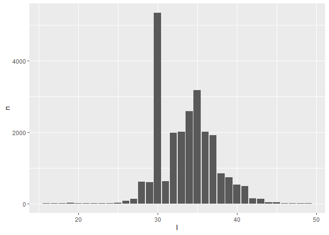<!-- -->

# Number of samples - rind removed

## <stat>

``` r
# All samples with and without CRISPR. 
sample_crispr_content <- CRISPRscope_meta_Project_Sample_list <- read_delim(paste(data_folder, "/IMPORT_EXPORT/CRISPRscope_meta_Project_Sample_list.csv", sep=""), 
    ",", escape_double = FALSE, trim_ws = TRUE)
```

    ## New names:
    ## * `` -> ...1

    ## Rows: 209 Columns: 4

    ## -- Column specification --------------------------------------------------------
    ## Delimiter: ","
    ## chr (2): ProjectID, SRA_ID
    ## dbl (1): ...1
    ## lgl (1): CRISPR

    ## 
    ## i Use `spec()` to retrieve the full column specification for this data.
    ## i Specify the column types or set `show_col_types = FALSE` to quiet this message.

``` r
# Metadata. Goal here is to remove the 22 samples from Rind of PRJEB32768
# Attention to encoding and separator. 
CRISPRscope_meta_METADATA <- read_delim(paste(data_folder, "/IMPORT/metadata/CRISPRscope_meta_Project_Sample_MANUAL_METADATA_VS.csv", sep=""),"\t", escape_double = FALSE, trim_ws = TRUE)
```

    ## New names:
    ## * `` -> ...1

    ## Rows: 209 Columns: 10

    ## -- Column specification --------------------------------------------------------
    ## Delimiter: "\t"
    ## chr (8): ProjectID, SRA_ID, BioSample_ID, Cheese_type, Sample_location (core...
    ## dbl (1): ...1
    ## lgl (1): CRISPR

    ## 
    ## i Use `spec()` to retrieve the full column specification for this data.
    ## i Specify the column types or set `show_col_types = FALSE` to quiet this message.

``` r
# Get the samples from Rind
rind_list <- CRISPRscope_meta_METADATA  %>% filter(`Sample_location (core rind)` == "Rind") %>% select(ProjectID, SRA_ID)
# => 22 samples from PRJEB32768


# we remove samples from rind
sample_crispr_content <- sample_crispr_content %>% filter(!SRA_ID %in% rind_list$SRA_ID)

sample_crispr_content %>% dplyr::count(CRISPR)
```

    ## # A tibble: 2 x 2
    ##   CRISPR     n
    ##   <lgl>  <int>
    ## 1 FALSE     24
    ## 2 TRUE     163

``` r
#26/209 -> before rind removal

# 187 metagenomes in total
24/187
```

    ## [1] 0.1283422

# Metadata

correction of manual metadata TMP by joining the crispr-less samples
that were previously removed / ignored

``` r
# 
CRISPRscope_meta_Project_Sample_MANUAL_METADATA <- read_delim(paste(data_folder, "/IMPORT/metadata/CRISPRscope_meta_Project_Sample_MANUAL_METADATA_VS.csv", sep=""),
    "\t", escape_double = FALSE, trim_ws = TRUE) %>% 
  mutate(Animal = gsub("cow", "Cow", Animal))%>% 
  mutate(Milk = gsub("raw", "Raw", Milk))
```

    ## New names:
    ## * `` -> ...1

    ## Rows: 209 Columns: 10

    ## -- Column specification --------------------------------------------------------
    ## Delimiter: "\t"
    ## chr (8): ProjectID, SRA_ID, BioSample_ID, Cheese_type, Sample_location (core...
    ## dbl (1): ...1
    ## lgl (1): CRISPR

    ## 
    ## i Use `spec()` to retrieve the full column specification for this data.
    ## i Specify the column types or set `show_col_types = FALSE` to quiet this message.

``` r
metaData_updated <- sample_crispr_content %>%
  left_join(CRISPRscope_meta_Project_Sample_MANUAL_METADATA %>% renameSamples(), by = c("ProjectID", "SRA_ID")) %>%
  select(-...1.y, -CRISPR.y) %>% dplyr::rename(contains_crispr = CRISPR.x) %>% 
  arrange(ProjectID, SRA_ID)

metaData_updated %>% write.csv(paste(data_folder, "/IMPORT/metadata/CRISPRscope_meta_Project_Sample_MANUAL_METADATA_updated.csv", sep=""))

metaData_updated
```

    ## # A tibble: 187 x 10
    ##    ...1.x ProjectID           SRA_ID    contains_crispr BioSample_ID Cheese_type
    ##     <dbl> <chr>               <chr>     <lgl>           <chr>        <chr>      
    ##  1    118 20201217_metagenom~ 24h_101_~ TRUE            <NA>         <NA>       
    ##  2    119 20201217_metagenom~ 24h_105_~ TRUE            <NA>         <NA>       
    ##  3    120 20201217_metagenom~ 24h_115_~ TRUE            <NA>         <NA>       
    ##  4    121 20201217_metagenom~ 24h_124_~ TRUE            <NA>         <NA>       
    ##  5    122 20201217_metagenom~ 24h_150_~ TRUE            <NA>         <NA>       
    ##  6    123 20201217_metagenom~ 24h_190_~ TRUE            <NA>         <NA>       
    ##  7    124 20201217_metagenom~ 24h_203_~ TRUE            <NA>         <NA>       
    ##  8    125 20201217_metagenom~ 24h_280_~ TRUE            <NA>         <NA>       
    ##  9    126 20201217_metagenom~ 24h_302_~ TRUE            <NA>         <NA>       
    ## 10    127 20201217_metagenom~ 24h_305_~ TRUE            <NA>         <NA>       
    ## # ... with 177 more rows, and 4 more variables:
    ## #   Sample_location (core rind) <chr>, Animal <chr>, Milk <chr>,
    ## #   Description <chr>

\#\#
<p>

barchart Includes all samples, the ones with rind included. There are 22
of them and they are removed later.

``` r
# id_data = id_data %>% 
#     mutate(ProjectID = replace(ProjectID, ProjectID == "20201217_metagenomes", "Agroscope"))

sample_crispr_content <- renameSamples(sample_crispr_content)

plt <- sample_crispr_content %>% 
  mutate(ProjectID = replace(ProjectID, ProjectID == "20201217_metagenomes", "Agroscope")) %>% 
  dplyr::count(ProjectID, CRISPR) %>% 
  ggplot(aes(x=ProjectID, y=n, fill=CRISPR))  +
  labs(x = "", y = "Sample count") +
  theme_bw() +
  geom_col(position="stack") +
  scale_fill_discrete(name = "Presence of \nCRISPR") +
  theme(
    axis.text = element_text(size = 14),
    axis.title = element_text(size = 14),
    axis.text.x = element_text(angle = 45, vjust = 0.6, color = "black"), 
    plot.title = element_text(size = 15, face = "bold", color = "darkgreen"),
    panel.grid.major = element_line(size = 0.25, linetype = 'solid',colour = "black"),
    panel.grid.minor = element_line(size = 0.25, linetype = 'solid',colour = "black"),
    panel.background = element_rect(fill = "white",colour = "black", linetype = 'solid', size = 0.5),
    plot.background = element_rect(fill = "white",colour = NA),
    plot.margin = unit(c(1,1,1,1), "cm"),
    legend.position = "right",
    legend.background = element_rect(fill = "white", colour = NA),
    legend.box.background = element_rect(fill = "white", colour = NA),
    legend.text = element_text(color = "black", size = 14),
    legend.title = element_text(color = "black", size = 14)) + 
  scale_fill_manual(values=c("black", "lightblue3"))
```

    ## Warning in `[<-.factor`(`*tmp*`, list, value = "Agroscope"): niveau de facteur
    ## incorrect, NAs générés

    ## Scale for 'fill' is already present. Adding another scale for 'fill', which
    ## will replace the existing scale.

``` r
# 
# ggsave(
#   plot = plt,
#   file = "./IMG/report/10_BioProject_CRISPR_content.pdf",
#   bg = "white",
#   width = 25,
#   height = 15,
#   units = "cm",
#   dpi = 800
# )
  
plt # %>% layout(title ="CRISPR content", annotations=list(yref='paper',xref="paper",y=1.05,x=1.15, text="Presence of CRISPR",showarrow=F) )
```

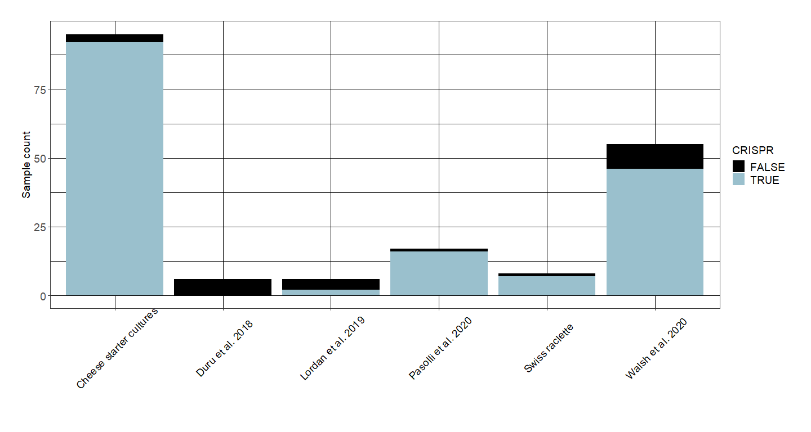<!-- -->

# Number of arrays - repeats - spacers

## <stat>

``` r
# Before filtering
#CRISPRscope_meta_tbl %>% summarise(n_spacer = n_distinct(cluster_spacer), n_repeat = n_distinct(cluster_repeat), n_array = n_distinct(GID))

# After removing samples from rind
CRISPRscope_meta_tbl_filtered %>% summarise(n_spacer = n_distinct(cluster_spacer), n_repeat = n_distinct(cluster_repeat), n_array = n_distinct(GID))
```

    ## # A tibble: 1 x 3
    ##   n_spacer n_repeat n_array
    ##      <int>    <int>   <int>
    ## 1     6661      121     394

# Number of Spacers / mil. reads

## <stat> mean sp/ mil.reads

``` r
# CRISPRscope_meta_tbl %>% select(SRA_ID, spacer_per_milread) %>% distinct() %>% summarise(max_milread = max(spacer_per_milread), min_milread = min(spacer_per_milread) ,avg_milread = mean(spacer_per_milread), sd_milread = sd(spacer_per_milread))

CRISPRscope_meta_tbl_filtered %>% select(SRA_ID, spacer_per_milread) %>% distinct() %>% summarise(max_milread = max(spacer_per_milread), min_milread = min(spacer_per_milread) ,avg_milread = mean(spacer_per_milread), sd_milread = sd(spacer_per_milread))
```

    ## # A tibble: 1 x 4
    ##   max_milread min_milread avg_milread sd_milread
    ##         <dbl>       <dbl>       <dbl>      <dbl>
    ## 1        38.9     0.00300        5.70       6.87

``` r
CRISPRscope_meta_tbl_filtered %>% select(SRA_ID, repeat_per_milread) %>% distinct() %>% summarise(max_milread = max(repeat_per_milread), min_milread = min(repeat_per_milread) ,avg_milread = mean(repeat_per_milread), sd_milread = sd(repeat_per_milread))
```

    ## # A tibble: 1 x 4
    ##   max_milread min_milread avg_milread sd_milread
    ##         <dbl>       <dbl>       <dbl>      <dbl>
    ## 1        2.86     0.00300       0.417      0.470

``` r
CRISPRscope_meta_tbl_filtered %>% select(SRA_ID, spacer_per_milread) %>% distinct() %>% 
  ggplot(aes(x=spacer_per_milread)) +
  geom_boxplot()
```

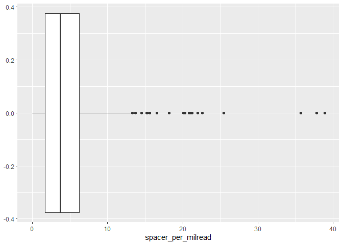<!-- -->

## <stat> million reads

``` r
CRISPRscope_meta_tbl_filtered %>% summarise(min_rc = min(read_count), max_rc = max(read_count))
```

    ## # A tibble: 1 x 2
    ##    min_rc    max_rc
    ##     <dbl>     <dbl>
    ## 1 1929494 817373450

\#\#
<p>

barchart avg spacer/milread / projects

``` r
CRISPRscope_meta_tbl_filtered_renamed <- renameSamples(CRISPRscope_meta_tbl_filtered)

plot_milread <- CRISPRscope_meta_tbl_filtered_renamed %>%
  mutate(ProjectID = replace(ProjectID, ProjectID == "20201217_metagenomes", "Agroscope")) %>% 
  select(ProjectID, SRA_ID, spacer_per_milread) %>% 
  distinct() %>% 
  group_by(ProjectID) %>%
  summarise(ProjectID, avg_milread = mean(spacer_per_milread), sd_milread = sd(spacer_per_milread)) %>%
  distinct() %>%
  select(ProjectID, avg_milread, sd_milread) %>% ungroup() %>%
  mutate(sd_milread = replace_na(sd_milread, 0)) %>% # 286900 has only 1 sample
  arrange(desc(avg_milread)) %>% 
  add_column(group = "spacers")
```

    ## Warning in `[<-.factor`(`*tmp*`, list, value = "Agroscope"): niveau de facteur
    ## incorrect, NAs générés

    ## `summarise()` has grouped output by 'ProjectID'. You can override using the `.groups` argument.

``` r
# for repeats

plot_milread_repeat <- CRISPRscope_meta_tbl_filtered_renamed %>%
  mutate(ProjectID = replace(ProjectID, ProjectID == "20201217_metagenomes", "Agroscope")) %>% 
  select(ProjectID, SRA_ID, repeat_per_milread) %>% 
  distinct() %>% 
  group_by(ProjectID) %>%
  summarise(ProjectID, avg_milread = mean(repeat_per_milread), sd_milread = sd(repeat_per_milread)) %>%
  distinct() %>%
  select(ProjectID, avg_milread, sd_milread) %>% ungroup() %>%
  mutate(sd_milread = replace_na(sd_milread, 0)) %>% # 286900 has only 1 sample
  arrange(desc(avg_milread)) %>% 
  add_column(group = "repeats")
```

    ## Warning in `[<-.factor`(`*tmp*`, list, value = "Agroscope"): niveau de facteur
    ## incorrect, NAs générés

    ## `summarise()` has grouped output by 'ProjectID'. You can override using the `.groups` argument.

``` r
plot_milread <- bind_rows(plot_milread, plot_milread_repeat)

plot_milread <- renameSamples(plot_milread)
```

    ## Warning in `[<-.factor`(`*tmp*`, list, value = "Duru et al. 2018"): niveau de
    ## facteur incorrect, NAs générés

``` r
plot_milread$ProjectID <- factor(plot_milread$ProjectID, 
                                 levels = c("Walsh et al. 2020", "Swiss raclette","Lordan et al. 2019","Cheese starter cultures","Pasolli et al. 2020"))

plot_milread$group <- factor(plot_milread$group, 
                             levels = c("spacers", "repeats"))

plt <- plot_milread %>% 
  ggplot(aes(x = ProjectID, y = avg_milread, sd = sd_milread, colors = "darkblue")) + 
  geom_point(aes(shape=group))+
  geom_errorbar(aes(x = ProjectID, ymin=avg_milread-sd_milread, ymax=avg_milread+sd_milread), width=.2,
                 position=position_dodge(0.05)) +
  coord_flip()+
  theme_bw() +
  theme(
    axis.text = element_text(size = 14),
    axis.title = element_text(size = 14),
    axis.text.x = element_text(
      angle = 45,
      vjust = 0.5,
      hjust = 0.5,
      color = "black"
    ),
    axis.text.y = element_text(hjust = 0, color = "black"),
    axis.title.x = element_text(color = "black", vjust = 0.1),
    axis.title.y = element_text(color = "black"),
    plot.title = element_text(color = "black"),
    axis.line.y.left = element_line(color = "black"),
    axis.line.y.right = element_line(color = "black"),
    axis.line.x.top = element_line(color = "black"),
    axis.line.x.bottom = element_line(color = "black"),
    axis.ticks = element_line(color = "black"),
    panel.background = element_rect(fill = "white", colour = NA),
    panel.grid.major = element_line(
      size = 0,
      linetype = 'solid',
      colour = "white"
    ),
    panel.grid.minor = element_line(
      size = 0,
      linetype = 'solid',
      colour = "white"
    ),
    plot.background = element_rect(fill = "white", colour = NA),
    plot.margin = unit(c(1, 1, 1, 1), "cm"),
    legend.position = "none",
    legend.background = element_rect(fill = "white", colour = NA),
    legend.box.background = element_rect(fill = "white", colour = NA),
    legend.text = element_text(color = "black"),
    legend.title = element_text(color = "black")
  ) +
  ylab("Observed number per million reads") +
  xlab("")+
  facet_wrap(~group, scales = "free_x")

  


ggsave(
  plot = plt,
  file = paste(google_drive_folder,"/11_SP_DR_per_million_read.pdf", sep = ""),
  bg = "white",
  width = 15,
  height = 10,
  units = "cm",
  dpi = 800
)

plt
```

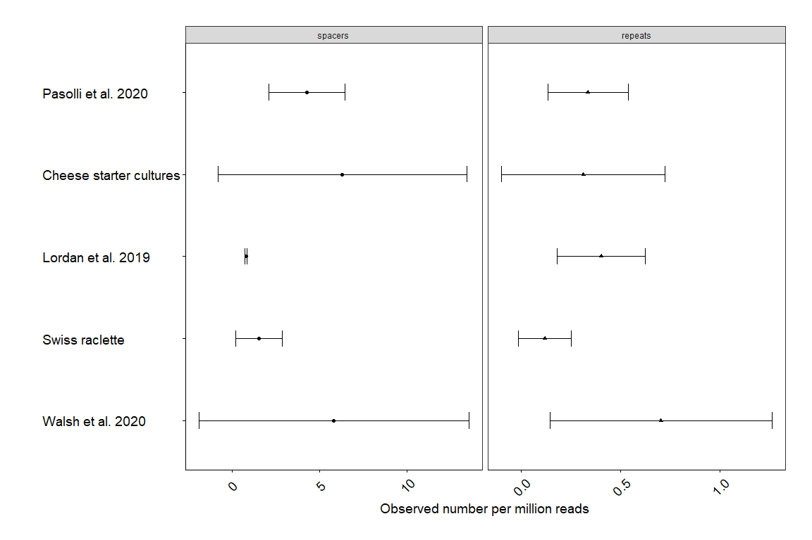<!-- -->

\#\#
<p>

barcharts spacer / milread / sample

``` r
# https://stackoverflow.com/questions/38833042/r-making-bigger-graphs-when-using-facet-wrap

#
# Per sample, number of spacers per million reads
# input: unmerged stats
# Call: nb_spacers_norm

# # TODO: to match all the graphs, maybe order by the same as the "number of arrays " graph.
# 
# nb_sp_nrm <- nb_spacers_norm(stats_data) %>%
#   arrange(normalized_total) %>%
#   mutate(SRA_ID = fct_reorder(SRA_ID, normalized_total))
# 


CRISPRscope_meta_tbl_filtered %>% select(spacer_per_milread) %>% distinct()
```

    ## # A tibble: 163 x 1
    ##    spacer_per_milread
    ##                 <dbl>
    ##  1            1.89   
    ##  2            1.08   
    ##  3            2.06   
    ##  4            0.679  
    ##  5            0.865  
    ##  6            4.12   
    ##  7            0.00300
    ##  8           13.3    
    ##  9            9.78   
    ## 10           11.4    
    ## # ... with 153 more rows

``` r
df_spacer_mil_reads <- CRISPRscope_meta_tbl_filtered %>% 
  select(ProjectID, SRA_ID, spacer_per_milread) %>% 
  distinct() %>% 
  mutate(ProjectID = as.factor(ProjectID), SRA_ID = fct_reorder(SRA_ID, spacer_per_milread)) %>% 
  group_by(ProjectID) %>% 
  arrange(spacer_per_milread, by_group = TRUE) %>% 
  ungroup()

plot_milreads <- df_spacer_mil_reads %>% 
  ggplot(aes(x=SRA_ID, y=spacer_per_milread)) +
  geom_bar(stat="identity", fill="orange", alpha=.6, width=.5)+
  ylab("Number of spacers per million reads") +
  xlab("Sample") +
  ggtitle("Number of spacers per million reads") +
  theme(axis.text.x = element_text(angle = 90, vjust = 0.5, hjust=1)) + 
  facet_wrap(~ProjectID, scales='free_x') 


plot_milreads
```

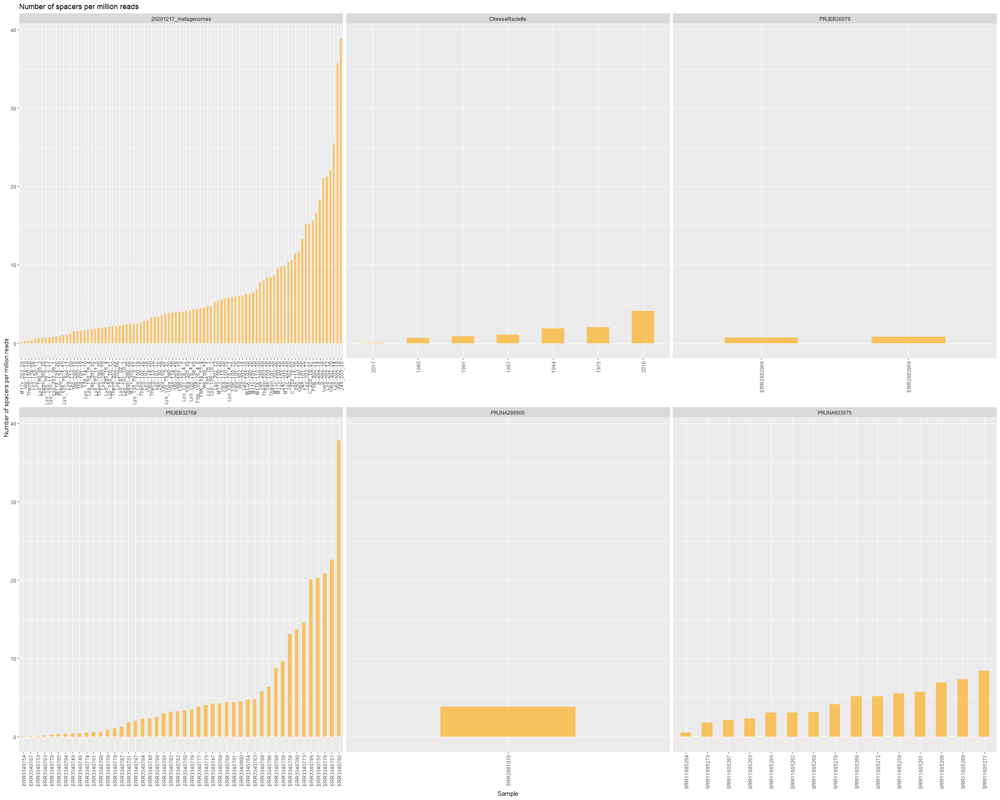<!-- -->

# Cas-Subtypes per projects

\#\#
<p>

Heatmap

``` r
#View(CRISPRscope_meta_tbl)
plt_castype <- CRISPRscope_meta_tbl_filtered %>%
  mutate(ProjectID = replace(ProjectID, ProjectID == "20201217_metagenomes", "Agroscope")) %>%
  dplyr::count(ProjectID, Subtype, GID) %>% 
  dplyr::count(Subtype, ProjectID) %>% 
  select(ProjectID, Subtype, n) %>%
  ggplot(aes(x = ProjectID, y = Subtype, fill = n)) +
  geom_tile(color = "gray") +
  scale_fill_gradient(low = "lightblue", high = "black") +
  theme_bw() +
  theme(
    axis.title = element_text(size = 14),
    axis.text = element_text(size = 14),
    axis.text.x = element_text(
      angle = 45,
      vjust = 1,
      hjust = 1,
      color = "black"
    ),
    axis.text.y = element_text(hjust = 0, color = "black"),
    axis.title.x = element_text(color = "black"),
    axis.title.y = element_text(color = "black"),
    plot.title = element_text(color = "black"),
    axis.line.y.left = element_line(color = "black"),
    axis.line.y.right = element_line(color = "black"),
    axis.line.x.top = element_line(color = "black"),
    axis.line.x.bottom = element_line(color = "black"),
    axis.ticks = element_line(color = "black"),
    panel.background = element_rect(fill = "white", colour = NA),
    panel.grid.major = element_line(
      size = 0,
      linetype = 'solid',
      colour = "white"
    ),
    panel.grid.minor = element_line(
      size = 0,
      linetype = 'solid',
      colour = "white"
    ),
    plot.background = element_rect(fill = "white", colour = NA),
    plot.margin = unit(c(1, 1, 1, 1), "cm"),
    legend.position = "right",
    legend.background = element_rect(fill = "white", colour = NA),
    legend.box.background = element_rect(fill = "white", colour = NA),
    legend.text = element_text(color = "black", size = 14),
    legend.title = element_text(color = "black", size = 14)
  ) +
  labs(fill = "Array count") +
  xlab("Bioproject") +
  ylab("Cas-subtype")


# ggsave(
#   plot = plt_castype,
#   file = "./IMG/report/13_Cas-Subtypes_bioproject.pdf",
#   bg = "white",
#   width = 25,
#   height = 15,
#   units = "cm",
#   dpi = 800
# )

plt_castype
```

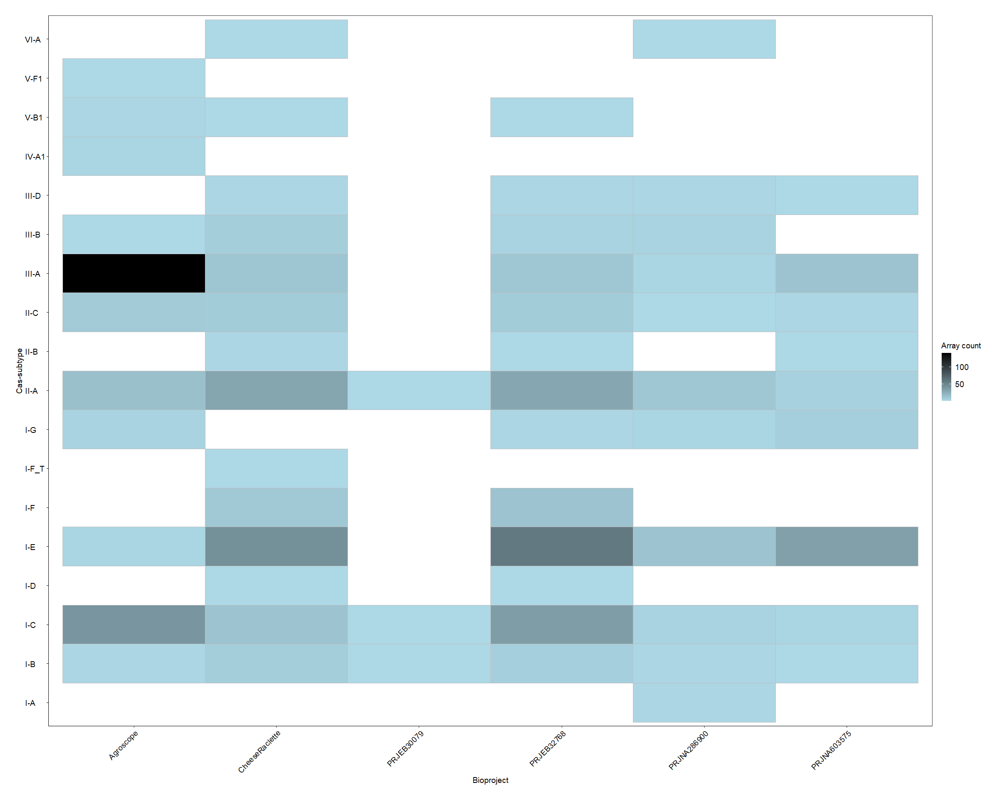<!-- -->

\#——————————

# Repeats and Spacers sharing

## WIP repeats shared vs meso-thermo

``` r
# Raclette / Lordan et al. Walsh et al => Mesophillic
# Starter / Pasolli => thermophillic 


typed_CRISPRscope_meta_tbl_filtered <- CRISPRscope_meta_tbl_filtered %>% renameSamples() %>% 
  mutate(type = ifelse(ProjectID == "Swiss raclette", "Mesophilic", NA)) %>% 
  mutate(type = ifelse(ProjectID == "Lordan et al. 2019", "Mesophilic", type)) %>% 
  mutate(type = ifelse(ProjectID == "Walsh et al. 2020", "Mesophilic", type)) %>% 
  mutate(type = ifelse(ProjectID == "Swiss starter culture", "Thermophilic", type)) %>%
  mutate(type = ifelse(ProjectID == "Pasolli et al. 2020", "Thermophilic", type)) %>%
  select(ProjectID, type, cluster_repeat_identity, cluster_spacer_identity) %>% 
  mutate(ProjectID = paste(ProjectID, " (", type, ")", sep = ""))


# Percentage of shared repeats between pairs of projects vs between type (meso thermo)


byproject <- typed_CRISPRscope_meta_tbl_filtered %>% 
  group_by(ProjectID) %>% 
  summarise(Repeat_cluster_100 = cluster_spacer_identity) %>% 
  distinct() %>% ungroup() %>% 
  group_by(Repeat_cluster_100) %>% 
  summarise(Repeat_cluster_100 = Repeat_cluster_100, count = n()) %>% 
  distinct() %>% 
  right_join(typed_CRISPRscope_meta_tbl_filtered %>% select(ProjectID, cluster_repeat_identity) %>% distinct(), 
             by=c("Repeat_cluster_100" = "cluster_repeat_identity")) %>% 
  ungroup() %>% mutate(count=Repeat_cluster_100) %>% 
  spread_(key_col = "ProjectID", value_col = "count") %>% 
  select(-Repeat_cluster_100)
```

    ## `summarise()` has grouped output by 'ProjectID'. You can override using the `.groups` argument.

    ## `summarise()` has grouped output by 'Repeat_cluster_100'. You can override using the `.groups` argument.

``` r
project_combn = t(combn(c(colnames(byproject)), 2))

project_combination = tibble(x = project_combn[,1], y = project_combn[,2])  # NO REPETITION (BUT NOT COMPLETE MATRIX)


f100 <- function(x,y){
  z = c(byproject %>% select(x) == byproject %>% select(y))
  
  return(sum(z, na.rm = TRUE))
}


projects_combination.spacer_shared_100 <- project_combination %>% mutate(shared_repeats = map2_dbl(x,y,f100)) %>% 
  mutate_at(c("shared_repeats"), ~(rescale(., c(0,1)) %>% as.vector))   # scales between 0 and 1, keeps NA
```

    ## Note: Using an external vector in selections is ambiguous.
    ## i Use `all_of(x)` instead of `x` to silence this message.
    ## i See <https://tidyselect.r-lib.org/reference/faq-external-vector.html>.
    ## This message is displayed once per session.

    ## Note: Using an external vector in selections is ambiguous.
    ## i Use `all_of(y)` instead of `y` to silence this message.
    ## i See <https://tidyselect.r-lib.org/reference/faq-external-vector.html>.
    ## This message is displayed once per session.

``` r
projects_combination.spacer_shared_100 %>% 
  # mutate(x = factor(species_combination.spacer_shared_100$x, levels = species_levels_21)) %>% 
  # mutate(y = factor(species_combination.spacer_shared_100$y, levels = species_levels_21)) %>% 
  ggplot(aes(x=x, y=y,fill=shared_repeats)) +
  geom_tile() + 
  theme_classic() + 
  scale_fill_gradientn(colours = c("grey", "blue", "red"), values = c(0,0.001,1))+
  scale_y_discrete(labels = function(x) str_replace(x, "_", " "), limits=rev) +
  scale_x_discrete(labels = function(x) str_replace(x, "_", " "), limits=rev) +
  theme(
    axis.text.x = element_text(
      hjust = 1,
      color = "black",
      size = 12,
      face = "italic",
      angle = 45
    ),
    axis.text.y = element_text(
      hjust = 1,
      color = "black",
      size = 12,
      face = "italic"
    ),
    #axis.text.y = element_blank(), # comment / uncomment for y axis text
    axis.title.x = element_text(color = "black"),
    axis.title.y = element_text(color = "black"),
    axis.line.y.left = element_line(color = "black"),
    axis.line.y.right = element_line(color = "black"),
    axis.line.x = element_line(color = "black"),
    axis.ticks = element_line(color = "black"),
    plot.title = element_text(color = "black"),
    panel.background = element_rect(fill = "white", colour = NA),
    plot.background = element_rect(fill = "white", colour = NA),
    legend.position = "right",
    legend.background = element_rect(fill = "white", colour = NA),
    legend.box.background = element_rect(fill = "white", colour = NA),
    legend.text = element_text(color = "black"),
    legend.title = element_text(color = "black"),
    plot.margin = unit(c(1, 1, 1, 1), "cm"),
    panel.grid.major = element_line(color = "grey", size = 0.1),
    panel.grid.minor = element_line(color = "grey", size = 0.1),
    strip.background = element_rect(
      color = "black",
      fill = "white",
      size = 0.5,
      linetype = "solid"
    ),
    strip.text = element_text(color = "grey")
  ) +
  ylab("") +
  xlab("Shared repeats (100% identity clusters)")
```

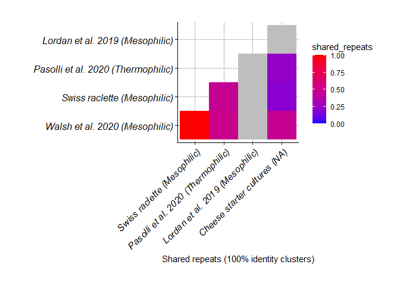<!-- -->

## Export vincent rarefaction curve

Export for Rarefaction curve computing

Question: Do you know if the repeats you find in the metagenome occur in
multiple metagenomic samples or only in one? Can you make a dataframe
with metagenomic samples on the y-axis and repeat on the x-axis and
within the data.frame you have the presence/absence or coverage or
spacer count of the repeat?

``` r
CRISPRscope_meta_tbl_filtered %>% select(ProjectID, SRA_ID, cluster_repeat_identity, cluster_repeat) %>% distinct() %>% 
  write.csv(file = paste(data_folder, "/EXPORT/metagenome_repeats_by_projects.csv", sep=""))

CRISPRscope_meta_tbl_filtered %>% select(ProjectID, SRA_ID, cluster_spacer_identity, cluster_spacer) %>% distinct() %>% 
  write.csv(file = paste(data_folder, "/EXPORT/metagenome_spacers_by_projects.csv", sep=""))
```

## TEST sample comparison

compare samples from the same project

Subset the data to take only Gruyère samples

``` r
selected_sra <- CRISPRscope_meta_METADATA %>% filter(Cheese_type == "Gruyere") %>% select(SRA_ID) %>% unlist()

selected_data <- CRISPRscope_meta_tbl_filtered %>% filter(SRA_ID %in% selected_sra)

selected_data_2 <- CRISPRscope_meta_tbl_filtered 
```

Metaphlan results

``` r
allStrains_metaphlan %>% filter(Sample %in% selected_sra & RelAbundance > 0.5) %>% select(Sample, Species, RelAbundance) %>% 
  ggplot(aes(x = Sample, y = RelAbundance, fill = Species, )) + 
  geom_bar(position = "dodge", stat = "identity")+
  theme_bw() +
  theme(
    axis.title = element_text(size = 14),
    axis.text = element_text(size = 14),
    axis.text.x = element_text(
      angle = 45,
      vjust = 1,
      hjust = 1,
      color = "black"
    ),
    axis.text.y = element_text(hjust = 0, color = "black"),
    axis.title.x = element_text(color = "black"),
    axis.title.y = element_text(color = "black"),
    plot.title = element_text(color = "black"),
    axis.line.y.left = element_line(color = "black"),
    axis.line.y.right = element_line(color = "black"),
    axis.line.x.top = element_line(color = "black"),
    axis.line.x.bottom = element_line(color = "black"),
    axis.ticks = element_line(color = "black"),
    panel.background = element_rect(fill = "white", colour = NA),
    panel.grid.major = element_line(
      size = 0,
      linetype = 'solid',
      colour = "white"
    ),
    panel.grid.minor = element_line(
      size = 0,
      linetype = 'solid',
      colour = "white"
    ),
    plot.background = element_rect(fill = "white", colour = NA),
    plot.margin = unit(c(1, 1, 1, 1), "cm"),
    legend.position = "right",
    legend.background = element_rect(fill = "white", colour = NA),
    legend.box.background = element_rect(fill = "white", colour = NA),
    legend.text = element_text(color = "black", size = 14),
    legend.title = element_text(color = "black", size = 14)
  ) +
  labs(fill = "Array count", title = "Gruyère samples comparison") +
  xlab("Sample") +
  ylab("Relative abundance") 
```

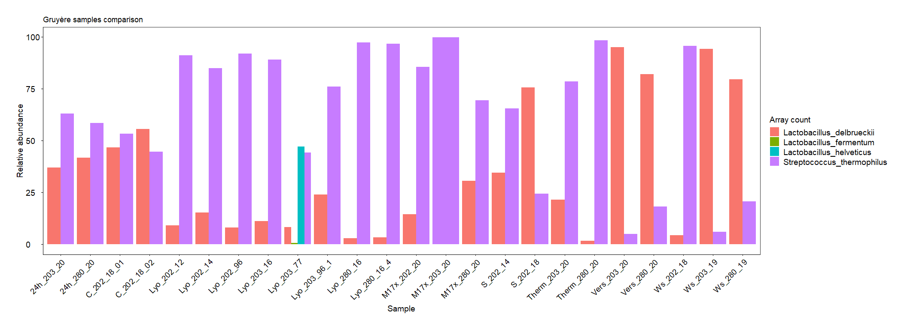<!-- -->

Plot Cas types

``` r
selected_data %>%
  dplyr::count(SRA_ID, Subtype, GID) %>% 
  dplyr::count(Subtype, SRA_ID) %>% 
  select(SRA_ID, Subtype, n) %>%
  ggplot(aes(x = SRA_ID, y = Subtype, fill = n)) +
  geom_tile(color = "gray") +
  scale_fill_gradient(low = "lightblue", high = "black") +
  theme_bw() +
  theme(
    axis.title = element_text(size = 14),
    axis.text = element_text(size = 14),
    axis.text.x = element_text(
      angle = 45,
      vjust = 1,
      hjust = 1,
      color = "black"
    ),
    axis.text.y = element_text(hjust = 0, color = "black"),
    axis.title.x = element_text(color = "black"),
    axis.title.y = element_text(color = "black"),
    plot.title = element_text(color = "black"),
    axis.line.y.left = element_line(color = "black"),
    axis.line.y.right = element_line(color = "black"),
    axis.line.x.top = element_line(color = "black"),
    axis.line.x.bottom = element_line(color = "black"),
    axis.ticks = element_line(color = "black"),
    panel.background = element_rect(fill = "white", colour = NA),
    panel.grid.major = element_line(
      size = 0,
      linetype = 'solid',
      colour = "white"
    ),
    panel.grid.minor = element_line(
      size = 0,
      linetype = 'solid',
      colour = "white"
    ),
    plot.background = element_rect(fill = "white", colour = NA),
    plot.margin = unit(c(1, 1, 1, 1), "cm"),
    legend.position = "right",
    legend.background = element_rect(fill = "white", colour = NA),
    legend.box.background = element_rect(fill = "white", colour = NA),
    legend.text = element_text(color = "black", size = 14),
    legend.title = element_text(color = "black", size = 14)
  ) +
  labs(fill = "Array count", title = "Gruyère samples comparison") +
  xlab("Sample") +
  ylab("Cas-subtype") 
```

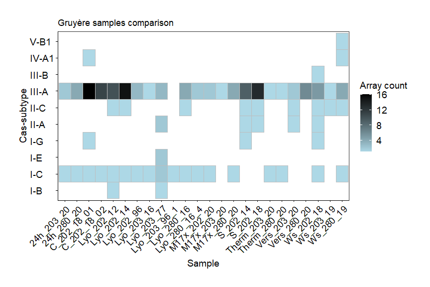<!-- -->

\#——————————

# Mapping DR-SP-DR

!! Pay attention to ^m (ctrl-v ctrl-m in bash) character. These
invisible whitespaces can cause problems in the script (0 coverage)

When the computation is done merge the two (proto)spacer files with:

``` bash
cut -f 4,5,10 ./allSamples_spacer_coverage.bed > ./allSamples_spacer_coverage_short.bed
cut -f 5 ./allSamples_protospacer_coverage.bed > ./allSamples_spacer_coverage_tmp.bed
echo -e "spacer_name\tspacer_cov\tsample\tprotospacer_cov" > ./allSamples_coverages_final.bed
paste -d '\t' ./allSamples_spacer_coverage_short.bed ~/allSamples_spacer_coverage_tmp.bed >>  ./allSamples_coverages_final.bed
```

``` r
##-----------------------------------------------
##------------------------import data
##-----------------------------------------------


CRISPR_spacer_coverage_start <- read_delim(paste(data_folder, "/IMPORT/allSamples_coverages_final.bed", sep=""), "\t", escape_double = FALSE, trim_ws = TRUE)
```

    ## Rows: 3556344 Columns: 4

    ## -- Column specification --------------------------------------------------------
    ## Delimiter: "\t"
    ## chr (2): spacer_name, sample
    ## dbl (2): spacer_cov, protospacer_cov

    ## 
    ## i Use `spec()` to retrieve the full column specification for this data.
    ## i Specify the column types or set `show_col_types = FALSE` to quiet this message.

``` r
reads4normalization <- read_delim(paste(data_folder, "/IMPORT/reads4normalization.txt", sep=""),  "\t", escape_double = FALSE, col_names = c("bioproject","sample","readNumber"), trim_ws = TRUE)
```

    ## Rows: 209 Columns: 3

    ## -- Column specification --------------------------------------------------------
    ## Delimiter: "\t"
    ## chr (2): bioproject, sample
    ## dbl (1): readNumber

    ## 
    ## i Use `spec()` to retrieve the full column specification for this data.
    ## i Specify the column types or set `show_col_types = FALSE` to quiet this message.

``` r
CRISPR_spacer_coverage_wzeros <- CRISPR_spacer_coverage_start
CRISPR_spacer_coverage_cleaned <- CRISPR_spacer_coverage_start %>% filter(spacer_cov!=0 & protospacer_cov!=0)
dim(CRISPR_spacer_coverage_cleaned)
```

    ## [1] 12075     4

``` r
#dim(CRISPR_spacer_coverage)


##-----------------------------------------------
###----------------normalize with total number of reads per sample
##-----------------------------------------------
CRISPR_spacer_coverage <- merge(CRISPR_spacer_coverage_cleaned,reads4normalization,by="sample",all.x = TRUE)
CRISPR_spacer_coverage$spacer_CPM <- 1000000*(CRISPR_spacer_coverage$spacer_cov/CRISPR_spacer_coverage$readNumber)
CRISPR_spacer_coverage$protospacer_CPM <- 1000000*(CRISPR_spacer_coverage$protospacer_cov/CRISPR_spacer_coverage$readNumber)

# Same while keeping zeroes
CRISPR_spacer_coveragez <- merge(CRISPR_spacer_coverage_wzeros,reads4normalization,by="sample",all.x = TRUE)
CRISPR_spacer_coveragez$spacer_CPM <- 1000000*(CRISPR_spacer_coveragez$spacer_cov/CRISPR_spacer_coveragez$readNumber)
CRISPR_spacer_coveragez$protospacer_CPM <- 1000000*(CRISPR_spacer_coveragez$protospacer_cov/CRISPR_spacer_coveragez$readNumber)

summary(CRISPR_spacer_coverage)
```

    ##     sample          spacer_name          spacer_cov      protospacer_cov  
    ##  Length:12075       Length:12075       Min.   :    1.0   Min.   :    1.0  
    ##  Class :character   Class :character   1st Qu.:    6.0   1st Qu.:    2.0  
    ##  Mode  :character   Mode  :character   Median :   22.0   Median :    7.0  
    ##                                        Mean   :  145.1   Mean   :  160.5  
    ##                                        3rd Qu.:  100.0   3rd Qu.:   26.0  
    ##                                        Max.   :19825.0   Max.   :40216.0  
    ##   bioproject          readNumber       spacer_CPM       protospacer_CPM    
    ##  Length:12075       Min.   :  1889   Min.   :     1.6   Min.   :      1.6  
    ##  Class :character   1st Qu.: 11352   1st Qu.:    97.9   1st Qu.:     56.0  
    ##  Mode  :character   Median : 39523   Median :   574.7   Median :    206.3  
    ##                     Mean   :109924   Mean   :  5803.5   Mean   :   4075.2  
    ##                     3rd Qu.:162240   3rd Qu.:  3348.6   3rd Qu.:    905.0  
    ##                     Max.   :621580   Max.   :999472.3   Max.   :1627943.8

``` r
CRISPR_spacer_coverage %>% write_csv(file = paste(data_folder, "/IMPORT_EXPORT/DR_SP_DR_results.csv", sep=""))
CRISPR_spacer_coveragez %>% write_csv(file = paste(data_folder, "/IMPORT_EXPORT/DR_SP_DR_results_zeroes.csv", sep=""))
```

\#
<p>

spacer vs protospacer

``` r
##-----------------------------------------------
###----------------plot
##-----------------------------------------------
library(viridis)
```

    ## Le chargement a nécessité le package : viridisLite

    ## 
    ## Attachement du package : 'viridis'

    ## L'objet suivant est masqué depuis 'package:scales':
    ## 
    ##     viridis_pal

``` r
# spacer name and subtype

snast <- CRISPRscope_meta_tbl_filtered %>% mutate(ProjectID2 = ProjectID) %>% unite(spacer_name, c("ProjectID", "SRA_ID","GID","SPID","Coverage"), sep = "_") %>% select(spacer_name, Subtype)

plt_coverage = CRISPR_spacer_coverage %>% left_join(snast, by=c("spacer_name")) 
```

``` r
my.formula <- y ~ x
library(ggpmisc)
```

    ## Le chargement a nécessité le package : ggpp

    ## 
    ## Attachement du package : 'ggpp'

    ## L'objet suivant est masqué depuis 'package:ggplot2':
    ## 
    ##     annotate

``` r
plot <-
  ggplot(plt_coverage, aes(x = spacer_CPM, y = protospacer_CPM)) +
  geom_point(alpha = 0.7, size = 0.2) + #aes(color= Subtype),
  #scale_color_viridis_d() +
  scale_x_continuous(trans = 'log10') +
  scale_y_continuous(trans = 'log10') +
  labs(x = "spacer [cpm]", y = "protospacers  [cpm]") +
  #geom_point(aes(fill = Subtype),alpha = 0.4, size = 0.2) +
  geom_smooth(method = "lm", se = FALSE) +
  # stat_smooth(method = "glm") +
  stat_poly_eq(formula = my.formula,
               aes(label = paste(..eq.label.., ..rr.label.., sep = "~~~")),
               parse = TRUE, ) +
  theme_bw() + 
  theme(
    axis.text = element_text(size = 18),
    axis.title = element_text(size = 18),
    legend.text = element_text(color = "black", size = 14),
    legend.title = element_text(color = "black", size = 14),
    axis.text.x = element_text(
      angle = 45,
      hjust = 1,
      color = "black"
    ),
    axis.text.y = element_text(color = "black"),
    axis.title.x = element_text(color = "black"),
    axis.title.y = element_text(color = "black"),
    axis.line.y.left = element_line(color = "black"),
    axis.line.y.right = element_line(color = "black"),
    axis.line.x = element_line(color = "black"),
    axis.ticks = element_line(color = "black"),
    plot.title = element_text(color = "black"),
    panel.background = element_rect(fill = "white", colour = NA),
    plot.background = element_rect(fill = "white", colour = NA),
    legend.position = "top",
    legend.background = element_rect(fill = "white", colour = NA),
    legend.box.background = element_rect(fill = "white", colour = NA),
    plot.margin = unit(c(1, 1, 1, 1), "cm"),
    #panel.grid.major = element_line(color = "black", size = 0.1),
    #panel.grid.minor = element_line(color = "black", size = 0.1),
    strip.background = element_rect(
      color = "black",
      fill = "White",
      size = 0.5,
      linetype = "solid"
    ),
    strip.text = element_text(color = "black")
  ) 
  #facet_wrap(~Subtype)


# ggsave(
#   plot = plot,
#   file = "./IMG/report/15_SpacerProtospacerAbundance.pdf",
#   bg = "white",
#   width = 15,
#   height = 25,
#   units = "cm",
#   dpi = 800
# )

# ggsave(
#   plot = plot,
#   file = "./IMG/poster/15_SpacerProtospacerAbundance.svg",
#   bg = "white",
#   width = 20,
#   height = 25,
#   units = "cm",
#   dpi = 800
# )

plot
```

    ## `geom_smooth()` using formula 'y ~ x'

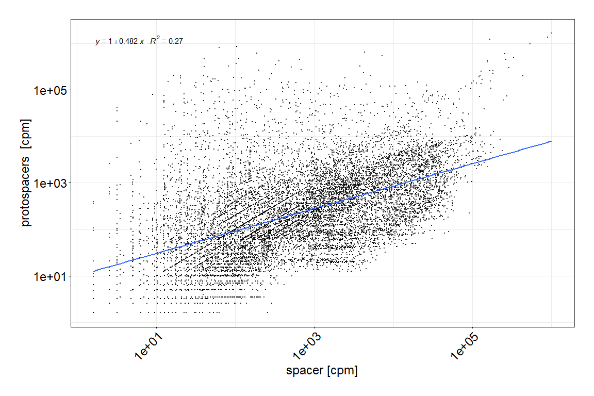<!-- -->

## Facet version

``` r
my.formula <- y ~ x
library(ggpmisc)

plot2 <-
  ggplot(plt_coverage, aes(x = spacer_CPM, y = protospacer_CPM)) +
  geom_point(alpha = 0.7, size = 0.2) + #aes(color= Subtype),
  #scale_color_viridis_d() +
  scale_x_continuous(trans = 'log10') +
  scale_y_continuous(trans = 'log10') +
  labs(x = "spacer [cpm]", y = "protospacers  [cpm]") +
  #geom_point(aes(fill = Subtype),alpha = 0.4, size = 0.2) +
  geom_smooth(method = "lm", se = FALSE) +
  stat_poly_eq(formula = my.formula,
               aes(label = paste(..eq.label.., ..rr.label.., sep = "~~~")),
               parse = TRUE, ) +
  theme_bw() + 
  theme(
    axis.text = element_text(size = 18),
    axis.title = element_text(size = 18),
    legend.text = element_text(color = "black", size = 14),
    legend.title = element_text(color = "black", size = 14),
    axis.text.x = element_text(
      angle = 45,
      hjust = 1,
      color = "black"
    ),
    axis.text.y = element_text(color = "black"),
    axis.title.x = element_text(color = "black"),
    axis.title.y = element_text(color = "black"),
    axis.line.y.left = element_line(color = "black"),
    axis.line.y.right = element_line(color = "black"),
    axis.line.x = element_line(color = "black"),
    axis.ticks = element_line(color = "black"),
    plot.title = element_text(color = "black"),
    panel.background = element_rect(fill = "white", colour = NA),
    plot.background = element_rect(fill = "white", colour = NA),
    legend.position = "top",
    legend.background = element_rect(fill = "white", colour = NA),
    legend.box.background = element_rect(fill = "white", colour = NA),
    plot.margin = unit(c(1, 1, 1, 1), "cm"),
    #panel.grid.major = element_line(color = "black", size = 0.1),
    #panel.grid.minor = element_line(color = "black", size = 0.1),
    strip.background = element_rect(
      color = "black",
      fill = "White",
      size = 0.5,
      linetype = "solid"
    ),
    strip.text = element_text(color = "black")
  ) +
  facet_wrap(~Subtype)

plot3 <-
  ggplot(plt_coverage %>% mutate(ProjectID = bioproject) %>% renameSamples(), aes(x = spacer_CPM, y = protospacer_CPM)) +
  geom_point(alpha = 0.7, size = 0.2) + #aes(color= Subtype),
  #scale_color_viridis_d() +
  scale_x_continuous(trans = 'log10') +
  scale_y_continuous(trans = 'log10') +
  labs(x = "spacer [cpm]", y = "protospacers  [cpm]") +
  #geom_point(aes(fill = Subtype),alpha = 0.4, size = 0.2) +
  geom_smooth(method = "lm", se = FALSE) +
  stat_poly_eq(formula = my.formula,
               aes(label = paste(..eq.label.., ..rr.label.., sep = "~~~")),
               parse = TRUE, ) +
  theme_bw() + 
  theme(
    axis.text = element_text(size = 18),
    axis.title = element_text(size = 18),
    legend.text = element_text(color = "black", size = 14),
    legend.title = element_text(color = "black", size = 14),
    axis.text.x = element_text(
      angle = 45,
      hjust = 1,
      color = "black"
    ),
    axis.text.y = element_text(color = "black"),
    axis.title.x = element_text(color = "black"),
    axis.title.y = element_text(color = "black"),
    axis.line.y.left = element_line(color = "black"),
    axis.line.y.right = element_line(color = "black"),
    axis.line.x = element_line(color = "black"),
    axis.ticks = element_line(color = "black"),
    plot.title = element_text(color = "black"),
    panel.background = element_rect(fill = "white", colour = NA),
    plot.background = element_rect(fill = "white", colour = NA),
    legend.position = "top",
    legend.background = element_rect(fill = "white", colour = NA),
    legend.box.background = element_rect(fill = "white", colour = NA),
    plot.margin = unit(c(1, 1, 1, 1), "cm"),
    #panel.grid.major = element_line(color = "black", size = 0.1),
    #panel.grid.minor = element_line(color = "black", size = 0.1),
    strip.background = element_rect(
      color = "black",
      fill = "White",
      size = 0.5,
      linetype = "solid"
    ),
    strip.text = element_text(color = "black")
  ) +
  facet_wrap(~ProjectID)

plot2
```

    ## `geom_smooth()` using formula 'y ~ x'

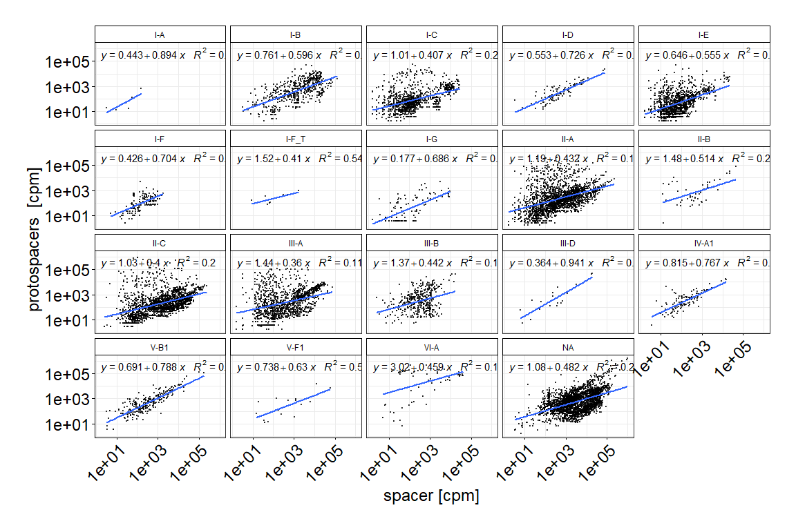<!-- -->

``` r
plot3
```

    ## `geom_smooth()` using formula 'y ~ x'

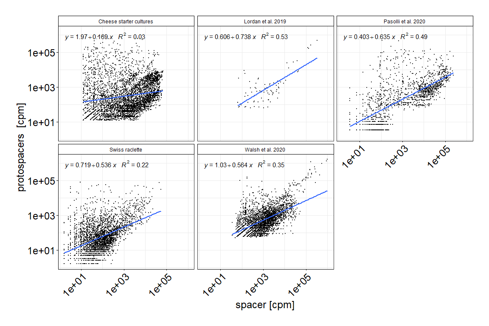<!-- -->

``` r
ggsave(
  plot = plot2,
  file = paste(google_drive_folder,"/Spacer_protospacer_facets_castype.pdf", sep = ""),
  bg = "white",
  width = 30,
  height = 15,
  units = "cm",
  dpi = 800
)
```

    ## `geom_smooth()` using formula 'y ~ x'

# <processing> Spacer vs 0 protospacers

``` r
# Always take spacers with >0 coverage -> otherwise wrong samples and only 0's

# Spacers that have no match in the metagenome
CRISPR_spacer_coverage_zero_protospacer <- CRISPR_spacer_coverage_start %>% filter(spacer_cov!=0 & protospacer_cov==0)

# Spacers that have a match in the metagenome
CRISPR_spacer_coverage_nonzero_protospacer <- CRISPR_spacer_coverage_start %>% filter(spacer_cov!=0 & protospacer_cov!=0)

# a = proportion of spacers without a target
# b = proportion of spacers with a target
a = CRISPR_spacer_coverage_zero_protospacer %>% dplyr::count(protospacer_cov) %>% summarise(tot = sum(n))
b = CRISPR_spacer_coverage_nonzero_protospacer %>% dplyr::count(protospacer_cov) %>% summarise(tot = sum(n))
a # 7677
```

    ## # A tibble: 1 x 1
    ##     tot
    ##   <int>
    ## 1  7677

``` r
b # 12075
```

    ## # A tibble: 1 x 1
    ##     tot
    ##   <int>
    ## 1 12075

``` r
spacers_tot = CRISPR_spacer_coverage_start %>% filter(spacer_cov!=0) # a + b = 19752

# percentage of spacers without a target 
a$tot / (a$tot + b$tot) # 0.3886695
```

    ## [1] 0.3886695

\#——————————

# TODO Relation between species abudnance and coverage of spacers.

\#——————————

# TMP count reads mapping

diversity. Count spacer reads per sample - classify

``` r
# metaData_updated
# CRISPR_spacer_coverage


meta_readcount <- left_join(CRISPR_spacer_coverage, metaData_updated, by=c("sample" = "SRA_ID")) %>% 
  filter(spacer_CPM < 7500) # remove extreme values

meta_readcount %>% select(sample) %>% distinct()
```

    ##              sample
    ## 1              1875
    ## 2              1944
    ## 3              1957
    ## 4              1975
    ## 5              1985
    ## 6              1991
    ## 7              2010
    ## 8              2017
    ## 9        24h_101_20
    ## 10       24h_105_20
    ## 11       24h_115_20
    ## 12       24h_124_20
    ## 13       24h_150_20
    ## 14       24h_190_20
    ## 15       24h_203_20
    ## 16       24h_280_20
    ## 17       24h_302_20
    ## 18       24h_305_20
    ## 19      C_202_18_01
    ## 20      C_202_18_02
    ## 21       ERR2982964
    ## 22       ERR2982965
    ## 23       ERR2982968
    ## 24       ERR2982969
    ## 25       ERR3340746
    ## 26       ERR3340747
    ## 27       ERR3340748
    ## 28       ERR3340749
    ## 29       ERR3340750
    ## 30       ERR3340751
    ## 31       ERR3340752
    ## 32       ERR3340753
    ## 33       ERR3340754
    ## 34       ERR3340755
    ## 35       ERR3340756
    ## 36       ERR3340757
    ## 37       ERR3340758
    ## 38       ERR3340759
    ## 39       ERR3340760
    ## 40       ERR3340761
    ## 41       ERR3340762
    ## 42       ERR3340763
    ## 43       ERR3340764
    ## 44       ERR3340765
    ## 45       ERR3340766
    ## 46       ERR3340767
    ## 47       ERR3340768
    ## 48       ERR3340769
    ## 49       ERR3340770
    ## 50       ERR3340771
    ## 51       ERR3340772
    ## 52       ERR3340773
    ## 53       ERR3340774
    ## 54       ERR3340775
    ## 55       ERR3340776
    ## 56       ERR3340777
    ## 57       ERR3340778
    ## 58       ERR3340779
    ## 59       ERR3340780
    ## 60       ERR3340781
    ## 61       ERR3340782
    ## 62       ERR3340783
    ## 63       ERR3340784
    ## 64       ERR3340785
    ## 65       ERR3340786
    ## 66       ERR3340787
    ## 67       ERR3340788
    ## 68       ERR3340789
    ## 69       ERR3340790
    ## 70       ERR3340791
    ## 71       ERR3340792
    ## 72       ERR3340793
    ## 73       ERR3340794
    ## 74       ERR3340795
    ## 75       ERR3340796
    ## 76       ERR3340797
    ## 77       ERR3340798
    ## 78       ERR3340799
    ## 79       ERR3340800
    ## 80       ERR3340801
    ## 81       ERR3340802
    ## 82       ERR3340803
    ## 83       ERR3340804
    ## 84       ERR3340805
    ## 85       ERR3340806
    ## 86       ERR3340807
    ## 87       ERR3340808
    ## 88       ERR3340809
    ## 89       ERR3340810
    ## 90       ERR3340811
    ## 91       ERR3340812
    ## 92       ERR3340813
    ## 93       ERR3340814
    ## 94       ERR3340815
    ## 95       ERR3340816
    ## 96       ERR3340817
    ## 97       ERR3340818
    ## 98       ERR3340819
    ## 99       ERR3340820
    ## 100      ERR3340821
    ## 101      ERR3340822
    ## 102      FSK_101_75
    ## 103      FSK_105_75
    ## 104  FSK_105_76_4_6
    ## 105    FSK_124_75_4
    ## 106      FSK_305_76
    ## 107    Lyo_101_02_7
    ## 108    Lyo_101_10_2
    ## 109      Lyo_101_16
    ## 110  Lyo_101_76_4_7
    ## 111      Lyo_101_77
    ## 112    Lyo_105_11_5
    ## 113    Lyo_105_76_1
    ## 114    Lyo_105_76_2
    ## 115 Lyo_105_76_3_31
    ## 116  Lyo_105_76_4_1
    ## 117  Lyo_105_76_4_2
    ## 118 Lyo_105_76_5_11
    ## 119 Lyo_105_76_5_12
    ## 120 Lyo_105_76_5_13
    ## 121      Lyo_115_09
    ## 122      Lyo_124_08
    ## 123 Lyo_150_11_3_11
    ## 124   Lyo_150_14_10
    ## 125      Lyo_150_18
    ## 126   Lyo_150_76_11
    ## 127    Lyo_150_76_4
    ## 128      Lyo_190_17
    ## 129    Lyo_190_95_3
    ## 130      Lyo_202_12
    ## 131      Lyo_202_14
    ## 132      Lyo_202_96
    ## 133      Lyo_203_16
    ## 134      Lyo_203_77
    ## 135    Lyo_203_96_1
    ## 136      Lyo_280_16
    ## 137    Lyo_280_16_4
    ## 138      Lyo_302_13
    ## 139      Lyo_305_17
    ## 140    Lyo_305_96_1
    ## 141     M17x_101_20
    ## 142     M17X_105_20
    ## 143     M17X_115_20
    ## 144     M17X_124_20
    ## 145     M17x_150_20
    ## 146     M17x_190_20
    ## 147     M17x_202_20
    ## 148     M17x_203_20
    ## 149     M17x_280_20
    ## 150     M17x_302_20
    ## 151     M17x_305_20
    ## 152        S_202_14
    ## 153        S_202_18
    ## 154     SRR11605259
    ## 155     SRR11605260
    ## 156     SRR11605261
    ## 157     SRR11605262
    ## 158     SRR11605263
    ## 159     SRR11605264
    ## 160     SRR11605265
    ## 161     SRR11605266
    ## 162     SRR11605267
    ## 163     SRR11605268
    ## 164     SRR11605269
    ## 165     SRR11605270
    ## 166     SRR11605271
    ## 167     SRR11605272
    ## 168     SRR11605273
    ## 169     SRR11605274
    ## 170      SRR2081070
    ## 171    Therm_101_20
    ## 172    Therm_105_20
    ## 173    Therm_115_20
    ## 174    Therm_124_20
    ## 175    Therm_150_20
    ## 176    Therm_190_20
    ## 177    Therm_203_20
    ## 178    Therm_280_20
    ## 179    Therm_302_20
    ## 180    Therm_305_20
    ## 181     Vers_101_20
    ## 182     Vers_105_20
    ## 183     Vers_115_20
    ## 184     Vers_124_20
    ## 185     Vers_150_20
    ## 186     Vers_190_20
    ## 187     Vers_203_20
    ## 188     Vers_280_20
    ## 189     Vers_302_20
    ## 190     Vers_305_20
    ## 191       ws_101_19
    ## 192       Ws_105_19
    ## 193       Ws_115_19
    ## 194       Ws_124_19
    ## 195       Ws_150_19
    ## 196       Ws_190_19
    ## 197       Ws_202_18
    ## 198       Ws_203_19
    ## 199       Ws_280_19
    ## 200       Ws_302_19
    ## 201       Ws_305_19

maybe go for the repeats instead of spacers

``` r
# meta_readcount %>% select(-X1.x) %>% filter(Animal != "NA") %>% 
#   ggplot(aes(x=spacer_CPM)) + 
#   geom_density_ridges(aes(x=spacer_CPM, y=Animal)) +
#   geom_jitter(aes(x=spacer_CPM, y=Cheese_type), size = 0.2)
# 
# meta_readcount %>% select(-X1.x) %>% filter(Milk != "NA") %>% 
#   ggplot(aes(x=spacer_CPM)) + 
#   geom_density_ridges(aes(x=spacer_CPM, y=Milk)) +
#   geom_jitter(aes(x=spacer_CPM, y=Cheese_type), size = 0.2) 

meta_readcount %>% select(-...1.x) %>% filter(Cheese_type != "NA") %>% 
  ggplot() + 
  geom_density_ridges(aes(x=spacer_CPM, y=Cheese_type)) + 
  geom_jitter(aes(x=spacer_CPM, y=Cheese_type), size = 0.2) +
  theme_bw() +
  theme(
  #   axis.text.y = element_text(
  #     hjust = 1,
  #     color = "black",
  #     size = 12,
  #     face = "italic"
  #   ),
    axis.text.x = element_text(color = "black"),
    #axis.text.y = element_blank(), # comment / uncomment for y axis text
    axis.title.x = element_text(color = "black"),
    axis.title.y = element_text(color = "black"),
    axis.line.y.left = element_line(color = "black"),
    axis.line.y.right = element_line(color = "black"),
    axis.line.x = element_line(color = "black"),
    axis.ticks = element_line(color = "black"),
    plot.title = element_text(color = "black"),
    panel.background = element_rect(fill = "white", colour = NA),
    plot.background = element_rect(fill = "white", colour = NA),
    legend.position = "none",
    legend.background = element_rect(fill = "white", colour = NA),
    legend.box.background = element_rect(fill = "white", colour = NA),
    legend.text = element_text(color = "black"),
    legend.title = element_text(color = "black"),
    plot.margin = unit(c(1, 1, 1, 1), "cm"),
    panel.grid.major = element_line(color = "grey", size = 0.1),
    panel.grid.minor = element_line(color = "grey", size = 0.1),
    strip.background = element_rect(
      color = "black",
      fill = "white",
      size = 0.5,
      linetype = "solid"
    ),
    strip.text = element_text(color = "grey")
  ) +
  ylab("") +
  xlab("Spacers count per million reads (CPM)")
```

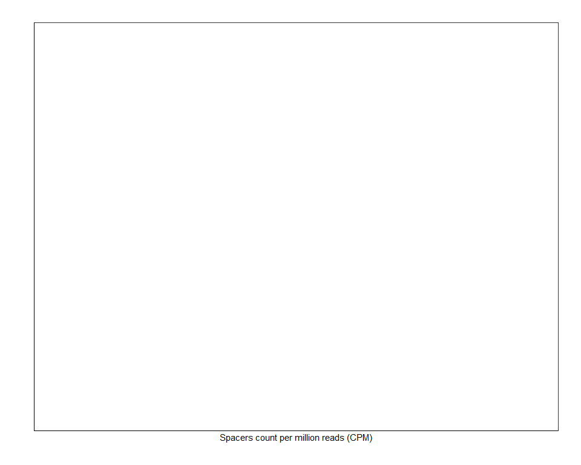<!-- -->

THIS SPACER MAKES MORES ENSE FOR DIVERSITY OF SPACERS

\#—————- \# Vincent: presence absence per metagenome

``` r
All_metagenomic_spacer_clusters <- CRISPRscope_meta_tbl_filtered %>% select(cluster_spacer_identity) %>% distinct()

library(easyr)
```

    ## Warning: le package 'easyr' a été compilé avec la version R 4.1.1

``` r
asdf <- function(value){
  value <- as.numeric(value)
  if(value != 0){
    return(1)
  }else{
    return(0)
  }
}


  
Spacer_per_sample <- CRISPRscope_meta_tbl_filtered %>% 
  select(cluster_spacer_identity, SRA_ID) %>% 
  distinct() %>% 
  spread(key = SRA_ID, value = SRA_ID) %>% 
  mutate(across(!cluster_spacer_identity,  function(x) tidyr::replace_na(x, 0))) %>% 
  mutate(across(!cluster_spacer_identity, function(x) !grepl("^0$", x) ))

Spacer_per_sample %>% 
  write.csv(file = paste(data_folder, "/EXPORT/cluster_by_sample_spread.csv", sep=""), quote = F, row.names = FALSE, col.names = TRUE)
```

    ## Warning in write.csv(., file = paste(data_folder, "/EXPORT/
    ## cluster_by_sample_spread.csv", : attempt to set 'col.names' ignored

``` r
Spacer_per_sample %>% gather(key = "sample", value = "value", -cluster_spacer_identity) %>% 
  ggplot(aes(x =cluster_spacer_identity, y = sample)) + 
  geom_tile() +
  theme_bw()
```

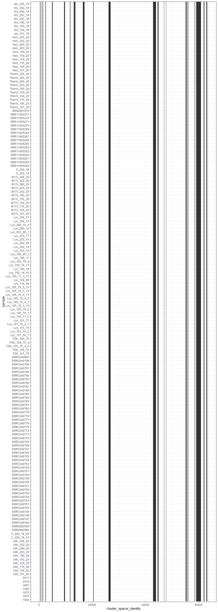<!-- -->

``` r
# CRISPRscope_meta_tbl_filtered %>% 
#   select(cluster_spacer_identity, SRA_ID) %>% 
#   distinct() %>% 
#   spread(key = SRA_ID, value = SRA_ID, fill = 0) %>% 
#   write.csv(file = "./OUTPUT/Vincent/cluster_by_sample_spread.csv", quote = F, row.names = FALSE, col.names = TRUE)
```
