CRISPRscope: comparison
================
Thibault Schowing
07 décembre, 2021

-   [Comparison between CRISPRscope and CRISPRscope\_meta
    data](#comparison-between-crisprscope-and-crisprscope_meta-data)
-   [Import packages](#import-packages)
    -   [Directories](#directories)
-   [Import data](#import-data)
-   [custom functions](#custom-functions)
-   [Phylogenetic order](#phylogenetic-order)
    -   [Spacers](#spacers)
    -   [Repeats](#repeats)
    -   [Numbers](#numbers)
    -   [Export repeats ALL (distinct)](#export-repeats-all-distinct)
    -   [Export spacers ALL for clustering
        (distinct)](#export-spacers-all-for-clustering-distinct)
        -   [100% similarity clustering -
            spacers](#100-similarity-clustering---spacers)
-   [Common repeats/spacers between
    projects](#common-repeatsspacers-between-projects)
-   [Metagenomic spacer / repeat
    coverage](#metagenomic-spacer--repeat-coverage)
    -   [Boxplot coverages](#boxplot-coverages)
    -   [Export metagenome-only repeats for
        blast](#export-metagenome-only-repeats-for-blast)
-   [Meta repeats only - cas type](#meta-repeats-only---cas-type)
    -   [Data](#data)
        -   [Genomic](#genomic)
        -   [Metagenomic](#metagenomic)
        -   [Export for combined plot](#export-for-combined-plot)
    -   [Numbers](#numbers-1)
    -   [Plots](#plots)
        -   [Metagenome](#metagenome)
        -   [Genomes](#genomes)
        -   [Combined plots](#combined-plots)
-   [eggnog results](#eggnog-results)
    -   [Cog categories - viruses](#cog-categories---viruses)
-   [BLAST cas types](#blast-cas-types)
-   [BLAST match Edit Distances](#blast-match-edit-distances)
-   [BLAST IMGVR metadata](#blast-imgvr-metadata)
-   [Fraction of vOTU per species and
    strain](#fraction-of-votu-per-species-and-strain)
-   [Fractions of vOTU - metagenomes](#fractions-of-votu---metagenomes)
    -   [main](#main)
    -   [Focus on S.therm](#focus-on-stherm)
-   [Mesophilic vs thermophilic](#mesophilic-vs-thermophilic)
    -   [Part 1 - genomic](#part-1---genomic)
    -   [Part 3 - overall](#part-3---overall)
-   [Nb Spacer per Cas type](#nb-spacer-per-cas-type)

# Comparison between CRISPRscope and CRISPRscope\_meta data

# Import packages

``` r
library(tidyverse)
```

    ## -- Attaching packages --------------------------------------- tidyverse 1.3.1 --

    ## v ggplot2 3.3.5     v purrr   0.3.4
    ## v tibble  3.1.2     v dplyr   1.0.7
    ## v tidyr   1.1.3     v stringr 1.4.0
    ## v readr   2.0.0     v forcats 0.5.1

    ## -- Conflicts ------------------------------------------ tidyverse_conflicts() --
    ## x dplyr::filter() masks stats::filter()
    ## x dplyr::lag()    masks stats::lag()

``` r
library(ggpmisc)
```

    ## Le chargement a nécessité le package : ggpp

    ## 
    ## Attachement du package : 'ggpp'

    ## L'objet suivant est masqué depuis 'package:ggplot2':
    ## 
    ##     annotate

``` r
library(ggVennDiagram)


# Load library
#install.packages("VennDiagram")
library(VennDiagram) #Caca
```

    ## Le chargement a nécessité le package : grid

    ## Le chargement a nécessité le package : futile.logger

    ## 
    ## Attachement du package : 'VennDiagram'

    ## L'objet suivant est masqué depuis 'package:ggVennDiagram':
    ## 
    ##     ellipse

``` r
# Prepare a palette of 2 colors with R colorbrewer:
library(RColorBrewer)

#Load
library("jpeg")
library("tiff")
library("magick")
```

    ## Linking to ImageMagick 6.9.12.3
    ## Enabled features: cairo, freetype, fftw, ghostscript, heic, lcms, pango, raw, rsvg, webp
    ## Disabled features: fontconfig, x11

``` r
library("seqRFLP") # dataframe2fas

# if(!require(devtools)) install.packages("devtools")
# devtools::install_github("kassambara/ggpubr")
library(ggpubr)
```

    ## 
    ## Attachement du package : 'ggpubr'

    ## L'objet suivant est masqué depuis 'package:VennDiagram':
    ## 
    ##     rotate

## Directories

``` r
repository <- "C:/Users/thsch/Desktop/CRISPRscope" # Main git repository. 
google_drive_folder <- "G:/Mon Drive/0_Documents/1_Emploi/E_StageAgroscope/CRISPRscope_writing/IMG"
data_folder <- "C:/Users/thsch/Desktop/0_data"
```

# Import data

``` r
# Restore the objects

CRISPRscope_tbl_26 <- readRDS(file = paste(data_folder, "/CRISPRscope_results/export_complete_SEL26.rds", sep=""))
CRISPRscope_tbl_185 <- readRDS(file = paste(data_folder, "/CRISPRscope_results/export_complete_SEL185.rds", sep=""))
CRISPRscope_meta_tbl_filtered <- readRDS(file = paste(data_folder, "/CRISPRscope_meta_results/CRISPRscope_meta_tbl_filtered.rds", sep=""))
id_data = readRDS(file = paste(data_folder, "/CRISPRscope_meta_results/id_data.rds", sep=""))


renameSamples <- function(imput_tibble) {
  a <- imput_tibble %>%
    mutate(ProjectID = replace(ProjectID, ProjectID == "PRJEB32768", "Walsh et al. 2020")) %>% 
    mutate(ProjectID = replace(ProjectID, ProjectID == "PRJNA286900", "Pasolli et al. 2020")) %>% 
    mutate(ProjectID = replace(ProjectID, ProjectID == "PRJEB30079", "Lordan et al. 2019")) %>% 
    mutate(ProjectID = replace(ProjectID, ProjectID == "PRJEB23938", "Duru et al. 2018")) %>% 
    mutate(ProjectID = replace(ProjectID, ProjectID == "PRJNA603575", "Pasolli et al. 2020")) %>% 
    mutate(ProjectID = replace(ProjectID, ProjectID == "CheeseRaclette", "Swiss raclette"))  %>% 
    mutate(ProjectID = replace(ProjectID, ProjectID == "20201217_metagenomes", "Swiss starter culture"))
  return(a)
}
```

# custom functions

``` r
outersect <- function(x, y) {
  sort(c(setdiff(x, y),
         setdiff(y, x)))
}


renameOrganism <- function(tibble){
  return(tibble %>% 
            mutate(Organism = replace(Organism, Organism == "Lactobacillus_helveticus", "Lhelv")) %>% 
            mutate(Organism = replace(Organism, Organism == "Lactobacillus_acidophilus", "Laci")) %>% 
            mutate(Organism = replace(Organism, Organism == "Lactobacillus_delbrueckii", "Ldel")) %>% 
            mutate(Organism = replace(Organism, Organism == "Lacticaseibacillus_rhamnosus", "Lrham")) %>% 
            mutate(Organism = replace(Organism, Organism == "Lacticaseibacillus_casei", "Lcas")) %>% 
            mutate(Organism = replace(Organism, Organism == "Latilactobacillus_curvatus", "Lcur")) %>% 
            mutate(Organism = replace(Organism, Organism == "Loigolactobacillus_coryniformis", "Lcor")) %>% 
            mutate(Organism = replace(Organism, Organism == "Leuconostoc_pseudomesenteroides", "Lpseu")) %>% 
            mutate(Organism = replace(Organism, Organism == "Leuconostoc_lactis", "Leulac")) %>% 
            mutate(Organism = replace(Organism, Organism == "Limosilactobacillus_fermentum", "Lfer")) %>% 
            mutate(Organism = replace(Organism, Organism == "Pediococcus_pentosaceus", "Ppen")) %>% 
            mutate(Organism = replace(Organism, Organism == "Pediococcus_parvulus", "Ppar")) %>% 
            mutate(Organism = replace(Organism, Organism == "Lactiplantibacillus_plantarum", "Lpla")) %>% 
            mutate(Organism = replace(Organism, Organism == "Streptococcus_lutetiensis", "Slute")) %>% 
            mutate(Organism = replace(Organism, Organism == "Streptococcus_thermophilus", "Stherm")) %>% 
            mutate(Organism = replace(Organism, Organism == "Mammaliicoccus_sciuri", "Msciu")) %>% 
            mutate(Organism = replace(Organism, Organism == "Staphylococcus_equorum", "Sequo")) %>% 
            mutate(Organism = replace(Organism, Organism == "Bifidobacterium_animalis", "Bani")) %>% 
            mutate(Organism = replace(Organism, Organism == "Cutibacterium_acnes", "Cacn")) %>% 
            mutate(Organism = replace(Organism, Organism == "Propionibacterium_freudenreichii", "Pfreu")) %>% 
            mutate(Organism = replace(Organism, Organism == "Corynebacterium_casei", "Ccas"))
  )
}
```

\#———————————————-

# Phylogenetic order

For the 26 most prevalent species, and so the 21 crispr containing ones,
we set the phylogenetic order like bellow.

``` r
species_levels_26 <- c("Lactobacillus_helveticus","Lactobacillus_acidophilus","Lactobacillus_delbrueckii",
                   "Companilactobacillus_versmoldensis","Lacticaseibacillus_rhamnosus","Lacticaseibacillus_casei",
                   "Latilactobacillus_curvatus","Loigolactobacillus_coryniformis","Leuconostoc_pseudomesenteroides",
                   "Leuconostoc_mesenteroides","Leuconostoc_lactis","Limosilactobacillus_fermentum","Pediococcus_pentosaceus",
                   "Pediococcus_parvulus","Lactiplantibacillus_plantarum","Streptococcus_lutetiensis","Streptococcus_thermophilus",
                   "Lactococcus_lactis","Mammaliicoccus_sciuri","Staphylococcus_equorum","Brevibacterium_linens",
                   "Brevibacterium_aurantiacum","Bifidobacterium_animalis","Cutibacterium_acnes","Propionibacterium_freudenreichii",
                   "Corynebacterium_casei")


# when calling ggplot: 
#Organism <- factor(Organism, levels = species_level)

# Verify typo by comparing known list
#s <- tibble(species_levels_26) %>% filter(species_levels %in% final_species_list_26$Species)

# List of actually present species (with order)
crisprscope_species_list <- CRISPRscope_tbl_26 %>% select(Organism) %>% distinct(Organism) %>% unlist(use.names=F)

species_levels_21 <- tibble(species_levels_26) %>% filter(species_levels_26 %in% crisprscope_species_list)
species_levels_21 <- species_levels_21$species_levels_26


# Species level with abreviation
species_levels_21_abrv <- list("Lhelv", "Laci", "Ldel", "Lrham", "Lcas", "Lcur", "Lcor", 
     "Lpseu", "leulac", "Lfer", "Ppen", "Ppar", "Lpla", "Slute", 
     "Stherm", "Msciu", "Sequo", "Bani", "Cacn", "Pfreu", "Ccas")
```

\#———————- \#TODO Venn diagram 80% similarity clustering

``` r
# Read 80% cluster files
# ADD IDENTITY FOR DISTRIBUTION
Clusters0_8_CRISPRscope_ALL_REPEATS <- read_csv("C:/Users/thsch/Desktop/0_data/IMPORT/clustering/Clusters0.8_CRISPRscope_ALL_REPEATS.csv") %>% 
  select(-seqid)
```

    ## Rows: 1362 Columns: 4

    ## -- Column specification --------------------------------------------------------
    ## Delimiter: ","
    ## chr (2): seq, seqid
    ## dbl (2): cluster, identity

    ## 
    ## i Use `spec()` to retrieve the full column specification for this data.
    ## i Specify the column types or set `show_col_types = FALSE` to quiet this message.

``` r
Clusters0_8_CRISPRscope_ALL_SPACERS <- read_csv("C:/Users/thsch/Desktop/0_data/IMPORT/clustering/Clusters0.8_CRISPRscope_ALL_SPACERS.csv") %>% 
  select(-seqid)
```

    ## Rows: 79007 Columns: 4

    ## -- Column specification --------------------------------------------------------
    ## Delimiter: ","
    ## chr (2): seq, seqid
    ## dbl (2): cluster, identity

    ## 
    ## i Use `spec()` to retrieve the full column specification for this data.
    ## i Specify the column types or set `show_col_types = FALSE` to quiet this message.

``` r
Clusters0_8_CRISPRscope_ALL_REPEATS %>% 
  mutate(identity = abs(identity)) %>% 
  mutate(identity = ifelse(identity == 1.00, 100, identity)) %>% distinct() %>% 
  ggplot(aes(x=identity)) +
  geom_density() + 
  xlab("Repeat percentage identity within clusters") +
  ylab("Density") 
```

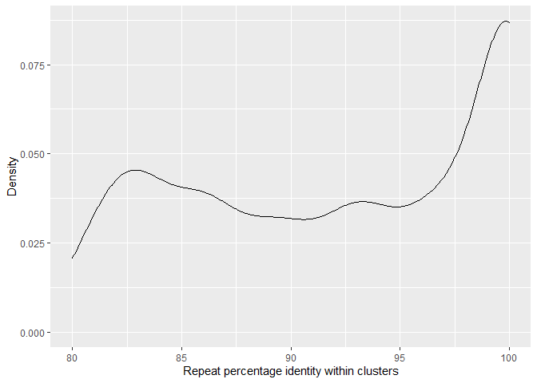<!-- -->

``` r
Clusters0_8_CRISPRscope_ALL_SPACERS %>% 
  mutate(identity = abs(identity)) %>% 
  mutate(identity = ifelse(identity == 1.00, 100, identity)) %>% distinct()%>% 
  ggplot(aes(x=identity)) +
  geom_density() + 
  xlab("Spacer percentage identity within clusters") +
  ylab("Density") 
```

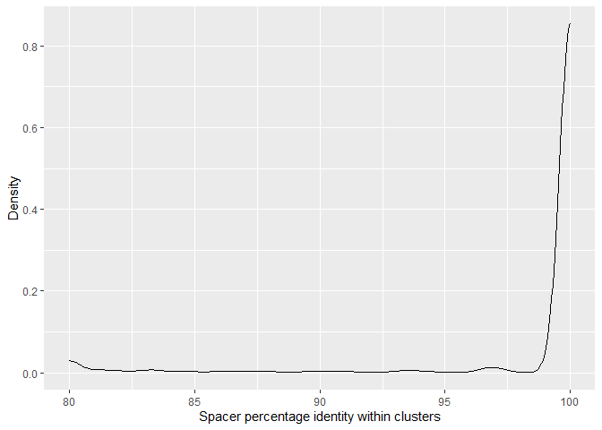<!-- -->

``` r
# Add spacer and repeat 80% clusters to tmp datasets


tmp_tbl_185 <- CRISPRscope_tbl_185 %>% select(SpacerSeq, DR_seq) %>% 
  left_join(Clusters0_8_CRISPRscope_ALL_SPACERS, by=c("SpacerSeq" = "seq")) %>% 
  dplyr::rename(cluster_spacer_80 = cluster) %>% dplyr::rename(clst80_spacer_identity = identity) %>% 
  left_join(Clusters0_8_CRISPRscope_ALL_REPEATS, by=c("DR_seq" = "seq")) %>% 
  dplyr::rename(cluster_repeat_80 = cluster) %>% dplyr::rename(clst80_repeat_identity = identity) %>% 
  drop_na() # no na !! :-)


tmp_tbl_26 <- CRISPRscope_tbl_26 %>% select(SpacerSeq, DR_seq) %>% 
  left_join(Clusters0_8_CRISPRscope_ALL_SPACERS, by=c("SpacerSeq" = "seq")) %>% 
  dplyr::rename(cluster_spacer_80 = cluster) %>% dplyr::rename(clst80_spacer_identity = identity) %>% 
  left_join(Clusters0_8_CRISPRscope_ALL_REPEATS, by=c("DR_seq" = "seq")) %>% 
  dplyr::rename(cluster_repeat_80 = cluster) %>% dplyr::rename(clst80_repeat_identity = identity) %>% 
  drop_na() 


tmp_tbl_meta <- CRISPRscope_meta_tbl_filtered %>% select(spacer_seq, repeat_seq) %>% 
  left_join(Clusters0_8_CRISPRscope_ALL_SPACERS, by=c("spacer_seq" = "seq")) %>% 
  dplyr::rename(cluster_spacer_80 = cluster) %>% dplyr::rename(clst80_spacer_identity = identity) %>% 
  left_join(Clusters0_8_CRISPRscope_ALL_REPEATS, by=c("repeat_seq" = "seq")) %>% 
  dplyr::rename(cluster_repeat_80 = cluster) %>% dplyr::rename(clst80_repeat_identity = identity) %>% 
  drop_na() 


# LISTS - SPACERS

S1_80_G185 <- tmp_tbl_185 %>% select(cluster_spacer_80) %>% distinct() %>% unlist()
S2_80_G26 <- tmp_tbl_26 %>% select(cluster_spacer_80) %>% distinct() %>% unlist()
S3_80_M <- tmp_tbl_meta %>% select(cluster_spacer_80) %>% distinct() %>% unlist()


S1_80_G185 %>% write.table(file=paste(data_folder, "/EXPORT/list_S1_80_G185.csv", sep=""), row.names=FALSE, col.names = FALSE)
S2_80_G26 %>% write.table(file = paste(data_folder, "/EXPORT/list_S1_80_G26.csv", sep=""), row.names=FALSE, col.names = FALSE)
S3_80_M %>% write.table(file = paste(data_folder, "/EXPORT/list_S3_80_M.csv", sep=""), row.names=FALSE, col.names = FALSE)


R1_80_G185 <- tmp_tbl_185 %>% select(cluster_repeat_80) %>% distinct() %>% unlist()
R2_80_G26 <- tmp_tbl_26 %>% select(cluster_repeat_80) %>% distinct() %>% unlist()
R3_80_M <- tmp_tbl_meta %>% select(cluster_repeat_80) %>% distinct() %>% unlist()


R1_80_G185 %>% write.table(file=paste(data_folder, "/EXPORT/list_R1_80_G185.csv", sep=""), row.names=FALSE, col.names = FALSE)
R2_80_G26 %>% write.table(file = paste(data_folder, "/EXPORT/list_R1_80_G26.csv", sep=""), row.names=FALSE, col.names = FALSE)
R3_80_M %>% write.table(file = paste(data_folder, "/EXPORT/list_R3_80_M.csv", sep=""), row.names=FALSE, col.names = FALSE)
```

BIN

``` r
# A1_80 <- length(S1_80_G185)
# A2_80 <- length(S2_80_G26)
# A3_80 <- length(S3_80_M)
# 
# S_80_12 <- intersect(S1_80_G185, S2_80_G26)
# S_80_23 <- intersect(S2_80_G26, S3_80_M)
# S_80_13 <- intersect(S1_80_G185, S3_80_M)
# S_80_123 <- intersect(S_80_12, S3_80_M)
# 
# A_80_12 <- length(S_80_12)
# A_80_23 <- length(S_80_23)
# A_80_13 <- length(S_80_13)
# A_80_123 <- length(S_80_123)
```

\#———————- \# Venn diagram meta-26-185

Diagrams generated on <https://www.biovenn.nl/index.php> and customized
by using a design programm and, of couse, conserving the size ratios.

Lists for spacers and repeats are bellow.

## Spacers

``` r
library(VennDiagram)
# Sets of spacers (distinct clusters 100% identity)
S1_G185 <- CRISPRscope_tbl_185 %>% 
  select(cluster_spacer_identity) %>% distinct() %>% unlist()

S2_G26 <- CRISPRscope_tbl_26 %>% 
  select(cluster_spacer_identity) %>% distinct() %>% unlist()

S3_M <- CRISPRscope_meta_tbl_filtered %>% 
  select(cluster_spacer_identity) %>% distinct() %>% unlist()


# Areas (length of the sets)
A1 <- length(S1_G185)
A2 <- length(S2_G26)
A3 <- length(S3_M)

# Intersections between the sets
S12 <- intersect(S1_G185, S2_G26)
S23 <- intersect(S2_G26, S3_M)
S13 <- intersect(S1_G185, S3_M)
S123 <- intersect(S12, S3_M)

# Areas (lengts of the intersections)
A12 <- length(S12)
A23 <- length(S23)
A13 <- length(S13)
A123 <- length(S123)

category <- c("Genomes 185","Genomes 26","Metagenomes")
```

Try on <https://www.biovenn.nl/>

``` r
S1_G185 %>% write.table(file=paste(data_folder, "/EXPORT/list_S1G185.csv", sep=""), row.names=FALSE, col.names = FALSE)
S2_G26 %>% write.table(file = paste(data_folder, "/EXPORT/list_S1G26.csv", sep=""), row.names=FALSE, col.names = FALSE)
S3_M %>% write.table(file = paste(data_folder, "/EXPORT/list_S3M.csv", sep=""), row.names=FALSE, col.names = FALSE)
```

``` r
# BiocManager::install("biomaRt")
library(BioVenn)

# https://cran.r-project.org/web/packages/BioVenn/BioVenn.pdf

list_x <- S1_G185
list_y <- S2_G26
list_z <- S3_M


draw.venn(
  list_x,
  list_y,
  list_z,
  title = "BioVenn",
  t_f = "serif",
  t_fb = 2,
  t_s = 1.5,
  t_c = "black",
  subtitle = "(C) 2007-2020 Tim Hulsen",
  st_f = "serif",
  st_fb = 2,
  st_s = 1.2,
  st_c = "black",
  xtitle = "G185",
  xt_f = "serif",
  xt_fb = 2,
  xt_s = 1,
  xt_c = "black",
  ytitle = "S2_G26",
  yt_f = "serif",
  yt_fb = 2,
  yt_s = 1,
  yt_c = "black",
  ztitle = "S3_M",
  zt_f = "serif",
  zt_fb = 2,
  zt_s = 1,
  zt_c = "black",
  nrtype = "abs",
  nr_f = "serif",
  nr_fb = 2,
  nr_s = 1,
  nr_c = "black",
  x_c = "darkgrey",
  y_c = "orange",
  z_c = "blue",
  bg_c = "white",
  width = 1000,
  height = 1000,
  #output = "screen",
  output = "screen",
  filename = NULL,
  map2ens = FALSE
)
```

## Repeats

``` r
# Sets of spacers (distinct clusters 100% identity)
R1_G185 <- CRISPRscope_tbl_185 %>% 
  select(cluster_repeat_identity) %>% distinct() %>% unlist()

R2_G26 <- CRISPRscope_tbl_26 %>% 
  select(cluster_repeat_identity) %>% distinct() %>% unlist()

R3_M <- CRISPRscope_meta_tbl_filtered %>% 
  select(cluster_repeat_identity) %>% distinct() %>% unlist()


# Areas (length of the sets)
B1 <- length(R1_G185)
B2 <- length(R2_G26)
B3 <- length(R3_M)

# Intersections between the sets
R12 <- intersect(R1_G185, R2_G26)
R23 <- intersect(R2_G26, R3_M)
R13 <- intersect(R1_G185, R3_M)
R123 <- intersect(R12, R3_M)

# Areas (lengts of the intersections)
B12 <- length(R12)
B23 <- length(R23)
B13 <- length(R13)
B123 <- length(R123)

category <- c("Genomes 185","Genomes 26","Metagenomes")

R1_G185 %>% write.table(file = paste(data_folder, "/EXPORT/list_R1G185.csv", sep=""), row.names=FALSE, col.names = FALSE)
R2_G26 %>% write.table(file = paste(data_folder, "/EXPORT/list_R1G26.csv", sep=""), row.names=FALSE, col.names = FALSE)
R3_M %>% write.table(file = paste(data_folder, "/EXPORT/list_R3M.csv", sep=""), row.names=FALSE, col.names = FALSE)
```

## Numbers

``` r
# Minority of metagenomic spacers are shared
length(S13) / (length(S3_M))
```

    ## [1] 0.1925602

``` r
# Minority of metagenomic repeats are shared
length(R13) / ( length(R3_M))
```

    ## [1] 0.2439678

\#———————- \# EXPORT

## Export repeats ALL (distinct)

To show common repeats between genomes and metagenomes, cluster all
together and show Venn diagram of shared clusters between genome and
metagenome

``` r
# repeats_genome <- CRISPRscope_tbl_26 %>% select(DR_seq) %>% distinct(DR_seq) %>% 
#   rowid_to_column("header") %>% mutate(seq = DR_seq) %>% select(header, seq) %>%
#   add_column(sufx = "G") %>% 
#   unite(header, c(sufx, header))
# 
# repeats_metagenome <- CRISPRscope_meta_tbl_filtered %>%
#   filter(Coverage > 1) %>%  # already done in quality filtering
#   select(repeat_seq) %>% 
#   distinct(repeat_seq) %>% 
#   rowid_to_column("header") %>% 
#   mutate(seq = repeat_seq) %>%
#   select(header, seq) %>% 
#   add_column(sufx = "M") %>% 
#   unite(header, c(sufx, header)) 
# 
# outr <- bind_rows(repeats_genome, repeats_metagenome)
# 
# dfr <- data.frame(outr$header, outr$seq)
# dfr.fasta = dataframe2fas(dfr, file = "./OUTPUT/CRISPRscope_ALL_REPEATS_26.fasta")
#======================================================================================
repeats_genome <- CRISPRscope_tbl_185 %>% select(DR_seq) %>% distinct(DR_seq) %>% 
  rowid_to_column("header") %>% mutate(seq = DR_seq) %>% select(header, seq) %>%
  add_column(sufx = "G") %>% 
  unite(header, c(sufx, header))

repeats_metagenome <- CRISPRscope_meta_tbl_filtered %>%
  filter(Coverage > 1) %>%  # already done in quality filtering
  select(repeat_seq) %>% 
  distinct(repeat_seq) %>% 
  rowid_to_column("header") %>% 
  mutate(seq = repeat_seq) %>%
  select(header, seq) %>% 
  add_column(sufx = "M") %>% 
  unite(header, c(sufx, header)) 

outr <- bind_rows(repeats_genome, repeats_metagenome)

dfr <- data.frame(outr$header, outr$seq)
dfr.fasta = dataframe2fas(dfr, file = paste(data_folder, "/EXPORT/fasta/CRISPRscope_ALL_REPEATS.fasta", sep=""))
```

## Export spacers ALL for clustering (distinct)

To show the common spacers between the genomes and metagenomes, we
cluster alltogether the spacers from the two datasets and instead of
creating a Venn diagram of shared sequences, we create a venn diagram of
shared clusters. Metagenomic spacers with Coverage &lt; 1 are ommited.
Only distinct sequences are taken.

``` r
# spacers_genome <- CRISPRscope_tbl_26 %>% select(SpacerSeq) %>% distinct(SpacerSeq) %>% 
#   rowid_to_column("header") %>% mutate(seq = SpacerSeq) %>% select(header, seq) %>%
#   add_column(sufx = "G") %>% 
#   unite(header, c(sufx, header))
# 
# spacers_metagenome <- CRISPRscope_meta_tbl_filtered %>%
#   filter(Coverage > 1) %>%  # already done in quality fitering
#   select(spacer_seq) %>% 
#   distinct(spacer_seq) %>% 
#   rowid_to_column("header") %>% 
#   mutate(seq = spacer_seq) %>%
#   select(header, seq) %>% 
#   add_column(sufx = "M") %>% 
#   unite(header, c(sufx, header)) 
# 
# out2 <- bind_rows(spacers_genome, spacers_metagenome)
# 
# # Total number of spacers
# out2 %>% distinct(seq)
# 
# 
# dfs <- data.frame(out2$header, out2$seq)
# dfs.fasta = dataframe2fas(dfs, file = "./OUTPUT/CRISPRscope_ALL_SPACERS_26.fasta")
#==================================================================================
spacers_genome <- CRISPRscope_tbl_185 %>% select(SpacerSeq) %>% distinct(SpacerSeq) %>% 
  rowid_to_column("header") %>% mutate(seq = SpacerSeq) %>% select(header, seq) %>%
  add_column(sufx = "G") %>% 
  unite(header, c(sufx, header))

spacers_metagenome <- CRISPRscope_meta_tbl_filtered %>%
  filter(Coverage > 1) %>%  # already done in quality fitering
  select(spacer_seq) %>% 
  distinct(spacer_seq) %>% 
  rowid_to_column("header") %>% 
  mutate(seq = spacer_seq) %>%
  select(header, seq) %>% 
  add_column(sufx = "M") %>% 
  unite(header, c(sufx, header)) 

out2 <- bind_rows(spacers_genome, spacers_metagenome)

# Total number of spacers
out2 %>% distinct(seq)


dfs <- data.frame(out2$header, out2$seq)
dfs.fasta = dataframe2fas(dfs, file = paste(data_folder, "/EXPORT/fasta/CRISPRscope_ALL_SPACERS.fasta", sep=""))
```

Important: all spacers are exported so we can easilly match a header and
a sequence without matching cluster number (from blast)

Export all (genome and metagenome) cluster reference for blasting TODO:
use that as dictionary to map cluster - sequence after blast \#\# Export
All spacers - one per cluster

``` r
# Cluster, sequence ID and sequence 
Clusters_CRISPRscope_ALL_SPACERS <- read_csv(paste(data_folder, "/IMPORT/clustering/Clusters1_CRISPRscope_ALL_SPACERS.csv", sep=""))

out2 <- Clusters_CRISPRscope_ALL_SPACERS %>% arrange(cluster) %>% filter(identity == 1) %>% # Takes the cluster representative (other have 100 or -100)
  mutate(header = cluster, seq = seq) %>%
  select(header, seq)

dfs <- data.frame(out2$header, out2$seq)
dfs.fasta = dataframe2fas(dfs, file = paste(data_folder, "/EXPORT/fasta/cluster1_spacers_reference_CRISPRscope.fasta", sep=""))


dfs_all_cluster_mapping <- tibble(dfs)
```

\#\#Load all spacers clusters Now, load the cd-hit-est result and check
it out !

### 100% similarity clustering - spacers

``` r
Clusters_CRISPRscope_ALL_SPACERS <- read_csv(paste(data_folder, "/IMPORT/clustering/Clusters1_CRISPRscope_ALL_SPACERS.csv", sep=""))
```

    ## Rows: 79007 Columns: 4

    ## -- Column specification --------------------------------------------------------
    ## Delimiter: ","
    ## chr (2): seq, seqid
    ## dbl (2): cluster, identity

    ## 
    ## i Use `spec()` to retrieve the full column specification for this data.
    ## i Specify the column types or set `show_col_types = FALSE` to quiet this message.

``` r
Clusters_CRISPRscope_ALL_SPACERS <- Clusters_CRISPRscope_ALL_SPACERS %>% select(seqid, cluster) %>% arrange(cluster)


clst_G <- Clusters_CRISPRscope_ALL_SPACERS %>% filter(grepl("^G_", seqid)) %>% select(cluster) %>% distinct(cluster)
clst_M <- Clusters_CRISPRscope_ALL_SPACERS %>% filter(grepl("^M_", seqid)) %>% select(cluster) %>% distinct(cluster)
```

``` r
x <- list(
  A = length(clst_G$cluster),
  B = length(clst_M$cluster),
  C = length(intersect(clst_G$cluster,clst_M$cluster))
)

grid.newpage()
venn.plot <- draw.pairwise.venn(area1 = x[[1]], area2 = x[[2]], cross.area = x[[3]], category = c("Genome wide spacers", 
    "Metagenome wide spacers"), lty = rep("blank", 2), fill = c("light blue", "light green"), 
    alpha = c(0.4, 0.4), cat.pos = c(0, 220), euler.d = TRUE, sep.dist = 0.03, cex = c(4,3,4), cat.cex = c(2,2),
    rotation.degree = 0)
# Writing to file


tiff(filename = "./IMG/report/12_1_SpacerMG100percent.tiff", width = 660, height = 660);
grid.draw(venn.plot);
dev.off();

#img <- readTIFF("./IMG/report/SpacerMG100percent.tiff", native=TRUE)
#writeJPEG(img, target = "./IMG/report/SpacerMG100percent.jpeg", quality = 1)

img <- image_read("./IMG/report/12_1_SpacerMG100percent.tiff")
image_write(img, format = "pdf", "./IMG/report/12_1_SpacerMG100percent.pdf")

fn <- "./IMG/report/12_1_SpacerMG100percent.tiff"
if (file.exists(fn)) {
  #Delete file if it exists
  file.remove(fn)
}
```

# Common repeats/spacers between projects

``` r
sub_gen_sp <- CRISPRscope_tbl_185 %>% select(Organism, Strain, cluster_spacer_identity) %>% distinct(Organism, Strain, cluster_spacer_identity)
sub_metagen_sp <- CRISPRscope_meta_tbl_filtered %>% select(ProjectID, SRA_ID, GID, SPID, cluster_spacer_identity) %>% distinct(ProjectID, SRA_ID, GID, SPID, cluster_spacer_identity)

sub_gen_dr <- CRISPRscope_tbl_185 %>% select(Organism, Strain, cluster_repeat_identity) %>% distinct(Organism, Strain, cluster_repeat_identity)
sub_metagen_dr <- CRISPRscope_meta_tbl_filtered %>% select(ProjectID, SRA_ID, GID, cluster_repeat_identity) %>% distinct(ProjectID, SRA_ID, GID, cluster_repeat_identity)


unique_genome_repeats <- CRISPRscope_tbl_185 %>% select(Organism, Strain, cluster_repeat_identity) %>% distinct(Organism, Strain, cluster_repeat_identity)
unique_metagenome_repeats <- CRISPRscope_meta_tbl_filtered %>% select(ProjectID, SRA_ID, GID, SPID, cluster_repeat_identity) %>% distinct(ProjectID, SRA_ID, GID, SPID, cluster_repeat_identity)


# --------- Spacers ----------
shared_spacers <- inner_join(sub_gen_sp, sub_metagen_sp, by = c("cluster_spacer_identity" = "cluster_spacer_identity"), copy = FALSE)

shared_spacers %>% group_by(Organism, ProjectID) %>% summarise(nb_match_spacer_in_meta = n())
```

    ## `summarise()` has grouped output by 'Organism'. You can override using the `.groups` argument.

    ## # A tibble: 40 x 3
    ## # Groups:   Organism [27]
    ##    Organism                      ProjectID      nb_match_spacer_in_meta
    ##    <chr>                         <chr>                            <int>
    ##  1 Bifidobacterium_animalis      PRJNA603575                       4002
    ##  2 Bifidobacterium_breve         PRJNA603575                        681
    ##  3 Enterococcus_faecalis         PRJNA286900                         50
    ##  4 Escherichia_coli              CheeseRaclette                     120
    ##  5 Hafnia_paralvei               PRJEB32768                           4
    ##  6 Halomonas_sp_JB37             PRJEB32768                          13
    ##  7 Klebsiella_oxytoca            CheeseRaclette                       4
    ##  8 Lacticaseibacillus_casei      CheeseRaclette                      17
    ##  9 Lacticaseibacillus_rhamnosus  PRJNA286900                        131
    ## 10 Lactiplantibacillus_plantarum CheeseRaclette                     236
    ## # ... with 30 more rows

``` r
# --------- Repeats ----------

shared_repeats <- inner_join(sub_gen_dr, sub_metagen_dr, by = c("cluster_repeat_identity"="cluster_repeat_identity"), copy = FALSE)

shared_repeats %>% group_by(Organism, ProjectID) %>% summarise(nb_match_repeat_in_meta = n())
```

    ## `summarise()` has grouped output by 'Organism'. You can override using the `.groups` argument.

    ## # A tibble: 131 x 3
    ## # Groups:   Organism [66]
    ##    Organism                   ProjectID      nb_match_repeat_in_meta
    ##    <chr>                      <chr>                            <int>
    ##  1 Acinetobacter_baumannii    PRJEB32768                         114
    ##  2 Acinetobacter_nosocomialis PRJEB32768                           7
    ##  3 Bifidobacterium_animalis   PRJNA603575                        276
    ##  4 Bifidobacterium_breve      PRJNA603575                         64
    ##  5 Chryseobacterium_haifense  CheeseRaclette                       1
    ##  6 Citrobacter_braakii        CheeseRaclette                      46
    ##  7 Citrobacter_braakii        PRJEB32768                          46
    ##  8 Citrobacter_freundii       CheeseRaclette                      10
    ##  9 Citrobacter_freundii       PRJEB32768                           9
    ## 10 Citrobacter_freundii       PRJNA286900                          1
    ## # ... with 121 more rows

\#——————————

# Metagenomic spacer / repeat coverage

Compare coverage between metagenome sequences that overlap or not with
genomic sequences

``` r
# Lists of which spacers (unique, cluster 100%) belong to M, G or both.

clst_G                                                          # 56'796    Genomic spacer 100% cluster
```

    ## # A tibble: 56,796 x 1
    ##    cluster
    ##      <dbl>
    ##  1      18
    ##  2      19
    ##  3      20
    ##  4      21
    ##  5      22
    ##  6      23
    ##  7      24
    ##  8      25
    ##  9      26
    ## 10      27
    ## # ... with 56,786 more rows

``` r
clst_M                                                          # 8'244     Metagenomic spacer 100% cluster
```

    ## # A tibble: 8,244 x 1
    ##    cluster
    ##      <dbl>
    ##  1       0
    ##  2       1
    ##  3       2
    ##  4       3
    ##  5       4
    ##  6       5
    ##  7       6
    ##  8       7
    ##  9       8
    ## 10       9
    ## # ... with 8,234 more rows

``` r
clst_M_G_intersect <- intersect(clst_G$cluster, clst_M$cluster) # 1'584     Intersect of the two
# Total 63'006 clusters

OnlyGenomicSpacerCluster <- clst_G %>% filter(!cluster %in% clst_M_G_intersect)     # 55'310
OnlyMetagenomicSpacerCluster <- clst_M %>% filter(!cluster %in% clst_M_G_intersect) # 6'091
BothSpacerCluster <- tibble(clst_M_G_intersect)                                     # 1'605
# Total 63'006 clusters -> ok


# Compute the mean coverage for each group (except genomic part)


#----------------------------
# ONLY METAGENOMIC SPACERS
#----------------------------
CRISPRscope_meta_tbl_filtered %>% mutate(Coverage = as.numeric(Coverage)) %>% filter(cluster_spacer_identity %in% OnlyMetagenomicSpacerCluster$cluster) %>% 
  summarise(mean_coverage = mean(Coverage), sd_coverage = sd(Coverage), min_coverage = min(Coverage), max_coverage = max(Coverage)) 
```

    ## # A tibble: 1 x 4
    ##   mean_coverage sd_coverage min_coverage max_coverage
    ##           <dbl>       <dbl>        <dbl>        <dbl>
    ## 1          13.4        30.0            2          753

``` r
# mean_coverage     12.24949
# mean_sd_coverage  27.76257
# min_coverage      2
# max_coverage      753


#----------------------------
# Both GENOMIC AND METAGENOMIC SPACERS
#----------------------------
CRISPRscope_meta_tbl_filtered %>% mutate(Coverage = as.numeric(Coverage)) %>% filter(cluster_spacer_identity %in% BothSpacerCluster$clst_M_G_intersect) %>% 
  summarise(mean_coverage = mean(Coverage), sd_coverage = sd(Coverage), min_coverage = min(Coverage), max_coverage = max(Coverage))
```

    ## # A tibble: 1 x 4
    ##   mean_coverage sd_coverage min_coverage max_coverage
    ##           <dbl>       <dbl>        <dbl>        <dbl>
    ## 1          29.9        48.1            2          732

``` r
# mean_coverage     29.40659
# mean_sd_coverage  47.83631
# min_coverage      2
# max_coverage      732

#-----------
# T-test
#-----------

Group_B <- CRISPRscope_meta_tbl_filtered %>% 
  mutate(Coverage = as.numeric(Coverage)) %>% 
  filter(cluster_spacer_identity %in% BothSpacerCluster$clst_M_G_intersect) %>% 
  select(Coverage) %>% 
  unlist() 

Group_M <- CRISPRscope_meta_tbl_filtered %>% 
  mutate(Coverage = as.numeric(Coverage)) %>% 
  filter(cluster_spacer_identity %in% OnlyMetagenomicSpacerCluster$cluster) %>%
  select(Coverage) %>% 
  unlist() 

t.test(Group_B, Group_M) # p-value < 2.2e-16
```

    ## 
    ##  Welch Two Sample t-test
    ## 
    ## data:  Group_B and Group_M
    ## t = 32.888, df = 24078, p-value < 2.2e-16
    ## alternative hypothesis: true difference in means is not equal to 0
    ## 95 percent confidence interval:
    ##  15.55811 17.53008
    ## sample estimates:
    ## mean of x mean of y 
    ##  29.93186  13.38776

-&gt; the coverage is significantly lower in the only-metagenomic part.
It could be part of the initial 185 species or just unknown. Blast
repeats group\_m

## Boxplot coverages

``` r
# Both genome and metagenome
Group_B_boxplot <- CRISPRscope_meta_tbl_filtered %>% 
  mutate(Coverage = as.numeric(Coverage)) %>% 
  filter(cluster_spacer_identity %in% BothSpacerCluster$clst_M_G_intersect) %>% 
  select(Coverage) %>% 
  mutate(group = "Both Genome + Metagenome")

# Metagenome only
Group_M_boxplot <- CRISPRscope_meta_tbl_filtered %>% 
  mutate(Coverage = as.numeric(Coverage)) %>% 
  filter(cluster_spacer_identity %in% OnlyMetagenomicSpacerCluster$cluster) %>%
  select(Coverage) %>% 
  mutate(group = "Metagenome Only")

data_coverage = bind_rows(Group_B_boxplot, Group_M_boxplot)

library(ggsignif)

#geom_signif()

data_coverage %>% 
  ggplot(aes(x = group, y = Coverage, fill = group)) +
  geom_boxplot() +
  geom_signif(comparisons = list(c("Both Genome + Metagenome", "Metagenome Only")), map_signif_level = TRUE) +
  scale_y_continuous(trans = "log10")+
  theme_bw() +
  theme(
    #axis.text.x = element_text(angle = 45,hjust = 1,color = "black"),
    axis.text.y = element_text(color = "black"),
    axis.title.x = element_text(color = "black"),
    axis.title.y = element_text(color = "black"),
    axis.line.y.left = element_line(color = "black"),
    axis.line.y.right = element_line(color = "black"),
    axis.line.x = element_line(color = "black"),
    axis.ticks = element_line(color = "black"),
    plot.title = element_text(color = "black"),
    panel.background = element_rect(fill = "white", colour = NA),
    plot.background = element_rect(fill = "white", colour = NA),
    legend.position = "none",
    legend.background = element_rect(fill = "white", colour = NA),
    legend.box.background = element_rect(fill = "white", colour = NA),
    legend.text = element_text(color = "black", face = "italic"),
    legend.title = element_text(color = "black"),
    plot.margin = unit(c(1, 1, 1, 1), "cm"),
    panel.grid.major = element_blank(), #element_line(color = "black", size = 0.1),
    panel.grid.minor = element_blank(), #element_line(color = "black", size = 0.1),
    strip.background = element_rect(
      color = "black",
      fill = "White",
      size = 0.5,
      linetype = "solid"
    ),
    strip.text = element_text(color = "black")
  ) +
  ggtitle("") +
  xlab("") +
  ylab("Spacer reads coverage")
```

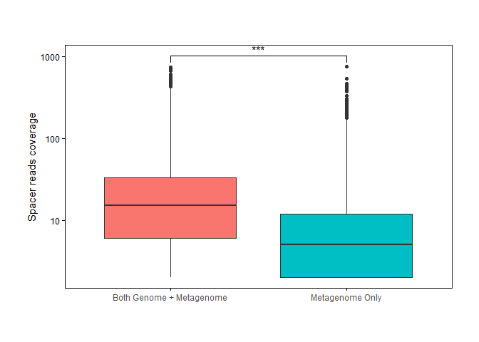<!-- -->
\#\# Boxplor coverages genomes groups

Sets of spacers (distinct clusters 100% identity)

S1\_G185 &lt;- CRISPRscope\_tbl\_185 %&gt;%
select(cluster\_spacer\_identity) %&gt;% distinct() %&gt;% unlist()

S2\_G26 &lt;- CRISPRscope\_tbl\_26 %&gt;%
select(cluster\_spacer\_identity) %&gt;% distinct() %&gt;% unlist()

S3\_M &lt;- CRISPRscope\_meta\_tbl\_filtered %&gt;%
select(cluster\_spacer\_identity) %&gt;% distinct() %&gt;% unlist()

Areas (length of the sets) A1 &lt;- length(S1\_G185) A2 &lt;-
length(S2\_G26) A3 &lt;- length(S3\_M)

Intersections between the sets S12 &lt;- intersect(S1\_G185, S2\_G26)
S23 &lt;- intersect(S2\_G26, S3\_M) S13 &lt;- intersect(S1\_G185, S3\_M)
S123 &lt;- intersect(S12, S3\_M)

Areas (lengts of the intersections) A12 &lt;- length(S12) A23 &lt;-
length(S23) A13 &lt;- length(S13) A123 &lt;- length(S123)

category &lt;- c(“Genomes 185”,“Genomes 26”,“Metagenomes”)

3 categories needed: metagenome only, metagenome/G26 and metagenome/G185
TODO: boxplot 3 groups

``` r
S1_G185 <- CRISPRscope_tbl_185 %>% 
  select(cluster_spacer_identity) %>% distinct() %>% unlist()

S2_G26 <- CRISPRscope_tbl_26 %>% 
  select(cluster_spacer_identity) %>% distinct() %>% unlist()


S_G26_ONLY <- intersect(outersect(S1_G185, S2_G26), S2_G26) # nothing, all is included in g185
S_G185_ONLY <- intersect(outersect(S1_G185, S2_G26), S1_G185) # 40290
S_G26_G185_BOTH <- intersect(S1_G185, S2_G26) # 16506

M_only <- intersect(outersect(S1_G185, S3_M), S3_M)


length(M_only)
```

    ## [1] 6642

``` r
length(S_G26_ONLY) + length(S_G185_ONLY) + length(S_G26_G185_BOTH)
```

    ## [1] 56796

``` r
# on veut les intersection entre metagenome et s-g-185 only
#                                metagenome et s-g-26-185-both
#                                metagenome only 


 

S3_M <- CRISPRscope_meta_tbl_filtered %>% 
  select(cluster_spacer_identity) %>% distinct() %>% unlist()

A1 <- length(S1_G185)
A2 <- length(S2_G26)
A3 <- length(S3_M)

S12 <- intersect(S1_G185, S2_G26)
S23 <- intersect(S2_G26, S3_M)
S13 <- intersect(S1_G185, S3_M)
S123 <- intersect(S12, S3_M)


# Both genome and metagenome
Group_A_boxplot <- CRISPRscope_meta_tbl_filtered %>%
  mutate(Coverage = as.numeric(Coverage)) %>%
  filter(cluster_spacer_identity %in% S_G185_ONLY) %>%
  select(Coverage, spacer_per_milread) %>%
  mutate(group = "Both Genome 185 + Metagenome (1925)")

# Both genome and metagenome
Group_B_boxplot <- CRISPRscope_meta_tbl_filtered %>%
  mutate(Coverage = as.numeric(Coverage)) %>%
  filter(cluster_spacer_identity %in% S_G26_G185_BOTH) %>%
  select(Coverage, spacer_per_milread) %>%
  mutate(group = "Both Genome 26/185 \n+ Metagenome (1739)")

# Metagenome only
Group_M_boxplot <- CRISPRscope_meta_tbl_filtered %>%
  mutate(Coverage = as.numeric(Coverage)) %>%
  filter(cluster_spacer_identity %in% M_only) %>%
  select(Coverage, spacer_per_milread) %>%
  mutate(group = "Metagenome Only (3958)")

data_coverage = bind_rows(Group_A_boxplot, Group_B_boxplot, Group_M_boxplot)
data_coverage_normalized = data_coverage %>% mutate(Coverage = Coverage / spacer_per_milread)
```

``` r
library(ggsignif)

#geom_signif()

plt <- data_coverage_normalized %>% 
  mutate(group = factor(data_coverage$group, levels = c("Metagenome Only (3958)", "Both Genome 185 + Metagenome (1925)","Both Genome 26/185 \n+ Metagenome (1739)"))) %>% 
  ggplot(aes(x = group, y = Coverage, fill = group)) +
  geom_boxplot() +
  # geom_signif(comparisons = list(c("Both Genome 185 + Metagenome (1925)", "Both Genome 26/185 + Metagenome (1739)")), 
  #             map_signif_level = TRUE, 
  #             y_position = c(5.3, 8.3), 
  #             test = "wilcox.test") +
  geom_signif(comparisons = list(c("Both Genome 185 + Metagenome (1925)", "Metagenome Only (3958)")), 
              map_signif_level = TRUE, 
              y_position = c(3.3, 5.3), 
              test = "wilcox.test") +
  geom_signif(comparisons = list(c("Both Genome 26/185 \n+ Metagenome (1739)", "Metagenome Only (3958)")), 
              map_signif_level = TRUE, 
              y_position = c(3., 6.3), 
              test = "wilcox.test") +
  scale_y_continuous(trans = "log10")+
  scale_color_manual(values = c("#d2d5e5ff", "#bcb5ceff", "#ad98b2ff")) +
  scale_fill_manual(values = c("#d2d5e5ff", "#bcb5ceff", "#ad98b2ff")) +
  theme_bw() +
  theme(
    axis.text.x = element_text(angle = 45,hjust = 1,color = "black"),
    axis.text.y = element_text(color = "black"),
    axis.title.x = element_text(color = "black"),
    axis.title.y = element_text(color = "black"),
    axis.line.y.left = element_line(color = "black"),
    axis.line.y.right = element_line(color = "black"),
    axis.line.x = element_line(color = "black"),
    axis.ticks = element_line(color = "black"),
    plot.title = element_text(color = "black"),
    panel.background = element_rect(fill = "transparent", colour = NA),
    plot.background = element_rect(fill = "transparent", colour = NA),
    legend.position = "none",
    legend.background = element_rect(fill = "transparent", colour = NA),
    legend.box.background = element_rect(fill = "transparent", colour = NA),
    legend.text = element_text(color = "black", face = "italic"),
    legend.title = element_text(color = "black"),
    plot.margin = unit(c(1, 1, 1, 1), "cm"),
    panel.grid.major = element_blank(), #element_line(color = "black", size = 0.1),
    panel.grid.minor = element_blank(), #element_line(color = "black", size = 0.1),
    strip.background = element_rect(
      color = "black",
      fill = "transparent",
      size = 0.5,
      linetype = "solid"
    ),
    strip.text = element_text(color = "black")
  ) +
  ggtitle("") +
  xlab("") +
  ylab("Spacer reads coverage (normalized)")


ggsave(
  plot = plt,
  file = paste(google_drive_folder,"/spacer_coverage_categories.pdf", sep = ""),
  bg = "transparent",
  width = 15,
  height = 30,
  units = "cm",
  dpi = 800
)

plt
```

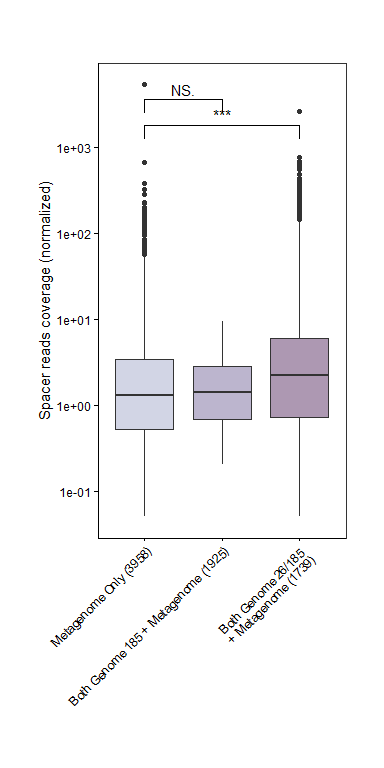<!-- -->

## Export metagenome-only repeats for blast

``` r
out_repeat <- CRISPRscope_meta_tbl_filtered %>% filter(cluster_repeat_identity %in% OnlyMetagenomicSpacerCluster$cluster) %>% 
  mutate(header = paste(ProjectID, SRA_ID, GID, sep = "_"), seq = repeat_seq) %>%
  select(header, seq) %>% 
  distinct(seq, .keep_all = TRUE)

dfs <- data.frame(out_repeat$header, out_repeat$seq)
dfs.fasta = dataframe2fas(dfs, file=paste(data_folder, "/EXPORT/fasta/RepeatsMetagenomeOnly.fasta", sep=""))
```

\#———————————————-

# Meta repeats only - cas type

``` r
# Sets of spacers (distinct clusters 100% identity)
R1_G185 <- CRISPRscope_tbl_185 %>% 
  select(cluster_repeat_identity) %>% distinct() %>% unlist()

R2_G26 <- CRISPRscope_tbl_26 %>% 
  select(cluster_repeat_identity) %>% distinct() %>% unlist()

R3_M <- CRISPRscope_meta_tbl_filtered %>% 
  select(cluster_repeat_identity) %>% distinct() %>% unlist()


# Areas (length of the sets)
B1 <- length(R1_G185)
B2 <- length(R2_G26)
B3 <- length(R3_M)

# Intersections between the sets
R12 <- intersect(R1_G185, R2_G26)
R23 <- intersect(R2_G26, R3_M)
R13 <- intersect(R1_G185, R3_M)
R123 <- intersect(R12, R3_M)


#-----------------------------

R_G26_ONLY <- intersect(outersect(R1_G185, R2_G26), R2_G26) # 0
R_G185_ONLY <- intersect(outersect(R1_G185, R2_G26), R1_G185) # 423 
R_G26_G185_BOTH <- intersect(R1_G185, R2_G26) # 112

length(R_G26_ONLY)
```

    ## [1] 0

``` r
length(R_G185_ONLY)
```

    ## [1] 423

``` r
length(R_G26_G185_BOTH)
```

    ## [1] 112

``` r
R_G26_M <- intersect(R3_M, R2_G26)
R_G185_M <- intersect(R3_M, R1_G185)

R_M_only <- intersect(outersect(R1_G185, R3_M), R3_M)
length(R_M_only)#227
```

    ## [1] 282

``` r
length(R_M_only)
```

    ## [1] 282

``` r
length(R_G26_ONLY) + length(R_G185_ONLY) + length(R_G26_G185_BOTH)
```

    ## [1] 535

``` r
CRISPRscope_meta_tbl_filtered %>% select(Subtype, cluster_repeat_identity) %>% 
  filter(cluster_repeat_identity %in% R_M_only) %>% distinct() %>% 
  write.csv(file=paste(data_folder, "/EXPORT/castype_cluster_metagenomeOnly.csv", sep=""), row.names = F, col.names = T) # 286
```

    ## Warning in write.csv(., file = paste(data_folder, "/EXPORT/
    ## castype_cluster_metagenomeOnly.csv", : attempt to set 'col.names' ignored

``` r
# 
# CRISPRscope_meta_tbl_filtered %>% select(Subtype, cluster_repeat_identity) %>% 
#   filter(cluster_repeat_identity %in% R_G26_M) %>% distinct() %>% 
#   write.csv(file="./OUTPUT/Vincent/castype_cluster_R_G26_M.csv", row.names = F, col.names = T)
# 
# 
# CRISPRscope_meta_tbl_filtered %>% select(Subtype, cluster_repeat_identity) %>% 
#   filter(cluster_repeat_identity %in% R_G185_M) %>% distinct() %>% 
#   write.csv(file="./OUTPUT/Vincent/castype_cluster_R_G185_M.csv", row.names = F, col.names = T)


#--------------------

CRISPRscope_tbl_185 %>% select(Cas_subtype, cluster_repeat_identity) %>% 
  filter(cluster_repeat_identity %in% R2_G26) %>% distinct() %>% 
  write.csv(file=paste(data_folder, "/EXPORT/castype_cluster_R2_G26.csv", sep=""), row.names = F, col.names = T) #113
```

    ## Warning in write.csv(., file = paste(data_folder, "/EXPORT/
    ## castype_cluster_R2_G26.csv", : attempt to set 'col.names' ignored

``` r
CRISPRscope_tbl_185 %>% select(Cas_subtype, cluster_repeat_identity) %>% 
  filter(cluster_repeat_identity %in% R2_G26) %>% select(Cas_subtype) %>% distinct()
```

    ## # A tibble: 8 x 1
    ##   Cas_subtype
    ##   <chr>      
    ## 1 I-G        
    ## 2 I-E        
    ## 3 I-C        
    ## 4 II-A       
    ## 5 III-A      
    ## 6 I-B        
    ## 7 II-C       
    ## 8 III-B

``` r
#--------------------

CRISPRscope_tbl_185 %>% select(Cas_subtype, cluster_repeat_identity) %>% 
  filter(cluster_repeat_identity %in% R_G185_ONLY) %>% distinct() %>% 
  write.csv(file=paste(data_folder, "/EXPORT/castype_cluster_R_G185_ONLY.csv", sep=""), row.names = F, col.names = T)#425
```

    ## Warning in write.csv(., file = paste(data_folder, "/EXPORT/
    ## castype_cluster_R_G185_ONLY.csv", : attempt to set 'col.names' ignored

``` r
CRISPRscope_tbl_185 %>% select(Cas_subtype, cluster_repeat_identity) %>% 
  filter(cluster_repeat_identity %in% R_G185_ONLY) %>%  select(Cas_subtype) %>% distinct()
```

    ## # A tibble: 17 x 1
    ##    Cas_subtype
    ##    <chr>      
    ##  1 I-F        
    ##  2 III-B      
    ##  3 I-E        
    ##  4 I-C        
    ##  5 I-B        
    ##  6 II-C       
    ##  7 I-G        
    ##  8 IV-D       
    ##  9 II-A       
    ## 10 IV-A3      
    ## 11 IV-A1      
    ## 12 III-D      
    ## 13 I-A        
    ## 14 III-A      
    ## 15 V-F2       
    ## 16 I-F_T      
    ## 17 V-F1

``` r
t1 <- CRISPRscope_tbl_185 %>% select(Cas_subtype) %>% distinct() %>% mutate(category="All 185 Species")
t2 <- CRISPRscope_tbl_26 %>% select(Cas_subtype) %>% distinct() %>% mutate(category="26 Sel. Species")
t3 <- CRISPRscope_meta_tbl_filtered  %>% select(Subtype) %>% distinct()%>% dplyr::rename(Cas_subtype = Subtype)  %>% mutate(category="Metagenomes")

t <- bind_rows(t1, t2, t3)

t %>% ggplot(aes(x=category, y=Cas_subtype)) +
  geom_tile()
```

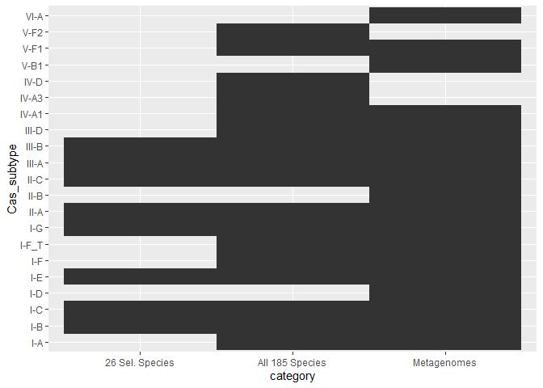<!-- -->

\#———————————————-

``` bash
# split 1 fasta into multiple max 1000 seq fasta files.
awk 'BEGIN {n_seq=0;} /^>/ {if(n_seq%1000==0){file=sprintf("myseq%d.fa",n_seq);} print >> file; n_seq++; next;} { print >> file; }' < sequences.fa
```

\#—————————————————- \#BLAST: Categories

## Data

``` r
#--------------------------------------
# IMPORT DATA
#--------------------------------------

# IMPORTED FROM Eggnog PROTEIN HITS -> Taxid = Virus
# - 
load(paste(data_folder, "/IMPORT_EXPORT/bacterial_viral_protein_hits_list", sep=""))


# IMG/VR

CRISPRblast_IMGVR_2 <- read_delim(paste(data_folder, "/BLAST/CRISPRblast_IMGVR_vincent.txt", sep=""), 
    "\t", escape_double = FALSE, col_names = c("qseqid", "sseqid", "pident", "length", "mismatch", "gapopen", "qstart", "qend", 
                                               "sstart", "send", "evalue", "bitscore", "stitle", "slen"), trim_ws = TRUE) %>% 
  mutate(database = "IMGVR") %>% 
  mutate(hit_type = "Viral") %>% 
  select(qseqid, sseqid, pident, mismatch, stitle, database, hit_type)
```

    ## Rows: 22645 Columns: 14

    ## -- Column specification --------------------------------------------------------
    ## Delimiter: "\t"
    ## chr  (2): sseqid, stitle
    ## dbl (12): qseqid, pident, length, mismatch, gapopen, qstart, qend, sstart, s...

    ## 
    ## i Use `spec()` to retrieve the full column specification for this data.
    ## i Specify the column types or set `show_col_types = FALSE` to quiet this message.

``` r
# NCBI non redundant nucleotide collection
CRISPRblast_nt_2 <- read_delim(paste(data_folder, "/BLAST/CRISPRblast_nt_vincent.txt", sep=""), 
    "\t", escape_double = FALSE, col_names = c("qseqid", "sseqid", "pident", "length", "mismatch", "gapopen", "qstart", "qend", 
                                               "sstart", "send", "evalue", "bitscore", "stitle", "slen", 
                                               "staxid", "ssciname", "sskingdom", "staxids"), trim_ws = TRUE) %>% 
  select(-staxid, -ssciname, -sskingdom, -staxids) %>% 
  mutate(database = "nt") %>% 
  mutate(hit_type = "Bacterial") %>%  # specialisation later
  mutate(hit_type = ifelse(str_detect(stitle, 'phage|Phage'), "Viral", hit_type)) %>% 
  mutate(hit_type = ifelse(str_detect(stitle, 'virus|Virus'), "Viral", hit_type)) %>% 
  mutate(hit_type = ifelse(str_detect(stitle, 'plasmid|Plasmid'), "Plasmid", hit_type)) %>% 
  mutate(hit_type = ifelse(qseqid %in% bacterial_viral_protein_hits_list, "Viral", hit_type)) %>% # Eggnog
  select(qseqid, sseqid, pident, mismatch, stitle, database, hit_type)
```

    ## Rows: 32521 Columns: 18

    ## -- Column specification --------------------------------------------------------
    ## Delimiter: "\t"
    ## chr  (5): sseqid, stitle, ssciname, sskingdom, staxids
    ## dbl (13): qseqid, pident, length, mismatch, gapopen, qstart, qend, sstart, s...

    ## 
    ## i Use `spec()` to retrieve the full column specification for this data.
    ## i Specify the column types or set `show_col_types = FALSE` to quiet this message.

``` r
  # # Verification for the viral eggnog list => 91 rows
  # read_delim(paste(data_folder, "/BLAST/CRISPRblast_nt_vincent.txt", sep=""), 
  #     "\t", escape_double = FALSE, col_names = c("qseqid", "sseqid", "pident", "length", "mismatch", "gapopen", "qstart", "qend", 
  #                                                "sstart", "send", "evalue", "bitscore", "stitle", "slen", 
  #                                                "staxid", "ssciname", "sskingdom", "staxids"), trim_ws = TRUE) %>% 
  #   select(-staxid, -ssciname, -sskingdom, -staxids) %>% 
  #   filter(qseqid %in% bacterial_viral_protein_hits_list)

CRISPRblast_nt_2 %>% write_csv(file=paste(data_folder, "/IMPORT_EXPORT/Blast_nt_results_categories.csv", sep=""))


# PLSDB

CRISPRblast_PLSDB_2 <- read_delim(paste(data_folder, "/IMPORT/PLSDB_Hits/CRISPRblast_plasmid.txt", sep=""), 
    "\t", escape_double = FALSE, col_names = c("qseqid", "sseqid", "pident", "length", "mismatch", "gapopen", "qstart", 
                                               "qend", "sstart", "send", "evalue", "bitscore", "stitle", "slen"), trim_ws = TRUE) %>% 
  mutate(database = "PLSDB") %>% 
  mutate(hit_type = "Plasmid") %>% 
  select(qseqid, sseqid, pident, mismatch, stitle, database, hit_type)
```

    ## Rows: 3467 Columns: 14

    ## -- Column specification --------------------------------------------------------
    ## Delimiter: "\t"
    ## chr  (2): sseqid, stitle
    ## dbl (12): qseqid, pident, length, mismatch, gapopen, qstart, qend, sstart, s...

    ## 
    ## i Use `spec()` to retrieve the full column specification for this data.
    ## i Specify the column types or set `show_col_types = FALSE` to quiet this message.

``` r
# CRISPR

# Last but not least, the spacers among nt / unassigned that have been found being part of CRISPR arrays 
# (They match themselves in the database) -> CRISPRblast_nt_vincent_CRISPR.txt

Blast_nt_vincent_CRISPR_2 <- read_delim(paste(data_folder, "/BLAST/CRISPRblast_nt_vincent_CRISPR.txt", sep=""), 
    "\t", escape_double = FALSE, col_names = c("qseqid", "sseqid", "pident", "length", "mismatch", "gapopen", "qstart", 
                                               "qend", "sstart", "send", "evalue", "bitscore", "stitle", "slen"), trim_ws = TRUE) 
```

    ## Rows: 8320 Columns: 18

    ## -- Column specification --------------------------------------------------------
    ## Delimiter: "\t"
    ## chr  (4): sseqid, stitle, X16, X17
    ## dbl (14): qseqid, pident, length, mismatch, gapopen, qstart, qend, sstart, s...

    ## 
    ## i Use `spec()` to retrieve the full column specification for this data.
    ## i Specify the column types or set `show_col_types = FALSE` to quiet this message.

``` r
CRISPR_hits_list <- Blast_nt_vincent_CRISPR_2 %>% select(qseqid) %>% unlist()

CRISPRblast_IMGVR_2
```

    ## # A tibble: 22,645 x 7
    ##    qseqid sseqid             pident mismatch stitle            database hit_type
    ##     <dbl> <chr>               <dbl>    <dbl> <chr>             <chr>    <chr>   
    ##  1      1 IMGVR_UViG_330002~   79.8        8 IMGVR_UViG_33000~ IMGVR    Viral   
    ##  2      2 GCA_002621725.1      83.7        9 GCA_002621725.1   IMGVR    Viral   
    ##  3      3 GCA_002622105.1      83.7        9 GCA_002622105.1   IMGVR    Viral   
    ##  4      4 GCA_002621725.1      82.4       12 GCA_002621725.1   IMGVR    Viral   
    ##  5      5 GCA_003925205.1      81.9        7 GCA_003925205.1   IMGVR    Viral   
    ##  6      6 GCA_003925205.1     100          0 GCA_003925205.1   IMGVR    Viral   
    ##  7      7 IMGVR_UViG_330002~   84.4       12 IMGVR_UViG_33000~ IMGVR    Viral   
    ##  8      8 GCA_002622105.1      84.6       10 GCA_002622105.1   IMGVR    Viral   
    ##  9      9 UGV-GENOME-0220310   84.9        6 UGV-GENOME-02203~ IMGVR    Viral   
    ## 10     15 GCA_002621725.1      83.7        9 GCA_002621725.1   IMGVR    Viral   
    ## # ... with 22,635 more rows

``` r
CRISPRblast_nt_2 
```

    ## # A tibble: 32,521 x 7
    ##    qseqid sseqid       pident mismatch stitle                  database hit_type
    ##     <dbl> <chr>         <dbl>    <dbl> <chr>                   <chr>    <chr>   
    ##  1      0 gi|18515399~  100          0 Streptococcus thermoph~ nt       Bacteri~
    ##  2      1 gi|16054747~  100          0 Streptococcus thermoph~ nt       Bacteri~
    ##  3      2 gi|13410388~   94.9        1 Streptococcus thermoph~ nt       Bacteri~
    ##  4      3 gi|13410390~   96.9        3 Streptococcus thermoph~ nt       Bacteri~
    ##  5      4 gi|11512458~   88.5        8 Streptococcus thermoph~ nt       Bacteri~
    ##  6      5 gi|14183488~   88          7 Streptococcus thermoph~ nt       Bacteri~
    ##  7      6 gi|33927706~   89          5 Streptococcus thermoph~ nt       Bacteri~
    ##  8      7 gi|18687683~   87.9        8 Streptococcus thermoph~ nt       Bacteri~
    ##  9      8 gi|18515399~   89.3        3 Streptococcus thermoph~ nt       Bacteri~
    ## 10      9 gi|18269809~   91          7 Streptococcus thermoph~ nt       Bacteri~
    ## # ... with 32,511 more rows

``` r
CRISPRblast_PLSDB_2 # 3,467
```

    ## # A tibble: 3,467 x 7
    ##    qseqid sseqid    pident mismatch stitle                     database hit_type
    ##     <dbl> <chr>      <dbl>    <dbl> <chr>                      <chr>    <chr>   
    ##  1      2 NZ_AJ242~  100          0 NZ_AJ242479.1 Streptococc~ PLSDB    Plasmid 
    ##  2      3 NZ_AJ242~  100          0 NZ_AJ242479.1 Streptococc~ PLSDB    Plasmid 
    ##  3      4 NZ_AJ242~  100          0 NZ_AJ242479.1 Streptococc~ PLSDB    Plasmid 
    ##  4      5 NZ_AJ242~   97.4        1 NZ_AJ242479.1 Streptococc~ PLSDB    Plasmid 
    ##  5      6 NZ_AJ242~  100          0 NZ_AJ242479.1 Streptococc~ PLSDB    Plasmid 
    ##  6      7 NZ_AJ242~  100          0 NZ_AJ242479.1 Streptococc~ PLSDB    Plasmid 
    ##  7      8 NZ_AJ242~  100          0 NZ_AJ242479.1 Streptococc~ PLSDB    Plasmid 
    ##  8      9 NZ_AJ242~  100          0 NZ_AJ242479.1 Streptococc~ PLSDB    Plasmid 
    ##  9     12 NZ_CP015~   85.7        7 NZ_CP015439.1 Anoxybacill~ PLSDB    Plasmid 
    ## 10     15 NZ_AJ242~   87.5        5 NZ_AJ242479.1 Streptococc~ PLSDB    Plasmid 
    ## # ... with 3,457 more rows

``` r
#--------------------------------------
# Assign correct hit type
#--------------------------------------

# We need a cluster - hit type table for all. 
# Viral -> priority, we know it's a virus
# Bacterial -> if in Plasmid -> it's plasmid Else -> it's bacterial 


CRISPRblast_2 <- bind_rows(CRISPRblast_IMGVR_2, CRISPRblast_nt_2, CRISPRblast_PLSDB_2) %>% 
  group_by(qseqid) %>% 
  summarise(cluster = qseqid, hit_type = hit_type) %>% 
  mutate(final_hit = ifelse("Viral" %in% hit_type %>% unlist(), 
                            "Viral", 
                            ifelse("Plasmid" %in% hit_type %>% unlist(),
                                   "Plasmid",
                                   "Bacterial"))) %>% 
  mutate(final_hit = ifelse(cluster %in% CRISPR_hits_list, "CRISPR", final_hit)) %>% # Assign CRISPR 
  ungroup() %>% 
  select(cluster, final_hit) %>% 
  distinct()
```

    ## `summarise()` has grouped output by 'qseqid'. You can override using the `.groups` argument.

``` r
# => list of cluster | hit_type
# This is only the clusters that have a HIT !!

#--------------------------------------
# Get all clusters from the dataset (blast has additional sequences, because exported before filtering/all genomes)
#--------------------------------------

all_crisprscope_clusters <- bind_rows(CRISPRscope_tbl_185 %>% 
                                        select(cluster_spacer_identity) %>% 
                                        distinct() %>% arrange(cluster_spacer_identity), 
                                      CRISPRscope_meta_tbl_filtered %>% 
                                        select(cluster_spacer_identity) %>% 
                                        arrange(cluster_spacer_identity)) %>% 
  distinct() %>% 
  arrange(cluster_spacer_identity) 


# List of valid (in filtered datasets) cluster-category 
# Remove old exported clusters that might have been removed (cas for the >50bp spacers)
CRISPRscope_blast_cluster_hit_type_2 <- CRISPRblast_2 %>% filter(cluster %in% (all_crisprscope_clusters %>% unlist()))

CRISPRscope_blast_cluster_hit_type_2 %>% select(final_hit) %>% distinct()
```

    ## # A tibble: 4 x 1
    ##   final_hit
    ##   <chr>    
    ## 1 Viral    
    ## 2 CRISPR   
    ## 3 Bacterial
    ## 4 Plasmid

``` r
# Complete with "no hit"
CRISPRscope_blast_cluster_hit_type_2_completed <- bind_rows(CRISPRscope_blast_cluster_hit_type_2,
                                                            all_crisprscope_clusters %>% 
                                                              filter(!cluster_spacer_identity %in% CRISPRscope_blast_cluster_hit_type_2$cluster) %>% 
                                                              mutate(final_hit = "No hit") %>% 
                                                              dplyr::rename(cluster = cluster_spacer_identity)) %>% # 24'105 No hit added
  mutate(final_hit = ifelse(final_hit == "CRISPR", "No hit", final_hit)) # They hit themselves, they are not target, they are query. 
                                                                         # However they shouldn't be removed -> still unknown target.

CRISPRscope_blast_cluster_hit_type_2_completed  %>% select(final_hit) %>% distinct()
```

    ## # A tibble: 4 x 1
    ##   final_hit
    ##   <chr>    
    ## 1 Viral    
    ## 2 No hit   
    ## 3 Bacterial
    ## 4 Plasmid

``` r
#--------------------------------------
# Types ordering
#--------------------------------------

hit_type_order_2 <- c("No hit" ,"Bacterial",  "Plasmid", "Viral")


#--------------------------------------
# Take bacterial assignation and join to sseqid
#--------------------------------------
# CRISPRscope_blast_cluster_hit_type_2_completed %>% filter(final_hit == "Bacterial") %>% 
#   left_join(CRISPRblast_nt_2 %>% 
#               select(qseqid, sseqid, stitle), by=c("cluster" = "qseqid")) %>%
#   separate(sseqid, into = c("DB1","accessionID1", "DB2", "accessionID2"), sep = "[|]", remove = F) %>% 
#   write_csv(file = paste(data_folder, "/EXPORT/BLAST_Bacterial_hits_target_id.csv", sep=""))
```

### Genomic

``` r
#
# Genomic
#


# Species order (highest to lowest number of hits)

genomic_blast_species_order <- CRISPRscope_tbl_26 %>% 
  select(Organism, cluster_spacer_identity) %>% 
  renameOrganism() %>% 
  distinct() %>% 
  left_join(CRISPRscope_blast_cluster_hit_type_2, by = c("cluster_spacer_identity" = "cluster")) %>% 
  group_by(Organism) %>% mutate(total_cluster = n()) %>% ungroup() %>% 
  drop_na() %>% 
  group_by(Organism) %>% mutate(total_hits=n()) %>% mutate(ratio = total_hits/total_cluster) %>% arrange(desc(ratio)) %>% 
  mutate(Organism = paste(Organism, " (", total_cluster , ")")) %>% select(Organism) %>% distinct() %>% 
  unlist()


# Hits proportion per species

genomic_blast_hits_2 <- CRISPRscope_tbl_26 %>% 
  select(Organism, cluster_spacer_identity) %>% 
  distinct() %>% 
  renameOrganism() %>% 
  left_join(CRISPRscope_blast_cluster_hit_type_2_completed, by = c("cluster_spacer_identity" = "cluster")) %>% 
  #mutate(final_hit = replace_na(final_hit, "No hit")) %>% 
  group_by(Organism) %>% mutate(total_cluster = n()) %>% ungroup() %>% 
  mutate(Organism = paste(Organism, " (", total_cluster , ")")) %>% 
  group_by(Organism, final_hit) %>% 
  summarise(Organism = Organism, HitCount = n(), Total_cluster = total_cluster, HitRatio = 100*(HitCount/Total_cluster)) %>% 
  distinct() %>% 
  select(Organism, final_hit, HitRatio) %>% 
  mutate(Organism = factor(Organism, levels = genomic_blast_species_order)) %>% 
  mutate(final_hit = factor(final_hit, levels = hit_type_order_2))
```

    ## `summarise()` has grouped output by 'Organism', 'final_hit'. You can override using the `.groups` argument.

### Metagenomic

``` r
#
# Metagenomic
#

# Projects order (highest to lowest number of hits)

metagenomic_blast_project_order <- CRISPRscope_meta_tbl_filtered %>% 
  renameSamples() %>% 
  select(ProjectID, cluster_spacer_identity) %>% 
  distinct() %>% 
  left_join(CRISPRscope_blast_cluster_hit_type_2, by = c("cluster_spacer_identity" = "cluster")) %>% 
  group_by(ProjectID) %>% mutate(total_cluster = n()) %>% ungroup() %>% 
  drop_na() %>% 
  group_by(ProjectID) %>% mutate(total_hits=n()) %>% mutate(ratio = total_hits/total_cluster) %>% arrange(desc(ratio)) %>%
  mutate(ProjectID = paste(ProjectID, " (", total_cluster , ")")) %>% 
  select(ProjectID) %>% distinct() %>% ungroup() %>% 
  unlist()

metagenomic_blast_hits_2 <- CRISPRscope_meta_tbl_filtered %>% 
  renameSamples() %>% 
  select(ProjectID, cluster_spacer_identity) %>% 
  distinct() %>% 
  left_join(CRISPRscope_blast_cluster_hit_type_2_completed, by = c("cluster_spacer_identity" = "cluster")) %>% 
  #mutate(final_hit = replace_na(final_hit, "No hit")) %>% 
  group_by(ProjectID) %>% mutate(total_cluster = n()) %>% ungroup() %>% 
  group_by(ProjectID, final_hit) %>% 
  summarise(ProjectID = ProjectID, HitCount = n(), Total_cluster = total_cluster, HitRatio = 100*(HitCount/Total_cluster)) %>% 
  distinct() %>% 
  mutate(ProjectID = paste(ProjectID, " (", Total_cluster , ")")) %>% 
  select(ProjectID, final_hit, HitRatio) %>% 
  mutate(ProjectID = factor(ProjectID, levels = metagenomic_blast_project_order)) %>% 
  mutate(final_hit = factor(final_hit, levels = hit_type_order_2))
```

    ## `summarise()` has grouped output by 'ProjectID', 'final_hit'. You can override using the `.groups` argument.

### Export for combined plot

``` r
genomic_blast_hits_2 %>% write_csv(file = paste(data_folder, "/EXPORT/BLAST_genomic_plot.csv", sep=""), col_names = T)
metagenomic_blast_hits_2 %>% write_csv(file = paste(data_folder, "/EXPORT/BLAST_metagenomic_plot.csv", sep=""), col_names = T)
```

## Numbers

Proportion plasmid virus etc

``` r
# meta
metagenomic_blast_count <- CRISPRscope_meta_tbl_filtered %>% 
  renameSamples() %>% 
  select(ProjectID, cluster_spacer_identity) %>% 
  distinct() %>% 
  left_join(CRISPRscope_blast_cluster_hit_type_2_completed, by = c("cluster_spacer_identity" = "cluster")) %>% 
  #mutate(final_hit = replace_na(final_hit, "No hit")) %>% 
  select(cluster_spacer_identity, final_hit)

# Geno
genomic_blast_count <- CRISPRscope_tbl_26 %>% 
  select(Organism, cluster_spacer_identity) %>% 
  distinct() %>% 
  renameOrganism() %>% 
  left_join(CRISPRscope_blast_cluster_hit_type_2_completed, by = c("cluster_spacer_identity" = "cluster")) %>% 
  #mutate(final_hit = replace_na(final_hit, "No hit")) %>% 
  select(cluster_spacer_identity, final_hit)


bind_rows(metagenomic_blast_count, genomic_blast_count) %>% distinct() %>% count(final_hit)
```

    ## # A tibble: 4 x 2
    ##   final_hit     n
    ##   <chr>     <int>
    ## 1 Bacterial  2254
    ## 2 No hit    12261
    ## 3 Plasmid     835
    ## 4 Viral      7936

``` r
viral = 7936
plasmid = 835
bacterial = 4878

no_hit = 9637
hit = viral + plasmid + bacterial
tot = hit + no_hit

no_hit/tot
```

    ## [1] 0.4138538

``` r
hit/tot
```

    ## [1] 0.5861462

``` r
viral/tot
```

    ## [1] 0.3408056

``` r
bacterial/tot
```

    ## [1] 0.2094821

``` r
plasmid/tot
```

    ## [1] 0.03585846

``` r
no_hit/tot
```

    ## [1] 0.4138538

``` r
# COG L / replication repair
74/bacterial
```

    ## [1] 0.01517015

## Plots

### Metagenome

``` r
blast_meta_plot <- metagenomic_blast_hits_2  %>% 
  ggplot(aes(x=ProjectID, y=HitRatio, group=final_hit, fill=final_hit)) +
  geom_col(stat="identity") +
  coord_flip() + # supplementary figure -> difference between species / overall 40-50% of target unknown
  #scale_fill_manual(values = c("darkgoldenrod2", "cyan2" ,"cyan2","cyan2","cyan2","grey"))
  scale_fill_manual(values = c("#afd2e9ff","#9d96b8ff","#9d6eb8ff","#9a7197ff"))+  
  scale_x_discrete(labels = function(x) str_replace(x, "_", " "), limits=rev) +
  theme_bw() +
  theme(
    axis.text.y = element_text(
      hjust = 1,
      color = "black",
      size = 12,
      face = "italic"
    ),
    axis.text.x = element_text(color = "black"),
    axis.title.x = element_text(color = "black"),
    axis.title.y = element_text(color = "black"),
    axis.line.y.left = element_line(color = "black"),
    axis.line.y.right = element_line(color = "black"),
    axis.line.x = element_line(color = "black"),
    axis.ticks = element_line(color = "black"),
    plot.title = element_text(color = "black"),
    panel.background = element_rect(fill = "white", colour = NA),
    plot.background = element_rect(fill = "white", colour = NA),
    legend.position = "left",
    legend.background = element_rect(fill = "white", colour = NA),
    legend.box.background = element_rect(fill = "white", colour = NA),
    legend.text = element_text(color = "black"),
    legend.title = element_text(color = "black"),
    plot.margin = unit(c(1, 1, 1, 1), "cm"),
    panel.grid.major = element_line(color = "grey", size = 0.1),
    panel.grid.minor = element_line(color = "grey", size = 0.1),
    strip.background = element_rect(
      color = "black",
      fill = "white",
      size = 0.5,
      linetype = "solid"
    ),
    strip.text = element_text(color = "grey")
  ) +
  ylab("") +
  xlab("") +
  labs(fill="Spacer hits\nproportions", title = "Hits categories proportions (# spacers)")
```

    ## Warning: Ignoring unknown parameters: stat

``` r
bars = ggplot2::ggplot_gtable(ggplot2::ggplot_build(blast_meta_plot))
bars$heights[5] <- unit(1, "cm")
bars$heights[1] <- unit(1, "null")
blast_meta_plot
```

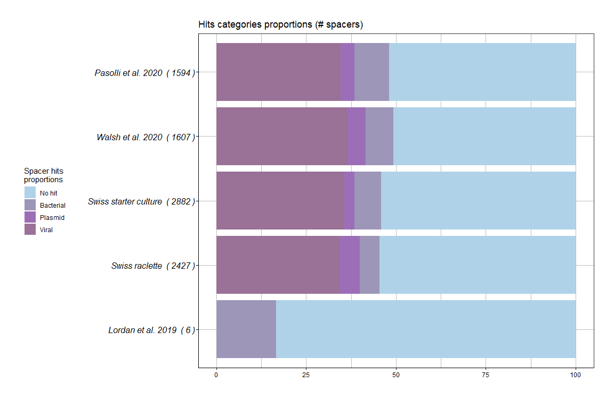<!-- -->

### Genomes

``` r
blast_genomes_plot <- genomic_blast_hits_2  %>% 
  ggplot(aes(x=Organism, y=HitRatio, group=final_hit, fill=final_hit)) +
  geom_col(stat="identity") +
  coord_flip() + # supplementary figure -> difference between species / overall 40-50% of target unknown
  #scale_fill_manual(values = c("darkgoldenrod2", "cyan2" ,"cyan2","cyan2","cyan2","grey"))
  scale_fill_manual(values = c("#afd2e9ff","#9d96b8ff","#9d6eb8ff","#9a7197ff"))+  
  scale_x_discrete(labels = function(x) str_replace(x, "_", " "), limits=rev) +
  theme_bw() +
  theme(
    axis.text.y = element_text(
      hjust = 1,
      color = "black",
      size = 12,
      face = "italic"
    ),
    axis.text.x = element_text(color = "black"),
    axis.title.x = element_text(color = "black"),
    axis.title.y = element_text(color = "black"),
    axis.line.y.left = element_line(color = "black"),
    axis.line.y.right = element_line(color = "black"),
    axis.line.x = element_line(color = "black"),
    axis.ticks = element_line(color = "black"),
    plot.title = element_text(color = "black"),
    panel.background = element_rect(fill = "white", colour = NA),
    plot.background = element_rect(fill = "white", colour = NA),
    legend.position = "left",
    legend.background = element_rect(fill = "white", colour = NA),
    legend.box.background = element_rect(fill = "white", colour = NA),
    legend.text = element_text(color = "black"),
    legend.title = element_text(color = "black"),
    plot.margin = unit(c(1, 1, 1, 1), "cm"),
    panel.grid.major = element_line(color = "grey", size = 0.1),
    panel.grid.minor = element_line(color = "grey", size = 0.1),
    strip.background = element_rect(
      color = "black",
      fill = "white",
      size = 0.5,
      linetype = "solid"
    ),
    strip.text = element_text(color = "grey")
  ) +
  ylab("") +
  xlab("") +
  labs(fill="Spacer hits\nproportions", title = "Hits categories proportions (# spacers)")
```

    ## Warning: Ignoring unknown parameters: stat

``` r
bars = ggplot_gtable(ggplot_build(blast_genomes_plot))
bars$heights[5] <- unit(1, "cm")
bars$heights[1] <- unit(1, "null")
blast_genomes_plot
```

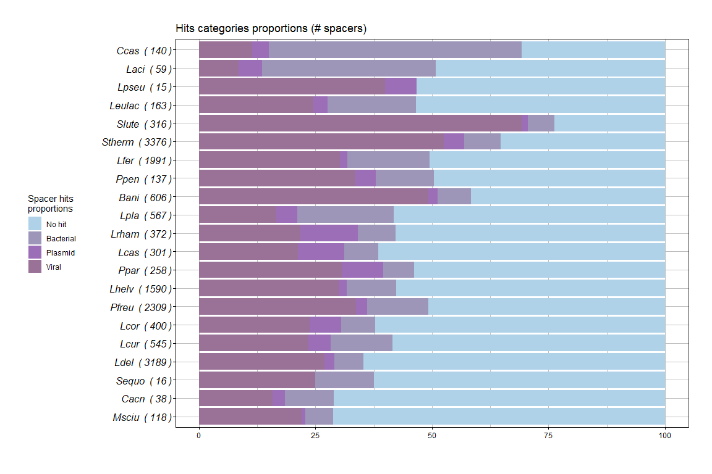<!-- -->

### Combined plots

``` r
genomic_blast_hits_2 <- read_csv(file = paste(data_folder, "/EXPORT/BLAST_genomic_plot.csv", sep=""), col_names = T)
```

    ## Rows: 82 Columns: 3

    ## -- Column specification --------------------------------------------------------
    ## Delimiter: ","
    ## chr (2): Organism, final_hit
    ## dbl (1): HitRatio

    ## 
    ## i Use `spec()` to retrieve the full column specification for this data.
    ## i Specify the column types or set `show_col_types = FALSE` to quiet this message.

``` r
metagenomic_blast_hits_2 <- read_csv(file = paste(data_folder, "/EXPORT/BLAST_metagenomic_plot.csv", sep=""), col_names = T)
```

    ## Rows: 18 Columns: 3

    ## -- Column specification --------------------------------------------------------
    ## Delimiter: ","
    ## chr (2): ProjectID, final_hit
    ## dbl (1): HitRatio

    ## 
    ## i Use `spec()` to retrieve the full column specification for this data.
    ## i Specify the column types or set `show_col_types = FALSE` to quiet this message.

``` r
gen_hit_plt_2 <- genomic_blast_hits_2 %>% ungroup() %>% mutate(name = Organism) %>% mutate(category = "Genomic") %>% 
  select(name, final_hit, HitRatio, category)

meta_hit_plt_2 <- metagenomic_blast_hits_2 %>% ungroup() %>%  mutate(name = ProjectID) %>%  mutate(category = "Metagenomic") %>% 
  select(name, final_hit, HitRatio, category)


hit_plt_2 <- bind_rows(gen_hit_plt_2, meta_hit_plt_2)


# Reordering for merged data

hit_plt_2 <- hit_plt_2 %>% group_by(name) %>% 
  mutate(p = ifelse(final_hit == "No hit", HitRatio, 0)) %>% 
  mutate(p = sum(p)) %>% 
  ungroup()

hit_plt_2_order <- hit_plt_2 %>% arrange(desc(p)) %>% select(name) %>% distinct() %>% unlist()
hit_plt_2$name <- factor(hit_plt_2$name, levels = hit_plt_2_order)
hit_plt_2$final_hit <- factor(hit_plt_2$final_hit, levels = c("No hit","CRISPR",  "Bacterial","Plasmid", "Viral"))

hit_plt_2 <- hit_plt_2 %>% arrange(name)


#hit_plt_2 %>% write_csv(file = paste("./hit_plot_combined_numbers.csv", sep=""), col_names = T)
```

Super usefull page: <https://mattherman.info/blog/fix-facet-width/>

``` r
plt_gm_blast <- hit_plt_2 %>% 
  ggplot(aes(y=name, x=HitRatio, fill=final_hit, category=category)) +
  geom_col() +
  #coord_flip() + # supplementary figure -> difference between species / overall 40-50% of target unknown
  #scale_fill_manual(values = c("darkgoldenrod2", "cyan2" ,"cyan2","cyan2","cyan2","grey"))
  scale_fill_manual(values = c("#afd2e9ff","#9d96b8ff","#9d6eb8ff","#9a7197ff"))+  
  theme_bw() +
  theme(
    axis.text.y = element_text(hjust = 1,color = "black",size = 12,face = "italic"),
    axis.text.x = element_text(color = "black"),
    axis.title.x = element_text(color = "black"),
    axis.title.y = element_text(color = "black"),
    axis.line.y.left = element_line(color = "black"),
    axis.line.y.right = element_line(color = "black"),
    axis.line.x = element_line(color = "black"),
    axis.ticks = element_line(color = "black"),
    plot.title = element_text(color = "black"),
    panel.background = element_rect(fill = "white", colour = NA),
    plot.background = element_rect(fill = "white", colour = NA),
    legend.position = "top",
    legend.background = element_rect(fill = "white", colour = NA),
    legend.box.background = element_rect(fill = "white", colour = NA),
    legend.text = element_text(color = "black"),
    legend.title = element_blank(),
    plot.margin = unit(c(1, 1, 1, 1), "cm"),
    panel.grid.major = element_line(color = "grey", size = 0.1),
    panel.grid.minor = element_line(color = "grey", size = 0.1),
    strip.background = element_rect(color = "black", fill = "white",size = 0.5,linetype = "solid" ),
    strip.text = element_text(color = "black")
  )+
  guides(fill = guide_legend(reverse = TRUE)) +
  ylab("") +
  xlab("Hits categories proportions (# spacers)") +
  labs(fill="Spacer hits\nproportions", title = "") +
  scale_linetype_manual(guide = guide_legend(reverse = TRUE) ) +
  facet_grid(rows = vars(category), scales = "free_y", switch = "y", space = "free_y")

plt_gm_blast
```

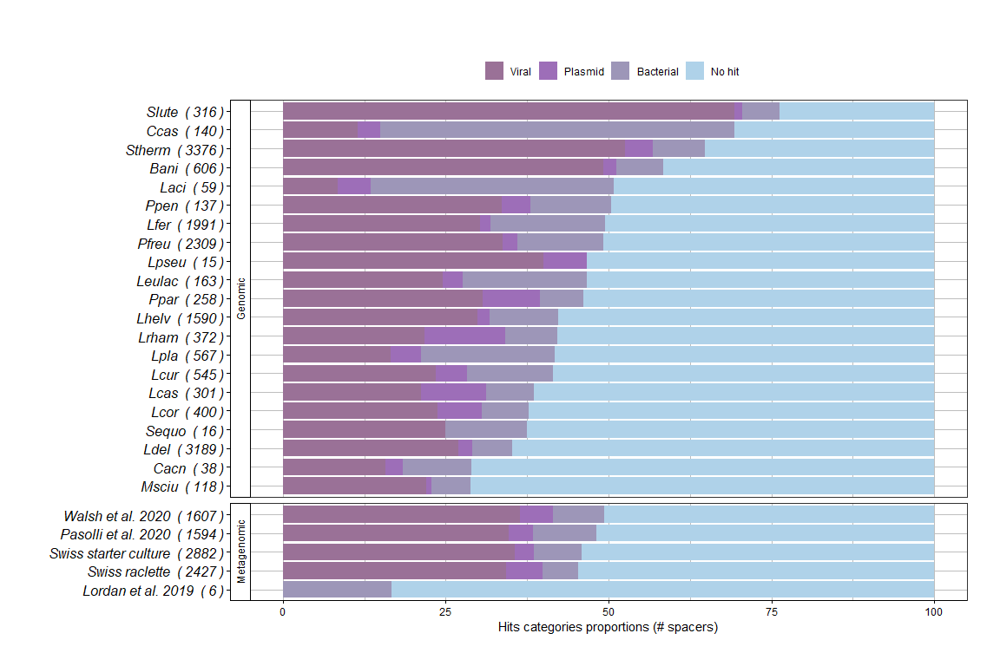<!-- -->

``` r
ggsave(
  plot = plt_gm_blast,
  file = paste(google_drive_folder,"/BLAST_genomes_metagenome_orderedHIT.pdf", sep=""),
  bg = "transparent",
  width = 25,
  height = 20,
  units = "cm",
  dpi = 800
)
```

Get the values (numbers)

``` r
genomic_tmp = genomic_blast_hits_2
metagenomic_tmp = metagenomic_blast_hits_2

bind_rows(genomic_tmp %>% dplyr::rename(name = Organism),
          metagenomic_tmp %>% dplyr::rename(name = ProjectID)) %>% write_csv(file = "../../export_fig4A_values.csv")
```

\#———————————————- \# BLAST: nr

Results from Spacers BLAST against nr

Accession numbers were sent to entrez-batch to retrieve accession number
related information. Due to failures on entrez’ side, a set of proteins
sequences couldn’t be retreived (in
/0\_data/EXPORT/BLASTnr\_accession\_list\_fail\_1.txt)

GENERATE QUERY

``` r
CRISPRblast_nr_03 <- read_delim(paste(data_folder, "/IMPORT/Blast_nr_hits/CRISPRblast_nr_03.txt", sep=""), 
    "\t", escape_double = FALSE, col_names = c("qseqid", "sseqid", "pident", "length", "mismatch", "gapopen", "qstart", "qend", 
                                               "sstart", "send", "evalue", "bitscore", "stitle", "slen"), 
    trim_ws = TRUE)
```

    ## Rows: 13657 Columns: 18

    ## -- Column specification --------------------------------------------------------
    ## Delimiter: "\t"
    ## chr  (5): sseqid, stitle, X16, X17, X18
    ## dbl (13): qseqid, pident, length, mismatch, gapopen, qstart, qend, sstart, s...

    ## 
    ## i Use `spec()` to retrieve the full column specification for this data.
    ## i Specify the column types or set `show_col_types = FALSE` to quiet this message.

``` r
# Get protein accession ID from Blast result.
# CLUSTER ID / SSEQID 
BLASTnr_sseqid_qseqid <- CRISPRblast_nr_03 %>% select(qseqid,sseqid) %>%
  mutate(sseqid = paste("|", sseqid, sep="")) %>%
  separate(sseqid, into = c("1" ,"DB","accessionID", "asdf"), sep = "[|]") %>%
  select(DB,accessionID, qseqid)

# 13'657  BLAST nr results > 1984 failed on Entrez-batch
BLASTnr_sseqid_qseqid %>% write_delim(file = paste(data_folder, "/EXPORT/BLASTnr_accession_list.txt", sep=""), col_names = F, delim="\n")

# Get failed attempts. 
# entrez_batch_fail_1 <- read_csv(paste(data_folder, "/IMPORT/Blast_nr_hits/entrez_batch_fail_1.txt", sep=""), col_names = FALSE) %>% 
#   mutate(X1 = gsub("Id=", "", X1)) %>% 
#   mutate(X1 = gsub(":.*", "", X1))

# Retry on Entrez-batch -> all failed to be retrieved = 1984 entries

#entrez_batch_fail_1 %>% write_delim(file = paste(data_folder, "/BLASTnr/BLASTnr_accession_list_fail_1.txt", sep=""), col_names = F, delim="\n")
```

Protein fasta sequences were then downloaded from NCBI (via entrez
results) and sent to Eggnog-mapper (<http://eggnog-mapper.embl.de/>)

# eggnog results

``` r
MM_ug5vlsop_emapper_annotations <- read_delim(paste(data_folder, "/Eggnog_results/MM_ug5vlsop.emapper.annotations.tsv", sep=""), 
    "\t", escape_double = FALSE, trim_ws = TRUE, 
    skip = 4)  %>%  dplyr::slice(1:(n()-3))
```

    ## Rows: 6196 Columns: 21

    ## -- Column specification --------------------------------------------------------
    ## Delimiter: "\t"
    ## chr (19): #query, seed_ortholog, eggNOG_OGs, max_annot_lvl, COG_category, De...
    ## dbl  (2): evalue, score

    ## 
    ## i Use `spec()` to retrieve the full column specification for this data.
    ## i Specify the column types or set `show_col_types = FALSE` to quiet this message.

``` r
#View(MM_ug5vlsop_emapper_annotations)


Eggnog_results <- MM_ug5vlsop_emapper_annotations %>%
  separate(`#query`, into = c("DB1","accessionID1", "DB2", "accessionID2"), sep = "[|]")
```

    ## Warning: One or more parsing issues, see `problems()` for details

    ## Warning: Expected 4 pieces. Additional pieces discarded in 6193 rows [1, 2, 3,
    ## 4, 5, 6, 7, 8, 9, 10, 11, 12, 13, 14, 15, 16, 17, 18, 19, 20, ...].

``` r
Eggnog_results
```

    ## # A tibble: 6,193 x 24
    ##    DB1   accessionID1 DB2   accessionID2 seed_ortholog   evalue score eggNOG_OGs
    ##    <chr> <chr>        <chr> <chr>        <chr>            <dbl> <dbl> <chr>     
    ##  1 gi    466393       gb    AAA28942.1   7237.FBpp028~ 0        1840. COG4886@1~
    ##  2 gi    684925       gb    AAC48859.1   1399941.U3PC~ 1.2e-151  543. 4QAQE@102~
    ##  3 gi    4587886      gb    AAD25912.1   387344.LVIS_~ 3.3e-204  718  COG3505@1~
    ##  4 gi    11138334     gb    AAG31329.1   12348.Q8SDH2~ 2.7e- 98  365. 4QBU2@102~
    ##  5 gi    19748446     gb    AAL97894.1   1154860.SAG0~ 5.7e-102  378. 2EYK9@1|r~
    ##  6 gi    38112242     gb    AAR11215.1   3885.XP_0071~ 1.3e- 83  317  28N51@1|r~
    ##  7 gi    55230225     gb    AAV45644.1   272569.rrnAC~ 3  e-110  404. COG1047@1~
    ##  8 gi    60099651     gb    AAX12955.1   630626.EBL_c~ 3.6e-224  784. COG4379@1~
    ##  9 gi    61608605     gb    AAX47095.1   121759.XP_01~ 1.2e-125  456. 2E0J9@1|r~
    ## 10 gi    66932787     gb    AAY58231.1   9913.ENSBTAP~ 4.1e-118  431. COG0386@1~
    ## # ... with 6,183 more rows, and 16 more variables: max_annot_lvl <chr>,
    ## #   COG_category <chr>, Description <chr>, Preferred_name <chr>, GOs <chr>,
    ## #   EC <chr>, KEGG_ko <chr>, KEGG_Pathway <chr>, KEGG_Module <chr>,
    ## #   KEGG_Reaction <chr>, KEGG_rclass <chr>, BRITE <chr>, KEGG_TC <chr>,
    ## #   CAZy <chr>, BiGG_Reaction <chr>, PFAMs <chr>

``` r
# 6193 proteins were analysed with Eggnog.


# Identify what the bacterial spacers target
# Spacers - BLASTnr - Entrez - Eggnog
BLAST_clusters_bacteria <- CRISPRscope_blast_cluster_hit_type_2 %>% filter(final_hit == "Bacterial")


# 14'476 bacterial hits
# 14'567 before marking 91 spacers as Viral (from eggnog protein annotation)

BLASTnr_sseqid_qseqid %>% filter(qseqid %in% BLAST_clusters_bacteria$cluster)
```

    ## # A tibble: 1,452 x 3
    ##    DB    accessionID    qseqid
    ##    <chr> <chr>           <dbl>
    ##  1 gb    AAV61121.1         26
    ##  2 emb   CDF01716.1         76
    ##  3 gb    AAV61121.1         84
    ##  4 ref   XP_014259592.1    116
    ##  5 ref   XP_031733868.1    126
    ##  6 gb    MBI3522666.1      129
    ##  7 gb    EHJ26660.1        130
    ##  8 ref   XP_005317372.1    138
    ##  9 ref   WP_090400433.1    139
    ## 10 ref   WP_090400433.1    140
    ## # ... with 1,442 more rows

``` r
# 11'502 have no protein matched / retrieved or eggnong annotation. 
# 2'974 <- 3'065 / 14'567 Spacers (cluster id) marked as "bacterial" have a 


# 14'567 Bacterial marked spacers. From which 3'065


Eggnog_results
```

    ## # A tibble: 6,193 x 24
    ##    DB1   accessionID1 DB2   accessionID2 seed_ortholog   evalue score eggNOG_OGs
    ##    <chr> <chr>        <chr> <chr>        <chr>            <dbl> <dbl> <chr>     
    ##  1 gi    466393       gb    AAA28942.1   7237.FBpp028~ 0        1840. COG4886@1~
    ##  2 gi    684925       gb    AAC48859.1   1399941.U3PC~ 1.2e-151  543. 4QAQE@102~
    ##  3 gi    4587886      gb    AAD25912.1   387344.LVIS_~ 3.3e-204  718  COG3505@1~
    ##  4 gi    11138334     gb    AAG31329.1   12348.Q8SDH2~ 2.7e- 98  365. 4QBU2@102~
    ##  5 gi    19748446     gb    AAL97894.1   1154860.SAG0~ 5.7e-102  378. 2EYK9@1|r~
    ##  6 gi    38112242     gb    AAR11215.1   3885.XP_0071~ 1.3e- 83  317  28N51@1|r~
    ##  7 gi    55230225     gb    AAV45644.1   272569.rrnAC~ 3  e-110  404. COG1047@1~
    ##  8 gi    60099651     gb    AAX12955.1   630626.EBL_c~ 3.6e-224  784. COG4379@1~
    ##  9 gi    61608605     gb    AAX47095.1   121759.XP_01~ 1.2e-125  456. 2E0J9@1|r~
    ## 10 gi    66932787     gb    AAY58231.1   9913.ENSBTAP~ 4.1e-118  431. COG0386@1~
    ## # ... with 6,183 more rows, and 16 more variables: max_annot_lvl <chr>,
    ## #   COG_category <chr>, Description <chr>, Preferred_name <chr>, GOs <chr>,
    ## #   EC <chr>, KEGG_ko <chr>, KEGG_Pathway <chr>, KEGG_Module <chr>,
    ## #   KEGG_Reaction <chr>, KEGG_rclass <chr>, BRITE <chr>, KEGG_TC <chr>,
    ## #   CAZy <chr>, BiGG_Reaction <chr>, PFAMs <chr>

``` r
# Bacterial cluster hits - protein match - eggnog annotations
bactHits_protein_annot <- BLASTnr_sseqid_qseqid %>% filter(qseqid %in% BLAST_clusters_bacteria$cluster) %>% 
  inner_join(Eggnog_results, by=c("DB" = "DB2", "accessionID" = "accessionID2")) %>% 
  select(-DB1, -accessionID1)


# 1,398  bacterial blast hits are annotated with eggnog (12,168 have not). 
bactHits_protein_annot
```

    ## # A tibble: 724 x 23
    ##    DB    accessionID  qseqid seed_ortholog     evalue score eggNOG_OGs          
    ##    <chr> <chr>         <dbl> <chr>              <dbl> <dbl> <chr>               
    ##  1 emb   CDF01716.1       76 1046629.Ssal_0~ 2.2e-199  701. COG0201@1|root,COG0~
    ##  2 ref   WP_09040043~    139 1415630.U771_2~ 4.3e-114  418. COG2977@1|root,COG2~
    ##  3 ref   WP_09040043~    140 1415630.U771_2~ 4.3e-114  418. COG2977@1|root,COG2~
    ##  4 gb    KAE8802034.1    160 4513.MLOC_5846~ 1.2e-162  579. KOG0282@1|root,KOG0~
    ##  5 gb    QGS36746.1      161 1175629.AJTG01~ 1.9e-209  735. COG3853@1|root,COG3~
    ##  6 ref   WP_15980827~    162 1123360.thalar~ 2.3e- 60  238. COG1143@1|root,COG1~
    ##  7 ref   WP_12497713~    165 1423806.JCM154~ 2  e-300 1038. COG1368@1|root,COG1~
    ##  8 gb    OAW71700.1      186 435838.HMPREF0~ 9.1e- 22  110. COG3266@1|root,COG3~
    ##  9 ref   WP_15596784~    220 279808.SH2426   0        1183. COG3147@1|root,COG4~
    ## 10 ref   WP_15596784~    221 279808.SH2426   0        1183. COG3147@1|root,COG4~
    ## # ... with 714 more rows, and 16 more variables: max_annot_lvl <chr>,
    ## #   COG_category <chr>, Description <chr>, Preferred_name <chr>, GOs <chr>,
    ## #   EC <chr>, KEGG_ko <chr>, KEGG_Pathway <chr>, KEGG_Module <chr>,
    ## #   KEGG_Reaction <chr>, KEGG_rclass <chr>, BRITE <chr>, KEGG_TC <chr>,
    ## #   CAZy <chr>, BiGG_Reaction <chr>, PFAMs <chr>

``` r
# ZERO MATCH WITH DB1 and ID1
# BLASTnr_sseqid_qseqid %>% filter(qseqid %in% BLAST_clusters_bacteria$cluster) %>% 
#   inner_join(Eggnog_results, by=c("DB" = "DB1", "accessionID" = "accessionID1")) %>% 
#   select(-DB2, -accessionID2)
```

## Cog categories - viruses

Export list of sequences (cluster id) that are annotated as viruses from
Eggnog.

``` r
bactHits_protein_annot %>% distinct() %>% 
  separate(max_annot_lvl, into = c("taxid?", "Level"), sep = "[|]") %>% 
  select(Level) %>% distinct() 
```

    ## # A tibble: 46 x 1
    ##    Level              
    ##    <chr>              
    ##  1 Bacilli            
    ##  2 Gammaproteobacteria
    ##  3 Streptophyta       
    ##  4 Alphaproteobacteria
    ##  5 Bacteria           
    ##  6 Bacteroidetes      
    ##  7 Betaproteobacteria 
    ##  8 Metazoa            
    ##  9 Fungi              
    ## 10 Planctomycetes     
    ## # ... with 36 more rows

``` r
# Create / export a list of bacterial qseqid to mark as Viral earlier (loop back)
bacterial_viral_protein_hits <- bactHits_protein_annot %>% 
  separate(max_annot_lvl, into = c("taxid?", "Level"), sep = "[|]") %>% 
  filter(Level == "Myoviridae" | 
           Level == "Viruses" | 
           Level == "Siphoviridae" | 
           Level == "Caudovirales" | 
           Level == "Podoviridae" | 
           Level == "Microviridae" | 
           Level == "Nidovirales")  

bacterial_viral_protein_hits_list <- bacterial_viral_protein_hits %>% select(qseqid) %>% unlist()
save(bacterial_viral_protein_hits_list, file=paste(data_folder, "/IMPORT_EXPORT/bacterial_viral_protein_hits_list", sep=""))
```

Myoviridae Viruses Siphoviridae Caudovirales Podoviridae Microviridae
Nidovirales

\#\#
<p>

Cog categories

``` r
eggnog_plt_taxlevel <- bactHits_protein_annot %>% 
  select(qseqid, COG_category, max_annot_lvl) %>% 
  separate(max_annot_lvl, into = c("taxid?", "Level"), sep = "[|]") %>% 
  dplyr::count(Level)%>% 
  ggplot(aes(x=Level, y=n)) +
  geom_col()+  
  theme_bw() +
  theme(
    axis.text.y = element_text(hjust = 1,color = "black",size = 12,face = "italic"),
    axis.text.x = element_text(color = "black", angle = 45, hjust = 1),
    axis.title.x = element_text(color = "black"),
    axis.title.y = element_text(color = "black"),
    axis.line.y.left = element_line(color = "black"),
    axis.line.y.right = element_line(color = "black"),
    axis.line.x = element_line(color = "black"),
    axis.ticks = element_line(color = "black"),
    plot.title = element_text(color = "black"),
    panel.background = element_rect(fill = "white", colour = NA),
    plot.background = element_rect(fill = "white", colour = NA),
    legend.position = "top",
    legend.background = element_rect(fill = "white", colour = NA),
    legend.box.background = element_rect(fill = "white", colour = NA),
    legend.text = element_text(color = "black"),
    legend.title = element_blank(),
    plot.margin = unit(c(1, 1, 1, 1), "cm"),
    panel.grid.major = element_line(color = "grey", size = 0.1),
    panel.grid.minor = element_line(color = "grey", size = 0.1),
    strip.background = element_rect(color = "black", fill = "white",size = 0.5,linetype = "solid" ),
    strip.text = element_text(color = "grey")
  )+
  guides(fill = guide_legend(reverse = TRUE)) +
  ylab("") +
  xlab("Taxonomic level") +
  labs(fill="Number of bacterial spacers", title = "")

ggsave(
  plot = eggnog_plt_taxlevel,
  file = paste(google_drive_folder,"/eggnog_plt_taxlevel.pdf", sep=""),
  bg = "transparent",
  width = 25,
  height = 20,
  units = "cm",
  dpi = 800
)

eggnog_plt_taxlevel
```

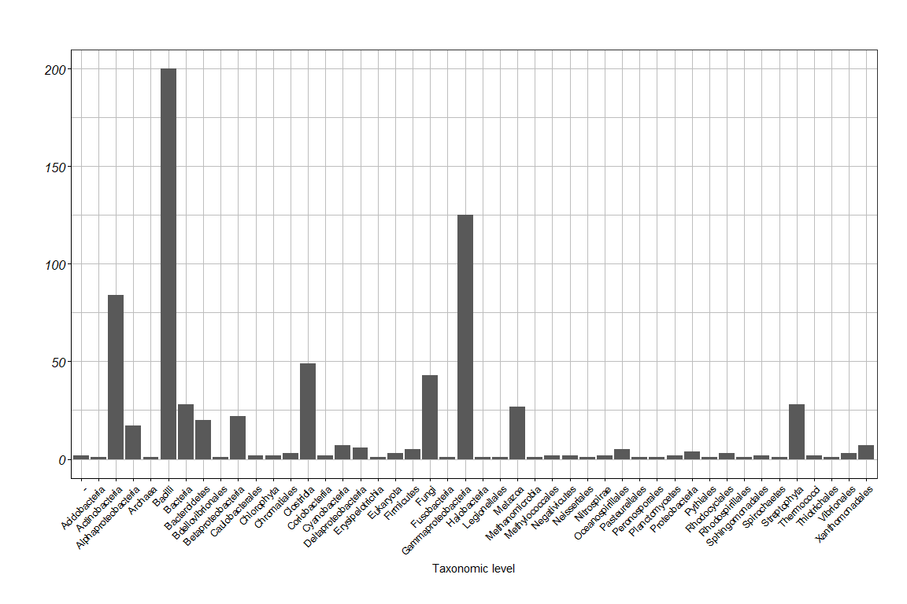<!-- -->

``` r
bactHits_protein_annot
```

    ## # A tibble: 724 x 23
    ##    DB    accessionID  qseqid seed_ortholog     evalue score eggNOG_OGs          
    ##    <chr> <chr>         <dbl> <chr>              <dbl> <dbl> <chr>               
    ##  1 emb   CDF01716.1       76 1046629.Ssal_0~ 2.2e-199  701. COG0201@1|root,COG0~
    ##  2 ref   WP_09040043~    139 1415630.U771_2~ 4.3e-114  418. COG2977@1|root,COG2~
    ##  3 ref   WP_09040043~    140 1415630.U771_2~ 4.3e-114  418. COG2977@1|root,COG2~
    ##  4 gb    KAE8802034.1    160 4513.MLOC_5846~ 1.2e-162  579. KOG0282@1|root,KOG0~
    ##  5 gb    QGS36746.1      161 1175629.AJTG01~ 1.9e-209  735. COG3853@1|root,COG3~
    ##  6 ref   WP_15980827~    162 1123360.thalar~ 2.3e- 60  238. COG1143@1|root,COG1~
    ##  7 ref   WP_12497713~    165 1423806.JCM154~ 2  e-300 1038. COG1368@1|root,COG1~
    ##  8 gb    OAW71700.1      186 435838.HMPREF0~ 9.1e- 22  110. COG3266@1|root,COG3~
    ##  9 ref   WP_15596784~    220 279808.SH2426   0        1183. COG3147@1|root,COG4~
    ## 10 ref   WP_15596784~    221 279808.SH2426   0        1183. COG3147@1|root,COG4~
    ## # ... with 714 more rows, and 16 more variables: max_annot_lvl <chr>,
    ## #   COG_category <chr>, Description <chr>, Preferred_name <chr>, GOs <chr>,
    ## #   EC <chr>, KEGG_ko <chr>, KEGG_Pathway <chr>, KEGG_Module <chr>,
    ## #   KEGG_Reaction <chr>, KEGG_rclass <chr>, BRITE <chr>, KEGG_TC <chr>,
    ## #   CAZy <chr>, BiGG_Reaction <chr>, PFAMs <chr>

``` r
# COG is only a single letter. If it's 2 or 3 letters so a protein might be in 

eggnog_plt_COG <- bactHits_protein_annot %>% 
  select(qseqid, COG_category, max_annot_lvl) %>% 
  separate(max_annot_lvl, into = c("taxid?", "Level"), sep = "[|]") %>% 
  dplyr::count(COG_category) %>% 
  ggplot(aes(x=COG_category, y=n)) +
  geom_col()+  
  theme_bw() +
  theme(
    axis.text.y = element_text(hjust = 1,color = "black",size = 12,face = "italic"),
    axis.text.x = element_text(color = "black", angle = 45, hjust = 1),
    axis.title.x = element_text(color = "black"),
    axis.title.y = element_text(color = "black"),
    axis.line.y.left = element_line(color = "black"),
    axis.line.y.right = element_line(color = "black"),
    axis.line.x = element_line(color = "black"),
    axis.ticks = element_line(color = "black"),
    plot.title = element_text(color = "black"),
    panel.background = element_rect(fill = "white", colour = NA),
    plot.background = element_rect(fill = "white", colour = NA),
    legend.position = "top",
    legend.background = element_rect(fill = "white", colour = NA),
    legend.box.background = element_rect(fill = "white", colour = NA),
    legend.text = element_text(color = "black"),
    legend.title = element_blank(),
    plot.margin = unit(c(1, 1, 1, 1), "cm"),
    panel.grid.major = element_line(color = "grey", size = 0.1),
    panel.grid.minor = element_line(color = "grey", size = 0.1),
    strip.background = element_rect(color = "black", fill = "white",size = 0.5,linetype = "solid" ),
    strip.text = element_text(color = "grey")
  )+
  guides(fill = guide_legend(reverse = TRUE)) +
  ylab("") +
  xlab("COG category") +
  labs(fill="Number of bacterial spacers", title = "")

ggsave(
  plot = eggnog_plt_COG,
  file = paste(google_drive_folder,"/eggnog_plt_COG.pdf", sep=""),
  bg = "transparent",
  width = 25,
  height = 20,
  units = "cm",
  dpi = 800
)

eggnog_plt_COG
```

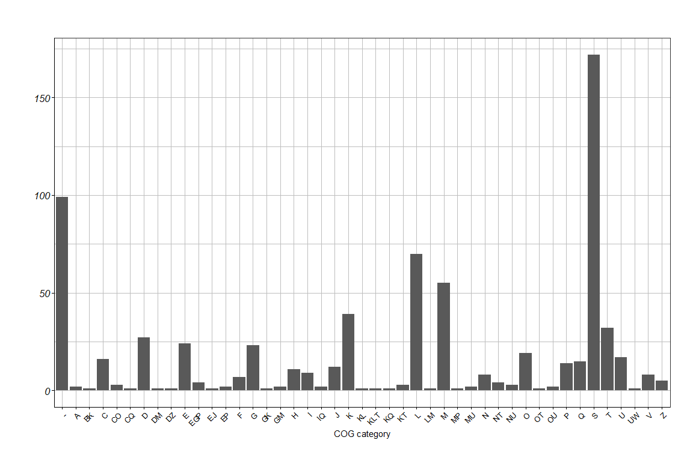<!-- -->

CRISPRscope\_blast\_cluster\_hit\_type\_2 contains cluster / type -&gt;
subset type == “Bacterial” -&gt; check in eggnog results

``` r
is.zero <- function(x){return(x==0)}

list_cog <- c("S2","A","BK","C","CO","CQ","D","DM","DZ","E","EGP","EJ","EP","F","G","GK","GM","H",
              "I","IQ","J","K","KL","KLT","KQ","KT","L","LM","M","MP","MU","N","NT","NU","O","OT",
              "OU","P","Q","S","T","U","UW","V","Z")

order_cog <- c("S","A","B","C","D","E","F","G","H",
              "I","J","K","L","M","N","O",
              "P","Q","T","U","V", "W","Z")

renameCOG <- function(tibble){
  return(tibble %>% 
           mutate(COG = replace(COG, COG == "A", "RNA processing\n modification")) %>% 
           mutate(COG = replace(COG, COG == "B", "Chromatin structure\n dynamics")) %>% 
           mutate(COG = replace(COG, COG == "C", "Energy production\n conversion")) %>% 
           mutate(COG = replace(COG, COG == "D", "Cell cycle control\n mitosis")) %>% 
           mutate(COG = replace(COG, COG == "E", "Amino acid metabolism\n transport")) %>% 
           mutate(COG = replace(COG, COG == "F", "Nucleotide metabolism\n transport")) %>% 
           mutate(COG = replace(COG, COG == "G", "Carbohydrate metabolism\n transport")) %>% 
           mutate(COG = replace(COG, COG == "H", "Coenzyme transport\n metabolism")) %>% 
           mutate(COG = replace(COG, COG == "I", "Lipid metabolism")) %>% 
           mutate(COG = replace(COG, COG == "J", "Translation")) %>% 
           mutate(COG = replace(COG, COG == "K", "Transcription")) %>% 
           mutate(COG = replace(COG, COG == "L", "Replication\n repair")) %>% 
           mutate(COG = replace(COG, COG == "M", "Cell wall membrane\n biogenesis")) %>% 
           mutate(COG = replace(COG, COG == "N", "Cell motility")) %>% 
           mutate(COG = replace(COG, COG == "O", "Post-translational modification")) %>% 
           mutate(COG = replace(COG, COG == "P", "Inorganic ion transport\n metabolism")) %>% 
           mutate(COG = replace(COG, COG == "Q", "Secondary structure")) %>% 
           mutate(COG = replace(COG, COG == "R", "General Functional\n  Prediction only")) %>% 
           mutate(COG = replace(COG, COG == "S", "Function unknown")) %>% 
           mutate(COG = replace(COG, COG == "T", "Signal transduction")) %>% 
           mutate(COG = replace(COG, COG == "U", "Intracellular trafficking\n secretion")) %>% 
           mutate(COG = replace(COG, COG == "V", "Defense mechanisms")) %>% 
           mutate(COG = replace(COG, COG == "W", "Extra cellular structures")) %>% 
           mutate(COG = replace(COG, COG == "X", "Mobilome: Prophage, Transposon")) %>% 
           mutate(COG = replace(COG, COG == "Y", "Nuclear structure")) %>% 
           mutate(COG = replace(COG, COG == "Z", "Cytoskeleton")) 
           
  )
}


cog_categories_sum <- bactHits_protein_annot %>% spread(COG_category, COG_category) %>% 
  select(-PFAMs, -BRITE, -KEGG_TC, -CAZy, -BiGG_Reaction,-KEGG_ko, -KEGG_Pathway, -KEGG_Module, -KEGG_Reaction, -KEGG_rclass, -KEGG_TC) %>% 
  select(-seed_ortholog, -evalue, -score, -eggNOG_OGs, -max_annot_lvl, -Description, -Preferred_name, -GOs, -EC) %>% 
  dplyr::rename(S2 = `-`) %>% 
  mutate_all(funs(replace_na(., 0))) %>% 
  mutate_at(list_cog, as.integer) %>% 
  mutate_all(funs(replace_na(., 1))) %>% 
  mutate(A = rowSums(select(.,A))) %>%
  mutate(S = rowSums(select(.,S, S2))) %>%
  mutate(B = rowSums(select(.,BK))) %>% 
  mutate(C = rowSums(select(.,C, CO, CQ))) %>%
  mutate(D = rowSums(select(.,D, DM, DZ))) %>%
  mutate(E = rowSums(select(.,E, EGP, EJ, EP))) %>%
  mutate(F = rowSums(select(.,F))) %>%
  mutate(G = rowSums(select(.,G, EGP, GK, GM))) %>%
  mutate(H = rowSums(select(.,H))) %>%
  mutate(I = rowSums(select(.,I, IQ))) %>%
  mutate(J = rowSums(select(.,J, EJ))) %>%
  mutate(K = rowSums(select(.,K, BK, GK, KL, KLT, KQ, KT))) %>%
  mutate(L = rowSums(select(.,L, KL, KLT, LM))) %>%
  mutate(M = rowSums(select(.,M, DM, GM, LM, MP, MU))) %>%
  mutate(N = rowSums(select(.,N, NT, NU))) %>%
  mutate(O = rowSums(select(.,O, CO, OT, OU))) %>%
  mutate(P = rowSums(select(.,P, EGP, EP, MP))) %>%
  mutate(Q = rowSums(select(.,Q, CQ, IQ, KQ, ))) %>%
  mutate(T = rowSums(select(.,T, KT, NT, OT, KLT))) %>%
  mutate(U = rowSums(select(.,U, MU, NU, OU, UW))) %>%
  mutate(W = rowSums(select(.,UW))) %>%
  mutate(V = rowSums(select(.,V))) %>%
  mutate(Z = rowSums(select(.,Z, DZ))) %>% 
  select(S,A,B,C,D,E,F,G,H,I,J,K,L,M,N,O,P,Q,T,U,W,V,Z) %>% 
  summarise(across(everything(), list(sum)))%>% rename_at(vars(ends_with("_1")), funs(str_replace(., "_1", ""))) 
```

    ## Warning: `funs()` was deprecated in dplyr 0.8.0.
    ## Please use a list of either functions or lambdas: 
    ## 
    ##   # Simple named list: 
    ##   list(mean = mean, median = median)
    ## 
    ##   # Auto named with `tibble::lst()`: 
    ##   tibble::lst(mean, median)
    ## 
    ##   # Using lambdas
    ##   list(~ mean(., trim = .2), ~ median(., na.rm = TRUE))

    ## Warning in mask$eval_all_mutate(quo): NAs introduits lors de la conversion
    ## automatique

    ## Warning in mask$eval_all_mutate(quo): NAs introduits lors de la conversion
    ## automatique

    ## Warning in mask$eval_all_mutate(quo): NAs introduits lors de la conversion
    ## automatique

    ## Warning in mask$eval_all_mutate(quo): NAs introduits lors de la conversion
    ## automatique

    ## Warning in mask$eval_all_mutate(quo): NAs introduits lors de la conversion
    ## automatique

    ## Warning in mask$eval_all_mutate(quo): NAs introduits lors de la conversion
    ## automatique

    ## Warning in mask$eval_all_mutate(quo): NAs introduits lors de la conversion
    ## automatique

    ## Warning in mask$eval_all_mutate(quo): NAs introduits lors de la conversion
    ## automatique

    ## Warning in mask$eval_all_mutate(quo): NAs introduits lors de la conversion
    ## automatique

    ## Warning in mask$eval_all_mutate(quo): NAs introduits lors de la conversion
    ## automatique

    ## Warning in mask$eval_all_mutate(quo): NAs introduits lors de la conversion
    ## automatique

    ## Warning in mask$eval_all_mutate(quo): NAs introduits lors de la conversion
    ## automatique

    ## Warning in mask$eval_all_mutate(quo): NAs introduits lors de la conversion
    ## automatique

    ## Warning in mask$eval_all_mutate(quo): NAs introduits lors de la conversion
    ## automatique

    ## Warning in mask$eval_all_mutate(quo): NAs introduits lors de la conversion
    ## automatique

    ## Warning in mask$eval_all_mutate(quo): NAs introduits lors de la conversion
    ## automatique

    ## Warning in mask$eval_all_mutate(quo): NAs introduits lors de la conversion
    ## automatique

    ## Warning in mask$eval_all_mutate(quo): NAs introduits lors de la conversion
    ## automatique

    ## Warning in mask$eval_all_mutate(quo): NAs introduits lors de la conversion
    ## automatique

    ## Warning in mask$eval_all_mutate(quo): NAs introduits lors de la conversion
    ## automatique

    ## Warning in mask$eval_all_mutate(quo): NAs introduits lors de la conversion
    ## automatique

    ## Warning in mask$eval_all_mutate(quo): NAs introduits lors de la conversion
    ## automatique

    ## Warning in mask$eval_all_mutate(quo): NAs introduits lors de la conversion
    ## automatique

    ## Warning in mask$eval_all_mutate(quo): NAs introduits lors de la conversion
    ## automatique

    ## Warning in mask$eval_all_mutate(quo): NAs introduits lors de la conversion
    ## automatique

    ## Warning in mask$eval_all_mutate(quo): NAs introduits lors de la conversion
    ## automatique

    ## Warning in mask$eval_all_mutate(quo): NAs introduits lors de la conversion
    ## automatique

    ## Warning in mask$eval_all_mutate(quo): NAs introduits lors de la conversion
    ## automatique

    ## Warning in mask$eval_all_mutate(quo): NAs introduits lors de la conversion
    ## automatique

    ## Warning in mask$eval_all_mutate(quo): NAs introduits lors de la conversion
    ## automatique

    ## Warning in mask$eval_all_mutate(quo): NAs introduits lors de la conversion
    ## automatique

    ## Warning in mask$eval_all_mutate(quo): NAs introduits lors de la conversion
    ## automatique

    ## Warning in mask$eval_all_mutate(quo): NAs introduits lors de la conversion
    ## automatique

    ## Warning in mask$eval_all_mutate(quo): NAs introduits lors de la conversion
    ## automatique

    ## Warning in mask$eval_all_mutate(quo): NAs introduits lors de la conversion
    ## automatique

    ## Warning in mask$eval_all_mutate(quo): NAs introduits lors de la conversion
    ## automatique

    ## Warning in mask$eval_all_mutate(quo): NAs introduits lors de la conversion
    ## automatique

    ## Warning in mask$eval_all_mutate(quo): NAs introduits lors de la conversion
    ## automatique

    ## Warning in mask$eval_all_mutate(quo): NAs introduits lors de la conversion
    ## automatique

    ## Warning in mask$eval_all_mutate(quo): NAs introduits lors de la conversion
    ## automatique

    ## Warning in mask$eval_all_mutate(quo): NAs introduits lors de la conversion
    ## automatique

    ## Warning in mask$eval_all_mutate(quo): NAs introduits lors de la conversion
    ## automatique

    ## Warning in mask$eval_all_mutate(quo): NAs introduits lors de la conversion
    ## automatique

    ## Warning in mask$eval_all_mutate(quo): NAs introduits lors de la conversion
    ## automatique

    ## Warning in mask$eval_all_mutate(quo): NAs introduits lors de la conversion
    ## automatique

``` r
cog_categories_sum_T <- as_tibble(cbind(nms = names(cog_categories_sum), t(cog_categories_sum))) %>% 
  dplyr::rename(COG = nms, n = V2) %>% 
  renameCOG %>% 
  mutate(n = as.double(n)) %>% 
  arrange(desc(n)) %>% 
  mutate(COG = factor(COG, levels = COG))
```

    ## Warning: The `x` argument of `as_tibble.matrix()` must have unique column names if `.name_repair` is omitted as of tibble 2.0.0.
    ## Using compatibility `.name_repair`.

``` r
cog_categories_sum_T %>%  
  ggplot(aes(x=COG, y=n))  +
  geom_bar(stat="identity", width=.8)  +
  theme_classic() +
  theme(
    axis.text.x = element_text(angle = 45, hjust = 1)
  )+
  xlab("COG categories of the 814/6143 spacers with a bacterial BLAST hit \nmatched to a protein. (Total: 859) ")+
  ylab("")
```

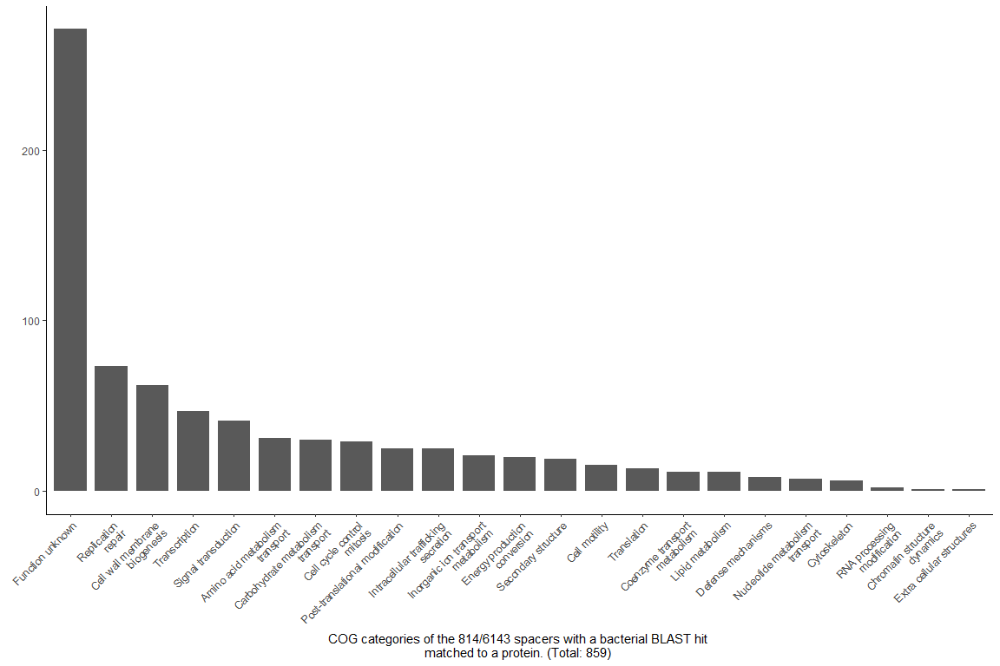<!-- -->

``` r
# Some verifications

sum( cog_categories_sum_T$n) # 859 
```

    ## [1] 769

\#———————————————-

# BLAST cas types

``` r
# Count arrays per type
overall_array_type_count <- full_join( CRISPRscope_tbl_26 %>% select(ArrayID, Cas_subtype) %>% distinct() %>% 
             select(Cas_subtype) %>% count(Cas_subtype),
           CRISPRscope_meta_tbl_filtered %>% select(SRA_ID, GID, Subtype) %>% distinct() %>% 
             select(Subtype) %>% count(Subtype) %>% dplyr::rename(Cas_subtype = Subtype),
           by = c("Cas_subtype")) %>% 
  replace_na(list(n.x = 0, n.y = 0)) %>% 
  mutate(n = rowSums(select(.,n.x, n.y))) %>% 
  select(Cas_subtype, n)


# Overall cas type hits
clst_cas <- bind_rows(CRISPRscope_tbl_26 %>% select(cluster_spacer_identity, Cas_subtype) %>% distinct() %>% 
                        dplyr::rename(clst = cluster_spacer_identity, cas = Cas_subtype),
                      CRISPRscope_meta_tbl_filtered %>% select(cluster_spacer_identity, Subtype) %>% distinct() %>% 
                        dplyr::rename(clst = cluster_spacer_identity, cas = Subtype)) %>% distinct() %>% 
  left_join(overall_array_type_count, by = c("cas" = "Cas_subtype")) %>% 
  mutate(cas_count = paste(cas, " (", n, ")", sep="")) %>% 
  select(clst, cas_count) %>% dplyr::rename(cas = cas_count)


BLAST_castype_hit_plot <- clst_cas %>% left_join(CRISPRscope_blast_cluster_hit_type_2, by = c("clst" = "cluster")) %>% mutate(final_hit = replace_na(final_hit, "No hit")) %>% 
  filter(!final_hit == "CRISPR") %>% 
  
  group_by(final_hit) %>% 
  count(cas) %>% 
  ungroup() %>% 
  group_by(cas) %>% 
  mutate(tot = sum(n)) %>% 
  mutate(fraction = n/tot) %>% 
  mutate(final_hit = factor(final_hit, levels = c("No hit", "Bacterial", "Plasmid", "Viral"))) %>% 
  ggplot(aes(x=cas, y=fraction, fill=final_hit)) +
  geom_col(position = "stack") +
  scale_y_continuous(labels = scales::percent_format())+
  scale_fill_manual(values=c("#afd2e9ff", "#9d96b8ff", "#9d6eb8ff", "#9a7197ff")) +
  #facet_wrap(~final_hit)+  
  theme_bw() +
  theme(
    axis.text.y = element_text(color = "black"),
    axis.text.x = element_text(color = "black", angle = 45, hjust=1),
    axis.title.x = element_text(color = "black"),
    axis.title.y = element_text(color = "black"),
    axis.line.y.left = element_line(color = "black"),
    axis.line.y.right = element_line(color = "black"),
    axis.line.x = element_line(color = "black"),
    axis.ticks = element_line(color = "black"),
    plot.title = element_text(color = "black"),
    panel.background = element_rect(fill = "white", colour = NA),
    plot.background = element_rect(fill = "white", colour = NA),
    legend.position = "right",
    legend.background = element_rect(fill = "white", colour = NA),
    legend.box.background = element_rect(fill = "white", colour = NA),
    legend.text = element_text(color = "black"),
    legend.title = element_blank(),
    plot.margin = unit(c(1, 1, 1, 1), "cm"),
    panel.grid.major = element_line(color = "grey", size = 0.1),
    panel.grid.minor = element_line(color = "grey", size = 0.1),
    strip.background = element_rect(color = "black", fill = "white",size = 0.5,linetype = "solid" ),
    strip.text = element_text(color = "Black")
  )


ggsave(
  plot = BLAST_castype_hit_plot,
  file = paste(google_drive_folder,"/BLAST_castype_hit_plot_stack.pdf", sep=""),
  bg = "transparent",
  width = 25,
  height = 20,
  units = "cm",
  dpi = 800
)

BLAST_castype_hit_plot
```

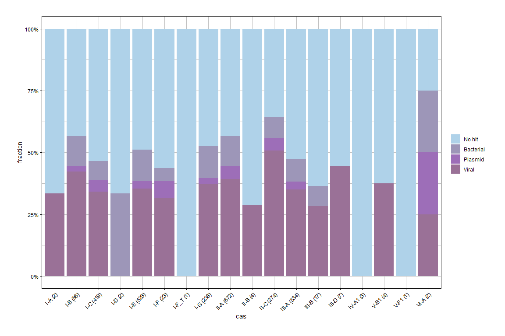<!-- -->

average plasmid per subtype

``` r
d <- clst_cas %>% left_join(CRISPRscope_blast_cluster_hit_type_2, by = c("clst" = "cluster")) %>% mutate(final_hit = replace_na(final_hit, "No hit")) 

d %>% count(cas, final_hit) %>% group_by(cas) %>% mutate(total = sum(n)) %>% group_by(final_hit) %>% summarise(average_nbspacer_type = mean(n/total), sd_nbspacer_type = sd(n/total))
```

    ## # A tibble: 5 x 3
    ##   final_hit average_nbspacer_type sd_nbspacer_type
    ##   <chr>                     <dbl>            <dbl>
    ## 1 Bacterial                0.120            0.0805
    ## 2 CRISPR                   0.106            0.0542
    ## 3 No hit                   0.577            0.231 
    ## 4 Plasmid                  0.0555           0.0561
    ## 5 Viral                    0.330            0.0709

\#TODO relative abundance of y axis. Per type. stacked barchart / all in
one figure !

\#———————————————- \# TODO BLAST bacterial check crisprs

For the bacterial hits, are they mapping to the actual same region of
the genome as it comes from the same database

``` r
#TODO check if only ncbi spacers match ncbi bacteria

# Blast raw results
CRISPRblast_nt_2 %>%  select(qseqid, sseqid, database, stitle)
```

    ## # A tibble: 32,521 x 4
    ##    qseqid sseqid             database stitle                                    
    ##     <dbl> <chr>              <chr>    <chr>                                     
    ##  1      0 gi|1851539906|gb|~ nt       Streptococcus thermophilus strain CS18 ch~
    ##  2      1 gi|1605474704|gb|~ nt       Streptococcus thermophilus strain STCH_33~
    ##  3      2 gi|134103885|gb|E~ nt       Streptococcus thermophilus isolate WTphi8~
    ##  4      3 gi|134103908|gb|E~ nt       Streptococcus thermophilus strain DGCC798~
    ##  5      4 gi|1151245825|gb|~ nt       Streptococcus thermophilus strain APC151,~
    ##  6      5 gi|1418348883|emb~ nt       Streptococcus thermophilus strain N4L gen~
    ##  7      6 gi|339277069|emb|~ nt       Streptococcus thermophilus JIM 8232 compl~
    ##  8      7 gi|1868768375|emb~ nt       Streptococcus thermophilus isolate STH_CI~
    ##  9      8 gi|1851539906|gb|~ nt       Streptococcus thermophilus strain CS18 ch~
    ## 10      9 gi|1826980942|gb|~ nt       Streptococcus thermophilus strain ST64987~
    ## # ... with 32,511 more rows

``` r
CRISPRscope_tbl_26 %>% select(cluster_spacer_identity, Organism, Strain )
```

    ## # A tibble: 50,955 x 3
    ##    cluster_spacer_identity Organism                 Strain         
    ##                      <dbl> <chr>                    <chr>          
    ##  1                    9902 Bifidobacterium_animalis GCF.004135895.1
    ##  2                    9903 Bifidobacterium_animalis GCF.004135895.1
    ##  3                    5321 Bifidobacterium_animalis GCF.004135895.1
    ##  4                    5322 Bifidobacterium_animalis GCF.004135895.1
    ##  5                    5323 Bifidobacterium_animalis GCF.004135895.1
    ##  6                    1058 Bifidobacterium_animalis GCF.004135895.1
    ##  7                    1585 Bifidobacterium_animalis GCF.004135895.1
    ##  8                    5324 Bifidobacterium_animalis GCF.004135895.1
    ##  9                    5325 Bifidobacterium_animalis GCF.004135895.1
    ## 10                    9904 Bifidobacterium_animalis GCF.004135895.1
    ## # ... with 50,945 more rows

``` r
#
```

\#———————————————-

# BLAST match Edit Distances

Percent or histogram

xx% of the matched sequences are identical and then… bla bla down to 70%
pident. \#\#
<p>

pident

``` r
bind_rows(CRISPRblast_IMGVR_2, CRISPRblast_nt_2, CRISPRblast_PLSDB_2) %>% 
  filter(qseqid %in% CRISPRscope_blast_cluster_hit_type_2$cluster) %>% ggplot(aes(x=pident)) + geom_bar(width = 0.1)
```

    ## Warning: position_stack requires non-overlapping x intervals

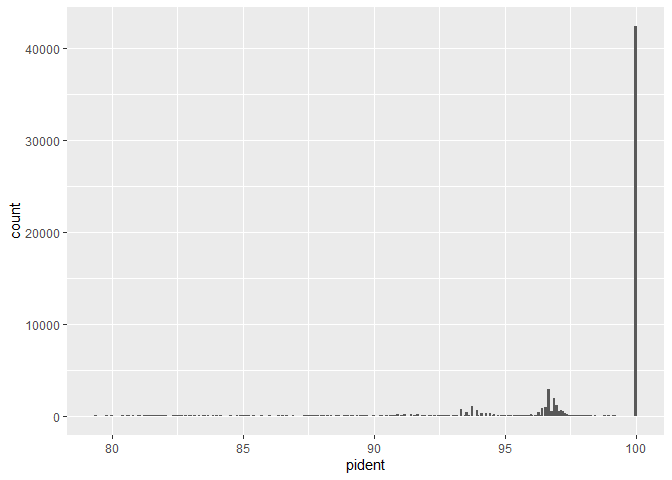<!-- -->

``` r
bind_rows(CRISPRblast_IMGVR_2, CRISPRblast_nt_2, CRISPRblast_PLSDB_2) %>% 
  filter(qseqid %in% CRISPRscope_blast_cluster_hit_type_2$cluster) %>% ggplot(aes(x=mismatch)) + geom_bar(width = 0.3)
```

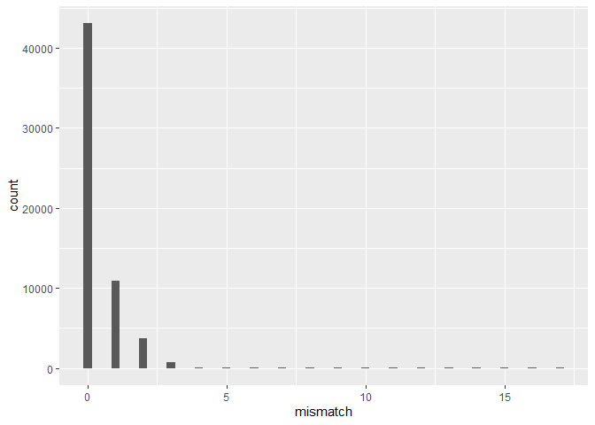<!-- -->

``` r
bind_rows(CRISPRblast_IMGVR_2, CRISPRblast_nt_2, CRISPRblast_PLSDB_2) %>% 
  filter(qseqid %in% CRISPRscope_blast_cluster_hit_type_2$cluster) %>% summarise(min_mismatch = min(mismatch), 
                                                                                 max_mismatch = max(mismatch), 
                                                                                 mean = mean(mismatch), 
                                                                                 sd = sd(mismatch))
```

    ## # A tibble: 1 x 4
    ##   min_mismatch max_mismatch  mean    sd
    ##          <dbl>        <dbl> <dbl> <dbl>
    ## 1            0           17 0.378 0.821

# BLAST IMGVR metadata

``` r
IMGVR_all_Sequence_information <- read_delim(paste(data_folder, "/DB/IMGVR/IMG_VR_2020-10-12_5.1/IMGVR_all_Sequence_information.tsv", sep=""), 
    "\t", escape_double = FALSE, trim_ws = TRUE)
```

    ## Rows: 2332702 Columns: 18

    ## -- Column specification --------------------------------------------------------
    ## Delimiter: "\t"
    ## chr (16): ## UViG, Taxon_oid, Scaffold_oid, Coordinates ('whole' if the UViG...
    ## dbl  (2): Length, Estimated completeness

    ## 
    ## i Use `spec()` to retrieve the full column specification for this data.
    ## i Specify the column types or set `show_col_types = FALSE` to quiet this message.

``` r
IMGVR_all_Host_information <- read_delim(paste(data_folder, "/DB/IMGVR/IMG_VR_2020-10-12_5.1/IMGVR_all_Host_information.tsv", sep=""), 
    "\t", escape_double = FALSE, trim_ws = TRUE)
```

    ## Rows: 2053759 Columns: 5

    ## -- Column specification --------------------------------------------------------
    ## Delimiter: "\t"
    ## chr (5): ## UViG, Prediction method, Host taxonomy prediction, Host genome;s...

    ## 
    ## i Use `spec()` to retrieve the full column specification for this data.
    ## i Specify the column types or set `show_col_types = FALSE` to quiet this message.

``` r
all_hits <- bind_rows(CRISPRblast_IMGVR_2, CRISPRblast_nt_2, CRISPRblast_PLSDB_2) %>% 
  filter(qseqid %in% CRISPRscope_blast_cluster_hit_type_2$cluster) %>% 
  filter(database == "IMGVR") # Maybe missin gorigin (gen meta)

# all_hits <- bind_rows(genome_blast_hits %>% mutate(origin = "genomic"),
#                       metagenome_blast_hits %>% mutate(origin = "metagenomic")) %>% 
#   filter(blast_database == "IMGVR") %>% 
#   select(qseqid, sseqid, pident, origin, )
#  

joined_IMGVR <- all_hits %>% 
  mutate(sseqid = str_extract(sseqid, "^[^|]+")) %>% 
  left_join(IMGVR_all_Sequence_information, by = c("sseqid" = "## UViG")) %>% 
  select(qseqid,sseqid, pident, Taxon_oid, Scaffold_oid, `Coordinates ('whole' if the UViG is the entire contig)`,
         `Ecosystem classification`, vOTU, Length, Topology, `Estimated completeness`, `MIUViG quality`, 
         `Gene content (total genes;cds;tRNA;VPF percentage)`, `Taxonomic classification`, 
         `Taxonomic classification method`, `Sequence origin (doi)`) %>% 
  distinct() %>% 
  left_join(IMGVR_all_Host_information, by = c("sseqid" = "## UViG"))
  
write.csv(joined_IMGVR, file = paste(data_folder, "/EXPORT/IMGVR_Hits_join.csv", sep=""), row.names = F)
```

``` r
joined_IMGVR <- read.csv( file = paste(data_folder, "/EXPORT/IMGVR_Hits_join.csv", sep=""))
```

# Fraction of vOTU per species and strain

From Vincent:

I have a challenging task, that aims at answering if the bacteria CRISPR
spacers are specialised (target only few phages but alot for every
phage) or if they diversify (many different spacers but only a handful
for every phage). It would mean alot of IMG data parsing.

these are the two files that I created on the IMG side. 1.
num\_of\_vOTUs= is a counts of vOTUs per taxon file 2.
UVIG\_match\_table= is a table where every UVIG can be assigned to a
vOTU

what would be important to know is now from every genome/metagenome if
it has a map to every UCIG. the dataframe would look like this for
genome 1. species 2. strain 3. UVIG 4. map or not (0/1) …I think

``` r
library(patchwork)
# num_of_vOTUs_per_taxon <- read_csv(paste(data_folder, "/IMPORT/IMG_Hits/num_of_vOTUs_per_taxon.csv", sep = ""))

# UViG_match_table <- read_csv(paste(data_folder, "/IMPORT/IMG_Hits/UViG_match_table.csv", sep = ""))


# Hits in IMGVR -> sequences informations 
# Contains cluster_spacer_id and the matching information in IMGVR

joined_IMGVR <- read.csv( file = paste(data_folder, "/EXPORT/IMGVR_Hits_join.csv", sep=""))


# Organism - Votu : For each organism, the votu's associated. 

asdf <- CRISPRscope_tbl_26 %>% select(Organism, Strain, cluster_spacer_identity) %>% 
  left_join(joined_IMGVR %>% select(qseqid, vOTU) %>% distinct(), by = c("cluster_spacer_identity" = "qseqid")) %>% 
  arrange(cluster_spacer_identity) %>% 
  distinct() %>% 
  drop_na() %>% select(Organism, vOTU) %>% distinct() %>% mutate(Organism = gsub("_", " ", Organism))


# Without the distinct, we keep the record of the number of spacers. 
# Organism - Strain - cluster_spacer_identity - vOTU (with duplicates)
CRISPRscope_tbl_26 %>% select(Organism, Strain, cluster_spacer_identity) %>% 
  left_join(joined_IMGVR %>% select(qseqid, vOTU) %>% distinct(), by = c("cluster_spacer_identity" = "qseqid")) %>% 
  arrange(cluster_spacer_identity) %>% 
  drop_na() %>% mutate(Organism = gsub("_", " ", Organism)) %>% 
  write_csv(file = paste(data_folder, "/EXPORT/fraction_votu_per_strain_duplicates.csv", sep=""), col_names = T)


  
# Host - vOTU from IMGVR
# IMGBR sequence and host information files, merged
# and subsetted for our 26 species (host) 

vOTUS_in_which_species <- read_csv(paste(data_folder, "/IMPORT/IMG_Hits/vOTUS_in_which_species.csv", sep=""))
```

    ## New names:
    ## * `` -> ...1

    ## Rows: 1436 Columns: 3

    ## -- Column specification --------------------------------------------------------
    ## Delimiter: ","
    ## chr (2): vOTU, taxon
    ## dbl (1): ...1

    ## 
    ## i Use `spec()` to retrieve the full column specification for this data.
    ## i Specify the column types or set `show_col_types = FALSE` to quiet this message.

``` r
vOTUS_in_which_species <- vOTUS_in_which_species %>% mutate(Organism = taxon) %>% select(Organism, vOTU)


# Totals

total_votus_per_species <-  rbind(asdf, vOTUS_in_which_species) %>% distinct() %>% group_by(Organism) %>% summarise(n_votus_per_total = n())

genomic_votu_per_species <- asdf  %>% distinct() %>% group_by(Organism) %>% summarise(n_votus_per_org = n())


# Pan immunity
fraction_votu_per_species <- left_join(total_votus_per_species, genomic_votu_per_species, by=c("Organism")) %>% mutate(fraction = 100*n_votus_per_org/n_votus_per_total)

# fraction_votu_per_species %>% write_csv(file = paste(data_folder, "/EXPORT/fraction_votu_per_species.csv", sep=""), col_names = T)


# per strain
fraction_votu_per_strain <- CRISPRscope_tbl_26 %>% select(Organism, Strain, cluster_spacer_identity) %>% 
  left_join(joined_IMGVR %>% select(qseqid, vOTU) %>% distinct(), by = c("cluster_spacer_identity" = "qseqid")) %>% 
  arrange(cluster_spacer_identity) %>% 
  distinct() %>% select(-cluster_spacer_identity) %>% 
  distinct() %>% 
  drop_na() %>% group_by(Organism, Strain) %>% 
  summarise(nb_votus_per_strain = n()) %>% 
  mutate(Organism = gsub("_", " ", Organism)) %>% 
  left_join(total_votus_per_species, by=c("Organism")) %>% 
  mutate(fraction = 100*nb_votus_per_strain/n_votus_per_total) 
```

    ## `summarise()` has grouped output by 'Organism'. You can override using the `.groups` argument.

``` r
# fraction_votu_per_strain %>% write_csv(file = paste(data_folder, "/EXPORT/fraction_votu_per_strain.csv", sep=""), col_names = T)
```

\#\#
<p>

Fraction vOTUs per Organisms/Strains

``` r
fraction_votu_per_species <- read_csv(file = paste(data_folder, "/EXPORT/fraction_votu_per_species.csv", sep=""), col_names = T)
```

    ## Rows: 21 Columns: 4

    ## -- Column specification --------------------------------------------------------
    ## Delimiter: ","
    ## chr (1): Organism
    ## dbl (3): n_votus_per_total, n_votus_per_org, fraction

    ## 
    ## i Use `spec()` to retrieve the full column specification for this data.
    ## i Specify the column types or set `show_col_types = FALSE` to quiet this message.

``` r
fraction_votu_per_strain <- read_csv(file = paste(data_folder, "/EXPORT/fraction_votu_per_strain.csv", sep=""), col_names = T)
```

    ## Rows: 1132 Columns: 5

    ## -- Column specification --------------------------------------------------------
    ## Delimiter: ","
    ## chr (2): Organism, Strain
    ## dbl (3): nb_votus_per_strain, n_votus_per_total, fraction

    ## 
    ## i Use `spec()` to retrieve the full column specification for this data.
    ## i Specify the column types or set `show_col_types = FALSE` to quiet this message.

``` r
#-----------

aaaplt <- fraction_votu_per_species %>% ggplot(aes(x=Organism, y=fraction)) +
  geom_bar(stat = "identity") +
  theme_classic() +
  ylim(0,100) +
  theme(axis.text.x = element_text(angle = 45, hjust = 1) )+ coord_flip()


# How many of these votus are targeted by one single strain. 


bbbplt <- fraction_votu_per_strain %>% 
  ggplot(aes(x=Organism, y=fraction)) +
  geom_boxplot()+
  ylim(0,100) +
  theme_classic() +
  xlab("")+
  theme(axis.text.x = element_text(angle = 45, hjust = 1) ) + coord_flip()


aaaplt + bbbplt +
  plot_layout(widths =  c(1,1))
```

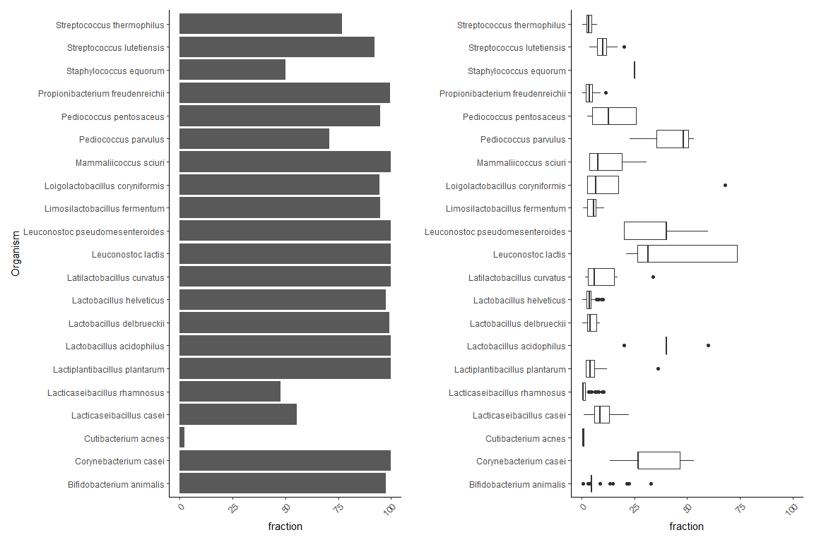<!-- -->

``` r
# 
```

Ce strains are highly specalized and target only a small fraction of the
vOTUS

numbers: strains target on average xx votu

``` r
fraction_votu_per_strain %>% summarise(mean_votu = mean(nb_votus_per_strain)) #10.82332
```

    ## # A tibble: 1 x 1
    ##   mean_votu
    ##       <dbl>
    ## 1      10.8

How many spacers does every strain have against one VOTU

``` r
CRISPRscope_tbl_26 %>% select(Organism, Strain, cluster_spacer_identity) %>% 
  left_join(joined_IMGVR %>% select(qseqid, vOTU) %>% distinct(), by = c("cluster_spacer_identity" = "qseqid")) %>% 
  arrange(cluster_spacer_identity) %>% 
  drop_na() %>% group_by(Organism, Strain, vOTU) %>% summarise(count_of_spacers = n()) %>% 
  ggplot(aes(x=count_of_spacers)) +
  geom_histogram()
```

    ## `summarise()` has grouped output by 'Organism', 'Strain'. You can override using the `.groups` argument.

    ## `stat_bin()` using `bins = 30`. Pick better value with `binwidth`.

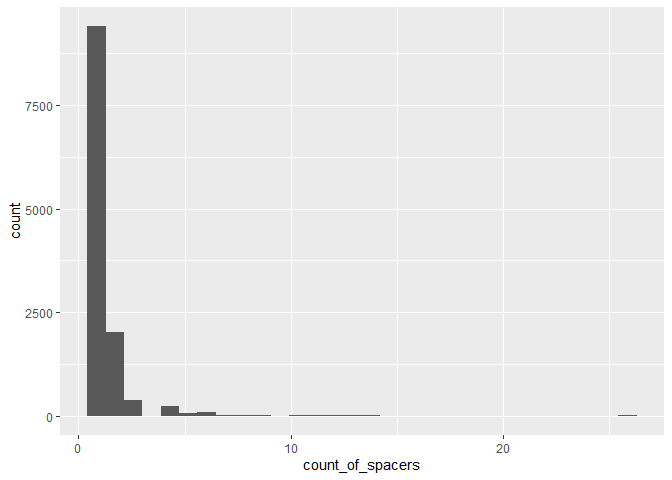<!-- -->

# Fractions of vOTU - metagenomes

## main

``` r
#

joined_IMGVR_hosts <- joined_IMGVR %>%
  separate(Host.taxonomy.prediction, into = c("1","2","3","4","5","6","HostSpecies"), sep=";") %>%
  select(qseqid, vOTU, HostSpecies)


# Metagenomic votus targeted
# Project - votu

megagenomic_project_votu <- CRISPRscope_meta_tbl_filtered %>% select(ProjectID, SRA_ID, cluster_spacer_identity) %>% 
  renameSamples() %>% 
  left_join(joined_IMGVR %>%  select(qseqid, vOTU) %>% distinct(), by = c("cluster_spacer_identity" = "qseqid")) %>% 
  arrange(cluster_spacer_identity) %>% 
  distinct() %>% 
  drop_na() %>% select(ProjectID, vOTU) %>% distinct() %>% arrange(ProjectID)

# Same at sample level
megagenomic_project_sample_votu <- CRISPRscope_meta_tbl_filtered %>% select(ProjectID, SRA_ID, cluster_spacer_identity) %>% 
  renameSamples() %>% 
  left_join(joined_IMGVR %>%  select(qseqid, vOTU) %>% distinct(), by = c("cluster_spacer_identity" = "qseqid")) %>% 
  arrange(cluster_spacer_identity) %>% 
  distinct() %>% 
  drop_na() %>% select(ProjectID, SRA_ID, vOTU) %>% distinct() %>% arrange(ProjectID)

# All available Sterm votu
# Organism - votu

votu_in_which_species_sterm <- vOTUS_in_which_species %>% filter(Organism == "Streptococcus thermophilus")

votu_in_which_species_sterm.list <- votu_in_which_species_sterm$vOTU


megagenomic_project_votu %>% group_by(ProjectID) %>% summarise(nb_votu_per_project = n())
```

    ## # A tibble: 4 x 2
    ##   ProjectID             nb_votu_per_project
    ##   <chr>                               <int>
    ## 1 Pasolli et al. 2020                   355
    ## 2 Swiss raclette                        388
    ## 3 Swiss starter culture                 506
    ## 4 Walsh et al. 2020                     294

``` r
megagenomic_project_votu %>% mutate(sterm = ifelse(vOTU %in% votu_in_which_species_sterm$vOTU, "sterm", "unknown")) 
```

    ## # A tibble: 1,543 x 3
    ##    ProjectID           vOTU        sterm  
    ##    <chr>               <chr>       <chr>  
    ##  1 Pasolli et al. 2020 Sg_117111   unknown
    ##  2 Pasolli et al. 2020 Sg_065991   unknown
    ##  3 Pasolli et al. 2020 Sg_033392   unknown
    ##  4 Pasolli et al. 2020 Sg_160195   sterm  
    ##  5 Pasolli et al. 2020 Sg_313517   sterm  
    ##  6 Pasolli et al. 2020 Sg_592649   unknown
    ##  7 Pasolli et al. 2020 Sg_107964   unknown
    ##  8 Pasolli et al. 2020 Sg_158064   unknown
    ##  9 Pasolli et al. 2020 Sg_239527   sterm  
    ## 10 Pasolli et al. 2020 vOTU_108347 unknown
    ## # ... with 1,533 more rows

``` r
megagenomic_project_votu %>% mutate(sterm = ifelse(vOTU %in% votu_in_which_species_sterm$vOTU, "sterm", "unknown")) %>% group_by(ProjectID) %>% 
  summarise(total_votu = n()) 
```

    ## # A tibble: 4 x 2
    ##   ProjectID             total_votu
    ##   <chr>                      <int>
    ## 1 Pasolli et al. 2020          355
    ## 2 Swiss raclette               388
    ## 3 Swiss starter culture        506
    ## 4 Walsh et al. 2020            294

``` r
# Per project
meta_votu_project <- megagenomic_project_votu %>% mutate(sterm = ifelse(vOTU %in% votu_in_which_species_sterm$vOTU, "sterm", "unknown")) %>% group_by(ProjectID, sterm) %>% 
  summarise(total_votu_sterm_project = n()) %>% filter(sterm == "sterm") %>% 
  select(-sterm) %>% mutate(total_sterm_in_imgvr = length(votu_in_which_species_sterm$vOTU)) %>% 
  mutate(fraction_project = 100* total_votu_sterm_project/total_sterm_in_imgvr) 
```

    ## `summarise()` has grouped output by 'ProjectID'. You can override using the `.groups` argument.

``` r
# Per samples
# megagenomic_project_sample_votu %>% mutate(sterm = ifelse(vOTU %in% votu_in_which_species_sterm$vOTU, "sterm", "unknown")) %>% 
#   group_by(ProjectID, SRA_ID, sterm) %>% 
#   summarise(total_votu_sterm_sample = n()) %>% 
#   filter(sterm == "sterm") %>% 
#   select(-sterm) %>% mutate(total_sterm_in_imgvr = length(votu_in_which_species_sterm$vOTU)) %>% 
#   mutate(fraction_sample = 100* total_votu_sterm_sample/total_sterm_in_imgvr) %>% 
#   left_join(meta_votu_project %>% select(ProjectID, total_votu_sterm_project, fraction_project), by = c("ProjectID")) %>% 
#   select(ProjectID, SRA_ID, total_sterm_in_imgvr, total_votu_sterm_project, fraction_project, total_votu_sterm_sample, fraction_sample) %>% 
#   write_csv(file = paste(data_folder, "/EXPORT/VOTUs_metagenomes_per_sample.csv", sep=""))


  # To have 'per project' add %>% select(ProjectID, total_sterm_in_imgvr, total_votu_sterm_project, fraction_project) %>% distinct()

# metagenomic_votu_sterm = read_csv(file = paste(data_folder, "/EXPORT/VOTUs_metagenomes_per_sample.csv", sep=""))


# How many votu does one spacer target
joined_IMGVR %>% select(qseqid, vOTU) %>% distinct() %>%
  group_by(qseqid) %>% 
  summarise(n_target_votu = n()) %>% 
  count(n_target_votu)
```

    ## # A tibble: 1 x 2
    ##   n_target_votu     n
    ##           <int> <int>
    ## 1             1 22633

## Focus on S.therm

``` r
# Focus on S. therm.

votu_sterm_projects <- CRISPRscope_meta_tbl_filtered %>% select(ProjectID, SRA_ID, cluster_spacer_identity) %>% 
  left_join(joined_IMGVR_hosts %>% 
              filter(HostSpecies == "Streptococcus thermophilus") %>% 
              distinct(), 
            by = c("cluster_spacer_identity" = "qseqid")) %>% 
  arrange(cluster_spacer_identity) %>% 
  distinct() %>% 
  drop_na() %>% 
  renameSamples() %>% 
  left_join(joined_IMGVR %>% select(vOTU, Taxonomic.classification) %>% distinct(), by=c("vOTU")) %>% 
  distinct()

# Total sterm votu targeted by our metagenomes: 135
votu_sterm_projects %>% select(vOTU) %>% distinct()
```

    ## # A tibble: 135 x 1
    ##    vOTU       
    ##    <chr>      
    ##  1 Sg_144542  
    ##  2 vOTU_287196
    ##  3 Sg_259035  
    ##  4 Sg_100026  
    ##  5 Sg_105845  
    ##  6 Sg_147381  
    ##  7 Sg_152738  
    ##  8 Sg_147316  
    ##  9 Sg_131958  
    ## 10 Sg_160195  
    ## # ... with 125 more rows

``` r
# Total sterm votu in IMGVR: 225
joined_IMGVR_hosts %>% 
  filter(HostSpecies == "Streptococcus thermophilus") %>% 
  select(vOTU) %>% 
  distinct()
```

    ##            vOTU
    ## 1     Sg_144123
    ## 2     Sg_149576
    ## 3   vOTU_138357
    ## 4   vOTU_150704
    ## 5     Sg_144542
    ## 6   vOTU_287196
    ## 7     Sg_152738
    ## 8     Sg_121458
    ## 9     Sg_133328
    ## 10    Sg_127795
    ## 11    Sg_089890
    ## 12    Sg_125624
    ## 13    Sg_259035
    ## 14    Sg_100026
    ## 15    Sg_096482
    ## 16    Sg_093307
    ## 17    Sg_105845
    ## 18    Sg_147381
    ## 19    Sg_143720
    ## 20    Sg_147316
    ## 21    Sg_131958
    ## 22    Sg_067728
    ## 23    Sg_108867
    ## 24    Sg_160195
    ## 25    Sg_313517
    ## 26    Sg_115233
    ## 27  vOTU_138159
    ## 28  vOTU_114005
    ## 29    Sg_136612
    ## 30  vOTU_161597
    ## 31    Sg_154182
    ## 32    Sg_324703
    ## 33    Sg_134365
    ## 34    Sg_145213
    ## 35    Sg_146561
    ## 36    Sg_157434
    ## 37    Sg_239527
    ## 38  vOTU_101714
    ## 39  vOTU_157002
    ## 40    Sg_138743
    ## 41    Sg_175955
    ## 42    Sg_141825
    ## 43    Sg_147325
    ## 44  vOTU_117203
    ## 45    Sg_161463
    ## 46  vOTU_161934
    ## 47    Sg_137960
    ## 48    Sg_151309
    ## 49    Sg_273754
    ## 50    Sg_128797
    ## 51    Sg_108032
    ## 52  vOTU_136346
    ## 53    Sg_139207
    ## 54    Sg_159209
    ## 55    Sg_132300
    ## 56    Sg_152044
    ## 57    Sg_143864
    ## 58  vOTU_198665
    ## 59  vOTU_114567
    ## 60    Sg_162943
    ## 61    Sg_163805
    ## 62    Sg_111293
    ## 63    Sg_089384
    ## 64    Sg_220696
    ## 65    Sg_123237
    ## 66    Sg_104481
    ## 67  vOTU_116605
    ## 68    Sg_181568
    ## 69    Sg_099174
    ## 70  vOTU_300726
    ## 71    Sg_140427
    ## 72    Sg_157823
    ## 73  vOTU_126827
    ## 74    Sg_467364
    ## 75    Sg_149132
    ## 76  vOTU_149305
    ## 77    Sg_127838
    ## 78    Sg_155932
    ## 79    Sg_158504
    ## 80    Sg_160891
    ## 81  vOTU_131872
    ## 82  vOTU_109660
    ## 83    Sg_822244
    ## 84    Sg_244846
    ## 85    Sg_266900
    ## 86    Sg_243748
    ## 87    Sg_130334
    ## 88    Sg_097600
    ## 89    Sg_142707
    ## 90    Sg_145884
    ## 91    Sg_105255
    ## 92  vOTU_118861
    ## 93    Sg_083813
    ## 94  vOTU_854766
    ## 95  vOTU_141698
    ## 96    Sg_114605
    ## 97    Sg_108387
    ## 98    Sg_096559
    ## 99    Sg_097927
    ## 100   Sg_133310
    ## 101   Sg_118337
    ## 102   Sg_667269
    ## 103   Sg_077650
    ## 104   Sg_107897
    ## 105   Sg_164415
    ## 106   Sg_146919
    ## 107 vOTU_278579
    ## 108   Sg_110952
    ## 109   Sg_134672
    ## 110 vOTU_134865
    ## 111   Sg_223750
    ## 112 vOTU_081838
    ## 113 vOTU_127060
    ## 114   Sg_104760
    ## 115   Sg_217476
    ## 116 vOTU_108208
    ## 117   Sg_111199
    ## 118   Sg_195484
    ## 119   Sg_143138
    ## 120   Sg_156105
    ## 121   Sg_148003
    ## 122   Sg_147988
    ## 123   Sg_123812
    ## 124   Sg_084479
    ## 125   Sg_151925
    ## 126 vOTU_150606
    ## 127   Sg_147738
    ## 128   Sg_088374
    ## 129   Sg_125572
    ## 130   Sg_309182
    ## 131 vOTU_475473
    ## 132 vOTU_106595
    ## 133   Sg_108753
    ## 134 vOTU_207996
    ## 135   Sg_110993
    ## 136 vOTU_121109
    ## 137   Sg_833746
    ## 138   Sg_079595
    ## 139   Sg_148411
    ## 140 vOTU_061318
    ## 141 vOTU_120285
    ## 142   Sg_911175
    ## 143   Sg_150660
    ## 144 vOTU_149668
    ## 145   Sg_262865
    ## 146 vOTU_229618
    ## 147   Sg_133676
    ## 148   Sg_185200
    ## 149   Sg_189322
    ## 150   Sg_119062
    ## 151   Sg_198686
    ## 152   Sg_239613
    ## 153   Sg_072967
    ## 154   Sg_123325
    ## 155 vOTU_091286
    ## 156   Sg_119523
    ## 157   Sg_326631
    ## 158 vOTU_128883
    ## 159   Sg_115152
    ## 160   Sg_112819
    ## 161   Sg_153112
    ## 162 vOTU_230319
    ## 163   Sg_259973
    ## 164   Sg_273672
    ## 165 vOTU_087073
    ## 166   Sg_189413
    ## 167 vOTU_128390
    ## 168 vOTU_078702
    ## 169   Sg_101153
    ## 170   Sg_255030
    ## 171   Sg_182074
    ## 172   Sg_142439
    ## 173   Sg_694714
    ## 174   Sg_116899
    ## 175   Sg_111538
    ## 176 vOTU_184013
    ## 177 vOTU_174709
    ## 178   Sg_681664
    ## 179   Sg_191817
    ## 180   Sg_874325
    ## 181   Sg_240189
    ## 182   Sg_161111
    ## 183   Sg_156345
    ## 184   Sg_156894
    ## 185   Sg_135118
    ## 186 vOTU_535228
    ## 187   Sg_194474
    ## 188   Sg_167423
    ## 189 vOTU_178785
    ## 190   Sg_144851
    ## 191   Sg_293352
    ## 192 vOTU_237662
    ## 193   Sg_133297
    ## 194 vOTU_119847
    ## 195 vOTU_260325
    ## 196   Sg_147418
    ## 197   Sg_150791
    ## 198   Sg_140067
    ## 199   Sg_172857
    ## 200   Sg_153679
    ## 201   Sg_247441
    ## 202   Sg_193694
    ## 203   Sg_208977
    ## 204   Sg_161588
    ## 205   Sg_168625
    ## 206   Sg_118466
    ## 207   Sg_152283
    ## 208   Sg_870924
    ## 209   Sg_112257
    ## 210   Sg_090553
    ## 211 vOTU_144816
    ## 212 vOTU_111110
    ## 213   Sg_280987
    ## 214   Sg_179561
    ## 215   Sg_175489
    ## 216   Sg_149210
    ## 217   Sg_235866
    ## 218   Sg_225603
    ## 219   Sg_127098
    ## 220 vOTU_139550
    ## 221   Sg_115804
    ## 222   Sg_110629
    ## 223   Sg_153684
    ## 224   Sg_274253
    ## 225   Sg_178991

``` r
# Same - without filter - to file
# CRISPRscope_meta_tbl_filtered %>% select(ProjectID, SRA_ID, cluster_spacer_identity) %>% 
#   left_join(joined_IMGVR_hosts %>% 
#               distinct(), 
#             by = c("cluster_spacer_identity" = "qseqid")) %>% 
#   arrange(cluster_spacer_identity) %>% 
#   distinct() %>% 
#   drop_na() %>% 
#   renameSamples() %>% 
#   left_join(joined_IMGVR %>% select(vOTU, Taxonomic.classification) %>% distinct(), by=c("vOTU")) %>% 
#   distinct() %>% write_csv(file = paste(data_folder, "/EXPORT/vOTU_per_sample.csv", sep=""))

# Total votu in IMG
#IMGVR_all_Sequence_information %>% select(vOTU) %>% distinct() # 935,362


# Total v otu for metagenomes
votu_total_projects <- CRISPRscope_meta_tbl_filtered %>% 
  left_join(joined_IMGVR %>% select(qseqid, vOTU), by=c("cluster_spacer_identity" = "qseqid")) %>% 
  renameSamples() %>% 
  group_by(ProjectID) %>% 
  summarise(ProjectID = ProjectID, total_spacers_with_IMG_hit = n(), total_votu = n_distinct(vOTU)) %>% distinct() 
```

    ## `summarise()` has grouped output by 'ProjectID'. You can override using the `.groups` argument.

``` r
# S.therm votus for metagenomes
votu_sterm_project_count <- votu_sterm_projects %>% group_by(ProjectID) %>% 
  summarise(ProjectID = ProjectID, total_spacers_with_sterm_IMG_hit = n(), total_distinct_sterm_votu = n_distinct(vOTU)) %>% distinct()
```

    ## `summarise()` has grouped output by 'ProjectID'. You can override using the `.groups` argument.

``` r
# Fraction of votu targeted by stherm in thermophilic samples
stermvotu <- votu_sterm_project_count %>% filter(ProjectID == "Walsh et al. 2020" | ProjectID == "Swiss starter culture" | ProjectID == "Swiss raclette")%>% 
  mutate(fraction = 100*(total_distinct_sterm_votu/total_spacers_with_sterm_IMG_hit)) 
mean(stermvotu$fraction) #19.03
```

    ## [1] 19.03716

``` r
sd(stermvotu$fraction)   # 8.35
```

    ## [1] 8.355633

``` r
# ...
asdf <- votu_sterm_project_count %>% 
  mutate(fraction = 100*(total_distinct_sterm_votu/total_spacers_with_sterm_IMG_hit)) 


sd(asdf$fraction)
```

    ## [1] 12.02792

``` r
#
meta_votu_sterm <- votu_total_projects %>% left_join(votu_sterm_project_count, by=c("ProjectID")) %>% 
  mutate(fraction = total_distinct_sterm_votu/total_spacers_with_sterm_IMG_hit)


# TODO: proportion of votu targeted by all projects and all samples

all_meta_votu <- CRISPRscope_meta_tbl_filtered %>% select(ProjectID, SRA_ID, cluster_spacer_identity) %>% 
  left_join(joined_IMGVR %>% select(qseqid, vOTU) %>% distinct(), by = c("cluster_spacer_identity" = "qseqid")) %>% 
  arrange(cluster_spacer_identity) %>% 
  distinct() %>% 
  drop_na() %>% select(vOTU) %>% distinct() # 1'088
```

\#———————————————- \# WIP VOTU and Cas subtypes

Get for each spacer cluster, which votu it targets.

``` r
# Cluster - Cas_type dict
spacer_cluster_subtype_dict <- bind_rows(CRISPRscope_tbl_26 %>% select(cluster_spacer_identity, Cas_subtype) %>% distinct(), 
          CRISPRscope_meta_tbl_filtered %>% select(cluster_spacer_identity, Subtype) %>% distinct() %>% dplyr::rename(Cas_subtype = Subtype)) %>% 
  distinct()

# All spacers with votu
sp_votu_casSubtype <- bind_rows(
  CRISPRscope_tbl_26 %>% select(Organism, Strain, cluster_spacer_identity) %>%
    left_join(
      joined_IMGVR %>% select(qseqid, vOTU, Taxonomic.classification) %>% distinct(),
      by = c("cluster_spacer_identity" = "qseqid")
    ) %>%
    arrange(cluster_spacer_identity) %>%
    drop_na() %>%
    select(cluster_spacer_identity, vOTU, Taxonomic.classification),
  
  CRISPRscope_meta_tbl_filtered %>% select(ProjectID, SRA_ID, cluster_spacer_identity) %>%
    renameSamples() %>%
    left_join(
      joined_IMGVR %>%  select(qseqid, vOTU, Taxonomic.classification) %>% distinct(),
      by = c("cluster_spacer_identity" = "qseqid")
    ) %>%
    arrange(cluster_spacer_identity) %>%
    distinct() %>%
    drop_na() %>%
    select(cluster_spacer_identity, vOTU, Taxonomic.classification)
) %>% distinct() %>% 
  left_join(spacer_cluster_subtype_dict, by=c("cluster_spacer_identity")) %>% 
  relocate(Cas_subtype, .after = vOTU)

# sp_votu_casSubtype %>% write_csv(file="./sp_votu_casSubtype.csv")
```

\#———————————————- \# DR-SP-DR vs BLAST hit fractions

``` r
CRISPR_spacer_coveragez <- read_csv(file = paste(data_folder, "/IMPORT_EXPORT/DR_SP_DR_results_zeroes.csv", sep=""), col_names = T)
```

    ## Rows: 3556344 Columns: 8

    ## -- Column specification --------------------------------------------------------
    ## Delimiter: ","
    ## chr (3): sample, spacer_name, bioproject
    ## dbl (5): spacer_cov, protospacer_cov, readNumber, spacer_CPM, protospacer_CPM

    ## 
    ## i Use `spec()` to retrieve the full column specification for this data.
    ## i Specify the column types or set `show_col_types = FALSE` to quiet this message.

``` r
# Firstly, get cluster number from Spacer ID

drspdr <- CRISPR_spacer_coveragez %>% left_join(CRISPRscope_meta_tbl_filtered %>% 
                                                 unite(spacer_name, ProjectID, SRA_ID, GID, SPID, Coverage, sep="_") %>% 
                                                 select(spacer_name, cluster_spacer_identity), by = c("spacer_name") )


# CheeseRaclette_1985_G15_SP3_2

CRISPRscope_meta_tbl_filtered %>% filter(GID == "G15")
```

    ## # A tibble: 141 x 22
    ##    ProjectID      SRA_ID   GID   SPID  Coverage spacer_seq        cluster_spacer
    ##    <chr>          <chr>    <chr> <chr> <chr>    <chr>                      <dbl>
    ##  1 PRJEB32768     ERR3340~ G15   SP6   10       ATAATTTGTCTCAAGC~           7477
    ##  2 PRJEB32768     ERR3340~ G15   SP25  7        TCACAGTTCTATTAGG~           7478
    ##  3 PRJEB32768     ERR3340~ G15   SP17  5        GGCGGGGGTCTCCGAC~           7479
    ##  4 PRJEB32768     ERR3340~ G15   SP12  4        TAAGTCTGTCCTAAGT~           7480
    ##  5 PRJEB32768     ERR3340~ G15   SP6   6        ATACACACAAAAAATG~           7508
    ##  6 PRJEB32768     ERR3340~ G15   SP16  4        TATCACACAAAAATGT~           7508
    ##  7 PRJEB32768     ERR3340~ G15   SP43  3        ATTCACACAAAAAATG~           7508
    ##  8 20201217_meta~ FSK_101~ G15   SP6   164      GTAGCTGGTGCAGCTT~           7101
    ##  9 20201217_meta~ FSK_101~ G15   SP255 13       ACAGCTGGTGCTGCTT~           7101
    ## 10 20201217_meta~ FSK_101~ G15   SP255 13       ACAGCTGGTGCTGCTT~           7101
    ## # ... with 131 more rows, and 15 more variables: cluster_spacer_identity <dbl>,
    ## #   identity_spacer_cluster <dbl>, repeat_seq <fct>, cluster_repeat <dbl>,
    ## #   cluster_repeat_identity <dbl>, identity_repeat_cluster <dbl>,
    ## #   spacer_length <int>, repeat_length <int>, read_count <dbl>,
    ## #   repeat_per_milread <dbl>, total_repeats <int>, spacer_per_milread <dbl>,
    ## #   total_spacers <int>, Subtype <chr>, Prediction_probability <dbl>

``` r
# Spacer cluster/ hit type (viral bacterial Nohit)
#meta_hit_type_id <- bind_rows(meta_hits, meta_no_hits) %>% select(qseqid, hit_type) %>% distinct()


# Vincent
drspdr %>% right_join(CRISPRscope_blast_cluster_hit_type_2_completed, by = c("cluster_spacer_identity" = "cluster"))
```

    ## # A tibble: 5,094,411 x 10
    ##    sample spacer_name          spacer_cov protospacer_cov bioproject  readNumber
    ##    <chr>  <chr>                     <dbl>           <dbl> <chr>            <dbl>
    ##  1 1875   CheeseRaclette_1944~          0               0 CheeseRacl~     162240
    ##  2 1875   CheeseRaclette_1944~          0               0 CheeseRacl~     162240
    ##  3 1875   CheeseRaclette_1944~         52               5 CheeseRacl~     162240
    ##  4 1875   CheeseRaclette_1944~         58               7 CheeseRacl~     162240
    ##  5 1875   CheeseRaclette_1944~          8              21 CheeseRacl~     162240
    ##  6 1875   CheeseRaclette_1944~         20            1447 CheeseRacl~     162240
    ##  7 1875   CheeseRaclette_1944~         44              19 CheeseRacl~     162240
    ##  8 1875   CheeseRaclette_1944~         40               5 CheeseRacl~     162240
    ##  9 1875   CheeseRaclette_1944~         31               7 CheeseRacl~     162240
    ## 10 1875   CheeseRaclette_1944~         16              14 CheeseRacl~     162240
    ## # ... with 5,094,401 more rows, and 4 more variables: spacer_CPM <dbl>,
    ## #   protospacer_CPM <dbl>, cluster_spacer_identity <dbl>, final_hit <chr>

``` r
drspdr_hit <- drspdr %>% left_join(CRISPRscope_blast_cluster_hit_type_2_completed, by = c("cluster_spacer_identity" = "cluster"))
#View(drspdr_hit)
# drspdr_hit %>% write_csv(file="./meta_sp_protosp_coverage_hits.csv")
```

``` r
# Plot

my.formula <- y ~ x
library(ggpmisc)
plot <-
  ggplot(drspdr_hit, aes(x = spacer_CPM, y = protospacer_CPM)) +
  geom_point(alpha = 0.7, size = 0.2) + #aes(color= Subtype),
  #scale_color_viridis_d() +
  scale_x_continuous(trans = 'log10') +
  scale_y_continuous(trans = 'log10') +
  labs(x = "spacer [cpm]", y = "protospacers  [cpm]") +
  #geom_point(aes(fill = Subtype),alpha = 0.4, size = 0.2) +
  geom_smooth(method = "lm", se = FALSE) +
  stat_poly_eq(formula = my.formula,
               aes(label = paste(..eq.label.., ..rr.label.., sep = "~~~")),
               parse = TRUE, ) +
  theme_bw() + 
  theme(
    axis.text = element_text(size = 18),
    axis.title = element_text(size = 18),
    legend.text = element_text(color = "black", size = 14),
    legend.title = element_text(color = "black", size = 14),
    axis.text.x = element_text(
      angle = 45,
      hjust = 1,
      color = "black"
    ),
    axis.text.y = element_text(color = "black"),
    axis.title.x = element_text(color = "black"),
    axis.title.y = element_text(color = "black"),
    axis.line.y.left = element_line(color = "black"),
    axis.line.y.right = element_line(color = "black"),
    axis.line.x = element_line(color = "black"),
    axis.ticks = element_line(color = "black"),
    plot.title = element_text(color = "black"),
    panel.background = element_rect(fill = "white", colour = NA),
    plot.background = element_rect(fill = "white", colour = NA),
    legend.position = "top",
    legend.background = element_rect(fill = "white", colour = NA),
    legend.box.background = element_rect(fill = "white", colour = NA),
    plot.margin = unit(c(1, 1, 1, 1), "cm"),
    #panel.grid.major = element_line(color = "black", size = 0.1),
    #panel.grid.minor = element_line(color = "black", size = 0.1),
    strip.background = element_rect(
      color = "black",
      fill = "White",
      size = 0.5,
      linetype = "solid"
    ),
    strip.text = element_text(color = "black")
  ) +
  facet_wrap(~final_hit)


# ggsave(
#   plot = plot,
#   file = paste(google_drive_folder, "/15_SpacerProtospacerAbundance_HIT_TYPE.pdf", sep = ""),
#   bg = "white",
#   width = 15,
#   height = 25,
#   units = "cm",
#   dpi = 800
# )

plot
```

    ## Warning: Transformation introduced infinite values in continuous x-axis

    ## Warning: Transformation introduced infinite values in continuous y-axis

    ## Warning: Transformation introduced infinite values in continuous x-axis

    ## Warning: Transformation introduced infinite values in continuous y-axis

    ## Warning: Transformation introduced infinite values in continuous x-axis

    ## Warning: Transformation introduced infinite values in continuous y-axis

    ## `geom_smooth()` using formula 'y ~ x'

    ## Warning: Removed 5343952 rows containing non-finite values (stat_smooth).

    ## Warning: Removed 5343952 rows containing non-finite values (stat_poly_eq).

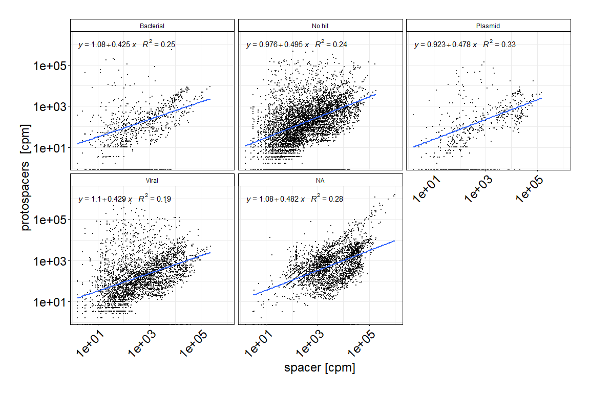<!-- -->

# Mesophilic vs thermophilic

``` r
CRISPR_spacer_coverage_2 <-  read_csv(paste(data_folder, "/IMPORT_EXPORT/DR_SP_DR_results.csv", sep="")) %>% 
  mutate(ProjectID = bioproject) %>% 
  renameSamples()
```

    ## Rows: 12075 Columns: 8

    ## -- Column specification --------------------------------------------------------
    ## Delimiter: ","
    ## chr (3): sample, spacer_name, bioproject
    ## dbl (5): spacer_cov, protospacer_cov, readNumber, spacer_CPM, protospacer_CPM

    ## 
    ## i Use `spec()` to retrieve the full column specification for this data.
    ## i Specify the column types or set `show_col_types = FALSE` to quiet this message.

``` r
# Firstly, get cluster number from Spacer ID


drspdr_type <- CRISPR_spacer_coveragez %>% left_join(CRISPRscope_meta_tbl_filtered %>% 
                                                 unite(spacer_name, ProjectID, SRA_ID, GID, SPID, Coverage, sep="_") %>% 
                                                 select(spacer_name, cluster_spacer_identity), by = c("spacer_name") ) %>% 
  mutate(ProjectID = bioproject) %>% renameSamples() %>% 
  mutate(type = ifelse(ProjectID == "Swiss raclette", "Mesophilic", NA)) %>% 
  mutate(type = ifelse(ProjectID == "Lordan et al. 2019", "Mesophilic", type)) %>% 
  mutate(type = ifelse(ProjectID == "Walsh et al. 2020", "Mesophilic", type)) %>% 
  mutate(type = ifelse(ProjectID == "Swiss starter culture", "Thermophilic", type)) %>%
  mutate(type = ifelse(ProjectID == "Pasolli et al. 2020", "Thermophilic", type)) 
```

``` r
# Plot

my.formula <- y ~ x
library(ggpmisc)
plot <-
  ggplot(drspdr_type, aes(x = spacer_CPM, y = protospacer_CPM)) +
  geom_point(alpha = 0.7, size = 0.2) + #aes(color= Subtype),
  #scale_color_viridis_d() +
  scale_x_continuous(trans = 'log10') +
  scale_y_continuous(trans = 'log10') +
  labs(x = "spacer [cpm]", y = "protospacers  [cpm]") +
  #geom_point(aes(fill = Subtype),alpha = 0.4, size = 0.2) +
  geom_smooth(method = "lm", se = FALSE) +
  stat_poly_eq(formula = my.formula,
               aes(label = paste(..eq.label.., ..rr.label.., sep = "~~~")),
               parse = TRUE, ) +
  theme_bw() + 
  theme(
    axis.text = element_text(size = 18),
    axis.title = element_text(size = 18),
    legend.text = element_text(color = "black", size = 14),
    legend.title = element_text(color = "black", size = 14),
    axis.text.x = element_text(
      angle = 45,
      hjust = 1,
      color = "black"
    ),
    axis.text.y = element_text(color = "black"),
    axis.title.x = element_text(color = "black"),
    axis.title.y = element_text(color = "black"),
    axis.line.y.left = element_line(color = "black"),
    axis.line.y.right = element_line(color = "black"),
    axis.line.x = element_line(color = "black"),
    axis.ticks = element_line(color = "black"),
    plot.title = element_text(color = "black"),
    panel.background = element_rect(fill = "white", colour = NA),
    plot.background = element_rect(fill = "white", colour = NA),
    legend.position = "top",
    legend.background = element_rect(fill = "white", colour = NA),
    legend.box.background = element_rect(fill = "white", colour = NA),
    plot.margin = unit(c(1, 1, 1, 1), "cm"),
    #panel.grid.major = element_line(color = "black", size = 0.1),
    #panel.grid.minor = element_line(color = "black", size = 0.1),
    strip.background = element_rect(
      color = "black",
      fill = "White",
      size = 0.5,
      linetype = "solid"
    ),
    strip.text = element_text(color = "black")
  ) +
  facet_wrap(~type)


# ggsave(
#   plot = plot,
#   file = paste(google_drive_folder, "/15_SpacerProtospacerAbundance_type.pdf", sep = ""),
#   bg = "white",
#   width = 15,
#   height = 25,
#   units = "cm",
#   dpi = 800
# )

plot
```

\#———————————————-

\#———————————————- \# Numbers Results

## Part 1 - genomic

``` r
#===============================
# Main numbers
#===============================


CRISPRscope_tbl_26 <- readRDS(file = paste(data_folder, "/CRISPRscope_results/export_complete_SEL26.rds", sep=""))
CRISPRscope_tbl_185 <- readRDS(file = paste(data_folder, "/CRISPRscope_results/export_complete_SEL185.rds", sep=""))


# Number of species and genomes sith CRISPR
CRISPRscope_tbl_185 %>% 
  summarise(nb_species = n_distinct(Organism), 
            nb_genomes = n_distinct(Strain), 
            nb_spacers_total = n(),
            nb_repeat_total = n_distinct(SpacerSeq),
            nb_spacer_cluster = n_distinct(cluster_spacer_identity),
            nb_repeat_cluster = n_distinct(cluster_repeat_identity))
```

    ## # A tibble: 1 x 6
    ##   nb_species nb_genomes nb_spacers_total nb_repeat_total nb_spacer_cluster
    ##        <int>      <int>            <int>           <int>             <int>
    ## 1        126       4211           143052           69307             56796
    ## # ... with 1 more variable: nb_repeat_cluster <int>

``` r
# Number of dominant species and genomes
CRISPRscope_tbl_26 %>% 
  summarise(nb_species = n_distinct(Organism),
            nb_genomes = n_distinct(Strain),
            nb_array = n_distinct(ArrayID),
            nb_spacer_total = n(),
            nb_repeat_total = n_distinct(SpacerSeq),
            nb_spacer_cluster = n_distinct(cluster_spacer_identity),
            nb_repeat_cluster = n_distinct(cluster_repeat_identity),
            nb_cas_subtypes = n_distinct(Cas_subtype))
```

    ## # A tibble: 1 x 8
    ##   nb_species nb_genomes nb_array nb_spacer_total nb_repeat_total
    ##        <int>      <int>    <int>           <int>           <int>
    ## 1         21       1195     1972           50955           21028
    ## # ... with 3 more variables: nb_spacer_cluster <int>, nb_repeat_cluster <int>,
    ## #   nb_cas_subtypes <int>

``` r
# Number of uniques spacers (cluster present only once)
CRISPRscope_tbl_26 %>% 
  select(cluster_spacer_identity) %>% 
  group_by(cluster_spacer_identity) %>% 
  dplyr::count() %>% 
  filter(n == 1) # 9858 rows
```

    ## # A tibble: 9,858 x 2
    ## # Groups:   cluster_spacer_identity [9,858]
    ##    cluster_spacer_identity     n
    ##                      <dbl> <int>
    ##  1                      20     1
    ##  2                      21     1
    ##  3                      22     1
    ##  4                      23     1
    ##  5                      24     1
    ##  6                      25     1
    ##  7                      28     1
    ##  8                      29     1
    ##  9                      30     1
    ## 10                      31     1
    ## # ... with 9,848 more rows

``` r
# Array size mean and sd
mean(CRISPRscope_tbl_26 %>% group_by(ArrayID) %>% summarise(array_size = n()) %>% select(array_size) %>% unlist())
```

    ## [1] 25.83925

``` r
sd(CRISPRscope_tbl_26 %>% group_by(ArrayID) %>% summarise(array_size = n()) %>% select(array_size) %>% unlist() )
```

    ## [1] 19.29306

``` r
# Proportion of strains w/wo CRISPR -> in 1.2 / Numbers / CRISPR content


# Shared spacers among species
CRISPRscope_tbl_26 %>% select(Organism, cluster_spacer_identity) %>% distinct() %>% 
  group_by(cluster_spacer_identity) %>% summarise(n_species = n()) %>% 
  dplyr::count(n_species) # 0 spacers (cluster 100) are shared between species. 
```

    ## # A tibble: 1 x 2
    ##   n_species     n
    ##       <int> <int>
    ## 1         1 16506

``` r
# Shared repeats among species

# 100% id
CRISPRscope_tbl_26 %>% select(Organism, cluster_repeat_identity) %>% distinct() %>% 
  group_by(cluster_repeat_identity) %>% summarise(n_species = n()) %>% 
  dplyr::count(n_species) # Only two repeats are present in 2 species, and one in 3 species. The 109 others are only present in on species.
```

    ## # A tibble: 3 x 2
    ##   n_species     n
    ##       <int> <int>
    ## 1         1   109
    ## 2         2     2
    ## 3         3     1

``` r
# 80% id
repeat_cluster_80_count <- CRISPRscope_tbl_26 %>% select(Organism, cluster_repeat) %>% distinct() %>% 
  group_by(cluster_repeat) %>% summarise(n_species = n()) %>% 
  dplyr::count(n_species)

total_dr80 <- sum(repeat_cluster_80_count$n) #40
one_dr80 <- sum(repeat_cluster_80_count %>% filter(n_species == 1) %>% select(n) %>% unlist())
morethanone_dr80 <- sum(repeat_cluster_80_count %>% filter(n_species > 1) %>% select(n) %>% unlist())
```

``` r
#===============================
# ANI
#===============================


ANI_Shared_spacers_strain_pair <- read_csv(file = paste(data_folder, "/IMPORT_EXPORT/ANI_Shared_spacers_strain_pair2.csv", sep=""))
```

    ## New names:
    ## * `` -> ...1

    ## Rows: 160236 Columns: 9

    ## -- Column specification --------------------------------------------------------
    ## Delimiter: ","
    ## chr (4): species_query, strain_query, species_ref, strain_ref
    ## dbl (5): ...1, ANI, bidirectional_fragment_mapping, total_query_fragment, sh...

    ## 
    ## i Use `spec()` to retrieve the full column specification for this data.
    ## i Specify the column types or set `show_col_types = FALSE` to quiet this message.

``` r
ANI_Shared_spacers_strain_pair %>% summarise(min_ani = min(ANI), max_ani = max(ANI), mean_ani = mean(ANI), sd_ani = sd(ANI))
```

    ## # A tibble: 1 x 4
    ##   min_ani max_ani mean_ani sd_ani
    ##     <dbl>   <dbl>    <dbl>  <dbl>
    ## 1    79.4     100     98.7   1.16

``` r
# Number of pairs

total_pairs <- length(ANI_Shared_spacers_strain_pair$species_query)

# For a total of 160,556 pairs of strains 
zero_shared <- length(ANI_Shared_spacers_strain_pair %>% 
                        filter(shared_spacer_numeric == 0) %>% 
                        select(species_query) %>% unlist()) # 93824 pairs do not share any spacers.  
zero_shared/total_pairs # 0.5855363 %
```

    ## [1] 0.6686512

``` r
something_shared <- length(ANI_Shared_spacers_strain_pair %>% 
                             filter(shared_spacer_numeric > 0) %>% 
                             select(species_query) %>% unlist()) # 66,412  paires share one or more spacers.
something_shared/total_pairs # 0.4144637 %
```

    ## [1] 0.3313488

``` r
# Proportion of shared spacers for the 41%
shared_spacer_numbers <- ANI_Shared_spacers_strain_pair %>% 
  filter(shared_spacer_numeric > 0) %>% 
  select(shared_spacer_numeric) %>% unlist()

mean(shared_spacer_numbers)
```

    ## [1] 37.55919

``` r
median(shared_spacer_numbers)
```

    ## [1] 33.54839

``` r
sd(shared_spacer_numbers)
```

    ## [1] 34.32548

``` r
# [1] 30.89438
# [1] 9.230769
# [1] 33.79036

# Pairs that share 90% or more of their spacers

share_90_more <- ANI_Shared_spacers_strain_pair %>% filter(shared_spacer_numeric >= 90) %>% select(ANI) %>% unlist()
mean(share_90_more)
```

    ## [1] 99.96415

``` r
median(share_90_more)
```

    ## [1] 99.99285

``` r
sd(share_90_more)
```

    ## [1] 0.1588835

``` r
# Strains with ANI > 90 share a substantial proportion of the spacers
share_ani_999_more <- ANI_Shared_spacers_strain_pair %>% filter(ANI > 99.9) %>% select(shared_spacer_numeric) %>% unlist()

mean(share_ani_999_more)
```

    ## [1] 73.93962

``` r
sd(share_ani_999_more)
```

    ## [1] 21.15704

``` r
# ANI smaller than 99 and shared spacers higher than 50%
ANI_Shared_spacers_strain_pair %>% filter(ANI < 99 & shared_spacer_numeric >= 50) %>% 
  select(species_query, strain_query, strain_ref, ANI, shared_spacer_numeric)
```

    ## # A tibble: 524 x 5
    ##    species_query           strain_query  strain_ref      ANI shared_spacer_nume~
    ##    <chr>                   <chr>         <chr>         <dbl>               <dbl>
    ##  1 Corynebacterium_casei   FAM24583-i1-1 GCF.01489743~  98.8                53.3
    ##  2 Corynebacterium_casei   GCF.01489743~ FAM24583-i1-1  98.8                53.3
    ##  3 Lacticaseibacillus_rha~ FAM20550-i1-1 FAM20576-i1-1  98.0                60.2
    ##  4 Lacticaseibacillus_rha~ FAM20550-i1-1 GCF.00106288~  98.0                63.8
    ##  5 Lacticaseibacillus_rha~ FAM20550-i1-1 GCF.01537748~  98.0                63.8
    ##  6 Lacticaseibacillus_rha~ FAM20550-i1-1 GCF.00017325~  97.9                68.5
    ##  7 Lacticaseibacillus_rha~ FAM20550-i1-1 GCF.00228794~  97.9                63.8
    ##  8 Lacticaseibacillus_rha~ FAM20550-i1-1 GCF.01566845~  97.9                68.5
    ##  9 Lacticaseibacillus_rha~ FAM20550-i1-1 GCF.00240679~  97.9                68.5
    ## 10 Lacticaseibacillus_rha~ FAM20550-i1-1 GCF.00240674~  97.9                68.5
    ## # ... with 514 more rows

``` r
nb_ani_small_shared_high <- length(ANI_Shared_spacers_strain_pair %>% filter(ANI < 99 & shared_spacer_numeric >= 50) %>% 
  select(species_query) %>% unlist())
  
nb_ani_small_shared_high / total_pairs
```

    ## [1] 0.003270176

``` r
#===============================
# EDIT distance
#===============================

# Raw file 
merged_slices <- read_csv(file=paste(data_folder, "/pairwise_alignment_results/merged_slices.csv", sep=""), 
    col_names = FALSE)
```

    ## Rows: 136215765 Columns: 1

    ## -- Column specification --------------------------------------------------------
    ## Delimiter: ","
    ## dbl (1): X1

    ## 
    ## i Use `spec()` to retrieve the full column specification for this data.
    ## i Specify the column types or set `show_col_types = FALSE` to quiet this message.

``` r
# The majority
total_edit <- merged_slices %>% summarise(n=n())                                             # 136215765
majority <- merged_slices %>% filter(X1 < 30 && X1 > 6) %>% summarise(n = n()) %>% select(n) # 136215765
```

\#\#Part 2 - metagenomic

``` r
library(tidyverse)
CRISPRscope_meta_tbl_filtered <- readRDS(file = paste(data_folder, "/CRISPRscope_meta_results/CRISPRscope_meta_tbl_filtered.rds", sep=""))
id_data = readRDS(file = paste(data_folder, "/CRISPRscope_meta_results/id_data.rds", sep=""))

# Number of samples - raw
  id_data %>% summarise(nb_project = n_distinct(ProjectID), nb_samples = n_distinct(SRA_ID)) # 203
```

    ## # A tibble: 1 x 2
    ##   nb_project nb_samples
    ##        <int>      <int>
    ## 1          6        203

``` r
  # Note: two of the projects are part of the same Passoli publication -> see rename_sample function for details. 
  id_data %>% select(ProjectID) %>% distinct()
```

    ## # A tibble: 6 x 1
    ##   ProjectID           
    ##   <chr>               
    ## 1 PRJEB32768          
    ## 2 PRJNA286900         
    ## 3 PRJNA603575         
    ## 4 PRJEB30079          
    ## 5 CheeseRaclette      
    ## 6 20201217_metagenomes

``` r
# Number of samples with CRISPR
# Number of arrays
# Number of Spacers
# Number of repeats


CRISPRscope_meta_tbl_filtered %>% 
  summarise(n_sample = n_distinct(SRA_ID), 
            n_spacers_all = n(), 
            n_spacers_dist = n_distinct(cluster_spacer_identity),
            r_repeat_dist = n_distinct(cluster_repeat_identity),
            n_array = n_distinct(GID))
```

    ## # A tibble: 1 x 5
    ##   n_sample n_spacers_all n_spacers_dist r_repeat_dist n_array
    ##      <int>         <int>          <int>         <int>   <int>
    ## 1      163         24111           8226           373     394

``` r
CRISPRscope_meta_tbl_filtered %>% select(SRA_ID, spacer_per_milread) %>% distinct() %>% 
  summarise(mean_sp_milread = mean(spacer_per_milread),
            sd_sp_milread = sd(spacer_per_milread))
```

    ## # A tibble: 1 x 2
    ##   mean_sp_milread sd_sp_milread
    ##             <dbl>         <dbl>
    ## 1            5.70          6.87

``` r
CRISPRscope_meta_tbl_filtered %>% select(SRA_ID, repeat_per_milread) %>% distinct() %>% 
  summarise(mean_dr_milread = mean(repeat_per_milread),
            sd_dr_milread = sd(repeat_per_milread))
```

    ## # A tibble: 1 x 2
    ##   mean_dr_milread sd_dr_milread
    ##             <dbl>         <dbl>
    ## 1           0.417         0.470

## Part 3 - overall

``` r
CRISPRscope_tbl_26 <- readRDS(file = paste(data_folder, "/CRISPRscope_results/export_complete_SEL26.rds", sep=""))
CRISPRscope_tbl_185 <- readRDS(file = paste(data_folder, "/CRISPRscope_results/export_complete_SEL185.rds", sep=""))
CRISPRscope_meta_tbl_filtered <- readRDS(file = paste(data_folder, "/CRISPRscope_meta_results/CRISPRscope_meta_tbl_filtered.rds", sep=""))


CRISPRscope_tbl_185 %>% select(cluster_spacer_identity) %>% 
  bind_rows(CRISPRscope_meta_tbl_filtered %>% 
              select(cluster_spacer_identity)) %>% 
  distinct() %>% 
  arrange(cluster_spacer_identity)
```

    ## # A tibble: 63,438 x 1
    ##    cluster_spacer_identity
    ##                      <dbl>
    ##  1                      18
    ##  2                      19
    ##  3                      20
    ##  4                      21
    ##  5                      22
    ##  6                      23
    ##  7                      24
    ##  8                      25
    ##  9                      26
    ## 10                      27
    ## # ... with 63,428 more rows

``` r
# Overall spacers clusters -> 63'438 unique clusters (after filtering)
# 


Clusters_CRISPRscope_ALL_SPACERS <- read_csv(paste(data_folder, "/IMPORT/clustering/Clusters1_CRISPRscope_ALL_SPACERS.csv", sep=""))
```

    ## Rows: 79007 Columns: 4

    ## -- Column specification --------------------------------------------------------
    ## Delimiter: ","
    ## chr (2): seq, seqid
    ## dbl (2): cluster, identity

    ## 
    ## i Use `spec()` to retrieve the full column specification for this data.
    ## i Specify the column types or set `show_col_types = FALSE` to quiet this message.

# Nb Spacer per Cas type

``` r
d1 <- bind_rows(
  CRISPRscope_tbl_26 %>% select(ArrayID, Cas_subtype) %>% dplyr::rename(Array = ArrayID),
  CRISPRscope_meta_tbl_filtered_renamed %>% unite("Array", SRA_ID:GID, sep="_") %>% select(Array, Subtype) %>% 
    dplyr::rename(Cas_subtype = Subtype)
) %>% 
  count(Array, Cas_subtype) %>% 
  select(Cas_subtype, n)


plt_arrsz <- d1 %>% 
  ggplot() +
  geom_density_ridges(aes(x = n, y = Cas_subtype), scale = 1, fill = "cornflowerblue") +
  geom_jitter(aes(x=n, y=Cas_subtype), size=0.3, alpha=0.4)+
  theme_bw() +
  xlab("Array size") +
  ylab("Cas subtype")
  
  


plt_dsty <- ggdensity(d1, x = "n", add = "mean") + 
  xlab("")+
  ylab("")+
  xlim(c(0,280))


g_arrsz <- egg::ggarrange(
  plt_dsty, plt_arrsz,
  nrow = 2, ncol = 1, heights = c(1, 6), widths = c(1)
)
```
